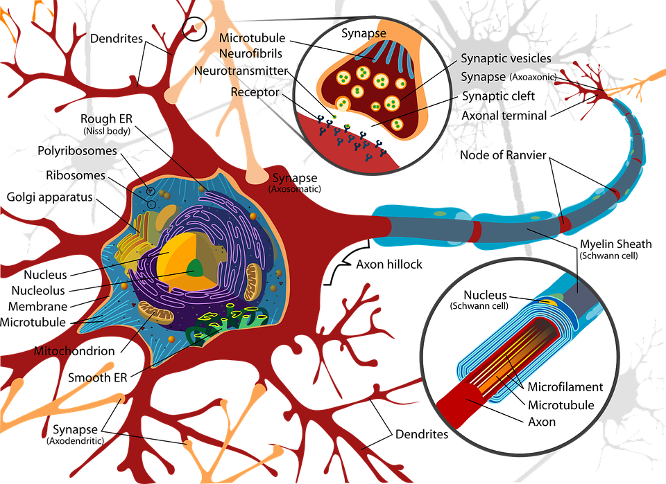
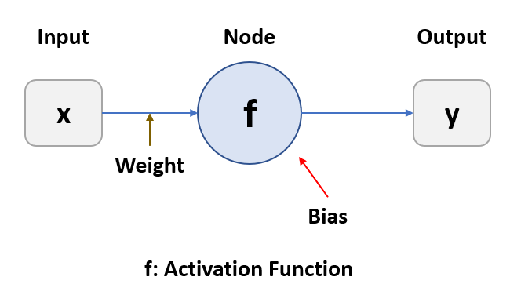
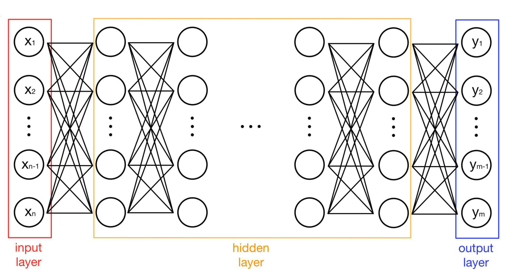

# 1. Neuron
### In Biology
전기적 및 화학적 신호를 통해 정보를 처리하고 전송하는 전기적으로 흥분시키는 세포입니다. 뉴런 사이의 신호는 다른 세포와의 특별하게 연결된 시냅스에서 발생합니다. 뉴런은 신경망을 형성할 수 있도록 끝과 끝이 연결 가능합니다.

### In Deep Learning
생물학적인 뉴런의 개념에 기조한 수학적인 함수를 의미합니다. 뉴런의 활성화 유무에 따라 활성함수가 결정됩니다. 이 때, 해당 뉴런의 결과가 0이라면, 신호를 주고받지 않는 비활성화 상태임을 알 수 있습니다.

# 2. Perceptron
퍼셉트론은 인공신경망의 기본 구성 단위로 정보를 전파하는 역할을 합니다. 이는 생물학의 percept + neuron의 합성어로 학습 가능한 초창기 신경망 모델로 노드, 가중치, 층 등의 개념들이 도입되어 딥러닝을 포함한 현대 신경망들의 중요한 구성요소들을 이해하는데 의미가 있습니다. 여기서 활성함수 $\sigma$는 특정 퍼셉트론으로 들어오는 입력값이 일정 수준의 threshold를 넘어서면 일정값을 전파하고, 그렇지 않으면 어떠한 값도 전파하지 않습니다. 

  

# 3. Multi-Layer Perceptron
다층 퍼셉트론(Multi-Layer Perceptron, MLP)은 층이 2개 이상 존재하는 신경망입니다. 이 때, 입력층(input layre)과 출력층(output layer)을 제외한 층을 은닉층(hidden layer)라고 합니다. 이 층이 1개일 경우 얕은 신경망(shallow neural network), 다수일 경우 깊은 신경망(deep neural network)이라고 합니다. 다층 퍼셉트론의 구성을 보면, 같은 층 내의 뉴런 간에는 연결되어 있지 않고 다른 층의 뉴런들과 모두 연결되어 있습니다.(Fully Connected Layer, FC Layer) 

# 4. Role of Hidden Layer
다층 퍼셉트론은 단층 퍼셉트론과 달리 비선형으로 분포하는 데이터에 대해 학습이 가능합니다. 이 과정에서 가중치에 대해 선형 방정식을 계산하기 때문에 층과 층 사이에 선형으로 표현된 데이터를 활성화함수를 이용해 비선형으로 변환해 연산합니다. 

# 참고
http://kbrain.co.kr/board_FXki69/890
https://davinci-ai.tistory.com/20
https://yhyun225.tistory.com/21
https://compmath.korea.ac.kr/deeplearning/Perceptron.html