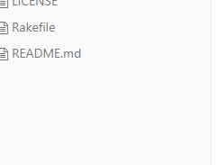
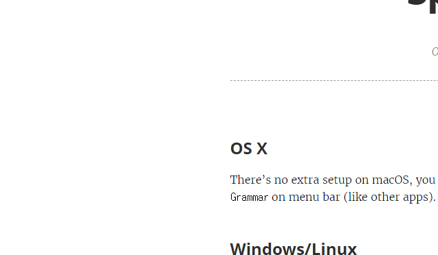

typora-root-url: ../

# 엑셀 판매데이터

dfg

 - ㅁㅇㄴ마니누리
 - 하야이꾸

1. 메ㅓ싴


무루깡
1. ㅁㄴㅇㄹ

2. ㅁㄴㅇ람ㄴㅇ라


1. 123123
2. ㅀㄴㅀ

| 번호 | 이름  | 성별 | 국어 | 수학 | 영어 | 사회 | 과학 | 미술 | 음악 | 체육 | 기술 | 한국 | 한문 | 교양 | 총점 | 등급 | 등급(세부) |
| -- | --- | -- | -- | -- | -- | -- | -- | -- | -- | -- | -- | -- | -- | -- | -- | -- | ------ |
| 1  | 은송희 | 여  | 63 | 90 | 93 | 51 | 74 | 84 | 8  | 32 | 15 | 63 | 53 | 6  |    |    |        |
| 2  | 방원미 | 여  | 91 | 39 | 37 | 5  | 68 | 94 | 94 | 8  | 99 | 2  | 94 | 16 |    |    |        |
| 3  | 지재린 | 여  | 44 | 79 | 88 | 92 | 37 | 2  | 20 | 79 | 49 | 14 | 88 | 80 |    |    |        |
| 4  | 나슬송 | 여  | 7  | 43 | 11 | 84 | 66 | 23 | 32 | 21 | 74 | 60 | 94 | 75 |    |    |        |
| 5  | 여예옥 | 남  | 63 | 19 | 54 | 84 | 10 | 70 | 84 | 74 | 73 | 63 | 99 | 81 |    |    |        |
| 6  | 윤정선 | 여  | 21 | 18 | 66 | 19 | 89 | 92 | 25 | 41 | 71 | 21 | 28 | 14 |    |    |        |

| \-100.0 |
| ------- |
| \-100.0 |
| \-100.0 |
| \-100.0 |
| \-100.0 |

```
=VLOOKUP(J17,$J$7:$L$12,3,0)
```
| 행 레이블 | 합계 : 매출(천원) |
| ----- | ----------- |
| 20대이하 | 602347.94   |
| 30대   | 6836638.466 |
| 40대   | 9985890.497 |
| 50대   | 12612836.97 |
| 60대   | 5927105.425 |
| 70대이상 | 5710131.466 |

$x^2 + y^2 = z^2$

$$
\begin{align}
\sum_{n=1}^{2}(\alpha ^2 + \beta ^3 + 5) = 1
\end{align}
$$

\sum_{n=1}^{2}(\alpha ^2 + \beta ^3 + 5) = 1

| **번호** | **이름** | **성별** | **국어** | **수학** | **영어** | **사회** | **과학** |
|:------:|:------:|:------:|:------:|:------:|:------:|:------:|:------:|
| 1      | 은송희    | 여      | 63     | 90     | 93     | 51     | 74     |
| 2      | 방원미    | 여      | 91     | 39     | 37     | 5      | 68     |
| 3      | 지재린    | 여      | 44     | 79     | 88     | 92     | 37     |
| 4      | 나슬송    | 여      | 7      | 43     | 11     | 84     | 66     |
| 5      | 여예옥    | 남      | 63     | 19     | 54     | 84     | 10     |
| 6      | 윤정선    | 여      | 21     | 18     | 66     | 19     | 89     |
| 7      | 원세완    | 남      | 77     | 94     | 6      | 42     | 24     |
| 8      | 노가운    | 여      | 43     | 44     | 83     | 90     | 39     |
| 9      | 임의준    | 남      | 50     | 74     | 74     | 50     | 97     |





