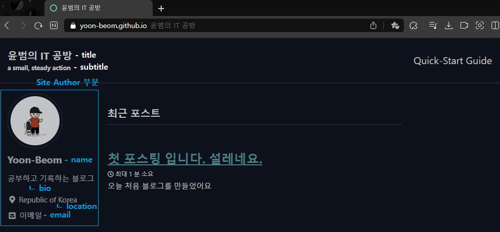

### 내가 사용하는 편집기
- Obsidian
- Visual Studio Code
- Typora

처음 기록을 해야겠다 싶어서 시작한건 Obsidian 이였다.
파일과 파일과의 연결, 또 커스텀이 자유롭고 플러그인이 다양했다.
Obsidian도 마크다운 문법을 사용하기 때문에, 깃허브를 이용한 블로그를 만들기 전에
Obsidian을 통해서 작성하고 md 파일만 올리면 되겠다 싶었다.

깃허브를 이용한 블로그를 만들면서 문제가 생겼다.
- Obsidian은 html을 읽지 못하고 그에 관련한 플러그인도 없다.
- Obsidian은 상대경로 절대경로 모두 이미지를 읽지만, 블로그를 업로드할 때에는 상대경로를 써야한다.

이 경우 Obsidian과 깃블로그에도 잘 읽혔다.
```


```
이 경우에는 Obsidian에서는 잘 읽혔지만 깃블로그에서는 이미지가 읽히지 않았다.
```

```
