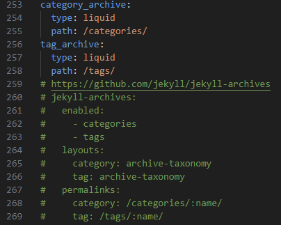

### Minimall Mistakes 테마 가이드
<a href="https://mmistakes.github.io/minimal-mistakes/docs/configuration/#conversion-and-markdown-processing">https://mmistakes.github.io/minimal-mistakes/docs/configuration/#conversion-and-markdown-processing</a>


- 위의 가이드에서 아카이브 셋팅을 보면 카테고리와 태그 아카이브 관련한 글이다.
- _config.yml 파일의 아카이브 관련 코드를 찾는다.



- 밑의 주석 처리 된 코드들도 풀어준다. line 260 ~ 269

- Visual Studio Code 주석 처리 단축키는 Ctrl + K + C / 주석 해제 단축키는 Ctrl + K + U 이다.

- _page 파일을 만들고 그안에 category-archive.md와 tag-archive.md 파일을 만든다.

  

- category-archive.md 파일 안에 아래의 코드를 입력한다.
```category-archive.md
---
tiile: "Category"
layout: categories
permalink: /categories/
author_profile: true
sidebar_main: true
---
```
```tag-archive.md
---
tiile: "Tag"
layout: tags
permalink: /tags/
author_profile: true
sidebar_main: true
---
```

- _data 폴더 안의 navigation.yml 파일은 아래와 같이 수정한다.

```
main:
 - title: "Category"
   url: /categories/
 - title: "Tag"
   url: /tags/
```
