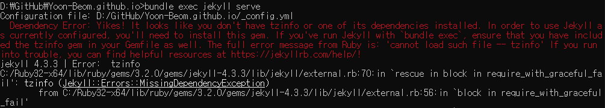
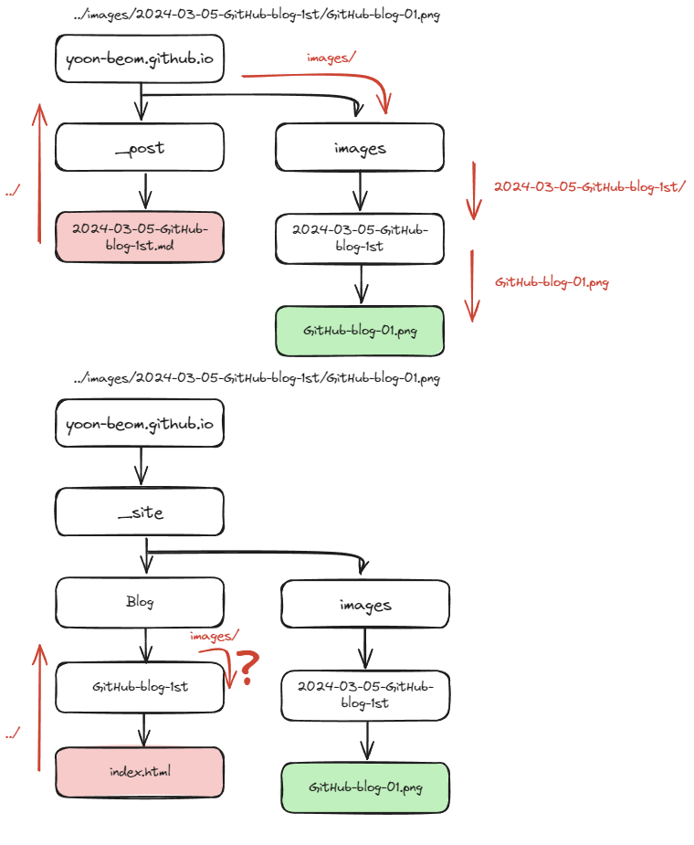
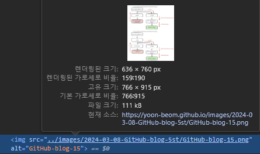
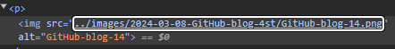

### 이미지 경로 오류
카테고리 기능을 추가하고 결과를 확인 하는데 이미지가 안 읽어와서 또 무슨 오류인가 싶었다.
카테고리 기능은 url을 통해 분류 된다.

- 카테고리 추가 전

```
https://yoon-beom.github.io/GitHub-blog-1st/
```
- 카테고리 blog 추가 후

```
https://yoon-beom.github.io/blog/GitHub-blog-1st/
```
- 이미지의 경로는 상대경로로 상위 폴더로 올라가서 현재 폴더에서 images 파일에 들어 가는 것이다.

```

```


### 카테고리 적용 전 경로


### 카테고리 적용 후 경로



- 여기서 카테고리 적용 하는 게시글은 ../../ 로 쓰면 블로그에서 이미지가 읽히지만 그렇게 되면 편집기에서는 이미지가 안 읽힌다는 문제가 있다.

### github 블로그에서 본 오류
- 카테고리를 적용하지 않은 게시물의 이미지 경우 상대 경로가 절대경로로 잘 바뀌였다.

- 카테고리를 적용한 게시물의 이미지 경우 아직 상대 경로로 지정되어 있다.

