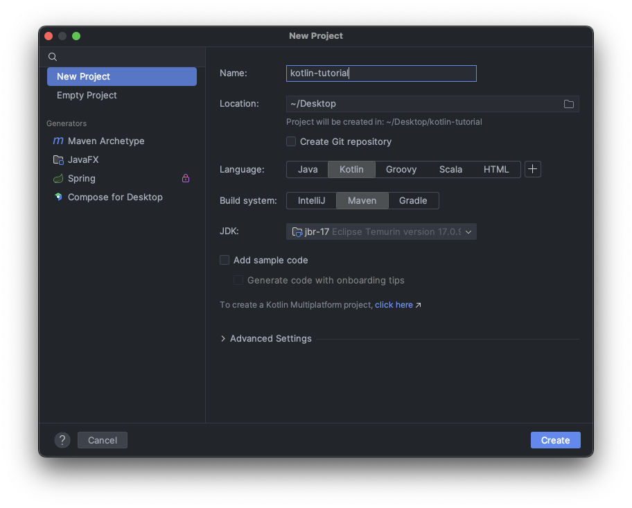

## 1. Introduction

Kotlin is an amazing programming language. At the time of writing, Kotlin is the second most [popular language](https://survey.stackoverflow.co/2023) on the JVM (behind Java of course), the language of choice for writing Android applications &mdash; which covers about 70% of the mobile market &mdash; and it's opening new doors to other compilation targets (WASM, native) as well as multiplatform projects, targeting server-side, mobile (both iOS and Android) and the web. Kotlin is developed and maintained by a financially successful company who write their own software in it (skin in the game), its [annual conference](https://kotlinconf.com/) is sold-out months in advance, and its community is active and contributing with new libraries and tools every day.

Needless to say, Kotlin is going to be a force.

Regardless of what kind of software you need to build, Kotlin has got you covered. For your career as a software engineer, it's a no-brainer to at least get a taste of what Kotlin can offer, so that you know where you stand.

This is your guide. In about the time it takes to watch a movie[^time] you'll get a clear sense of what Kotlin is, what it's not, and what you can do with it. We will cover

- Kotlin basics
- OOP features of Kotlin
- Kotlin standard collections
- Functional programming essentials
- Some Kotlin-specific features and niceties

This guide is for developers with some experience with some other language, and I'll skip general CS fundamentals. I will make connections to many programming languages, not least because Kotlin took inspiration from many other languages. By the end of this course, expect to write 300-400 lines of code.

I also made a video version of this guide as a YouTube playlist which you can watch [here](https://www.youtube.com/playlist?list=PLmtsMNDRU0BwGCBDIKKQNLYycRTnQzMfp).

> If you go through this guide saying "hmm, Kotlin looks cool", I encourage you to go _deep_. For that, I think you'll like [Kotlin Essentials](https://rockthejvm.com/p/kotlin-essentials). It's a jam-packed, long-form, hands-on course where you'll write not hundreds but _thousands_ of lines of code from scratch in dozens of examples and exercises, including an _image processing project_ that you can use for your own pictures.

[^time]: Don't be fooled by the estimated "read time". If you can go through this guide at 200 words per minute as this blog is usually set up to estimate, then you're either a genius or a Kotlin expert already. My advice: take about 2-3x the estimated time here, to understand the code examples as well.

## 2. Getting Started

For this guide, we will need the following:
- a Kotlin IDE
- a JDK
- 1.5 hours to try things in your IDE as we go through the tutorial

For the Kotlin IDE, the no-brainer choice is [IntelliJ IDEA](https://www.jetbrains.com/idea/) - the software built (in Kotlin) by the company that created Kotlin. So if you haven't done it already, go download the community edition of IntelliJ before we continue.

For the JDK, we'll do great with a long-term support Java version. Go to the latest [downloads page](https://www.oracle.com/ro/java/technologies/downloads/) and install one now. At the time of writing, JDK 21 and JDK 17 both work great for this guide.

For the third thing (setting time aside), I'll leave that to you 😇

Once you have IntelliJ installed, go ahead and create a new project. Select Kotlin and Maven, and select the JDK that you just installed, instead of the jbr-17 I have in the picture:



Then, under the `src` folder, right-click and create a new package, call it `com.rockthejvm` &mdash; if you're coming from a JVM background (e.g. Scala or Java), this naming convention is probably second nature to you. For everyone else: in the JVM we organize our code in "packages", whose naming conventions look like reversed website names, and they're mapped to the OS as folders, e.g. `com.rockthejvm` has a folder path `(your project path)/src/main/kotlin/com/rockthejvm` on the file system.

Under `com.rockthejvm`, right-click and create a new Kotlin class/file, name it `Playground`, and make it an `object`. If inside the object you type in `main`, IntelliJ will suggest a main template application - use it, and write a `println("Let's rock!")` inside the main function. This turns `Playground` into a runnable application, whose output is "Let's rock!". That's your "hello, world".

You can also remove the entire object and replace your code with

```kotlin
fun main() {
    println("Let's rock, now!")
}
```

and it does the same thing. You got the idea: you can now run Kotlin applications.

> A note: for every chapter of this guide, I recommend you create a fresh application just to keep your code nice and organized.

Let's start talking about the Kotlin foundations.

## 3. The Kotlin Basics Crash Course

For this chapter, I'll write code in a new application that I'm going to call `Basics`.

### 3.1. Values, Variables, and Types

What's programming without variables? In Kotlin we have two kinds of variables: `val`s and `var`s.

```kotlin
val meaningOfLife: Int = 42
```

This is a value. The syntax is quite similar to many other languages (identical to `Scala` for example). We have `val`, the name of the value, `: Int` meaning the type of the thing, the assignment `=` and then the value of... the value. Nothing fancy.

Two things to note about values. The first thing is that we _can't change them_. They are constants once defined. So if I write

```kotlin
meaningOfLife = 99 // nope
```

that's a compiler error. Values cannot be reassigned. As we will see later, if we structure our code in terms of values and their expressions, this induces a certain mode of thinking. We'll explore it in due time.

The second aspect is that _the type annotation can generally be omitted_. The Kotlin compiler has a powerful feature called _type inference_, which looks at the right-hand side of the assignment, computes the type of the expression in question (in our case that's an int), and assigns the type to the value without us having to do the manual typing. Sweet!

The other kind of variable is a `var`, which _can be changed_. Same syntax otherwise, same rules, same type inference:

```kotlin
var objectiveInLife = 32
objectiveInLife = 45 // ok - vars can be changed
```

We generally prefer using `val`s as we write more complex code, but that's a philosophical lesson for later.

Kotlin has the same standard types that you'd expect from a mainstream programming language. They are called
- Int for 32-bit integers
- Short for 16-bit integers (rarely used)
- Byte for 8-bit integers
- Long for 64-bit integers
- Char for single characters
- Boolean for `true` or `false` (these are keywords)
- Float for 32-bit floating-point decimals
- Double for 64-bit decimals

Again, nothing fancy. Types are the same as regular Java types but capitalized.

A special mention goes to the String type, which maps to the JVM String type, and with similar functionality and features.

```kotlin
val aString = "I love Kotlin"
val aChar = 's'
val aCombinedString = "I" + " " + "love" + " " + "Kotlin"
```

Python and JavaScript developers beware: Kotlin Strings are only delimited by double quotes `"`, never single quotes! We use single quotes for characters only.

String concatenation with `+` works in the same way as most other languages. However, Kotlin Strings have an extra nice feature compared to Java, for example: we can inject values or even expressions inside a string by using the `$` operator. This feature is called _templating_ or _interpolation_ (a feature borrowed from Scala). Here are some examples:

```kotlin
val aTemplate = "The meaning of life is $meaningOfLife"
val computation = "Look, ma, I can run computations inside a string: ${22 * 47}"
```

Pretty neat!

So we know how to use values, variables and types. Let's move to _expressions_.

### 3.2. Expressions and Control Flow

**Expressions are structures that evaluate to a value.** The structure `2 + 5` is an expression, it has a type (Int) and reduces to a value (7). Obviously, we use expressions all the time while writing code. The other big thing we use all the time is _instructions_, which are **structures that can be executed**. Printing something is an instruction, for example.

Generally, we think of classical programming structures like if statements and for loops as _instructions_. In Kotlin, they can take multiple shapes.

An `if` structure in Kotlin can be an _instruction_ or an _expression_. Let me give an example.

```kotlin
val aCondition = 1 > 2
if (aCondition) {
    println("the condition is true")
} else {
    println("the condition is false")
}
```

This if structure is an instruction, because it "does" something depending on the value of `aCondition`. This structure has no value of its own.

Let's see another example, in which an if structure can be evaluated to a value, turning it into an _expression_:

```kotlin
val anIfExpression = if (aCondition) 42 else 999 // this is an expression
```

In this case, the `if` structure _has_ the value 42 or 999, depending on whether `aCondition` is true or not. This structure is an expression. The closest analogous expression in the C family (including Java) would be the ternary `aCondition ? 42 : 999` operator, but that's far less readable.

The `when` structure in Kotlin, which looks like a switch on steroids, also has this dual property of instruction vs expression.

````kotlin
when (meaningOfLife) {
    42 -> println("the meaning of life from HGG")
    43 -> println("not the meaning of life, but quite close")
    else -> println("something else")
}
````

This tests `meaningOfLife` against the constants 42, 43 or anything else, and "does" something depending on the value. The `when` expression in Kotlin can be used in a variety of ways and it has a bunch of features, but that would keep us bogged down in this structure while we have lots of other things to cover. If you want to go deeper, check out Kotlin Essentials.

In the same style as the `if` structure, a `when` structure can be reduced to a value by making the branches be expressions as well:

```kotlin
val meaningOfLifeMessage = when (meaningOfLife) {
    42 -> "hitchhiker's MOL"
    43 -> "quite close"
    else -> "something else"
}
```

So the `if` and `when` structures can be either _instructions_ ("do something") or _expressions_ ("evaluates to something").

### 3.3. Looping

Loops in Kotlin look very similar to other languages, with some small syntactic differences in between. The most common is looping through elements of a collection:

```kotlin
println("iterating through a list")
val aList = listOf(1,5,3,2,4)
for (element in aList) {
    println(element)
}
```

We're going to cover collections a bit later in this guide, but safe to say `aList` is a collection of integers. A `for` loop iterates through all elements of `aList` via the `element in aList` construct. Naturally, the snippet above prints every item in the list, in order, one per line.

The same construct works with a variety of other collections. Lists, arrays, sets are just some of them, and the iteration works identically on them. _Ranges_, though, are an interesting "collection":

```kotlin
println("inclusive range 1-10")
for (i in 1 .. 10) {
    println(i)
}
```

In this snippet, we have an identical for loop, only that the structure we're iterating through is different: `1 .. 10` is just another collection, which in this case is an _inclusive range_ 1 to 10. There are various kinds of ranges we can build, for various iteration needs:

- `1 .. 10` is an inclusive range
- `1 until 10` is an exclusive range: the end of the range is excluded
- `1 ..< 10` is the same as `1 until 10`
- `1 .. 10 step 2` is an inclusive range, counting in steps of 2
- `10 downTo 1` is a descending range, inclusive

For loops are useful when we iterate through a collection. The fundamental repetition instruction is `while`, much like other programming languages. A while loop looks like this:

```kotlin
println("while loops")
var i = 1
while (i <= 10) {
    println(i)
    i += 1
}
```

The syntax of a `while` instruction is identical to the C family (including C, C++, Java, JavaScript and others).

### 3.4. Functions

The Kotlin syntax for defining functions doesn't deviate too much from the mainstream. Here is a function that concatenates a String a set number of times:

```kotlin
fun concatenateString(aString: String, count: Int): String {
    var result = ""
    for (c in 1 .. count)
        result += aString
    return result
}
```

- keyword `fun`
- name of the function
- inside `()`, all the arguments in the form `name: Type`, comma-separated
- `: ReturnType` after parameters
- `{}` delimiting the local scope of the function, where we can do anything we want
- `return (something)` of the correct type

Because Kotlin is quite often used in the FP (functional programming) style, it's often the case that functions become single expressions. To simplify the syntax, instead of adding curly braces `{}` all the time, we can write `= (some expression)`, like in this example which combines two strings in a special format:

```kotlin
fun combineStrings(strA: String, strB: String) =
    "$strA----$strB"
```

For single-expression functions, we may omit the return type because the compiler can infer and type-check the expression we use on the right-hand side of `=`.

With these basic features covered, it's time to go deeper into the multi-paradigm aspect of Kotlin, starting with object-oriented programming.

## 4. OOP in Kotlin

### 4.1. Classes, Instances, Properties and Methods

Kotlin is heavily inspired by Java and Scala, so no wonder we share the same OOP essential principles. Long story short, our custom data types in Kotlin are classes:

```kotlin
class Pet {
    // properties = pieces of data
    val age = 0
    // functions (methods) = pieces of behavior
    fun eat() { // this method can be overridden in child classes
        println("I'm eating something")
    }
}
```

Classes mimic concepts in the real-world, which we use to model our software. Classes combine two major things
- _data_ in the form of `val`s or `var`s defined in the scope of the class - we call them _properties_
- _behavior_ in the form of functions defined in the scope of the class - we call these _methods_

A class is a _description_ of how a data structure is supposed to look like and how it would work. _Instances_ of classes are concrete memory zones allocated in the structure described by the class. _Construction_ or _instantiation_ is the act of allocating memory for instances, which uses the class main definition, aka a "constructor", which is invoked like a function. In the case of `Pet` above, the constructor doesn't take any arguments, so we can instantiate a `Pet` like this:

```kotlin
val aPet = Pet()
```

and once we have an instance of `Pet`, we can use its properties or methods with the now standard dot notation:

```kotlin
val petAge = aPet.age
aPet.eat()
```

Java people may roll their eyes at this point, because the syntax and style is almost identical. Not going to stress the basic syntax too much.

### 4.2. Inheritance

Kotlin offers the concept of inheritance, much like most other OOP languages. In short, we can create derived classes that have the same properties and methods as others, simulating the relationship of "is a subtype of" with concepts in real life. For example, we say "a dog is a subtype of pet", which we model in Kotlin as

```kotlin
class Dog: Pet()
```

which a Java/Scala programmer might write as

```java
class Dog extends Pet
```

Now if we write that in our code, we'll get into a compiler error. The class `Pet` cannot be "extended". That is because Kotlin classes are closed to inheritance by default. Through many years of collective OOP experience, inheritance has yielded mixed results in complex software, which is why Kotlin restricts inheritance unless you have sufficient intention for a type to be inheritable. If so, we'll place the `open` keyword in front of the class we want to inherit from, like this:

```kotlin
open class Pet {
    // ... the rest of the code
}
```

To make things more interesting, let's add a constructor argument to Dog:

```kotlin
class Dog(name: String): Pet()
```

The invocation of `Pet()` is important, because if we want to allocate a `Dog`, the runtime needs to allocate a `Pet` first, in order to make space for the properties and methods we're inheriting. So _every time we extend a class, we must provide a constructor for the parent class._

Nice. Let's allocate a `Dog`:

```kotlin
val aDog = Dog("Lassie")
```

At this point, we can use the same properties from Pet by virtue of inheritance:

```kotlin
val lassiesAge = aDog.age
aDog.eat()
```

Now, a counter-intuitive thing. By the constructor argument, we might expect to access `name` as a property of `Dog`:

```kotlin
val lassie = aDog.name
```

Alas, that's an error. _A constructor argument is not a property_. If we want to "promote" a constructor argument to a property, we need to add the `val` or `var` keyword to it:

```kotlin
class Dog(val name: String) : Pet()
```

At which point the compiler will now be happy.

Besides the properties and methods we're inheriting from Pet, we can also add our own properties and methods. We've already added a property in the form of the constructor argument, let's also add a method just to see how that would look like:

```kotlin
class Dog(val name: String) : Pet() {
    fun bark(stranger: String) {
        println("Woof woof! $stranger not allowed!")
    }
}
```

We can also decide to change the behavior of some methods of the parent class. This is called _overriding_. Java, for example, is very liberal with overriding: simply re-define the method with the same signature as that of the parent class, and the new method will be used on any instance of the derived class. Because inheritance (and overriding in particular) is known to cause issues in large codebases if used without any restrictions, Kotlin enforces some _intention_ on overriding: _by default, methods are not overridable_. That is, unless we add the `open` keyword in front of the method in the parent class (just like we did for the open class earlier) and the `override` keyword on the method on the child class:

```kotlin
// (in Pet)
open fun eat() { // this method can be overridden in child classes
    println("I'm eating something")
}

// (in Dog)
override fun eat() {
    println("I'm chewing something, whatcha lookin at?")
}
```

Once we call `aDog.eat()`, we will see the new behavior kick in.

Once we have the concept of inheritance, we unlock the concept of _subtype polymorphism_. This means that we can declare (or expect) a value of a certain type, and then provide a value of a _subtype_ instead:

```kotlin
val myPet: Pet = Dog("Hachi")
```

This means that the compiler allows us to use the properties and methods (API) of the declared type `Pet`, but at runtime, the behavior of that instance will belong to the _real_ class that the value has been instantiated as. In other words, if we write

```kotlin
myPet.eat()
```

We will see the message `I'm chewing something, whatcha lookin at?` printed to the console, not the message in the `Pet` class. This _subtype polymortphism_ is important, because in complex software, we generally choose to work with the most general API, and free our mental burden from the details of the value in question, trusting that it will perform according to its specialized implementation.

### 4.3. Abstract Classes and Interfaces

Once we have the concept of inheritance and this idea of "programming against the most general API", it's often useful to define an incomplete type with just behavior definitions, without implementations. This kind of class is called an _abstract class_, and it has analogues in most OOP languages. In Kotlin, just like in Java and Scala, we have this concept as well:

```kotlin
abstract class WalkingPet {
    val hasLegs = true
    abstract fun walk(): String // may not necessarily have an implementation
}
```

The keyword `abstract` is necessary for methods that don't have an implementation, just a signature. In this case, a class that defines an abstract method must also have the `abstract` keyword next to it. An abstract class is just like a regular class &mdash; meaning that we can add properties and methods &mdash; but with the following rules:

- an abstract class and all abstract methods are automatically `open`
- an abstract class does not necessarily _have_ to have abstract methods, but a class that _has_ abstract methods _must_ be abstract
- an abstract class may not be instantiated, even if it may have constructor arguments
- a class that inherits from an abstract class must either
  - be abstract
  - or override all abstract methods

The ultimate abstract kind is called an _interface_, which takes the concept directly from Java. Usually, an interface just defines methods, although in Kotlin we can also provide method implementations as well.

```kotlin
interface Carnivore {
    fun eat(animal: Pet): String
}

interface ColdBlooded // a plain interface with no methods
```

An interface is automatically abstract, and therefore open; and the same is applicable to its methods.

With the new concept of an interface in Kotlin, it's time we expand upon the Kotlin inheritance model. Just like in Java and Scala, in Kotlin we can inherit from _a single class and potentially multiple interfaces_. Here is an example:

```kotlin
class Snake: Pet(), Carnivore, ColdBlooded {
    override fun eat(animal: Pet) =
        "sssst, I'm sssswallowing thisss poor sssucker"

    // and maybe additional properties, methods, overrides
}
```

If we do inherit from one class _and_ interface(s), we must specify the parent class first (i.e. its constructor), and then all the interfaces. The [diamond problem](https://en.wikipedia.org/wiki/Multiple_inheritance#The_diamond_problem) is usually not a problem, because all we need to do is implement whatever is left abstract from the class and interfaces in question.

In Kotlin OOP, we also have the common access modifiers for properties and methods that we find in other OO languages, including
- `protected`: access is allowed within the class body and all child classes
- `private`: access is allowed within the class body
- no access modifier means _public_: access is permitted from anywhere in the code

### 4.4. Objects and Companions

For those of you coming from another OOP language, you might remember the singleton pattern: a way to restrict the creation of a single instance of a particular type &mdash; which in real-life could be some important service which allocates some resources. This pattern is not trivial to get right: we need to check the existence of another instance so that we instantiate our type just once, we may decide to instantiate the class lazily so that we don't overwhelm the system, and we might introduce multithreaded locking and additional checks for parallel applications. Taking care of all these problems can be difficult.

In Kotlin, we can solve the singleton pattern in one line of code:

```kotlin
object MySingleton
```

Boom. Done. `MySingleton` is now a type, and the only possible instance of that type. Just like with a class, we can add properties and methods to this type:

```kotlin
object MySingleton {
    val aProperty = 42
    fun aMethod(arg: Int): Int {
        println("hello from singleton: $arg")
        return aProperty + arg
    }
}
```

We can now refer to `MySingleton` both as a type and the (only) instance of this type, just like we would on a regular value:

```kotlin
val theSingleton = MySingleton
val anotherSingleton = MySingleton
println(theSingleton == anotherSingleton) // naturally true
val theProperty = MySingleton.aProperty
```

In OOP, we sometimes need to be able to define properties and methods that are "static", meaning that they depend on a type itself, rather than a particular instance of that type. In Java, we have the `static` keyword which we can simply attach to a property or a method. Instead, in Kotlin we have a special concept. Because using an `object`s properties and methods looks like we're using them on the type, e.g. `MySingleton.aProperty`, it makes sense for the "static" properties and methods of a class to attach them to an object with the same name as the class name. In Scala, we call this a "companion object", and Kotlin has taken this idea and embedded it further into the language, in the form of a `companion object`:

```kotlin
open class Pet {
    // the properties and methods from before

    companion object { // properties and methods of the Pet TYPE
        val humanLoveGuaranteed = true
    }
}
```

Now, we can write `Pet.humanLoveGuaranteed` because this property belongs to the `Pet` companion object, and we call this property "static" just like in Java. The concept of a `companion object` makes it easier for us to organize our code in terms of instance-related properties and methods on one side, and class-related properties and methods on the other (inside the companion object).

### 4.5. Data Classes

Because a lot of our work as engineers involves moving meaningful data around, it's useful to be able to store "bags of data" in various collections, compare them, check for duplicates, and things of this kind. Much like Scala `case class`es and Java `record`s, Kotlin also has the notion of a `data class`. Here is an example:

```kotlin
data class Person(val name: String, val age: Int) {
    // other properties and methods
}
```

Data classes are meant to be lightweight data structures which we use to pass around, compare, combine and transform. Besides the usual features of a regular class, a data class has the following automatically generated by the compiler:

- an `equals` method which compares the _data_ rather than the reference equality
- a `hashCode` method which returns different hash codes for different data - used for hash-based data structures, like sets and maps
- a human-readable `toString` method for debugging
- a `copy` method which allows duplicating a data class with maybe some different values for certain properties
- `componentN` methods which allow for a Python-like deconstruction of a data class

The only restrictions are that
- a data class cannot be inherited from
- all constructor arguments _must_ be properties, either `val` or `var`

### 4.6. Basic Error Handling

Much like other mainstream languages, Kotlin has the same `try-catch-finally` composite structure.

JVM applications "crash" by either
- Errors, which are caused by problems with the underlying system, e.g. stack overflow errors, out of memory errors
- or Exceptions, which are caused by untreated situations in our code, e.g. trying to access a file that doesn't exist

Unlike Errors, which are serious and should be allowed to terminate the applications, exceptions are something that we can recover from. There are many different ways that we can recover from exceptions, which we generically (and maybe confusingly) we call "error handling", ignoring the Errors on the JVM that we can't really treat anyway. The basic "error handling" technique is embedded into the Kotlin language, and that is the composite `try-catch-finally`:

- we attempt some code that might fail with the `try` section
- we intercept possible exceptions in the code with `catch` clauses
- we clean up any resources started or used with the `finally` section

Most mainstream languages have an almost identical structure, and it looks like this:

```kotlin
val maybeFailure = try {
    // code that can crash
    val language = "Kotlin"
    language.substring(10, 20) // crash
} catch (e: Exception) {
    "some faulty error message"
} finally {
    // execute some code no matter what
}
```

In truth, exceptions are nothing else but normal instances of classes. They all derive from the parent type `Throwable`. Anything that is `Throwable` can crash the application via `throw` statements, and they can be handled or "caught" by `catch` clauses. We can create our own exception types if necessary; all we need is extend the `Throwable` interface.

Of note, we can have multiple `catch` clauses, in which we can check for various exception types, one at a time. Remember to _place the most specific exception types first_, because catching a general type like `Exception` will also handle any subtype of `Exception` as well.

### 4.7. Generics

As we saw at the beginning, Kotlin is a statically typed language. In order to reuse pieces of logic for many (potentially unrelated) types, we use _generics_. The syntax for generics is very similar to other statically typed languages, like Java, C#, Scala, or TypeScript. A warning for people coming from Python, JS and other dynamically typed languages: this concept might be a bit unintuitive or tough.

Let's assume we're designing a linked list with certain properties. This linked list is a collection, so it would make sense to reuse this concept regardless of the type of elements this list contains: integers, Pets, Strings, dinosaurs, whatever. The way we would design such a data structure would look like this:

```kotlin
interface MyLinkedList<T> {
    // can use the type T inside the definitions of the methods/properties
    fun head(): T
    fun tail(): MyLinkedList<T>
}
```

The `<T>` is a _type parameter_, meaning that we can make the compiler _set the type_ of an instance of `MyLinkedList` to a certain type that we use when instantiating. At that point, the real type in the place of `T` is used (and enforced) everywhere we use the API of the instance. For example, if we have an instance of `MyLinkedList<Int>`, then we know (and the compiler can enforce) that every time we call the `head()` method, we will obtain an `Int` and nothing else.

A great example is the Kotlin standard collection library, which uses generics a lot:

```kotlin
// real collections
val numbers: List<Int> = listOf(1,2,3)
val first = numbers[0] // known to be an Int
val strings = listOf("Kotlin", "rocks")
val firstStringLength = strings[0].length // known to be a String, so can use its properties and call its methods
```

There is much more to generics than this explanation here, but the Kotlin Essentials course takes enough time to go through the topic in great detail.

### 4.8. Collections

We used collections superficially a few times in this guide. It's time to explore them in more details. In this section, we'll look at

- lists
- arrays
- sets
- maps

in both their immutable and mutable forms.

Lists are the most common data structures for _storing elements of the same type, in order_. The interface for this type is `List<T>`, and we can build lists like this:

```kotlin
val aList: List<Int> = listOf(1,2,3,4)
```

The fundamental API of a list consists of two things:
- the ability to retrieve an element at a particular place (index) inside the lists, on a 0-index basis (meaning that the first item is at index 0)
- the size of the list

With Kotlin lists, we can write the following:

```kotlin
val thirdElement: Int = aList.get(2) // retrieve the element at index 2
val thirdElement_v2: Int = aList[2] // same as aList.get(2)
val length = aList.size
```

Besides the fundamental API, the List type has a myriad of methods and properties for various kinds of operations and transformations. Here are some examples:

```kotlin
// assuming aList is [1,2,3,4]
val find3 = aList.indexOf(3) // returns the index
val has3 = aList.contains(3) // true
val subList = aList.subList(1,3) // from(inclusive), to(exclusive) => [2,3]
val with5 = aList.plus(5) // returns a new list with 5 at the end: [1,2,3,4,5]
```

Lists are by default _immutable_, which means that any modification will not change the original list but return a new one: see the last line in the previous snippet for example, adding 5 to the end of the list will return a new list.

"Isn't that inefficient?" Not really. Because we live on the JVM, we have a smart and fast garbage collector to free the memory used by unreferenced or unused instances. In addition, it turns out that using immutable data structures greatly helps with reading and understanding code, as well as avoiding a large category of bugs, so whatever we give up in efficiency (almost nothing) is definitely worth it, as our productivity and software safety is greatly increased, especially in the case of massively parallel and distributed applications.

For those of you really wanting to use mutable collections for performance, Kotlin also has a mutable version of all important collections. In the example of a list, we can build a mutable list with the following:

```kotlin
val mutableList = mutableListOf(1,2,3,4,5,6)
// can change an element in place
mutableList.set(2, 99) // change the item at index 2 to the value 99
mutableList[2] = 99 // same
```

Speaking of mutable lists, Kotlin also has _arrays_, which are fixed-size mutable linear collections. Arrays have a very similar API to mutable lists (specifically the indexing/get/set methods):

```kotlin
val anArray = arrayOf(1,2,3,4,5,7) // allocates an array of size 6 then puts the elements inside
anArray[3] = 100
```

Arrays are mapped to JVM arrays (which in turn are mapped to OS arrays), so arrays are generally faster than lists. The downside is that they're generally harder to work with.

Sets are also present in Kotlin: data structures that do not allow any duplicates. An example:

```kotlin
val aSet = setOf(1,2,3,4,1,2,3)
```

This is an immutable set, which contains the items 1,2,3,4 just once. The fundamental Set API is the ability to tell whether an item is in the set or not:

```kotlin
val contains1 = aSet.contains(1)
val contains1_v2 = 1 in aSet // same
```

Besides that, we have various methods to add/remove elements, add/remove/union/diff an entire set, as well as a functional API which we will see shortly.

```kotlin
// other API
val add7 = aSet.plus(7) // new set: [1,2,3,4,7]
val without3 = aSet.minus(3) // new set: [1,2,4]
```

Just like lists can be mutable or immutable, Kotlin sets can also be mutable or immutable. The way we build an immutable set in Kotlin, as well as change the contents of a mutable set in place, would be like this:

```kotlin
val mutableSet = mutableSetOf(1,2,3,4,1,2,3)
mutableSet.add(99)
mutableSet.remove(4)
```

And one final important collection that we use all the time in Kotlin: maps. Maps are key-value associations, which we use to retrieve relational values, for instance the phone number of a person in a "yellow pages" data structure (does anyone remember yellow pages?), or the price of an item in an inventory, or the email of a user given their unique identifier.

Maps are data structures with two type parameters: a key type and a value type. We can build a map like this:

```kotlin
val phonebook: Map<String, Int> = mapOf(
    Pair("Daniel", 123),
    "Alice" to 999 // same as Pair("Alice", 999)
)
```

In this case, we need to provide pairs instead of simple values (because we make associations), and we have this nice syntax sugar in Kotlin to build a pair in the form of a "key to value" association (see `"Alice" to 999` above).

The fundamental API of a map is to
- test whether a key is in the map
- retrieve the value associated with a key

which in Kotlin we would write like this:

```kotlin
val hasAlice = phonebook.contains("Alice")
val hasAlice_v2 = "Alice" in phonebook // same
val aliceNumber = phonebook.get("Alice")
val aliceNumber_v2 = phonebook["Alice"]
```

Besides these, we have various utility methods to transform maps, to add/remove keys, change associations, convert a map to a list of pairs and vice-versa, etc.

## 5. Functional Programming in Kotlin

Functional programming is as old as programming itself. In fact, at the beginning of computer science, the theory of functional programming (lambda calculus) has proven it to be computationally equivalent to the Turing machine, which models the imperative "do this, do that" style we mostly think in today. However, FP has come back with a vengeance: its abstraction power makes functional code much more compact, and comparatively easy to read and understand than imperative code, while also being safer, with the aid of static and powerful type systems like Kotlin and Scala. Kotlin has therefore embraced functional programming.

This is an oversimplification, but the most important aspect of functional programming is to be able to use functions just as naturally as any other kinds of values ("first class functions"). In Kotlin, we can define _function values_ in the following way:

```kotlin
val tenxFun: (Int) -> Int = fun (x: Int): Int { return x * 10 }
```

Look a the type `(Int) -> Int`. This is the type of a function value (not a method), a.k.a. a _lambda_, which if invoked with an argument returns that argument times 10. Obviously, we can invoke this function value like any other named `fun` definition:

```kotlin
val forty = tenxFun(4)
```

The catch is that we can now use this function as an argument to other functions, or we can use the type `(Int) -> Int` as a return type from other functions. With this new capability, we can write powerful abstractions and powerful code, as we will see in more advanced guides and materials.

Getting back to the new function value definition, Kotlin has various forms in which we can write function values. A more compact way of writing `tenxFun` is the following, which is the most popular way of defining function values:

```kotlin
val tenxFun_v2 = { x: Int -> x * 10 }
```

One immediate example of using functional programming is the collections functional API. It's often the case that we need to transform collections in various ways. As an example, we have a list of 10 million users and we need to lowercase their names so that they're easier to retrieve in a database. Normally we'd loop through all these values with a loop, making sure to transform the names accordingly. We can achieve the same with a `map` transformation:

```kotlin
val people: List<Person> = ...
val personTransformer = { p: Person -> p.copy(name = p.name.toLowerCase()) }
val lowercasePeople = people.map(personTransformer)
```

Far more compact, elegant, and easy to read and understand. Just from 2 lines of code, it's clear what the transformer does, and it's also clear that we're transforming the entire collection by running the same transformer on all the elements in the list (by knowing what `map` does). The `map` method is therefore called a _higher-order function_ (HOF), because it takes another function as an argument. Powerful, no?

We can also choose to pass the function value inline, as argument to `map`:

```kotlin
val lowercasePeople_v2 = people.map({ p: Person -> p.copy(name = p.name.toLowerCase()) })
```

Such code is so popular, that Kotlin allows lambdas (function values) to stay outside the parentheses `()` of the higher-order function, if the lambda is the last argument in the list. In other words, we can say

```kotlin
val lowercasePeople_v3 = people.map { p: Person -> p.copy(name = p.name.toLowerCase()) }
```

As you become more accustomed to Kotlin, this style will become second nature to you, especially since `map` returns another collection, so if you want to run multiple transformations in a chain, you can.

Because we commonly use higher-order functions and we use lambdas a lot, the Kotlin compiler already expects a function of a certain type as argument. So we don't need to always annotate the lambda argument(s) with types, because Kotlin knows them already:

```kotlin
val lowercasePeople_v4 = people.map { p -> p.copy(name = p.name.toLowerCase()) } // p is known to be a Person
```

For a single-argument lambda, even the `p ->` can be eliminated. If you don't really care about the name of the argument, Kotlin already gives it a name: `it`. You can use it like this:

```kotlin
val lowercasePeople_v5 = people.map { it.copy(name = it.name.toLowerCase()) }
```

You can use either one of the transformations we showed above, and the result will be identical.

With functional programming unlocked, many standard collections in the Kotlin library offer higher-order functions in their functional programming API. For example, `filter`ing is popular: keep just the items of the collection that satisfy a boolean predicate, in the form of a lambda type `T -> Boolean`:

```kotlin
val numbers = listOf(1,3,5,7,9,2,3,4)
val evenNumbers = numbers.filter { x -> x % 2 == 0 } // [2,4]
```

We can combine all the elements of a collection into one final result, using a 2-argument lambda:

```kotlin
val numbersSum = numbers.reduce { a, b -> a + b } // sum of all elements in the list
```

Or various forms of processing collections with predicates:
- finding the first item in a collection that passes a predicate
- taking/dropping a prefix of a collection containing just items that pass a predicate
- counting how many items satisfy a predicate
-
```kotlin
// processing with predicates
val firstEven = numbers.find { x -> x % 2 == 0 } // may return null if the item doesn't exist
val oddPrefix = numbers.takeWhile { x -> x % 2 != 0 } // [1,3,5,7,9]
val evenNumbersCount = numbers.count { x -> x % 2 == 0 } // 2
```

As we will see later in more advanced material, functional programming is one of the most powerful aspects of the Kotlin language.

## 6. Kotlin-Specific Features

All of the above features are present in other languages to some extent, including Java! One of the primary reasons why people join Kotlin is because Kotlin makes code easy, understandable, safe from bugs, and fun. In this chapter we'll demonstrate a few such features, and if you want to learn more Kotlin-specific tricks and more in-depth, you can check out Kotlin Essentials.

### 6.1. Nullables

The null reference is probably not just a [billion-dollar mistake](https://www.infoq.com/presentations/Null-References-The-Billion-Dollar-Mistake-Tony-Hoare/), but many orders of magnitude bigger. Books, conferences and many hours of developer work have been spent trying to defend against nulls, dealing with nulls, and managing nulls in software.

The Kotlin type system allows nulls as well, but gives simple and powerful restrictions of what you can do in case a value can be null. Let's start with an example:

```kotlin
data class Developer(val name: String, val favLanguage: String)
```

In Java, for example, you can write
```java
Developer dev = null;
String name = dev.name;
```

and this will crash spectacularly, even if the problem is right in your face.

Kotlin learned. Kotlin will not allow you to use properties or methods of a variable which _might_ be null, and will also not allow you to _use_ null to assign to a variable that has a definitive type. So in our case, an assignment such as

```kotlin
val dev: Developer = null
```

is not possible in Kotlin. If you want to use an expression on the right-hand side that _might_ be null, the type of the variable in question is not `Developer` but `Developer?`, a.k.a. a _nullable_. So it's okay to write

```kotlin
val maybeDev: Developer? = null
```

Now the second restriction kicks in. With a nullable variable, you may not use its properties and call its methods, so the following is also illegal:

```kotlin
val devName = maybeDev.name
```

In order to access the `.name` property of the potential `Developer`, you'll have to check whether it is null or not. The defensiveness is built into the language:

```kotlin
val devName =
    if (maybeDev == null) "John Doe"
    else maybeDev.name // compiler knows maybeDeveloper is not null
```

This is bug-free code, because the compiler forbids anything else.

A more compact way of accessing the property/method of a nullable expression is to use the nullable accessor operator `?.` instead of the regular dot accessor `.`:

```kotlin
val devName_v2 = maybeDeveloper?.name
```

The catch is that the resulting expression is _also_ nullable: if the original instance is null, then the whole expression is null; otherwise we'll get the normal property value. If we want to provide an alternative value for an expression in case it is null, we can use the Elvis operator `?:`, like this:

```kotlin
val devName_definitive = devName_v2 ?: "John Doe" // this would be a nice smiley face ?:-)
```

Nice funny people, these Kotlin language designers.

### 6.2. Special Methods and Operators

Some Kotlin methods are treated in a particular way by the Kotlin compiler, so that our code looks nicer and more "natural". One instance is _infix methods_, which allow method calls to look more like natural language than a programming language. Assume we have a class Person:

```kotlin
data class Person(val name: String, val age: Int) {
    fun likes(movie: String) =
        "$name says: I LOVE $movie!"
}
```

Naturally, the normal way of invoking this `likes` method is the standard dot notation:

```kotlin
val daniel = Person("Daniel", 99)
val danielStatement = daniel.likes("Dune")
```

However, if we add the `infix` keyword in front of the `likes` method definition, we'll be able to write the following equivalent expression:

```kotlin
val danielStatement_v2 = daniel likes "Dune"
```

Plain English!

Not only that, but there are methods that have the role of _operators_ in Kotlin. Let's start with an example that describes a mathematical construct like a complex number or a vector in 2D space:

```kotlin
class Vector(var x: Double, var y: Double) {
    fun plus(other: Vector) =
        Vector(x + other.x, y + other.y)
}
```

With this definition, the standard way of combining two Vectors is the normal dot-call of the `plus` method:

```kotlin
val a = Vector(1.0, 2.0)
val b = Vector(3.5, 6.7)
val apb = a.plus(b)
```

However, the Kotlin syntax allows us to place the keyword `operator` in front of a few special methods: plus (+), minus (-), times (*), div (/), rem (%) and a few others. For this plus operator, if we make it

```kotlin
    operator fun plus(other: Vector) =
        Vector(x + other.x, y + other.y)
```

Then we can write natural mathematical operations:

```kotlin
val apb = a.plus(b) // original
val apb_v2 = a + b // same!
```

There are many different operators that we can use in Kotlin, and these single-argument mathematical ones are just a few. Let's see another example with the indexing operator, called `get`:

```kotlin
// (in Vector2D)

operator fun get(index: Int): Double =
    when (index) {
        0 -> x
        1 -> y
        else -> throw IllegalArgumentException("Vectors only have 2 coordinates")
    }
```

With the `get` operator we can achieve the indexing syntax we normally see in collections, but on our own types:

```kotlin
val ax = a.get(0)
val ax_v2 = a[0] // same
```

Powerful, no?

### 6.3. Extension Methods

Finally, one extra bit of Kotlin nicety is extension methods. In short, _we can add new methods to existing types even after they've been defined, even outside their own definition_.

"Why would you do that?"

For specific use cases (e.g. higher levels of abstraction, libraries or DSLs) it's important that the APIs you're exposing be flexible and simpler to use, rather than Java-level verbose. To that end, Kotlin allows the addition of new methods to existing types. As a simpler example, let's say that we're using a function to concatenate a string a set number of times, like one of the first functions we described at the beginning of this guide. We can make it nicer.

We can write the following definition. Watch the syntax:

```kotlin
fun Int.repeat(aString: String): String {
    var result = ""
    for (i in 1 .. this)
        result += aString
    return result
}
```

We added the method `repeat` on the type `Int`, otherwise the syntax stays the same. With this new construct, we'll be able to write:

```kotlin
val kotlinx3 = 3.repeat("Kotlin")
```

even though the `repeat` method did not exist for the Int type previously! The `repeat` method is called an _extension method_.

We can even combine the concept of an operator with the concept of an extension method to obtain really powerful and compact code. Rename `repeat` to `times`, which is one of the possible operator methods, and add the `operator` keyword in front of it:

```kotlin
operator fun Int.times(aString: String): String {
    var result = ""
    for (i in 1 .. this)
         result += aString
    return result
}
```

and we'll be able to write

```kotlin
val kotlinx3_v2 = 3 * "Kotlin" // same
```

Nicely done, Kotlin!

## 7. Conclusion

In this long-form guide, we went through a crash course in Kotlin. We explored the basic syntax structures, control flow, looping, functions, values and types, along with the compiler type inference. We covered the major object-oriented features of the language, including classes, instances, methods, properties, along with the inheritance model and the rules we must follow. We showed examples of generics and the important collections in the standard library, and then we looked into a different mode of thinking with functional programming and the functional API of collections. Finally, we saw some nice Kotlin-specific features that make programming fun and bug-safe at the same time.

I hope you enjoyed this fast-track guide to Kotlin. If you're interested in Kotlin in a deeper way, I highly recommend the [Kotlin Essentials](https://rockthejvm.com/p/kotlin-essentials) course to get some practical experience and a few thousand lines of code under your belt.

If you'd like to see the code for this written guide, it is available [on GitHub](https://github.com/rockthejvm/kotlin-at-light-speed).
