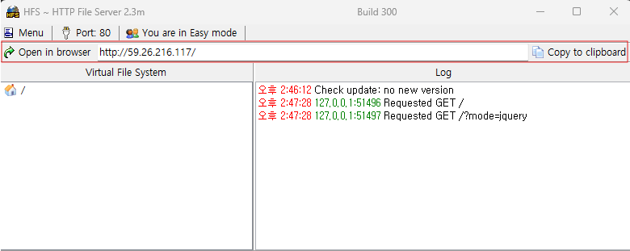
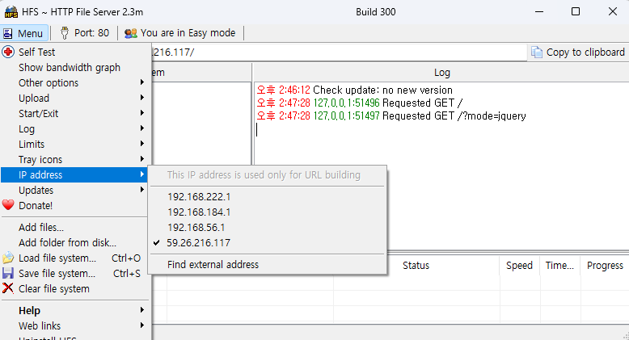
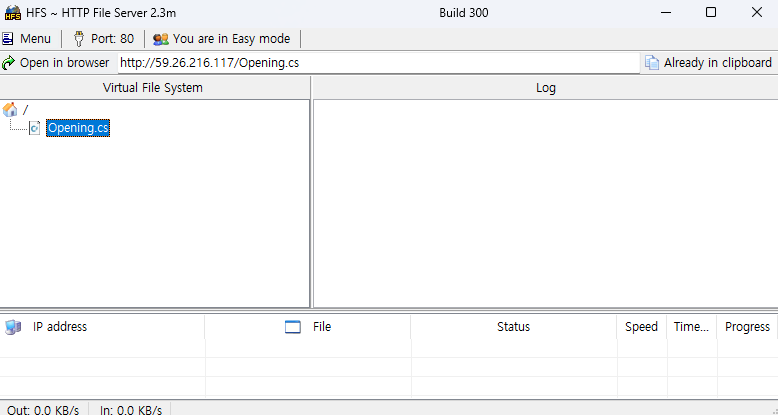
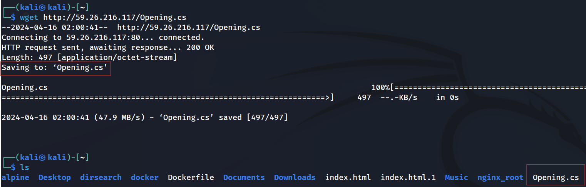

칼리리눅스의 가상환경이 아닌 외부의 환경에서 파일을 쉽게 가져오는 법을 소개한다.

1. 텍스트 복사, 붙여넣기 
   
   평소에 사용하던 contrlo + c  , contrlo + v 한뒤 칼리리눅에서 똑같이 contrlo + c , contrlo + v 하면된다.

외부의 환경에서 복수 붙여넣기가 되지 않는다면.

VMware tools가 제대로 설치가 되지 않아서 발생한 문제이다.

```
sudo apt-get install open-vm-tools open-vm-tools-desktop
```

명령어를 터미널에 입력 및 설치한뒤 재부팅한다.


2. 파일 복사, 붙여넣기 
   
   2.1 외부환경에서 복사하고 싶은 파일을 칼리리눅스에 드래그 앤 드롭
   
   2.2 외부환경에서 복사하고 싶은 파일을contrlo + c  칼리리눅스에 contrlo + v 
   
   

복사할 파일에 크기가 클때 2.1과 2.2방법을 사용하면 깨질때가 발생한다.

hfs(HTTP 파일 서버)를 외부환경에서 다운로드 받아 설치 및 실행한다. 

[HFS ~ HTTP File Server](https://www.rejetto.com/hfs/?f=dl)


HFS을 실행해 준다

파일을 공유하기전  본인의 IP가 정확하게 설정 되어있는지 확인한다.




IP 설정은 Menu -> IP address로 변경 가능하다.




외부환경에서 칼리리눅스로 복사하고 싶은 파일을 드래그 앤 드롭해준다.




이후 칼리리눅스 티미널 환경에서 

```
wget httpp://
```

wget httpp://59.26.216.117.Opening.cs 를 입력하면 저장이된다.

(IP주소는 사용자별로 다른다.)



 
