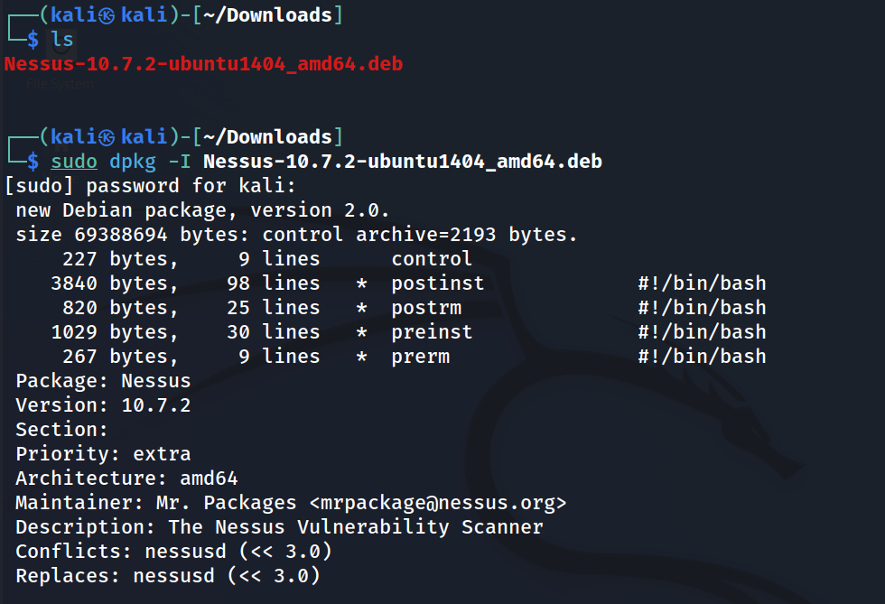

# dpkg란?

Kali Linux는 데비안 계열로 데비안 계열 명령어를 사용한다.

dpkg : 데비안 패키지 관리 시스템의 기초가 되는 SW로 dpkg 명령어가 .deb 패키지의 설치, 삭제, 정보 제공을 위해 사용된다. 

설치된 패키지들을 확인

```
sudo dpkg -l(소문자l)
```

설치된 프로그램과 관련 파일들을 확인

```
sudo dpkg -L apache2(프로그램이름)
```

설치된 프로그램의 정보를 확인

```
sudo dpkg -s apache2(프로그램이름)
```

설치된 프로그램 제거(설정파일까지)

```
sudo dpkg -P apache2(프로그램이름)
```

설치할 프로그램의 정보를 확인 

```
sudo dpkg -I Nessus-10.7.2-ubuntu1404_amd64.deb
```



deb파일 설치 방법

```
sudo dpkg -i Nessus-10.7.2-ubuntu1404_amd64.deb
```

usr/share 

윈도우의 Program Files(x86)의 기능 

usr/sbin

프록그램의 실행파일들이 주로 위치에 있다.(윈도우의 .exe)

/etc/ 

설정파일 

/lib/

라이브러리 

[[Kali Linux] 명령어 정리](https://heavensecuritygirl.tistory.com/36)
