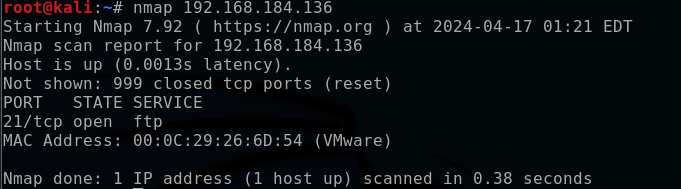
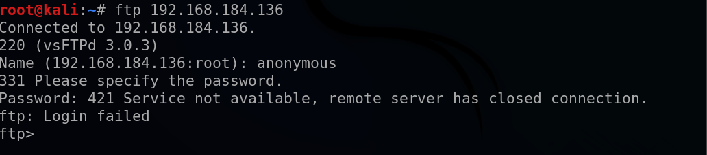
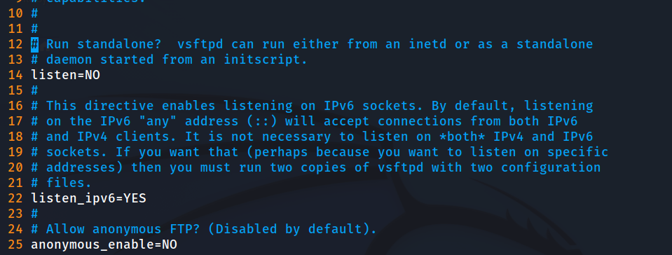
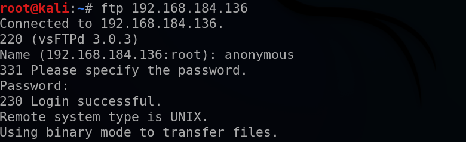
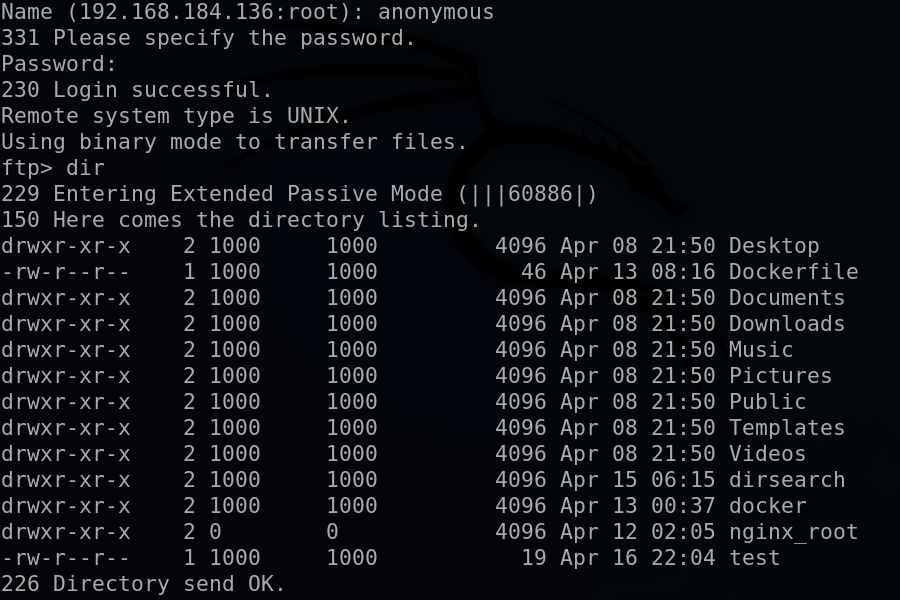

FTP란? 

파일 전송 프로토콜은 TCP/IP 프로토콜을 가지고 서버와 클라이언트 사이의 파일 전송을 하기 위한 프로토콜이다. 파일 전송 프로토콜은 TCP/IP 프로토콜 테이블의 응용 계층에 속하며, 역사는 오래 되었지만 지금도 인터넷에서 자주 사용된다.

FTP의 설치전 

```
sudo apt-get update
```

저장소를 업데이트를 진행하고 설치한다

FTP 데몬을 올리는 서비스인 vsftpd를 설치한다.

```
sudo apt install vsftpd
```

vsftpd 서비스를 동작시켜보자 

```
sudo service vsftpd start
```

vsftpd 서비스를 종료해보자

```
sudo service vsftpd stop
```

ftp 서비스에 접속하기 위해 다른 가상환경에서 nmap (vsftpd서비스를 실행한 가상환경의 IP 주소)명령어를 실행하여 ftp 서비스의 동작여부를 확인한다.

```
nmapt 192.168.184.136
```



ftp 서비스 접속을 위해 명령어 실행한다.

```
ftp 192.168.184.136
```

익명 연결을 위해 anonymous 입력을 해줘도 로그인이 되지 않는다.



익명연결 문제해결을 위해 vsftpd설정파일이 있는 저장소로 이동한다.

```
cd /etc/
```

```
ls -ak | grep vsftp
```

vsftp.conf파일을 vim에디터로 열어서 수정을 진행한다.

```
sudo vim vsftpd.conf
```



25번 라인에 anonymous_enable=NO


anonymous_enable=YES로 변경후 저장해준다 .

이후 서비스를 재시작해준다

```
sudo service vsftpd restart
```

원격 가상환경으로 돌아가 다시 로그인 해주고 엔터를 누르면 정상적으로 로그인된다.



하지만 dir 명령어를 입력하면 아무것도 없는것이 보이는데 이런 문제는 

기본으로 설정된 파일들은 아무것도 없기때문이다.

우리가 원하는 폴더로 지정해주는 방법 

vsftpd 설정파일이 있는 저장소로 이동하여 vim애디터로 수정을 해준다.

```
sudo vim vsftpd.conf
```

vim 에디터로 들어와 가장 밑단 라인에 

```
anon_root=/home/kali
```

ftp서비스를 위한 별도의 디렉토리를 만들어서 설정도 가능하다(취향) 저장후 서비스를 재시작해준다.

```
sudo service vsftpd restart
```

다시 원격장치로 돌아와 다시 접속을 헤주면 설정한 대로 /home/kali의 디렉토리를 확인가능하다.


