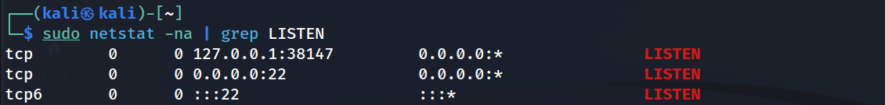
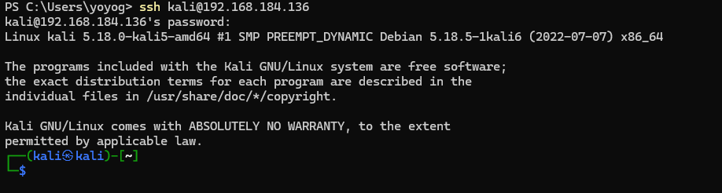
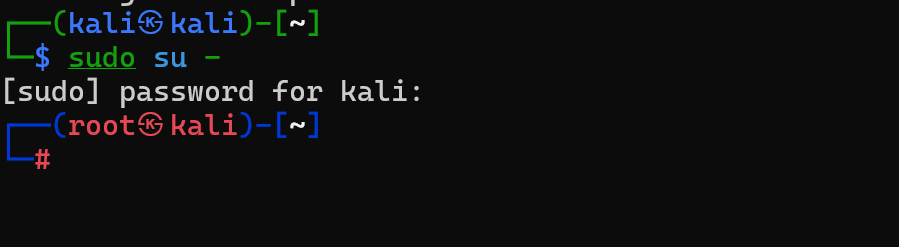
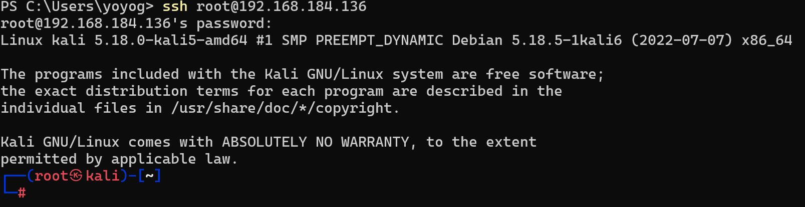

ssh란?

시큐어 셸은 네트워크 상의 다른 컴퓨터에 로그인하거나 원격 시스템에서 명령을 실행하고 다른 시스템으로 파일을 복사할 수 있도록 해 주는 응용 프로그램 또는 그 프로토콜을 가리킨다.

ssh서비스를 동작해 보자.

```
sudo service ssh start
```

서비스가 잘 동작하는지 알아보기 위해 네트워크의 상태를 확인해보자.

```
sudo netstat -na
```

-na : 좀 더 자세한 정보를 표시해라.



위 명령어를 입력하여 현제 ssh가 동작하는 상태를 확인할 수 있다.

grep LISTEN 명령어를 사용하여 열려 있는 상태를 확인 하였다.

22포트가 열려 있다는것을 확인할 수 있다.

호스트 os에서 ssh서비스가 잘 동작이되는지 확인해 보자.

호스트 os에서 cmd를 실행해 준다.

칼리리눅스 ssh접근을 위해 호스트 os에 ssh 칼리리눅스IP를 입력한다.


이때 주의 할점은 접속하는 대상인 kali사용자이므로 

```
ssh kali@192.168.184.136 
```

위 명령어로 접속을 해야한다.



칼리리눅스의 쉘환경에 로그인 된것을 볼수있다.

root로 계정전환도 가능하다.



exit로 ssh를 빠저나와

```
ssh root@192.168.184.136
```

로 접속을 할때는 접속권한이 없다고 문구가 나오다. 왜냐하면 ssh가 root권한으로 로그인하지 못하게  설정이 되어 있기때문이다.

root권한으로 접근가능하도록 해보자

```
sudo vim /etc/ssh/sshd_config
```

vim환경으로 들어가서 


주석을 지워주고 prohibit-password를 삭제하여 yes를 작성해준다


저장하고 vim 환경에서 나가준다.

tip vim에서 라인넘버를 보고 싶을때 set nu

```
:set nu
```

칼리리눅스 환경에서 ssh 서비스를 재시작 해준다

```
service ssh restart
```

호스트 os 로 다시 돌아가 root 계정으로 로그인해 보자

```
ssh root@192.168.184.136
```



root계정으로 서비스 접근이 가능하다.
