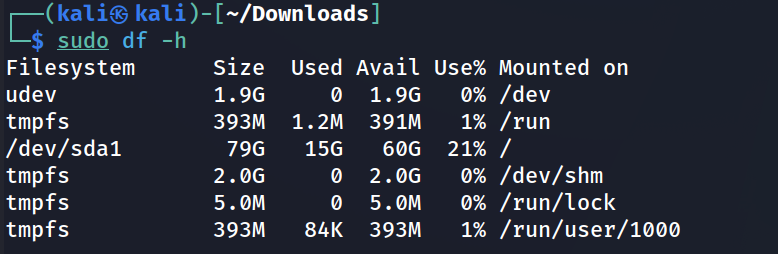
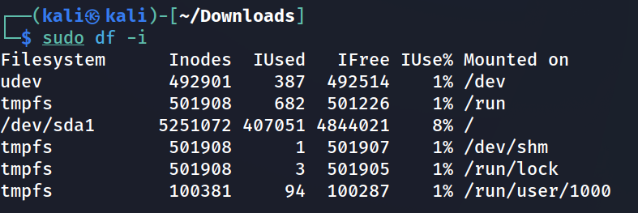
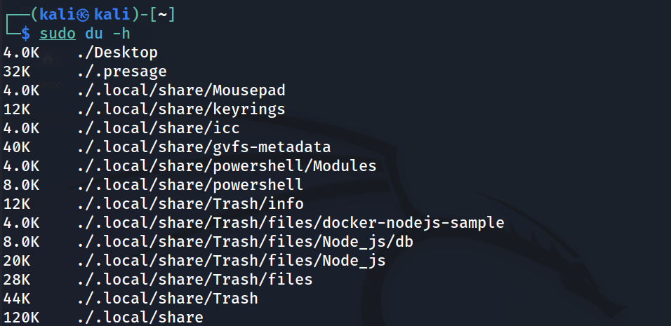
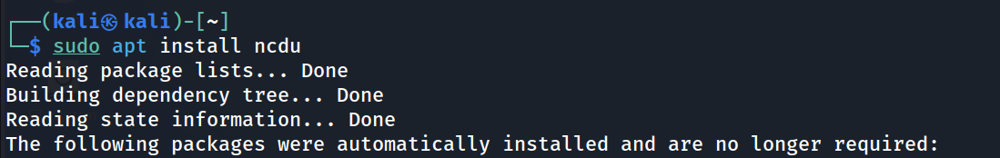
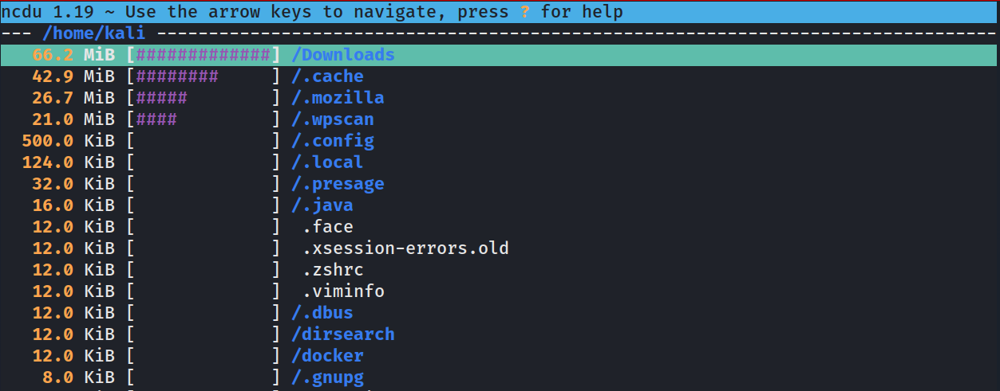
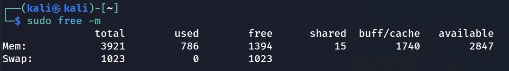
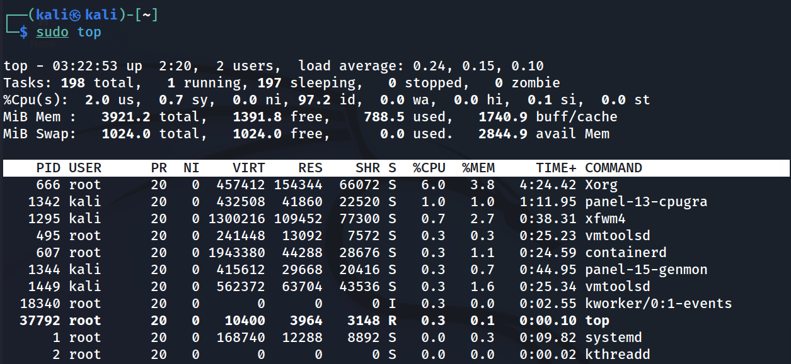
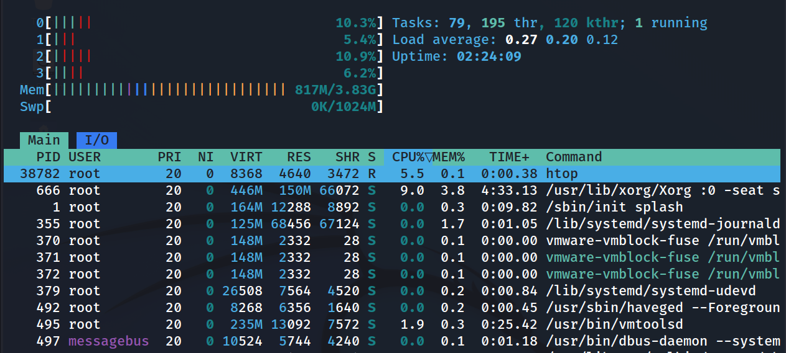

시스템, 메모리 확인하는 명령어

```
sudo df -h
```



/dev/sda1

칼리리눅스가 설치된 메인 공간

Inodes확인 명령어 

Inodes란? 

각각의 파일들의 중요한 정보가 담고있는 객체유형 파일에 대한 권한 소유

마지막 수정 날자 등의 세부정보들이 들어 있는 구조체를 가리킨다.

https://velog.io/@redgem92/%EC%9A%B4%EC%98%81%EC%B2%B4%EC%A0%9C-%ED%8C%8C%EC%9D%BC-%EC%8B%9C%EC%8A%A4%ED%85%9C-inode-%EB%B0%A9%EC%8B%9D%EC%97%90-%EB%8C%80%ED%95%98%EC%97%AC

```
sudo df -i
```



디렉토리 정보 확인

```
sudo du -h
```



더 보기 쉽고 좋은 ncdu 툴이 있다.(디스크 용량을 바로 확인 가능하다.)

```
sudo apt install ncdu
```





cpu와 메모리의 저장공간을 확인하는 명령어

```
sudo free -m
```



윈도우의 작업관리자 명령어(실시간)

```
sudo top
```



이것을 대체할 더 예븐 htop툴이 있다

```
sudo apt install htop
```


