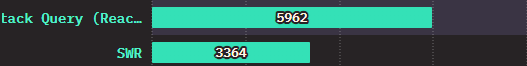

# React Query란

프론트엔드 개발을 하면서 API 호출 후 데이터를 효과적으로 관리할 방법을 찾던 중, React Query를 알게 되었다. 이전에도 몇 번 들어본 적은 있었지만, 이번 기회를 통해 React Query가 정확히 어떤 개념인지 정리해보았다.

<!-- 이미지 -->


[공식문서](https://tanstack.com/query/v5/docs/framework/react/overview)에 따르면, React Query는 데이터를 가져오고(fetching), 캐싱하며, 서버 데이터와의 동기화를 지원하는 라이브러리라고 설명하고 있다.

즉, React 환경에서 서버와의 데이터 동기화를 지속적으로 유지할 수 있도록 돕는 도구다. 이 라이브러리는 비동기 데이터를 불러오는 과정에서 발생할 수 있는 다양한 문제를 해결하는 데 중점을 두고 있다. 이제, 이러한 문제들이 무엇이며, React Query가 이를 어떻게 해결하는지 구체적으로 살펴보자.


# 1. 캐싱

React Query는 여러가지 장점이 있는데, 먼저 캐싱을 알아보자.

> 캐싱이란, 이전에 사용한 데이터를 임시로 저장하고 동일한 데이터에 대한 접근 속도를 높이는 것

캐싱을 통하여 동일한 데이터에 대한 비동기 호출을 방지하며, 서버에 대한 부담감을 덜어줄 수 있다.

하지만 아래의 의문점을 가질 수 있는데,

👤 **현재 데이터가 최신인지 어떻게 구분할 수 있는지?**

만약 캐싱된 데이터를 사용하고 있던 중, 서버 상의 데이터가 변경되었다면 사용자는 잘못된 정보를 제공받게 된다.

장점이 단점으로 전환되는 상황을 방지하기 위해서는 적절한 시기에 데이터를 갱신하는 것이 중요하다.

## a. 데이터 갱신

> fresh: (신선한) 캐싱한 데이터를 사용 <br />
> stale: (신선하지 않은) fetching이 필요한 상태

기본적으로 React Query는 캐시된 데이터를 stale로 간주한다.

즉, 최신화가 필요한 데이터라는 의미이며 아래와 같은 시점에 데이터를 갱신한다.

* 화면을 이탈했다가 다시 포커스를 가졌을 때
* 새로운 Query 인스턴스가 마운트 될 때
* 네트워크 재연결이 발생했을 때

예를 들어 정보 변경이 잦지 않은 **유저 정보**에 대해 캐싱한다고 치자.

현재 서버 부담은 크고, 호출하는 API가 많다.

심지어 유저 페이지에 진입할 때마다 get 요청을 보내 불필요한 API 호출이 생기게 된다.

이러한 상태 값을 캐싱하기 위해선 staleTime과 cacheTime을 알아야 하는데,

## b. staleTime? cacheTime?

> * staleTime은 데이터가 fresh에서 stale 상태로 변경되는 데 걸리는 시간 <br />
> * cacheTime은 데이터가 inactive한 상태일 때 캐싱된 상태로 남아있는 시간
> * inactive란 해당 쿼리가 현재 활성화 되지 않은 상태. <br /> 사용자가 화면에 포커스를 두지 않을 때 inactive 라고 한다. 쿼리가 캐시에 남아있지만, 자동으로 재요청하지 않는다.

staleTime에 의해 데이터가 fresh 상태인 경우엔, 위의 데이터 갱신 (refetch) 트리거가 발생해도 재요청을 하지 않는다.
cacheTime이 지난 이후 캐싱되었던 데이터는 가비지 콜렉터로 수집되어 메모리에서 해제된다.

결국 staleTime과 cacheTime이 뭐가 다른지 궁금할 수 있는데, 

만약 staleTime이 지나 데이터가 stale 상태가 되었지만, cacheTime은 지나지 않은 상태에서 <br />
해당 데이터를 사용하는 화면에 다시 포커스가 잡힌 경우에 (mount) 

**새로운 데이터를**  fetch 하는 동안 임시로 캐싱된 데이터를 보여준다.

이외에 사용자가 원하는 시점마다 직접 refetching을 하도록 설정할 수도 있다.

# 2. 간단한 비동기 데이터 관리

React Query는 API 호출과 비동기 데이터 관리를 간편하게 처리할 수 있도록 도와준다. <br />

React 개발 초창기 (2015-2018), Redux와 같은 라이브러리를 사용하여 이러한 작업을 처리했다. Redux는 Flux 패턴을 활용하여 상태를 관리하며, redux-thunk, redux-saga 등의 미들웨어를 사용하여 비동기 작업을 처리했다.

그러나 Redux를 사용하며 겪은 단점이 존재했는데, **장황한 Boilerplate 코드**이다.

아래는 간단한 Todo 샘플 코드이다.

```javascript
// src/store.js
import { createStore } from 'redux';

// 초기 상태
const initialState = {
  todos: []
};

// 액션 타입
const ADD_TODO = 'ADD_TODO';
const REMOVE_TODO = 'REMOVE_TODO';

// 액션 생성자
export const addTodo = text => ({
  type: ADD_TODO,
  payload: { text }
});

export const removeTodo = id => ({
  type: REMOVE_TODO,
  payload: { id }
});

// 리듀서 함수
function reducer(state = initialState, action) {
  switch (action.type) {
    case ADD_TODO:
      return {
        todos: [...state.todos, { id: Date.now(), text: action.payload.text }]
      };
    case REMOVE_TODO:
      return {
        todos: state.todos.filter(todo => todo.id !== action.payload.id)
      };
    default:
      return state;
  }
}

// Redux 스토어 생성
const store = createStore(reducer);

export default store;

```

```javascript
// src/App.js
import React, { useState } from 'react';
import { useSelector, useDispatch } from 'react-redux';
import { addTodo, removeTodo } from './store';

function App() {
  const todos = useSelector(state => state.todos);
  const dispatch = useDispatch();
  const [inputValue, setInputValue] = useState('');

  const handleAddTodo = () => {
    if (inputValue.trim() !== '') {
      dispatch(addTodo(inputValue));
      setInputValue('');
    }
  };

  const handleRemoveTodo = id => {
    dispatch(removeTodo(id));
  };

  return (
    <div>
      <h1>Todo List</h1>
      <input
        type="text"
        value={inputValue}
        onChange={e => setInputValue(e.target.value)}
      />
      <button onClick={handleAddTodo}>Add Todo</button>
      <ul>
        {todos.map(todo => (
          <li key={todo.id}>
            {todo.text}
            <button onClick={() => handleRemoveTodo(todo.id)}>Remove</button>
          </li>
        ))}
      </ul>
    </div>
  );
}

export default App;

```

위 코드는 최소한의 기능을 구현했을 뿐, 만약 하나의 API를 처리하기 위해 위해 여러 개의 액션과 리듀서를 사용하게 된다면 복잡도가 높아진다.

이는 앞서 설명했듯, Redux가 API 통신 및 비동기 상태 관리 라이브러리가 아니기 때문이다.

비동기 상태 관리를 위한 redux-thunk, redux-saga 등 프로젝트에 참여하는 개발자 성향에 맞춰야 하며, <br />
러닝 커브 이슈로 생산성이 낮아지는 경우도 있다.

이러한 이슈를 해결하기 위해 redux-toolkit이이 등장하였음에도 불구하고, 여전히 Boilerplate의 복잡도는 높았다.

위는 비동기 데이터 호출을 위한 환경에 구축하는데 있어 불편함을 보여준것이고, 아래는 비동기 데이터 관리에 대한 내용이다.

## Client Data와 Server Data 관심사 분리

프로젝트의 규모가 커질 수록 관리할 데이터는 늘어나고, Client Data와 Server Data의 분리가 필요한 시점이 올 것이다.

[관심사 분리]
> Client Data (상태 관리): 모달이나 UI 상태 등 클라이언트에서만 필요한 데이터 <br />
> Server Data (데이터 페칭): 유저 정보처럼 비동기 API 호출을 통해 서버에서 가져오는 데이터

Client Data의 경우 Redux, Recoil, mobX와 같은 전역 상태 관리 라이브러리들을 통해 관리되었다.
문제는 이러한 라이브러리들이 Server Data까지 같이 관리를 해야하는 상황이 잦았다.

위에서 설명했듯 Redux는 비동기 상태 관리 라이브러리가 아니기에 redux-thunk와 같은 미들웨어까지 사용하는 일이 생긴 것이다.

이 외에 데이터 페칭 로직을 최적화하여 불필요한 네트워크 요청을 최소화하고, 백그라운드에서 데이터 동기화를 처리하여 개발 생산성도 향상시킨다.

## Query와 Mutation

React Query에서 비동기 데이터 요청을 Query와 Mutation이라는 2가지 유형으로 나누어 생각한다.

제공되는 useQuery훅을 통해 수행되는 Query 요청은 GET Method로, 서버에 저장된 상태를 불러올 때 사용한다.

```javascript
// React Query useQuery 기본 사용 예시
const { data } = useQuery(
  queryKey, // Required
  fetchFn, // The function that the query will use to request data.
  options
)
```

> 이 외에 단 건 요청인 useQuery와 다르게 병렬로 요청하는 useQueries, 무한 스크롤 구현에 용이한 useInfiniteQuery 훅도 제공된다.

useQuery 훅은 요청마다 고유값 Unique Key (Query Key)를 필요로 한다. 해당 Unique Key로 서버 상태를 로컬에 캐시하고 관리한다. (재호출 등)

아래는 유저 정보를 가져오는 샘플 코드이다.

```javascript

const User = () => {
  const { isLoading, error, data } = useQuery(
    'userInfo', // Key, 다른 컴포넌트에서 해당 키를 사용한 hook이 있으면, 캐시된 데이터를 우선 사용함
    () => axios.get('/user').then(({ data }) => data)
  );

  if (isLoading) return <div> 로딩중 </div>
  if (error) return <div> 에러 {error.message} </div>
  if (!data) return <div> 데이터가 존재하지 않음 </div>

  return (
    <div>
      {data.name}
    </div>
  )
}

```
useMutation을 통해 수행되는 Query 요청은 POST, PUT, DELETE Method로, Side Effect를 발생시켜 서버의 상태를 변경시킬 때 사용한다.

> Side Effect: 결과를 예측할 수 없는 것. 외부의 상태를 변경

```javascript
// React Query useMutation 기본 사용 예시
const { mutate } = useMutation(
  mutationFn, // Required
  options
)
```

Side Effect를 발생시킨 후, 요청의 성공 여부에 따라 수행할 함수를 지정할 수 있다.

> onSuccess: 쿼리 요청 성공시 실행되는 함수 <br />
> onError:   쿼리 요청 실패시 실행되는 함수 <br />
> onSettled: 성공/실패 관계 없이 쿼리 요청시 실행되는 함수 <br />

아래는 간단한 샘플 코드이다.

```javascript
// 서버에 정보를 전달하기 위한 Custom Hook
import axios from 'axios';
import { useMutation, useQueryClient } from 'react-query';
import { QUERY_KEY as getContractQueryKey } from './useContractQuery';

const apiFetch = (params: string) => axios.post('/create/contract', { params });

const useCreateContractMutation = () => {
  const queryClient = useQueryClient();

  return useMutation(apiFetch, {
    // 해당 쿼리키로 관리되는 서버 상태를 다시 불러오기 위해
    // mutate 요청 성공 후, API Response Cache 초기화
    onSuccess: () => queryClient.invalidateQueries(getContractQueryKey),
  });
};
```

```javascript
import useCreateContractMutation from 'quires/useCreateContractMutation';

function Todo() {
  // 서버에 새로운 계약을 생성하기 위한 Custom Hook
  const { mutate } = useCreateContractMutation();

  const handleCreateContract = () => {
    mutate({ title: "계약서" });
  }

  return (
    <div>
      <button onClick={handleCreateContract}>계약 생성</button>
    </div>
  );
}

export default Todo;
```

# 3. React Query외 다른 라이브러리는?

React Query와 성격이 비슷한 데이터 페칭 라이브러리는 SWR (stale-while-revalidate)가 있다.



위 사진은 [State of js](https://2022.stateofjs.com/en-US/other-tools/#data_fetching)에서 조사한 2022 라이브러리 사용 빈도이며, TanStack Query (React Query) 다음으로 SWR가 많이 사용되고 있는 걸 볼 수 있다.

아래 코드를 통해 React Query와 유사한 점과 차이점을 알아보자.

```javascript
// SWR 기본 사용 예시
import useSWR from 'swr';
import axios from 'axios;

const url = "/api";
const fetcher = (url:string) => axios.get(url).then((res) => res.data);

const App = () => {
  const { data, error, isLoading } = useSWR(QUERY_KEY, fetcher);

  return (
    <div>
      {data.name}
    </div>
  )}
```

SWR은 첫 번째 인자로 URL을 키로 사용하고, 두 번째 인자로 fetch 함수를 받는다.
이 방식으로 SWR은 URL을 키로 삼아 fetch 함수를 통해 데이터를 가져온다.

일반적으로 요청에는 "loading", "ready", "error"의 세 가지 상태가 있다.
data, error, isLoading 값을 사용하여 요청의 현재 상태를 확인하여 필요한 UI를 반환할 수 있다.

또한 React Query와 비슷하게 Custom Hook을 통해 쉽게 재사용 할 수 있다.

```javascript
// user 정보를 얻어오는 커스텀 훅
const useUser = (id:string) => {
  const { data, error, isLoading } = useSWR(`/api/user/${id}`, fetcher)
 
  return {
    user: data,
    isLoading,
    isError: error
  }
}
```

Data fetching 와 몇 기능에 조금의 차이는 있지만, 추구하는 방향이 비슷한 걸 볼 수 있다.

그렇다면 **차이점은** 무엇인지 알아보자.

* Provider의 유무

> React-Query는 App (또는 root) 컴포넌트에 Provider로 감싸줘야, 자식 컴포넌트에서 사용 가능하며, SWR은 그냥 fetching 하면 된다.

React Query는 QueryClient라는 객체를 통해 모든 쿼리와 관련된 상태를 중앙에서 관리한다.

QueryClientProvider를 사용하여 QueryClient를 React 컴포넌트에 삽입하면, 트리 내의 모든 컴포넌트가 동일한 QueryClient 인스턴스를 공유하게 된다.
이를 통해 캐싱, 재요청, 가비지 컬렉션 등의 기능이 이루어진다.

반면 SWR은 단순성과 사용 편의성을 강조한다.

별도의 Provider 설정 없이도 전역적으로 캐시가 공유되도록 설계되었기에,
SWR 훅을 직접 호출하면, 내부적으로 글로벌 캐시를 사용하여 데이터 페칭 및 캐싱을 처리한다.


* fetcher 정의

> useSWR, useQuery 모두 두 번째 인자로 fetcher를 받는다. <br />
> 하지만 SWR은 fetcher의 인자로 useSWR의 첫 번째 인자(url)를 넘겨 주고, useQuery는 fetcher에 url을 직접 전달해야 한다.

또한 SWR은 전역 설정을 통해 fetcher를 정해 둘 수 있지만, React Query는 항상 두 번째 인자에 fetcher를 넘겨 줘야 한다.


* Mutation

> SWR과 React Query엔 Mutation이라는 개념이 있다. <br />
> 하지만 개념이 서로 다르게 적용된다.

둘 다 '변형시킨다' 라는 의미를 가졌지만,

**React Query**는 서버의 상태를 변형시킨 후, 쿼리를 갱신하여 최신 데이터를 반영하는 방식이고,
**SWR**은 useSWR()을 통해 캐시된 데이터를 Client에서 변형시킨 후, 필요에 따라 서버 요청을 통해 데이터를 동기화한다.

---

## 결론

React Query는 서버 상태 관리를 위한 라이브러리로, 데이터 관심사 분리, 효율적인 페칭, 캐싱, 자동으로 refetching, 쿼리 무효화, 재시도 등의 기능을 제공한다.
주로 RESTful API와 잘 어울리며, 데이터를 관리하는 데 필요한 다양한 옵션을 제공합니다.

비슷한 라이브러리로 SWR이 있으며, 프로젝트 상황에 맞게 라이브러리를 선택하면 된다.

> SWR을 사용해야 할 때: 간단하고 빠른 설정으로 캐싱과 페칭을 구현하고 싶을 때 <br />
> React Query를 사용해야 할 때: 복잡한 서버 상태 관리와 다양한 옵션이 필요한 경우

## Reference

[Tanstack Query](https://tanstack.com/query/latest/docs/framework/react/overview) <br />
[State of js](https://2022.stateofjs.com/en-US/other-tools/#data_fetching) <br />
[SWR](https://swr.vercel.app/ko/docs/getting-started)


