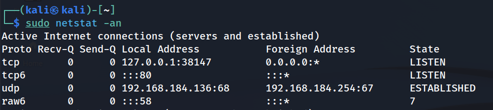

칼리리눅스를 이용해서 웹서비스 운영에 대한 기초를 배워보자 

프로토콜 기반에 웹서비스의 종류를 알아보자

1. FTP - 파일전송

2. HTTP - 웹서비스 - 80/TCP

3. SSH - 원격접속

4. Telnet - 원격접속, 파일전송....

5. Snmp - 장비로그전송....

<u>칼리리눅스는 HTTP 데몬과 관련된 apache2가 설치되어 있다.</u>

HTTP 서비스 apache2를 동작해보자

```
sudo service apache2 start
```

서비스가 잘 동작하는지 알아보기 위해 네트워크의 상태를 확인해보자.

```
sudo netstat -na
```

-na : 좀 더 자세한 정보를 표시해라.



위 명령어를 입력하여 현제 apache2가 동작하는 상태를 확인할 수 있다.

여기서 주의깊게 살펴볼 부분은 

> Local Address :::80 - 80포트로 열려 있다

> State LISTEN 나는 열고 있다

> Foreign Address 모든 대상에 대해서 허락한다

80포트로 들어가면 apache2 서비스가 열린다. 라고 설명할 수 있다.

apache2 서비스를 확인해보자

1. http://localhost  == localhost:80

2. http://127.0.0.1 로 접속한다(자신의 localhost)

웹 서비스의 대한 정보를 확인해 보자.

> /var/www/html/ 에서 확인 가능하다.

웹 서비스의 대한 log 정보를 확인해 보자. 

> /var/log/apache2 에서 확인 가능하다.

HTTP 서비스 apache2의 동작을 종료해보자.

```
sudo service apache2 stop
```
