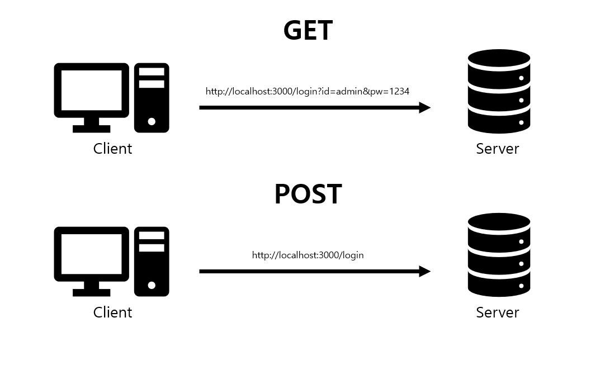

본격적으로 파이널 프로젝트를 시작하기 전에 대규모 시스템 설계에 대해 공부해보려고 한다. 멘토님이 추천해주신 [가상 면접 사례로 배우는 대규모 시스템 설계 기초] 의 1장 내용인 "사용자 수에 따른 규모 확장성" 을 정리했다. 


## 사용자 수에 따른 규모 확장성
한 명의 사용자를 지원하는 시스템에서 시작하여, 최종적으로 몇백만 사용자를 지원하는 시스템을 설계해보며 규모 확장성과 관련된 설계 문제를 푸는 데 쓰일 유용한 지식들을 마스터 해보자.

## 단일 서버 
모든 서버가 단 한대의 서버에서 실행되는 간단한 시스템 설계에 대한 그림은 아래와 같다. 


<div style="display: flex; justify-content: center;">
    
</div>

<br>

웹, 앱, 데이터베이스, 캐시 등이 전부 서버 한 대 가동되는 것을 표현 한 것이다. 이 그림의 시스템 구성을 이해하기 위해서는 사용자의 요청이 처리되는 과정과 요청을 만드는 단말에 대한 이해가 필요하다. 

<br>


<div style="display: flex; justify-content: center;">
     
</div>

(1)  사용자는 도메인 이름(api.musite.com) 을 이용하여 웹사이트에 접속한다.  

- 이 접속을 위해서는 도메인 이름을 도메인 이름 서비스(Domail Name Service) 를 이용하여 IP 주소로 변환하는 과정이 필요하다.
- 보통 제3 사업자 (third party)가 제공하는 유료 서비스를 이용하게 되므로 우리 시스템의 일부는 아니다. 

><b><span style="font-size:16px;">DNS(Domain Name Service) 란?</span></b><br>
<span style="font-size:14px;">스마트폰이나 노트북부터 대규모 소매 웹 사이트의 콘텐츠를 서비스하는 서버에 이르기까지 인터넷상의 모든 컴퓨터는 숫자를 사용하여 서로를 찾고 통신합니다. 이러한 숫자를 IP 주소라고 합니다. 웹 브라우저를 열고 웹 사이트로 이동할 때는 긴 숫자를 기억해 입력할 필요가 없습니다. 그 대신 example.com과 같은 도메인 이름을 입력해도 원하는 웹 사이트로 갈 수 있습니다. - <a href="https://aws.amazon.com/ko/route53/what-is-dns/">AWS</a><br>
DNS(Domain Name System)은 사용자가 숫자로 된 인터넷 프로토콜 주소 대신 인터넷 도메인 이름과 검색 가능한 URL을 사용하여 웹사이트에 접속하는 것을 가능하게 합니다. 사용자는  93.184.216.34와 같은 IP 주소를  기억하는 대신  www.example.com을 검색할 수 있습니다 - <a href="https://www.ibm.com/kr-ko/topics/dns">IBM</a>.</span>


(2) DNS의 조회 결과로 IP 주소가 반환된다. 

- 예제에서는 15.125.23.214 라고 표현했다. 이 주소는 그림 1-2의 웹서버 주소이다. 

(3) 해당 IP 주소로 HTTP(HyperText Transper Protocol) 요청이 전달된다. 

(4) 요청을 받은 웹서버는 HTML 페이지나 JSON 형태의 응답을 반납한다. 


실제 요청은 모바일 앱 또는 웹 앱을 통해서 전달된다. 

- 웹 애플리케이션 : 비즈니스 로직, 데이터 저장 등을 처리하기 위해서느 서버 구현용 언어(자바, 파이썬 등)를 사용하고 프레젠테이션용으로는 클라이언트 구현용 언어(HTML, 자바스크립트 등)를 사용한다. 

- 모바일 앱 : 모바일 앱과 웹 서버간 통신을 위해서는 HTTP 프로토콜은 이용한다. HTTP 프로토콜을 통헤서 반환될 응답 데이터릐 포맷으로는 보통 JSON(JavaScript Object Notation)이 널리 쓰인다. 

## 데이터베이스
사용자가 늘면 여러 서버를 두어야 한다. 하나는 웹/모바일 트래픽 처리 용도고, 다른 하나는 데이터베이스용이다. 

<div style="display: flex; justify-content: center;">
     
</div>

웹/모바일 트래픽 처리 서버(웹 계층)과 데이터베이스 서버(데이터 계층)을 분리하면 각각을 독립적으로 확장해 나갈 수 있게 된다. 


### 관계형 데이터베이스와 비관계형 데이터베이스 

<br>

<div style="display: flex; justify-content: center;">
     
</div>

<p style="text-align:center;"><b><span style="font-size:14px;">SQL vs NoSQL</span></b></p>


>**관계형 데이터베이스**

- **관계형 데이터베이스 관리 시스템(Relation Data-base Management System, RDBMS)** 이라고도 부른다.
- MySQL, 오라클 데이터베이스, PostgreSQL 등이 있다. 
- 자료를 테이블과 열, 컬럼으로 표현한다. 
- 데이터 처리 언어인 SQL(Structured Query Language)을 사용하면 여러 테이블에 있는 데이터를 그 관계에 따라 조인 연산(JOIN)을 이용해 합칠 수 있다. 

>**비관계형 데이터베이스**

- **NoSQL**이라고도 부른다. 
- CouchDB, Neo4j, HBase, Amazon DynamoDB 등이 있다. 
- NoSQL 데이터베이스는 JSON 문서와 같은 하나의 데이터 구조 안에 데이터를 보관한다
- 키-값 저장소, 문서 저장소, 와이드-컬럼 저장소, 그래프 저장소와 같은 기본 데이터 모델 중 하나를 사용하여 정보를 관리한다. 
- 비관계형 데이터베이스는 일반적으로 조인 연산은 지원하지 않는다. 


>**DBMS와 NoSQL을 이용한 고객 주문 관리 예제** 

📰 관계형 모델에서는 개별 테이블이 고객 데이터, 주문 데이터, 제품 데이터를 별도로 관리하고 이 데이터들은 고객 ID 또는 주문 ID와 같은 고유한 공통 키를 통해 연결된다. 

📰 이 방법은 데이터를 빨리 저장하고 가져오는 데 유용하지만 상당한 메모리를 요구하며 메모리를 추가하려고 할 경우, SQL 데이터베이스는 수직적으로만 확장할 수 있고 수평적으로는 확장할 수 없기 때문에 하드웨어를 통해서만 메모리를 추가할 수 있다.

➡️ 그 결과, 수직적 확장이 궁극적으로 회사의 데이터 저장 및 가져오기 능력을 제한하게 된다.

-------
🗂️ NoSQL 데이터베이스는 비관계형이므로 테이블을 연결할 필요가 없다.내장된 샤딩 및 고가용성 기능이 수평적 확장을 용이하게 한다.

➡️  데이터베이스 서버 하나로 모든 데이터를 저장하거나 모든 쿼리를 처리할 수 없는 경우, 워크로드를 두 개 이상의 서버로 나눌 수 있으므로 데이터를 수평적으로 확장할 수 있다.

------ 

어느 데이터베이스를 선택할 것인가는 목표에 따라 결정된다. 

아래와 같은 경우에는 비-관계형 데이터 베이스가 바람직한 선택일 수 있다. 

- 아주 낮은 응답 지연시간이 요구됨 
- 다루는 데이터가 비정형이라 관계형 데이터가 아님
- 데이터(JSON, YAML, XML 등)를 직렬화하거나 역직렬화 할 수 있기만 하면 됨
- 아주 많은 양의 데이터를 저장할 필요가 있음 

## 수직적 규모 확장 VS 수평적 규모 확장 

**'스케일 업(scale up)'** 이라고도 하는 **수직적 규모 확장(vertical scaling)** 프로세스는 서버에 고사양 자원(CPU, RAM 등)을 추가하는 행위를 말한다. 

반면 **'스케일 아웃(scale out)'** 이라고도 하는 **수평적 규모 확장** 프로세스는 더 많은 서버를 추가하여 성능을 개선하는 행위를 말한다. 

서버에 유입되는 트래픽 양이 적을 떄는 수직적 확장이 좋은 선택이지만, 이 방법은 몇 가지 **심각한 단점**이 있다. 

- 규모 확장에 한계가 있다. 한 대의 서버에 CPU나 메모리를 무한대로 증설할 방법은 없다. 
- 장애에 대한 자동복구(failover) 방안이나 다중화(redundancy) 방안을 제시하지 않는다. 서버에 장애가 발생하면 웹사이트/앱은 완전히 중단된다. 

대규모 애플리케이션을 지원하는 데는 수평적 규모 확장이 보다 적절하다. 

### 로드밸런서 
로드밸런서는 부하 분산 집합(load balancing set)에 속한 웹 서버들에게 트래픽 부하를 고르게 분산하는 역할을 한다. 

<div style="display: flex; justify-content: center;">
     
</div>

<p style="text-align:center;"><b><span style="font-size:14px;">로드밸런서 작동 과정</span></b></p>

사용자는 로드밸런서의 공개 IP 주소(Public IP address)로 접속한다. 따라서 웹 서버는 클라이언트의 접속을 직접 처리하지 않는다. 

보안을 위해, 서버 간 통신에는 사설 IP 주소(private IP address)*가 이용된다. 로드뱔런서는 웹 서버와 통신하기 위해 사설 주소를 이용한다. 

 <span style="font-size:14px;"><b>사설 IP 주소 : 같은 네트워크에 속한 서버 사이의 통신에만 쓰일 수 있는 IP 주소로, 인터넷을 통해서는 접속할 수 없다.</b></span> 


- 서버 1이 다운되면 모든 트래픽은 서버 2로 전송된다. 따라서 웹 사이트 전체가 다운되는 일이 방지된다. 

- 웹사이트로 유입되는 트래픽이 가파르게 증가하면 두 대의 서버로 트래픽을 감당할 수 없는 시점이 오는데, 로드밸런서가 있으면 웹 서버 계층에 새로운 서버를 추가하는 간단한 방법으로 자동적으로 트래픽을 분산시켜 우아하게 대처할 수 있다. 


현재 웹 계층은  자동복구(failover) 방안이나 다중화(redundancy)에 대한 설정도 끝났다. 이제 데이터 계층을 살펴볼 차례이다.  현재 설계 안에는 하나의 데이터베이스 서버 뿐이고, 장애의 자동복구나 다중화를 지원하지 않는다. **데이터 베이스 다중화는 이런 문제를 해결하는 보편적인 기술이다.**

### 데이터베이스 다중화
다중화란 동일한 시스템의 복수로 준비하여 장애가 일어나면 보조 시스템으로 전환하는 것을 말한다. 보통 서버 사이에 주(master) - 부(slave) 관계를 설정하고 데이터 원본은 주 서버에, 사본은 부 서버에 저장하는 방식이다. 

- master
    - 쓰기 연산(write operation)은 마스터에서만 지원
    - 데이터베이스를 조작하는 명령어들 insert, delete, update 등은 마스터 데이터베이스로만 전달 
- slave
    - 마스터 데이터 베이스로부터 그 사본을 전달받으며, 읽기 연산(read operation) 만을 지원
    - 대부분의 애플리케이션은 읽기 연산의 비중이 쓰기 연산보다 훨씬 높으며, 통상 부 데이터베이스의 수가 주 데이터베이스의 수보다 많다.


위의 내용대로 데이터베이스를 다중화하면 다음과 같은 모습이다.

<div style="display: flex; justify-content: center;">
     
</div>

<p style="text-align:center;"><b><span style="font-size:14px;">데이터베이스 다중화</span></b></p>


#### 데이터베이스 다중화의 장점 

- 더 나은 성능 : 주-부 다중화 모델에서 모든 데이터 연산은 주 데이터베이스 서버로만 전달되는 반면 읽기 연산은 부 데이터베이스 서버들로 분산된다.  병렬로 처리할 수 있는 질의(query)의 수가 늘어나므로 성능이 좋아진다. 

- 안전성(reliability) : 데이터를 여러 장소에 다중화 시키므로 자연 재해등의 이유로 데이터베이스 서버 가운데 일부가 파괴되어도 데이터는 보존된다. 
 
- 가용성(availability) : 데이터를 여러 지역에 복제해 둠으로써, 하나의 데이터베이스 서버에 장애사 발생하더라도 다른 서버에 있는 데이터를 가져와 계속 서비스 할 수 있다. 


>**데이터베이스 다중화를 이용한 시스템 장애에 대한 대응 과정** 

- 🖥️ 부 서버가 한 대 뿐인데 다운된 경우 
    - 읽기 연산은 한시적으로 모두 주 데이터베이스로 전달
    - 즉시 새로운 부 데이터베이스 서버가 장애 서버를 대체

- 🖥️ 부 서버가 여러대인 상황에 다운된 경우 
    - 나머지 부 데이터베이스 서버들로 분산
    - 새로운 부 데이터베이스 서버가 장애 서버를 대체

- 🖥️ 주 서버가 다운되는 경우 
    - 한 대의 부 데이터베이스 서버만 있는 경우 해당 부 데이터베이스 서버가 새로운 주 서버가 됨
    - 모든 데이터베이스 연산은 새로운 주 서버상에서 수행되고 새로운 부 서버가 추가 됨
    
<br>

프로덕션(production) 환경에서 벌어지는 일은 이것보다 더 복잡하지만, 일단 이정도만 알아두자.  그럼 로드밸런서와 데이터베이스 다중화를 고려한 시스템 설계를 살펴보자.

<br>

<div style="display: flex; justify-content: center;">
     
</div>

<p style="text-align:center;"><b><span style="font-size:14px;">로드밸런서와 데이터베이스 다중화를 고려한 설계안</span></b></p>

(1) 사용자는 DNS로부터 로드밸러서의 공개 IP 주소를 받는다. 

(2) 사용자는 해당 IP 주소를 사용해 로드밸런서에 접속한다. 

(3) HTTP 요청은 서버 1이나 서버 2로 전달된다. 

(4) 웹 서버는 사용자의 데이터를 부 데이터베이스 서버에서 읽는다.

(5) 웹 서버는 데이터 변경 연산은 두 데이터베이스로 전달한다. 데이터 추가, 삭제, 갱신 연산등이 이에 해당한다. 


이제 웹 계층과 데이터 계층에 대한 설계는 끝났다!

그럼 응답시간(latency)을 개선해 볼 순서다. 응답시간은 케시(cache)를 붙이고 정적 콘텐츠를 콘텐츠 전송 네트워크(Content Delivery Network, CDN)로 옮기면 개선할 수 있다. 


## 캐시
캐시는 값비싼 연산 결과 쪼는 자주 참조되는 데이터를 메모리 안에 두고, 뒤이은 요청이 보다 빨리 처리될수 있도록 하는 저장소다. 

웹페이지를 새로고침 할 때마다 표시할 데이터를 가져오기 위해 한 번 이상의 데이터베이스 호출이 발생한다. 

애플리케이션은 데이터베이스를 얼마나 자주 호출하느냐에 따라 크게 좌우되는데, 캐시는 그런 문제를 완화할 수 있다. 

### 캐시 계층
캐시 계층(casge tier)은 데이터가 잠시 보관되는 곳으로 데이터베이스보다 훨 씬 빠르다. 

<div style="display: flex; justify-content: center;">
     
</div>

<p style="text-align:center;"><b><span style="font-size:14px;">캐시 계층</span></b></p>

요청을 받은 웹 서버는 캐시에 응답이 저장되어 있는지를 본다. 만일 저장되어 있다면 해당 데이터를 클라이언트에 반환한다. 없는 경우에는 데이터베이스 질의를 통해 데이터를 찾아 캐시에 저장한 뒤 클라이언트에 반환한다. 

이러한 캐시 전략을 읽기 주도형 캐시 전락(read-through caching strategy)이라고 부른다. 캐시 전략은 데이터 종류, 크기, 액세스 패턴에 맞게 선택하면 된다. 

캐시 서버를 이용하는 방법은 간단한데 대부분의 캐시 서버들은 API로 제공하기 떄문이다. 

```java
SECONDS = 1
cache.set('myKey', 'hi there', 3600*SECONDS)
cache.get('myKey')
```

<p style="text-align:center;"><b><span style="font-size:14px;">memcached API</span></b></p>

### 캐시 사용 시 유의할 점
- 캐시는 어떤 상황에 바람직한가? : 데이터 갱신은 자주 일어나지 않지만 참조는 빈번히 일어나는 상황
- 어떤 데이터를 캐시에 두어야 하는가? : 휘발성 메모리므로, 영속적으로 보관 할 데이터는 바람직하지 않다. 
- 캐시에 보관된 데이터는 어떻게 만료된는가? : 이에 대한 정책을 마련하는 것은 좋은 습관이다. 만료된 데이터는 캐시에서 삭제되어야 한다. 
- 일관성(consistency)은 어떻게 유지된느가? :  저장소의 원본을 갱신하는 연산과 캐시를 갱신하는 연산이 단일 트랜잭션으로 처리되지 않는 경우 일관성은 깨질 수 있다. 
- 장애는 어떻게 대처할 것인가? : 캐시를 한 대만 두는 경우 해당 서버는 단일 장애 지점(Single of Failure, SPOF)이 되어버릴 가능성이 있다. SPOF를 피하려면 여러 지역에 걸쳐 캐시 서버를 분산시켜야한다.
- 캐시 메모리는 얼마나 크게 잡을 것인가? : 캐시 메모리가 너무 작으면 액세스 패턴에 따라 데이터가 자주 캐시에서 밀려난다. 그러므로, 캐시 메모리를 과할당하는 것이 좋다.
- 데이터 방출 정책은 무엇인가? : 캐시가 꽉 차버린 경우 추가로 데이터를 넣을 때 기존 데이터를 내보내야 한다. 이갓을 캐시 데이터 방출 정책이라 한다. LRU(Least Recently Used), LFU(Least Frequently Used), FIFO(First In First Out) 

## 콘텐츠 전송 네트워크(CDN)
CDN은 정적 콘텐츠를 전송하는 데 쓰이는, 지리적으로분산된 서버의 네트워크이다. 이미지, 비디오, CSS, JavaScript 파칠 등을 캐시할 수 있다. CDN은 동적 콘텐츠와 정적 콘텐츠를 캐시할 수 있지만, 지금은 정적 콘텐츠르 캐싱하는 방법에만 집중해보자. 

<div style="display: flex; justify-content: center;">
     
</div>

<p style="text-align:center;"><b><span style="font-size:14px;">CDN을 이용한 로딩시간 개선</span></b></p>

사용자가 웹사이트에 방문하면 사용자에게 가장 가까운 CDN 서버가 정적 콘텐츠에 전달된다. 이떄 사용자가 CDN 서버로부터 멀수록 웹사이트는 천천히 로드된다. CDN 서버가 샌프란시스코에 있다면 LA에 있는 사용자는 유럽에 있는 사용자보다 짜르게 웹 사이트를 볼 수 있다.


<div style="display: flex; justify-content: center;">
     
</div>

<p style="text-align:center;"><b><span style="font-size:14px;">CDN 동작 이미지</span></b></p>

(1) 사용자가 A가 이미지 URL을 이용해 image.png에 접근한다. URL의 도메인은 CDN 서비스 사업자가 제공한 것이다. 

(2) CDN 서버의 캐시에 해당 이미지가 없는 경우, 서버는 원본 서버에 요청하여 파일을 가져온다. 원본 서버는 웹 서버일 수도 있고 아마존 S3 같은 온라인 저장소일 수도 있다. 

(3) 원본 서버가 파일을 CDN 서버에 반환한다. 응답의 HTTP 헤다에는 해당 파일이 얼마나 오래 캐시될 수 있는지를 설명하는 TTL(Time-To-Live) 값이 들어있다.

(4) CDN 서버는 파일을 캐시하고 사용자 A에게 반환한다. 이미지는 TTL에 명시된 시간이 끝날 떄까지 캐시된다.

(5) 사용자 B가 같은 이미지에 대한 요청을  CDN 서버에 전송한다.

(6) 만료되지 않은 이미지에 대한 요청은 캐시를 통해 처리된다.

### CDN 사용 시 고려해야 할 사항
- 비용 : CDN은 보통 제3 사업자(third-party providers)에 의해 운영되며, CDN으로 들어가고 나가는 데이터 전송 양에 따라 요금을 내게 된다. 

- 적절한 만료 시한 설정 : 시의성이 중요한 콘텐츠의 경우 만료 시점을 잘 선택해야 한다. 

- CDN 장애에 대한 대처 방안 : CDN 자체가 죽었을 경우 웹사이트/애플리케이션이 어떻게 동작해야 하는지 고려해야 한다. 

- 콘텐츠 무효화(invalidation) 방법 : 아직 만료되지 않은 콘텐츠라 하더라도 아래 방법 가운데 하나를 쓰면 CDN에서 제거할 수 있다. 
    - CDN 사업자가 제공하는 API를 이용하여 콘텐츠 무효화
    - 콘텐츠의 다른 버전을 서비스하도록 오프벡트 비저닝 이용 : 콘텐츠의 새로운 버전을 지정하기 위해서는 URL 마지막에 버전 번호 인자를 주면 된다. (image.png?v=2)


시스템 설계에 CDN을 추가해보면 다음과 같다.

<div style="display: flex; justify-content: center;">
     
</div>

<p style="text-align:center;"><b><span style="font-size:14px;">CDN이 추가된 설계 </span></b></p>


(1) 정적 콘텐츠(JS, 이미지, CSS 등)는 더 이상 웹 서버를 통해 서비스하지 않으며, CDN을 통해 제공하여 더 나은 성능을 보여준다.

(2) 캐시가 제이터베이스 부하를 중여준다.


## 무상태(stateless) 웹 계층 

웹 계층을 수평적으로 확장할려며 이를 위해서는 상태정보(사용자 세션 데이터 등)를 웹 계층에서 제거해야 한다. 바람직한 전략은 상태 정보를 관계형 데이터베이스나 NoSQL 같은 지속성 저장소에 보관하고, 필요할 때 가져오도록 하는 것이다. 이렇게 구성된 웹 계층을 무 상태 웹계층이라 부른다. 

### 상태 의존적인 아키텍쳐
상태 정보를 보관하는 서버는 클라이언트 정보를 요청들 사이에 공유되도록 한다. 

<div style="display: flex; justify-content: center;">
     
</div>

<p style="text-align:center;"><b><span style="font-size:14px;">상태 의존적인 아키텍쳐</span></b></p>

위와 같은 구조는 클라이언트오부터의 요청은 항상 같은 서버로 전송되어야 하는 문제가 발생한다. 대부분의 로드밸런서가 이를 지원하기 위해 고정 세션(stucky session)이라는 기능을 제공하고 있는데, 이는 로드밸련서에 부담을 준다. 또한 서버의 장애를 처리하기도 복잡해진다. 

## 무상태 아키텍쳐
<div style="display: flex; justify-content: center;">
     
</div>

<p style="text-align:center;"><b><span style="font-size:14px;">무상태 아키텍쳐</span></b></p>

이 구조에서는 사용자로부터의 HTTP 요청은 어떤 웹 서버로도 전달될 수 있다. 웹 서버는 상태 정보가 필요한 경유 공유 저장소(shared storage)로부터 데이터를 가져온다.

따라서 상태 정보는 웹 서버로부터 물리적으로 분리되어 있다. 이런 구조는 **단순하고, 안전적이며, 규모 확장이 쉽다**

무상태 웹 계층을 갖도록 기존 설계를 수정하면 다음과 같다. 

<div style="display: flex; justify-content: center;">
     
</div>

<p style="text-align:center;"><b><span style="font-size:14px;">무상태 웹 계층 아키텍쳐</span></b></p>

세션 데이터를 웹 계층에서 분리하고 지속성 데이터 보관소에 저장하도록 만들었다. 이 공유 저장소는 관계형 데이터베이스일 수도 있고, Memcached/Redis 같은 캐시 시스템일 수도 있으며, NoSQL일 수도 있다. 

자동 구모 확장(autoscaling)은 트래픽 양에 따라 우ㅞㅂ 서버를 자동적으로 추가하거나 삭제하는 기능을 뜻한다. 상태 정보가 웹 서버들로부터 제거되었으므로, 트래픽 양에 따라 웹 서버를 넣거나 빼기만 하면 자동으로 규모를 확장할 수 있게 되었다. 

가용성을 높이고 전 세계 어디에서도 쾌적하게 사용할 수 있도록 하기 위해서는 여러 데이터센터를 지원하는 것이 필수다. 

## 데이터 센터 


두 개의 데이터 센터를 이용하느 사례다. 장애가 없는 상황에서 사용자는 가장 가까운 데이터 센터로 안내되는데, 통상 이 절차를 지리적 라우팅(geoDNS-routing 또는 geo-routing) 이라고 부른다. 지리적 라우팅에서 geoDNE는 사용자의 위치에 따라 도메인 이름을 어떤 IP주소로 변환할지 정할 수 있도록 해주는 DNNS 서비스다. 


<div style="display: flex; justify-content: center;">
     
</div>

<p style="text-align:center;"><b><span style="font-size:14px;">데이터 센터 </span></b></p>

위 예제의 경우, x% 사용자는 US-East 센터로, (100-x)% 사용자는 US-West 센터로 안내된다. 이들 데이터 센터 중 하나에 심각한 장애가 생긴다면 모든 트래픽은 장애가 없는 데이터 센터로 전송된다. 

<div style="display: flex; justify-content: center;">
     
</div>

<p style="text-align:center;"><b><span style="font-size:14px;">장애 상황에 따른 데이터 센터</span></b></p>

이 사례와 같은 다중 데이터센터 아키텍처를 만들려면 몇 가지 기술적 난제를 해결해야한다. 

- 트래픽 우회 : 올바른 데이터 센터로 보내는 효과적인 방법을 찾아야 한다. 
    - GeoDNS는 사용자에게 가장 가까운 데이터센터로 트래픽을 보낼 수 있도록 해준다.

- 데이터 동기화(synchronization) : 데이터 센터마다 별도의 데이터베이스를 사용하고 있는 상황이라면, 장애가 자동으로 복구되어 트래픽이 우회된다 해도, 해당 데이터센터에는 찾는 데이터가 없을 수도 있다. 
    - 이런 상황을 막는 보편적인 전략은 데아터를 여러 데이터에 걸쳐 다중화하는 것이다. 

- 테스트와 배포(deployment) : 여러 데이터 센터를 사용하도록 시스템이 구현된 상황이라면 웹사이트 쪼는 애플리케이션을 여러 위치에서 테스트해보는 것이 중요하다.
    - 자동화된 배포 도구는 모든 데이터 센터에 동알한 서비스가 설치되도록 하는데 중요한 역할을 한다. 


더 큰 규모로 시스템을 확장하기 위해서는 이스템의 컴포넌트를 분리하여, 각기 독립적으로 확장될 수 있도록 하여야 한다. 이 문제를 풀기 위해 채용하고 있는 핵심 전략 간운데 하나는 **메시지 큐(message queue)** 이다.


## 메세지 큐

메세지 큐는 무손실(durability, 즉 메시지 큐에 일단 보관된 메세지는 소비자가 꺼낼 때까지 안전히 보관된다는 특성)을 보장하는, *비동기 통신(asynchronous communication)을 지원하는 컴포넌트다. 메세지의 *버퍼 역할을 하며, 비동기적으로 전송한다. 


><b><span style="font-size:16px;">동기와 비동기</span></b><br>
<span style="font-size:14px;">**동기(Synchrounous)** : 어떤 작업을 요청했을 때 그 작업이 종료될 때까지 기다린 후 다음 작업을 수행한다. 데이터를 주고받는 ‘순서’가 중요할때 사용된다. 요청한 작업만 처리하면 되기 때문에 전체적인 수행 속도는 빠를 수 있다. 한 작업에 대한 시간이 길어질 경우, 전체 응답이 지연될 수 있다.<br>
**비동기(Asynchronous)** : 어떤 작업을 요청했을 때 그 작업이 종료될 때까지 기다리지 않고(작업을 위임하고), 다음 작업을 수행한다. 요청했던 작업이 끝나면 결과를 받고, 그에 따른 추가 작업이 있다면 수행한다. 요청 순서에 상관없이, 동시에 다수의 작업을 처리할 수 있다. 작업이 끝날 때 따로 이벤트를 감지하고 결과를 받아 그에 따른 추가 작업을 해줘야하기 때문에, 비교적 느릴 수 있다. I/O 작업이 잦고, 빠른 응답속도를 요구하는 프로그램에 적합하다.</span><br>

><b><span style="font-size:14px;"> 버퍼(buffer) : 데이터를 한 곳에서 다른 한 곳으로 전송하는 동안 일시적으로 그 데이터를 보관하는 메모리의 영역</span></b>


메세지 큐의 기본 아키텍처는 간단하다. 

<div style="display: flex; justify-content: center;">
     
</div>

<p style="text-align:center;"><b><span style="font-size:14px;">메세지 큐</span></b></p>

- 생산자 또는 발행자(priducer/publisher)라고 불리는 입력 서비스가 메세지를 만들어 메세지 큐에 발행(publish)한다.

- 큐에는 소비자 혹은 구독자(consumer/subscriber)라 불리는 서비스 혹은 서버가 연결되어 있는데, 메세지를 받아 그에 맞는 동작을 수행하는 역할을 한다. 

메세지 큐를 이용하면 서비스 또는 서버간의 결합이 느슨해져 규모 확장성이 보장된다. 

생산자는 소비자 프로세스가 다운되어 있어도 메세지를 발행할 수 있고, 소비자는 생산자 서비스가 가용한 상태가 아니더라도 메세지를 수신할 수 있다. 

>메시지 큐 에제 : 이미지의 크로핑(cropping), 새프닝(sharpning), 블러링(blurrirg) 등을 지원하는 사진 보정 어플리케이션

- 보정은 시간이 오래 걸릴수 있는 프로세스로 비동기적으로 처리하면 편하다. 
- 웹 서버는 사진 보정 작업(job)을 메시지 큐에 넣는다. 사진 보정 작업(worker) 프로세스들은 이 작업을 메기지 큐에서 꺼내어 비동기적으로 완료한다. 
- 생산자와 소비자 서비스의 규모는 각기 독립적으로 확장될 수 있다. 


<div style="display: flex; justify-content: center;">
     
</div>

<p style="text-align:center;"><b><span style="font-size:14px;">메세지 큐 예제</span></b></p>


## 로그, 메트릭 그리고 자동화

몇 개 서버에서 실행되는 소규모 웹 사이트를 만들 때는 로그나 메트릭(metric), 자동화(automation) 같은 것은 필수는 아니다. 하지만 웹 사이트와 함께 사업 규모가 커지고 나면, 필수적으로 설계해야 한다. 

- 로그 : 에러 로그는 서버 단위로 모니터링 할 수 있지만, 로그를 단일 서비스로 모아주는 도구를 활용하면 더 편리하게 검색하고 조회할 수 있다. 
- 메트릭 : 메트릭을 잘 수집하면 사업 현황에 관한 유용한 정보를 얻을 수도 있고, 시스템의 현재 상태도 쉽게 파악할 수 있다. 
     - 호스트 단위 메트릭 : CPU, 메모리, 디스크 I/O에 관한 메트릭이 여기 해당한다. 
     - 종합(aggregated) 메트릭 : 데이터베이스 계층의 성능, 캐시 계층의 성능이 여기 해당한다.
     - 핵심 비즈니스 메트릭 : 일별 능동 사용자(daily action user), 수익(revenue), 재방문(retention) 같은 것이 여기 해당한다. 

- 자동화 : 시스템이 크고 복잡해지면 생산성을 높이기 위해 자동화 도구를 활용해야 한다. 지속적 통합을 도와주는 도구를 활용하면 개발자가 만드는 코드가 어떤 검즌 절차를 자동으로 거치도록 할 수 있어서 문제를 쉽게 감지할 수 있다. 


### 메시지 큐, 로그, 매트릭, 자동화 등을 반영하여 수정한 설계안 

<div style="display: flex; justify-content: center;">
     
</div>

<p style="text-align:center;"><b><span style="font-size:14px;">메시지 큐, 로그, 매트릭, 자동화 등을 반영하여 수정한 설계안 </span></b></p> 


(1) 메세지 큐는 각 컴포넌트가 보다 느슨한 결합(loosely coupled)될 수 있도록 하고, 결함에 대한 내성을 높인다. 

(2) 로그, 모니터링, 메트릭, 자동화 등을 지원하기 위한 잔치를 추가하였다. 

## 데이터베이스 규모 확장 
데이터베이스의 구모를 확장하는 데는 두 가지 접근법이 있다. 하나는 수직적 규모 확장법이고 다른 하나는 수평적 규모 확장법이다. 

### 수직적 확장 
기존 서버에 더 많은, 또는 고성능 자원(CPU, RAM, 디스크 등)을 증설하는 방법이다. 아마존 AWS의 RDS(Relation Database Server)는 대용량 RAM을 갖춘 서버도 상품으로 제공하고 있다. 예를 들어 스택어버플로는 2013년 한 해 동안 방문한 천만명의 사용자 전부를 단 한대의 데이터베이스로 처리했다. 

>- 데이터베이스 서버 하드웨어에는 한계가 있으므로 CPU, RAM 등 무한 증설할 수는 없다.
- SPOF(Single Point Of Failure)로 인한 위험성이 크다.
- 비용이 많이 든다 

### 수평적 확장
데이터베이스의 수평적 확장은 **샤딩(sharding)**이라고도 부르는데, 더 많은 서버를 추가함으로써 성능을 향상시킬 수 있도록 한다. 

샤딩은 대듀모 데이터베이스를 **샤드(shard)**라고 부르는 작은 단위로 분할하는 기술을 일컫는다. 모든 샤드는 같은 스키마를 쓰지만 샤드에 보관되는 데이터는 중복이 없다. 

<div style="display: flex; justify-content: center;">
     
     
</div>


다음은 샤드로 분할된 데이터베이스의 예이다. 사용자 데이터를 어느 샤드에 넣을지는 사용자 ID에 따라 정한다. 이 사례는 user_id % 4 를 해시함수로 사용하여 데이터가 보관되는 샤드를 정한다.  


<div style="display: flex; justify-content: center; align-items: center; margin: 10px 0;">
   
          
     

</div>

<p style="text-align:center;"><b><span style="font-size:14px;">샤드로 분할된 데이터베이스 & 각 샤드 노드에 보관된 사용자 데이터  </span></b></p> 

샤딩 전략을 구현할 때 고려해야 할 가장 중요한 것은 샤딩 키(sharding key)를 어떻게 정하느냐 하는 것이다. 샤딩 키는 파티션 키(partition key)라고도 부르는데. 데이터가 어떻게 분산될지 정하는 하나 이상의 칼럼으로 구성된다. 

위의 예시의 경우네는 샤딩 키는 user_id 이다. 샤딩키를 정할 때는 데이터를 고르게 분할 할 수 있도록 하는게 중요하다. 

<div style="display: flex; justify-content: center;">
     
     
</div>

<p style="text-align:center;"><b><span style="font-size:14px;">데이터베이스 샤딩을 적용한 아키텍쳐</span></b></p> 


## 백만 사용자, 그리고 그 이상
시스템의 규모를 확장하는 것은 지속적이고 반복적인 과정이다. 시스템 규모 확장을 위해 살펴본 기법들은 다시 한번 정리해보면 다음과 같다.

- 웹 계층은 무상태 계층으로
- 모든 계층에 다중화 도입
- 가능한 한 많은 데이터를 캐시할 것
- 여러 데이터 센커를 지원할 것
- 정적 콘텐츠는 CDN을 통해 서비스할 것
- 데이터 계층은 샤딩을 통해 그 규모를 확장할 것
- 각 계층은 독립적 서비스로 분할할 것 
- 시스템을 지속적으로 모니터링하고, 자동화 도구를 활용할 것 