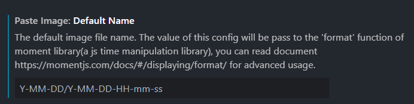
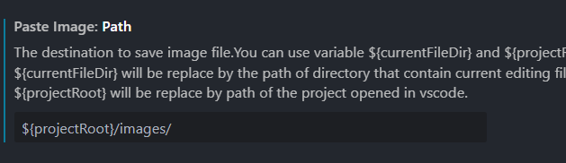
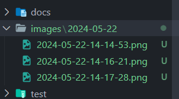

 
Pages가 다른 블로그 플랫폼 보다 편한 것 같아서 마음에 든다.
다른 사람들도 같이 많이 사용했으면 좋겠다는 생각이 든다.

YFM에서 정의한 제목을 이중 괄호 구문으로 본문에 추가할 수 있다.
이 글의 제목은 {{ page.title }}이고
마지막으로 수정된 시간은 {{ page.last_modified_at }}이다.  

이미지를 paste image 익스텐션으로 저장할 경우 필수 옵션 설정!!  
## Paste Image: Default Name  
 > Y-MM-DD/Y-MM-DD-HH-mm-ss

 

## Paste Image: Path 
> ${projectRoot}/images/  

   
 위의 설정을 해주면 날짜별 이미지가 폴더화 되어 관리된다.  

 

 

 위의 두 설정을 해줘야 

