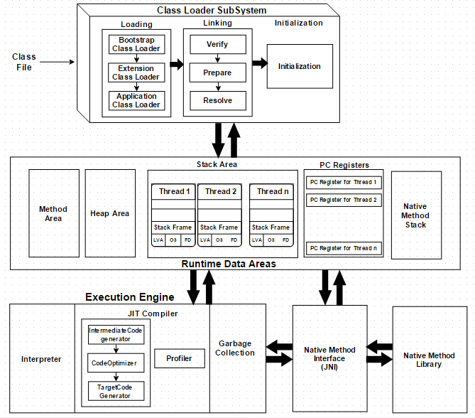

오늘은 상속에 대해서 알아보려고 합니다.

자바를 처음 배울 때 객체 지향 프로그래밍에서 상속은 기존 클래스의 속성과 기능을 그대로 물려받기 때문에 코드의 재사용할 수 있다는 강력한 장점을 가지고 있다고 배웠습니다.

하지만 실무에서는 상속을 사용한 코드를 보거나 사용한 기억이 없습니다.

더 나아가 왜 상속을 사용하지 않고, 인터페이스 구현이나 구성(`Composition`)을 선호하는지 알아보려고 합니다.


상속을 사용하지 않는 이유를 설명하기 전에 상속에 대해 설명해보겠습니다.


## 상속이란

상속은 객체 지향 프로그래밍의 핵심 요소 중 하나로, 기존 클래스의 필드와 메서드를 상속한 클래스에서 재사용하게 해줍니다.

상속은 `extends` 키워드를 사용하여 대상 하나만 선택할 수 있습니다.

```java
public abstract class Car {
    private String model; // 이름
    private int size; // 크기
    protected int year; // 연식

    public Car(String model, int size) {
        this.model = model;
        this.size = size;
    }
    
    // getter & setter 
    // methods ...
}
public class Truck extends Car {
    // private String model;
    // private int size;
    // protected int year;
    // 부모의 메서드들
    
	// 자식 클래스에 추가한 필드
    private int modelYear;
    
    public Truck(String model) {
        super(model, 1); // 소형차는 size를 3로 설정
    }
}
```

단, 모든 필드나 메서드를 자식 클래스에서 사용하지 못합니다.

####  패키지가 다른 경우

+ private
+ package-private (default)

#### 패키지가 같은 경우

+ private


위 접근 제어자가 붙어있는 메서드나 필드는 접근할 수 없으며 부모 클래스에서 제공하는 메서드를 통해 접근할 수 있습니다.

  

### 상속과 메모리 구조

{: .img50 .align-center}


글의 목적은 추상 클래스와 인터페이스를 사용목적에 따라 사용하자.


자바를 처음 학습할 때 객체지향 프로그래밍의 특징인 다형성을 배웠습니다.

다형성(`Polymorphism`)은 상속이나 인터페이스 구현을 통해 여러 클래스가 동일한 상위 타입으로 다뤄질 수 있도록 하는 것을 말합니다. 이를 통해 동일한 메서드 호출이 객체의 실제 타입에 따라 다르게 동작할 수 있습니다.

실무에서 다형성을 사용하기 위해 두 가지 방식인  추상 클래스의 상속과 인터페이스의 구현 중 사용 목적에 맞게 선택하기 위해 차이점을 정리했습니다.


상속(`extends`)은 객체 지향 프로그래밍에서 중요한 개념으로, 소프트웨어 설계의 유연성과 유지 보수성을 결정짓는 요소입니다. 


키워드는 **"결합도"**와 **"상태"** 입니다.


// 이번 글의 키워드는 "결합도"와 "상태"

// 결합도란?

// 상태란?

// 추상 클래스는 상속을 해야하며, 상태를 가진다

// 상속의 의미

// 상속을 하면 캡슐화가 깨진다.

// 하위 클래스에서 상위 클래스의 로직을 알아야한다. - 캡슐화가 깨짐

// 상위 클래스의 변경이 하위 클래스에도 영향을 미친다. -이펙티브자바


// 상태 공유의 의미

// 하위 클래스는 불변 객체를 유지하기 어렵다.

// 유지 보수하기가 어렵다.

