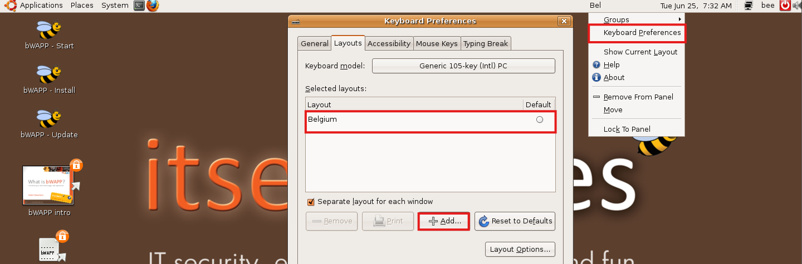
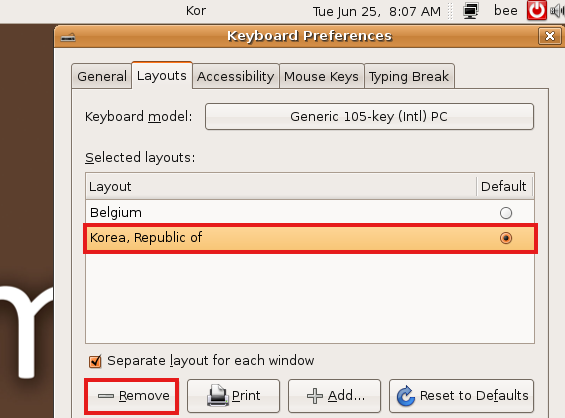

**[공지사항]** [본 블로그에 포함된 모든 정보는 교육 목적으로만 제공됩니다.](https://weoooo.github.io/notice/notice/)
{: .notice--danger}

**[bee-box란?]** [bee-box를 모르신다면 클릭!](https://weoooo.github.io/bee-box/bee-box/)
{: .notice--success}

## bee-box의 키보드 설정 변경

bee-box 상단 배너에 마우스 우클릭 -> keyboad Preferences 클릭한다

기본 키보드 설정은 Belgium(벨기에)로 설정되어 있다. 

(bee-box개발자 Malik Mesellem분이 벨기에 출신이신가보다:)

### bee-boxd의 키보드 추가

키보드 설정 화면에서 "Add..."를 클릭한다.

"Layouts:"를 클릭하여 키보드 리스트에서 "Korea, Republic of" 선택하여 클릭한다.

위 그림과 같이 설정이 완료가 되었다면 "Add"를 클릭하여 한글 키보드를 추가한다.

정상적으로 키보드가 추가 되었고 "close"를 클릭한다.

### bee-box 키보드 변경

현제 기본 키보드은 "Bel" 로 설정되어 있다.

bee-box 상단 배너 "Bel" 클릭하여 "Kor"로 변경한다 .

bee-box의 터미널로 들어가 설정이 잘 되었는지 확인한다.

그림과 같이 한글 키보드 배열에 맞게 문자가 잘 입력이 되는 것을 확인 가능하다!!

## 🤦‍♂️오류

😧문제: 위에 방법 대로 하고 키보드도 "Kor"로 변경 되었음에도 입력에 문제가 있는 경우 

😊해결: 키보드 설정으로 들어가 "Kor" 설정을 "Remove"를 클릭하여 삭제한뒤 위 방법을 재 반복하면 된다!!(저도 키보드 설정할때면 2~3 번 반복합니다!!)

bee-box 가상 머신 종료 후 재 실행할 때마다 키보드 설정을 해주셔야 합니다.