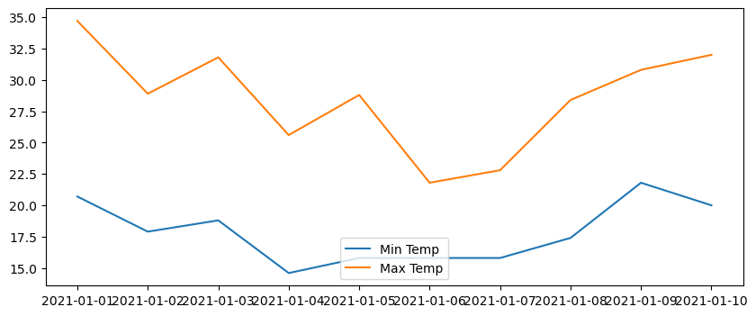
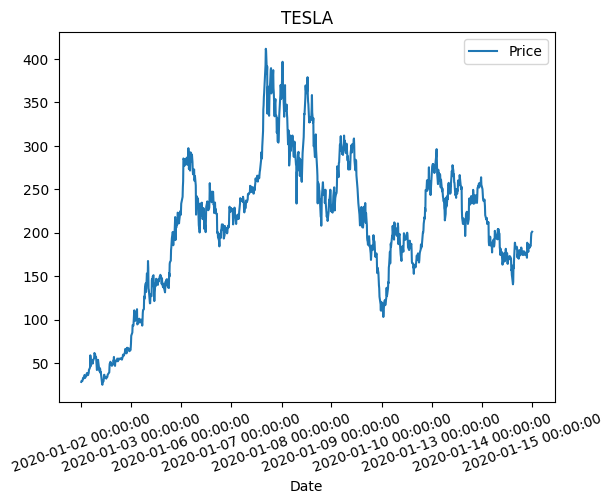
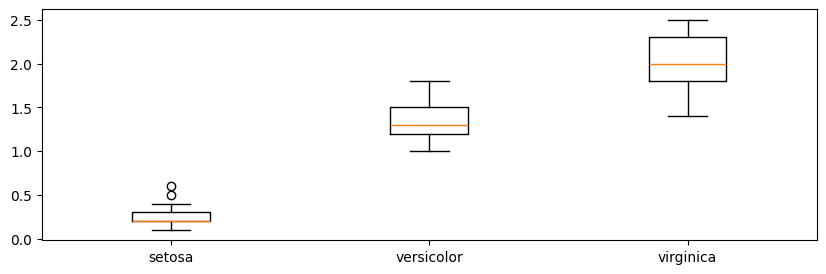

## kaggle 데이터 연습


```python
import pandas as pd 

train = pd.read_csv("kaggle/playground-series-s4e7/train.csv")
train.head()
```


<div>
<style scoped>
    .dataframe tbody tr th:only-of-type {
        vertical-align: middle;
    }

    .dataframe tbody tr th {
        vertical-align: top;
    }

    .dataframe thead th {
        text-align: right;
    }
</style>
<table border="1" class="dataframe">
  <thead>
    <tr style="text-align: right;">
      <th></th>
      <th>id</th>
      <th>Gender</th>
      <th>Age</th>
      <th>Driving_License</th>
      <th>Region_Code</th>
      <th>Previously_Insured</th>
      <th>Vehicle_Age</th>
      <th>Vehicle_Damage</th>
      <th>Annual_Premium</th>
      <th>Policy_Sales_Channel</th>
      <th>Vintage</th>
      <th>Response</th>
    </tr>
  </thead>
  <tbody>
    <tr>
      <th>0</th>
      <td>0</td>
      <td>Male</td>
      <td>21</td>
      <td>1</td>
      <td>35.0</td>
      <td>0</td>
      <td>1-2 Year</td>
      <td>Yes</td>
      <td>65101.0</td>
      <td>124.0</td>
      <td>187</td>
      <td>0</td>
    </tr>
    <tr>
      <th>1</th>
      <td>1</td>
      <td>Male</td>
      <td>43</td>
      <td>1</td>
      <td>28.0</td>
      <td>0</td>
      <td>&gt; 2 Years</td>
      <td>Yes</td>
      <td>58911.0</td>
      <td>26.0</td>
      <td>288</td>
      <td>1</td>
    </tr>
    <tr>
      <th>2</th>
      <td>2</td>
      <td>Female</td>
      <td>25</td>
      <td>1</td>
      <td>14.0</td>
      <td>1</td>
      <td>&lt; 1 Year</td>
      <td>No</td>
      <td>38043.0</td>
      <td>152.0</td>
      <td>254</td>
      <td>0</td>
    </tr>
    <tr>
      <th>3</th>
      <td>3</td>
      <td>Female</td>
      <td>35</td>
      <td>1</td>
      <td>1.0</td>
      <td>0</td>
      <td>1-2 Year</td>
      <td>Yes</td>
      <td>2630.0</td>
      <td>156.0</td>
      <td>76</td>
      <td>0</td>
    </tr>
    <tr>
      <th>4</th>
      <td>4</td>
      <td>Female</td>
      <td>36</td>
      <td>1</td>
      <td>15.0</td>
      <td>1</td>
      <td>1-2 Year</td>
      <td>No</td>
      <td>31951.0</td>
      <td>152.0</td>
      <td>294</td>
      <td>0</td>
    </tr>
  </tbody>
</table>
</div>


```python
train.shape
```


    (11504798, 12)


## 문제 1. 
- 나이 그룹 분류 : 'Age_Group'이라는 새로운 열이 추가하도록 한다. Age를 'Young', 'Middle-Aged', 'Senior'으로 분류합니다.
- 분류 기준
  + 30세 이하는 Young
  + 50세 이하는 Middle-Aged
  + 그 외는 Senior로 분류


```python
# code
train['Age_Group'] = train['Age'].apply(lambda x: 'Young' if x <= 30 else ('Middle-Aged' if x <= 50 else 'Senior'))
train.head(1)
```


<div>
<style scoped>
    .dataframe tbody tr th:only-of-type {
        vertical-align: middle;
    }

    .dataframe tbody tr th {
        vertical-align: top;
    }

    .dataframe thead th {
        text-align: right;
    }
</style>
<table border="1" class="dataframe">
  <thead>
    <tr style="text-align: right;">
      <th></th>
      <th>id</th>
      <th>Gender</th>
      <th>Age</th>
      <th>Driving_License</th>
      <th>Region_Code</th>
      <th>Previously_Insured</th>
      <th>Vehicle_Age</th>
      <th>Vehicle_Damage</th>
      <th>Annual_Premium</th>
      <th>Policy_Sales_Channel</th>
      <th>Vintage</th>
      <th>Response</th>
      <th>Age_Group</th>
    </tr>
  </thead>
  <tbody>
    <tr>
      <th>0</th>
      <td>0</td>
      <td>Male</td>
      <td>21</td>
      <td>1</td>
      <td>35.0</td>
      <td>0</td>
      <td>1-2 Year</td>
      <td>Yes</td>
      <td>65101.0</td>
      <td>124.0</td>
      <td>187</td>
      <td>0</td>
      <td>Young</td>
    </tr>
  </tbody>
</table>
</div>


## 문제 2. 
- 성별에 따른 연간 보험료 평균을 구하세요
    + 컬럼 : Annual_Premium, Gender


```python
# code
train.groupby('Gender')['Annual_Premium'].mean()
```


    Gender
    Female    30270.952164
    Male      30622.698524
    Name: Annual_Premium, dtype: float64


## 문제 3. 
- Gender는 남성이면서, 이전에 보험에 가입하지 않았으며, 차량 연식 < 1년 이하인 값을 구하세요.
- 컬럼 정보 : Gender, Previously_Insured, Vehicle_Age


```python
# code
train.loc[(train['Gender'] == 'Male') & (train['Previously_Insured'] == 0) & (train['Vehicle_Age'] == '< 1 Year'), :].reset_index(drop=True).shape
```


    (764141, 13)


## 문제 4. 
- Policy_Sales_Channel이 7.0 또는 152.0인 데이터를 필터링 하세요


```python
# code
train.loc[train['Policy_Sales_Channel'].isin([7.0, 152.0])].reset_index(drop=True).shape
```


    (4210510, 13)


### 층화추출


```python
stratified_sample = train.groupby('Response').apply(
    lambda x: x.sample(frac=0.001)
)

stratified_sample.to_csv("kaggle_test.csv", index=False)
```

    C:\Users\pcuser\AppData\Local\Temp\ipykernel_20356\1063128695.py:1: DeprecationWarning: DataFrameGroupBy.apply operated on the grouping columns. This behavior is deprecated, and in a future version of pandas the grouping columns will be excluded from the operation. Either pass `include_groups=False` to exclude the groupings or explicitly select the grouping columns after groupby to silence this warning.
      stratified_sample = train.groupby('Response').apply(
    

## [Matplotlib](https://matplotlib.org/) & Seaborn


```python
import matplotlib.pyplot as plt 

dates = [
    '2021-01-01', '2021-01-02', '2021-01-03', '2021-01-04', '2021-01-05',
    '2021-01-06', '2021-01-07', '2021-01-08', '2021-01-09', '2021-01-10'
]
min_temperature = [20.7, 17.9, 18.8, 14.6, 15.8, 15.8, 15.8, 17.4, 21.8, 20.0]
max_temperature = [34.7, 28.9, 31.8, 25.6, 28.8, 21.8, 22.8, 28.4, 30.8, 32.0]


# 객체지향 형태로 문법을 시작하세요!! 
fig, ax = plt.subplots(figsize=(10, 4))
ax.plot(dates, min_temperature, label = 'Min Temp')
ax.plot(dates, max_temperature, label = 'Max Temp')
print(type(ax))

ax.legend(loc=8)
# ax.set_xlabel("Dates")
# ax.set_ylabel("Temp")
# ax.set_title("titles")
plt.show()
```

    <class 'matplotlib.axes._axes.Axes'>
    


    

    


```python
!pip install yfinance --upgrade --no-cache-dir
```

    Collecting yfinance
      Downloading yfinance-0.2.40-py2.py3-none-any.whl.metadata (11 kB)
    Requirement already satisfied: pandas>=1.3.0 in c:\users\pcuser\desktop\hs_test\venv\lib\site-packages (from yfinance) (2.2.2)
    Requirement already satisfied: numpy>=1.16.5 in c:\users\pcuser\desktop\hs_test\venv\lib\site-packages (from yfinance) (2.0.0)
    Requirement already satisfied: requests>=2.31 in c:\users\pcuser\desktop\hs_test\venv\lib\site-packages (from yfinance) (2.32.3)
    Collecting multitasking>=0.0.7 (from yfinance)
      Downloading multitasking-0.0.11-py3-none-any.whl.metadata (5.5 kB)
    Collecting lxml>=4.9.1 (from yfinance)
      Downloading lxml-5.2.2-cp311-cp311-win_amd64.whl.metadata (3.5 kB)
    Requirement already satisfied: platformdirs>=2.0.0 in c:\users\pcuser\desktop\hs_test\venv\lib\site-packages (from yfinance) (4.2.2)
    Requirement already satisfied: pytz>=2022.5 in c:\users\pcuser\desktop\hs_test\venv\lib\site-packages (from yfinance) (2024.1)
    Collecting frozendict>=2.3.4 (from yfinance)
      Downloading frozendict-2.4.4-py311-none-any.whl.metadata (23 kB)
    Collecting peewee>=3.16.2 (from yfinance)
      Downloading peewee-3.17.5.tar.gz (3.0 MB)
         ---------------------------------------- 0.0/3.0 MB ? eta -:--:--
         - -------------------------------------- 0.1/3.0 MB 1.7 MB/s eta 0:00:02
         --- ------------------------------------ 0.3/3.0 MB 3.0 MB/s eta 0:00:01
         ---------- ----------------------------- 0.8/3.0 MB 5.5 MB/s eta 0:00:01
         --------------------- ------------------ 1.6/3.0 MB 8.5 MB/s eta 0:00:01
         ---------------------------------------- 3.0/3.0 MB 12.6 MB/s eta 0:00:00
      Installing build dependencies: started
      Installing build dependencies: finished with status 'done'
      Getting requirements to build wheel: started
      Getting requirements to build wheel: finished with status 'done'
      Preparing metadata (pyproject.toml): started
      Preparing metadata (pyproject.toml): finished with status 'done'
    Requirement already satisfied: beautifulsoup4>=4.11.1 in c:\users\pcuser\desktop\hs_test\venv\lib\site-packages (from yfinance) (4.12.3)
    Collecting html5lib>=1.1 (from yfinance)
      Downloading html5lib-1.1-py2.py3-none-any.whl.metadata (16 kB)
    Requirement already satisfied: soupsieve>1.2 in c:\users\pcuser\desktop\hs_test\venv\lib\site-packages (from beautifulsoup4>=4.11.1->yfinance) (2.5)
    Requirement already satisfied: six>=1.9 in c:\users\pcuser\desktop\hs_test\venv\lib\site-packages (from html5lib>=1.1->yfinance) (1.16.0)
    Requirement already satisfied: webencodings in c:\users\pcuser\desktop\hs_test\venv\lib\site-packages (from html5lib>=1.1->yfinance) (0.5.1)
    Requirement already satisfied: python-dateutil>=2.8.2 in c:\users\pcuser\desktop\hs_test\venv\lib\site-packages (from pandas>=1.3.0->yfinance) (2.9.0.post0)
    Requirement already satisfied: tzdata>=2022.7 in c:\users\pcuser\desktop\hs_test\venv\lib\site-packages (from pandas>=1.3.0->yfinance) (2024.1)
    Requirement already satisfied: charset-normalizer<4,>=2 in c:\users\pcuser\desktop\hs_test\venv\lib\site-packages (from requests>=2.31->yfinance) (3.3.2)
    Requirement already satisfied: idna<4,>=2.5 in c:\users\pcuser\desktop\hs_test\venv\lib\site-packages (from requests>=2.31->yfinance) (3.7)
    Requirement already satisfied: urllib3<3,>=1.21.1 in c:\users\pcuser\desktop\hs_test\venv\lib\site-packages (from requests>=2.31->yfinance) (2.2.2)
    Requirement already satisfied: certifi>=2017.4.17 in c:\users\pcuser\desktop\hs_test\venv\lib\site-packages (from requests>=2.31->yfinance) (2024.6.2)
    Downloading yfinance-0.2.40-py2.py3-none-any.whl (73 kB)
       ---------------------------------------- 0.0/73.5 kB ? eta -:--:--
       ---------------------------------------- 73.5/73.5 kB ? eta 0:00:00
    Downloading frozendict-2.4.4-py311-none-any.whl (16 kB)
    Downloading html5lib-1.1-py2.py3-none-any.whl (112 kB)
       ---------------------------------------- 0.0/112.2 kB ? eta -:--:--
       ---------------------------------------- 112.2/112.2 kB ? eta 0:00:00
    Downloading lxml-5.2.2-cp311-cp311-win_amd64.whl (3.8 MB)
       ---------------------------------------- 0.0/3.8 MB ? eta -:--:--
       ----- ---------------------------------- 0.5/3.8 MB 34.8 MB/s eta 0:00:01
       ----------- ---------------------------- 1.1/3.8 MB 13.5 MB/s eta 0:00:01
       ----------------- ---------------------- 1.7/3.8 MB 12.0 MB/s eta 0:00:01
       ------------------------ --------------- 2.3/3.8 MB 12.3 MB/s eta 0:00:01
       ------------------------------ --------- 2.9/3.8 MB 12.5 MB/s eta 0:00:01
       ---------------------------------------- 3.8/3.8 MB 14.4 MB/s eta 0:00:00
    Downloading multitasking-0.0.11-py3-none-any.whl (8.5 kB)
    Building wheels for collected packages: peewee
      Building wheel for peewee (pyproject.toml): started
      Building wheel for peewee (pyproject.toml): finished with status 'done'
      Created wheel for peewee: filename=peewee-3.17.5-py3-none-any.whl size=138681 sha256=2b628acea60d34e61e84e94a77f6dccec512ca83aef3166f9b304c7bd9dae949
      Stored in directory: C:\Users\pcuser\AppData\Local\Temp\pip-ephem-wheel-cache-o1ycwsre\wheels\d2\cb\9c\c300d7bf782e07f1658c306743d5e30af7e4834001e4064a96
    Successfully built peewee
    Installing collected packages: peewee, multitasking, lxml, html5lib, frozendict, yfinance
    Successfully installed frozendict-2.4.4 html5lib-1.1 lxml-5.2.2 multitasking-0.0.11 peewee-3.17.5 yfinance-0.2.40
    

    
    [notice] A new release of pip is available: 24.1 -> 24.1.1
    [notice] To update, run: python.exe -m pip install --upgrade pip
    


```python
import yfinance as yf 
TSLA = yf.download("TSLA", start="2020-01-01", end="2024-07-02")
TSLA.head(1)
```

    [*********************100%%**********************]  1 of 1 completed
    


<div>
<style scoped>
    .dataframe tbody tr th:only-of-type {
        vertical-align: middle;
    }

    .dataframe tbody tr th {
        vertical-align: top;
    }

    .dataframe thead th {
        text-align: right;
    }
</style>
<table border="1" class="dataframe">
  <thead>
    <tr style="text-align: right;">
      <th></th>
      <th>Open</th>
      <th>High</th>
      <th>Low</th>
      <th>Close</th>
      <th>Adj Close</th>
      <th>Volume</th>
    </tr>
    <tr>
      <th>Date</th>
      <th></th>
      <th></th>
      <th></th>
      <th></th>
      <th></th>
      <th></th>
    </tr>
  </thead>
  <tbody>
    <tr>
      <th>2020-01-02</th>
      <td>28.299999</td>
      <td>28.713333</td>
      <td>28.114</td>
      <td>28.684</td>
      <td>28.684</td>
      <td>142981500</td>
    </tr>
  </tbody>
</table>
</div>


```python
TSLA['Open'].index
```


    DatetimeIndex(['2020-01-02', '2020-01-03', '2020-01-06', '2020-01-07',
                   '2020-01-08', '2020-01-09', '2020-01-10', '2020-01-13',
                   '2020-01-14', '2020-01-15',
                   ...
                   '2024-06-17', '2024-06-18', '2024-06-20', '2024-06-21',
                   '2024-06-24', '2024-06-25', '2024-06-26', '2024-06-27',
                   '2024-06-28', '2024-07-01'],
                  dtype='datetime64[ns]', name='Date', length=1131, freq=None)


```python
fig, ax = plt.subplots()
ax.plot(TSLA['Open'])
ax.set_title("TESLA")
ax.legend(labels = ['Price'], loc = 'best')
ax.set_xlabel('Date')
ax.set_xticklabels(TSLA['Open'].index, rotation=20)
plt.show()
```

    C:\Users\pcuser\AppData\Local\Temp\ipykernel_14492\3467958351.py:6: UserWarning: set_ticklabels() should only be used with a fixed number of ticks, i.e. after set_ticks() or using a FixedLocator.
      ax.set_xticklabels(list(TSLA['Open'].index), rotation=20)
    


    

    


```python
import matplotlib.pyplot as plt
import seaborn as sns

iris = sns.load_dataset('iris')

data = [iris[iris['species']=="setosa"]['petal_width'], 
        iris[iris['species']=="versicolor"]['petal_width'],
        iris[iris['species']=="virginica"]['petal_width']]

fig, ax = plt.subplots(figsize=(10, 3))
ax.boxplot(data, tick_labels=['setosa', 'versicolor', 'virginica'])

plt.show()
```


    

    


```python
import matplotlib.pyplot as plt
import seaborn as sns

iris = sns.load_dataset('iris')

fig, ax = plt.subplots(figsize=(10, 3))
sns.boxplot(data = iris, x = 'species', y = 'petal_width', ax = ax)
ax.set_title("Titles")
ax.set_xlabel("SPECIES")
print(type(ax))
plt.show()
```

    <class 'matplotlib.axes._axes.Axes'>
    


    

    


# 막대 그래프 그려보기

## 라이브러리 불러오기


```python
import matplotlib.pyplot as plt
from matplotlib.ticker import (MultipleLocator, AutoMinorLocator, FuncFormatter)
import seaborn as sns
import numpy as np
```

## 데이터 불러오기


```python
tips = sns.load_dataset("tips")
tips.head(1)
```


<div>
<style scoped>
    .dataframe tbody tr th:only-of-type {
        vertical-align: middle;
    }

    .dataframe tbody tr th {
        vertical-align: top;
    }

    .dataframe thead th {
        text-align: right;
    }
</style>
<table border="1" class="dataframe">
  <thead>
    <tr style="text-align: right;">
      <th></th>
      <th>total_bill</th>
      <th>tip</th>
      <th>sex</th>
      <th>smoker</th>
      <th>day</th>
      <th>time</th>
      <th>size</th>
    </tr>
  </thead>
  <tbody>
    <tr>
      <th>0</th>
      <td>16.99</td>
      <td>1.01</td>
      <td>Female</td>
      <td>No</td>
      <td>Sun</td>
      <td>Dinner</td>
      <td>2</td>
    </tr>
  </tbody>
</table>
</div>


## 기초 데이터


```python
group_mean = tips.groupby(['day'], observed=False)['total_bill'].agg('mean')
h_day = group_mean.sort_values(ascending=False).index[0]
# h_day = group_mean.idxmax()
h_mean = float(np.round(group_mean.sort_values(ascending=False).values[0], 2))
h_day, h_mean
```


    ('Sun', 21.41)


## 축 옵션 UDF 함수


```python
def major_formatter(x, pos):
    return "%.2f$" % x
formatter = FuncFormatter(major_formatter)
```

## 시각화 객체지향선언


```python
fig, ax = plt.subplots(nrows = 1, ncols = 2, figsize=(16, 5))
ax0 = sns.barplot(x = 'day', y = 'total_bill', data = tips, 
                  errorbar=None, color = 'lightgray', alpha = 0.85, zorder = 2, 
                  ax = ax[0])

for p in ax0.patches:
    # print(p, type(p))
    fontweight = 'normal'
    color = 'k'# '#1CE834'
    height = np.round(p.get_height(), 2)
    if h_mean == height:
        # Sun이면 색상을 다르게 주겠다
        fontweight = 'bold'
        color = 'darkred'
        p.set_facecolor(color)
        p.set_edgecolor('black')
#    else:
#        p.set_facecolor(color)
#        p.set_edgecolor('black')
    ax0.text(p.get_x() + p.get_width()/2, height+1, 
             height, ha = 'center', size=12, fontweight=fontweight, color=color)

ax0.set_ylim(-3, 30)
ax0.set_title("Ideal Bar Graph", size = 16)

ax0.spines['top'].set_visible(False)
ax0.spines['left'].set_position(("outward", 20))
ax0.spines['left'].set_visible(False)
ax0.spines['right'].set_visible(False)

ax0.yaxis.set_major_locator(MultipleLocator(10))
ax0.yaxis.set_major_formatter(formatter)
ax0.yaxis.set_minor_locator(MultipleLocator(5))

ax0.set_ylabel("Avg. Total Bill($)", fontsize=14)

ax0.grid(axis="y", which="major", color="lightgray")
ax0.grid(axis="y", which="minor", ls=":")

ax0.set_xlabel("Weekday", fontsize=14)

for xtick in ax0.get_xticklabels():
  print(xtick)
  if xtick.get_text() == h_day:
    xtick.set_color("darkred")
    xtick.set_fontweight("demibold")
ax0.set_xticklabels(['Thursday', 'Friday', 'Saturday', 'Sunday'], size=12)


ax1 = sns.barplot(x = 'day', y = 'total_bill', data = tips, 
                  errorbar=None, alpha = 0.85, ax = ax[1])

for p in ax1.patches:
  height = np.round(p.get_height(), 2)
  ax1.text(p.get_x() + p.get_width()/2., height+1, height, ha = 'center', size=12)
ax1.set_ylim(-3, 30)
ax1.set_title("Just Bar Graph")

plt.show()
```

    Text(0, 0, 'Thur')
    Text(1, 0, 'Fri')
    Text(2, 0, 'Sat')
    Text(3, 0, 'Sun')
    

    C:\Users\pcuser\AppData\Local\Temp\ipykernel_14492\854998200.py:47: UserWarning: set_ticklabels() should only be used with a fixed number of ticks, i.e. after set_ticks() or using a FixedLocator.
      ax0.set_xticklabels(['Thursday', 'Friday', 'Saturday', 'Sunday'], size=12)
    


    

    


```python

```
