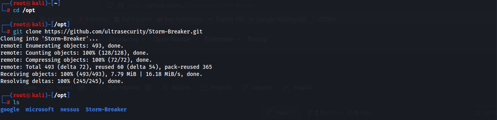
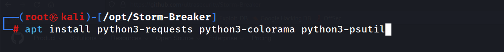
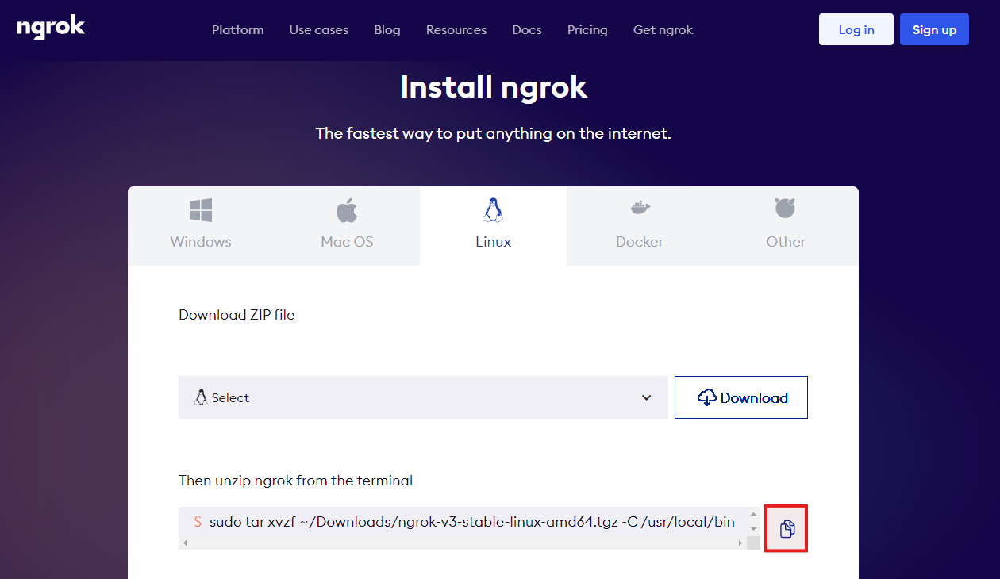
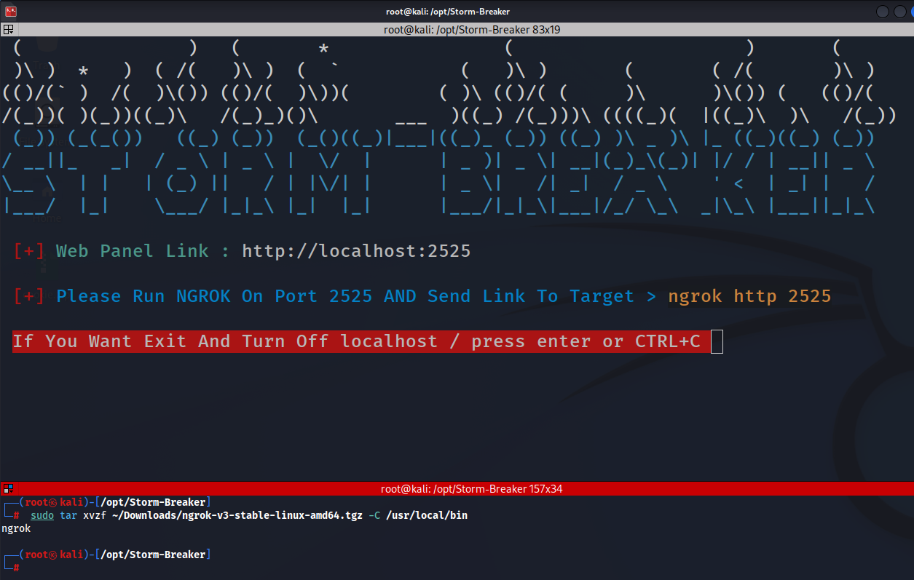
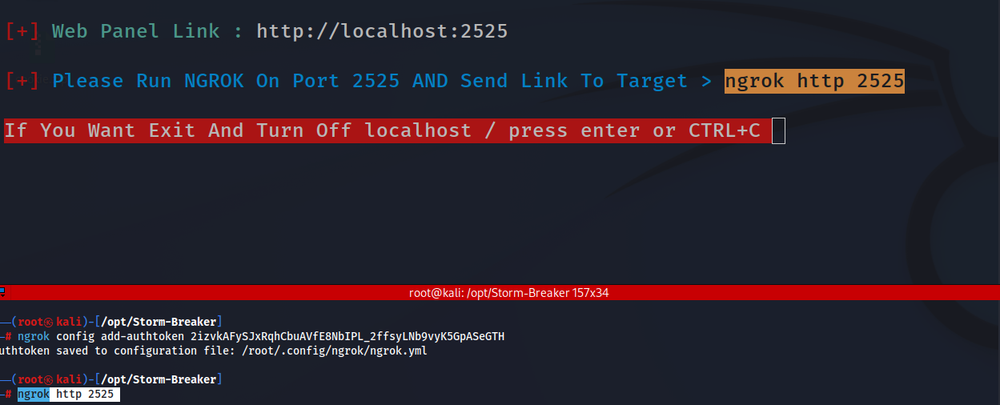
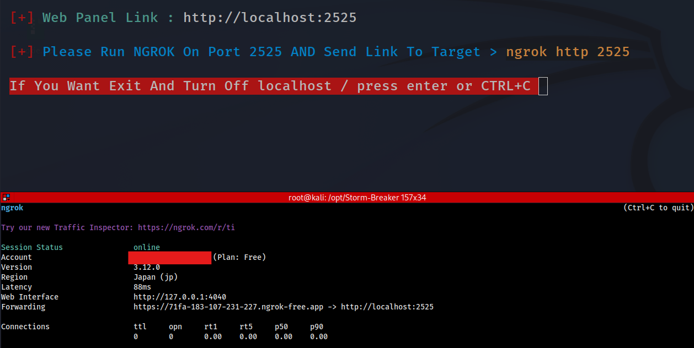
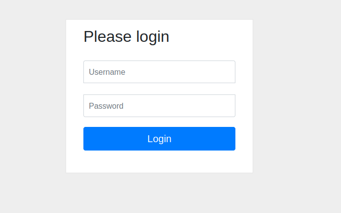
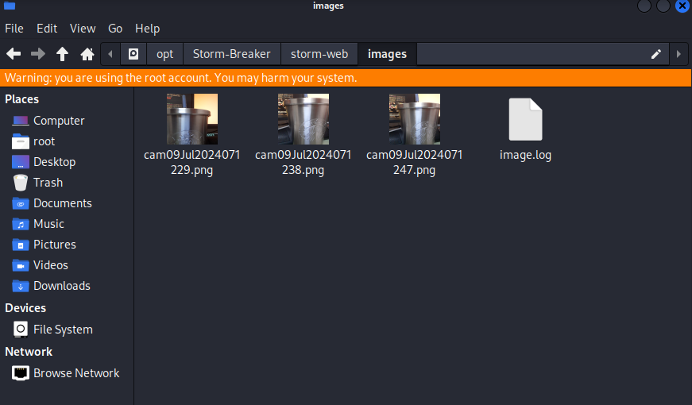

**[공지사항]** [본 블로그에 포함된 모든 정보는 교육 목적으로만 제공됩니다.](https://weoooo.github.io/notice/notice/)
{: .notice--danger}

## Storm-Breaker란?

Ultrasecurity라는 GitHub 사용자에 의해 개발된 오픈 소스 도구이다. 

이 도구는 `소셜 엔지니어링 `공격을 위해 설계되었으며, `피싱 페이지`를 통해 타겟의 위치 정보를 수집하는 데 중점을 둔다. 

사용자는 **타겟의 위치**, **IP 주소**, **브라우저 정보** 등을 쉽게 얻을 수 있습니다. 

## Storm-Breaker의 주요 기능

1. **위치 추적**: 피싱 링크를 클릭한 타겟의 GPS 위치를 수집할 수 있습니다.

2. **IP 주소 수집**: 타겟의 IP 주소를 수집하여 위치 정보를 얻거나 네트워크를 분석할 수 있습니다.

3. **브라우저 및 디바이스 정보**: 타겟의 브라우저 종류, 운영 체제 등 디바이스 관련 정보를 수집할 수 있습니다.

4. **소셜 엔지니어링 페이지**: 사용자는 미리 준비된 다양한 피싱 페이지를 사용하여 타겟을 유인할 수 있습니다.

## 요구 사항

- Python 3.x
- Ngrok

## 설치 과정

1. **GitHub 저장소 클론**: 먼저, Storm-Breaker 저장소를 클론한다.(작성자는 opt 디렉토리에 설치하였다.)

```shell
git clone https://github.com/ultrasecurity/Storm-Breaker.git
```

2. **디렉토리 이동**: Storm-Breaker 디렉토리로 이동한다.

```shell
cd [설치 위치]/Storm-Breaker
```



3. **의존성 설치**: 필요한 파이썬 패키지를 설치한다.



해당 패키지를 설치한뒤 이여서 Storm-Breaker 디렉토리에 있는 install.sh를 실행한다.


모든 설치 과정이 끝나고 경고 문이 뜨지만 걱정하지 않아도 된다.


이여서 st.py 파이썬 파일을 실행한다.


NGROK 실행: 공격자는 NGROK이라는 도구를 사용하여 로컬호스트 웹 패널을 인터넷에서 사용할 수 있도록 해야 한다.

## Ngrok 설치

### Ngrok란?

로컬 서버를 인터넷에 공개하는 역방향 프록시이다. 사용자의 컴퓨터에서 실행되는 프로그램이나 웹사이트를 인터넷 사용자가 직접 접근할 수 있도록 만들어 주는 도구이다.



설치하고자 하는 운영체제를 설치하고 파일을 다운받는다.(작성자는 칼리리눅스에 설치함.)

운영체제에 설치를 위해 빨간박스로 표시된 클립보드를 클릭하여 명령어를 복사한다.

새로운 터미널을 열어 복사된 명령어를 붙여주고 실행한다



`ngrok` 가 표시되며 정상적으로 실행됨을 확인할 수 있다.

ngrok 페이지로 돌아가 회원가입을 한다.(구글 계정으로 쉽게 가능하다.)


회원가입을 완료하면 자동으로 아래 이미지와 같은 페이지로 리다이렉션된다.

좌측 상단 배너 `Setup & Installation`클릭한다.


사용자의 운영체제에 맞게 선택한다.

사용자 인증을 위해 Ngrok 인증 토큰를 복사한다.


빨간박스 란에 있는 클립보드는 클릭하여 인증 토큰을 복사한다.

복사한 클립을 터미널에 붙여넣고 엔터를 누른다.


정상적으로 인증이 되었고 `/root...` 위치에 토큰이 저장됨을 확인할 수 있다.

```shell
ngrok http 2525
```

해당 명령어를 붙여 넣고 실행을 한다.



ngrok가 정상적으로 실행됨음 확인할 수 있다.



이제 `Forwarding` 란에 있는 주소로 접속한다.



접속을하면 해당 로그인 페이지가 보인다.

유저 이름: admin

비밀번호: admin

를 입력하고 로그인해준다.


URL형태로 공격패턴을 확인할 수 있다.

### 희생자 위치 확인

3번째 공격패턴을 복사하여 테스트한다.

테스트 방법은 희생자 PC 혹은 모바일에서 복사한 URL에 접속하면 된다.


테스트 결과 크롭 브라우저는 공격이 실행되지 않았다(크롬 보안 설정 때문인지? 보안 설정 off하지 않고 테스트 진행했음.)

폭스 브라우저에서는 공격이 성공하였다.


GPS값은 경도 위도로 받아오고 구글 맵으로 바로 접속 가능하게 URL를 제공한다.(정확한 위치는 아니였다.)

### 희생자 카메라 접근

1번쨰 공격패턴을 복사하여 테스트한다.

삼성 겔럭시 m20으로 테스트 하였다.(아이폰 사파리 환경에서는 공격 불가능하였다.)



아쉽게도 카메라의 동영상 촬영이 아닌 스크린샷의 형태로 이미지를 저장하는 형식으로 5~7정도에 1컷씩 저장된다.


(공격 URL은 http://이지만 모바일 웹 환경에서 자동으로 `https://`로 변경되었지만 공격에 성공하였다.)

## 결론

Storm-Breaker는 피싱 페이지를 통해 타겟의 위치 정보와 기타 디바이스 정보를 수집할 수 있는 강력한 도구이다. 

하지만 이를 사용할 때는 반드시 윤리적 가이드라인을 준수하고, 법적 문제를 피하기 위해 항상 적절한 동의를 받아야 한다. 

이 도구를 통해 소셜 엔지니어링 공격의 작동 방식을 이해하고, 더 나아가 이를 방어하는 방법을 배울 수 있다.

## 📖Reference

[GitHub - ultrasecurity/Storm-Breaker: Social engineering tool [Access Webcam &amp; Microphone &amp; Location Finder] With {Py,JS,PHP}](https://github.com/ultrasecurity/Storm-Breaker)

[ngrok.com/docs](https://ngrok.com/docs)

[Access Location, Camera &amp; Mic of any Device 🌎🎤📍📷 - YouTube](https://www.youtube.com/watch?v=h_f9lB4i-LA)
