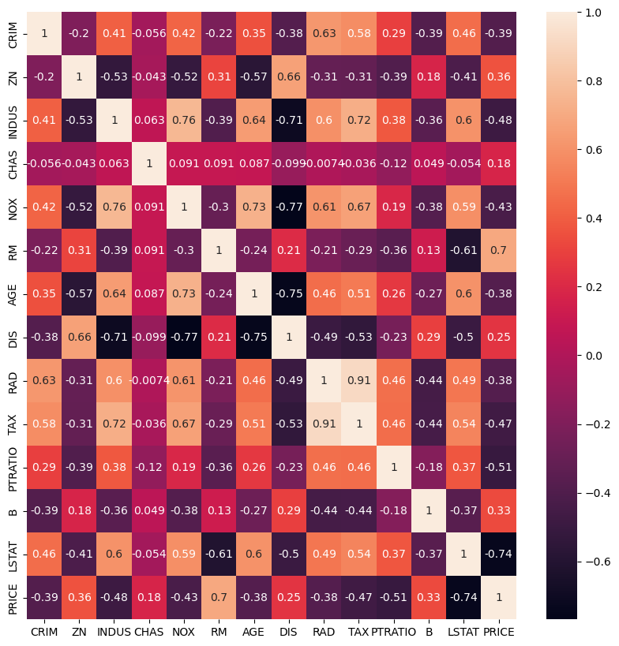

10. 선형 회귀 모델

## 회귀 소개

ex) 사람의 키는 평균 키로 회귀하려는 경향을 가진다는 자연의 법칙이 있다. (부모의 키가 크더라도 자식이 모두 크지 않는다. 여러 세대를 거쳐가며 무한정 커지는 것도 아닌, 무한정 작아지는 것도 아니다.)
- 회귀분석은 이러한 자연의 법칙을 이용하여 , 데이터 값이 평균과 같은 일정한 값으로 돌아가려는 경향을 이용한 통계학 기법이다.
- 여러 개의 독립변수 (feature)와 한 개의 종속변수(결정값) 간의 상관관계에서 , **독립변수의 값에 영향을 미치는 것을 "회귀계수"라 한다.**

따라서, 회귀분석의 목적은 **"최적의 회귀 계수를 찾는 것이다."**

## 회귀 유형

1. "회귀계수" 가 선형인가? 
 - yes :  선형회귀
 - no : 비선형회귀

2. "독립변수개수"가 1개인가?
 - yes (1개) : 단일 회귀
 - no (n개) : 다중 회귀

## 최적의 회귀 계수 찾기 

위에서 회귀분석의 목적은 최적의 회귀 계수를 찾는 것이라 했다.
 = 전체 데이터의 잔차(오류 값) 합이 최소화라는 의미도 된다.

 하지만 오류 값은 + 또는 - 가 될 수 있다. 따라서 오류의 합을 계산할 때는 절댓값을 취해서 더하거나(Mean Absolute Error) , 오류 값을 제곱을 구해서 더하는 방식(RSS, Residual Sum of Square)을 취한다.
 일반적으로 RSS을 쓴다. 미분 등의 계산을 편리하게 할 수 있기 때문이다.

 - error^2 = RSS

회귀에서 이 RSS는 비용이며 w변수(회귀 계수)로 구성되는 RSS를 비용 함수라고 한다.
비용 함수를 손실 함수라고도 한다.

## 비용함수 최소화하기

W 파라미터의 개수가 적다면 고차원 방정식으로 비용 함수가 최소가 되는 W 변숫값을 도출할 수 있겠지만, W 파라미터가 많으면 고차원 방정식을 동원하더라도 해결하기 어렵다.

### 경사하강법 (점진적 하강)

경사하강법은 이러한 고차원 방정식에 대한 문제를 해결해 주면서 비용 함수 RSS를 최소화 하는 방법을 직관적으로 제공하는 뛰어난 방식이다.

'점진적으로' 반복적인 계산을 통해 W 파라미터 값을 업데이트하면서 오류 값이 최소가 되는 파라미터를 구하는 방식이다.

## LinearRegression을 이용해 보스턴 주택 가격 회귀 구현


```python
import numpy as np
import matplotlib.pyplot as plt
import pandas as pd
import seaborn as sns

import warnings
warnings.filterwarnings('ignore')  # 사이킷런 1.2 부터는 보스턴 주택가격 데이터가 없어진다는 warning 메시지 출력 제거
```


```python
data_url = "http://lib.stat.cmu.edu/datasets/boston"
raw_df = pd.read_csv(data_url, sep="\s+", skiprows=22, header=None)
data = np.hstack([raw_df.values[::2, :], raw_df.values[1::2, :2]])
target = raw_df.values[1::2, 2]
```


```python
boston_df = pd.DataFrame(
    data=data,
    columns=['CRIM','ZN','INDUS','CHAS','NOX','RM','AGE','DIS','RAD','TAX','PTRATIO','B','LSTAT']
)

boston_df['PRICE']=target
boston_df
```


<div>
<style scoped>
    .dataframe tbody tr th:only-of-type {
        vertical-align: middle;
    }

    .dataframe tbody tr th {
        vertical-align: top;
    }

    .dataframe thead th {
        text-align: right;
    }
</style>
<table border="1" class="dataframe">
  <thead>
    <tr style="text-align: right;">
      <th></th>
      <th>CRIM</th>
      <th>ZN</th>
      <th>INDUS</th>
      <th>CHAS</th>
      <th>NOX</th>
      <th>RM</th>
      <th>AGE</th>
      <th>DIS</th>
      <th>RAD</th>
      <th>TAX</th>
      <th>PTRATIO</th>
      <th>B</th>
      <th>LSTAT</th>
      <th>PRICE</th>
    </tr>
  </thead>
  <tbody>
    <tr>
      <th>0</th>
      <td>0.00632</td>
      <td>18.0</td>
      <td>2.31</td>
      <td>0.0</td>
      <td>0.538</td>
      <td>6.575</td>
      <td>65.2</td>
      <td>4.0900</td>
      <td>1.0</td>
      <td>296.0</td>
      <td>15.3</td>
      <td>396.90</td>
      <td>4.98</td>
      <td>24.0</td>
    </tr>
    <tr>
      <th>1</th>
      <td>0.02731</td>
      <td>0.0</td>
      <td>7.07</td>
      <td>0.0</td>
      <td>0.469</td>
      <td>6.421</td>
      <td>78.9</td>
      <td>4.9671</td>
      <td>2.0</td>
      <td>242.0</td>
      <td>17.8</td>
      <td>396.90</td>
      <td>9.14</td>
      <td>21.6</td>
    </tr>
    <tr>
      <th>2</th>
      <td>0.02729</td>
      <td>0.0</td>
      <td>7.07</td>
      <td>0.0</td>
      <td>0.469</td>
      <td>7.185</td>
      <td>61.1</td>
      <td>4.9671</td>
      <td>2.0</td>
      <td>242.0</td>
      <td>17.8</td>
      <td>392.83</td>
      <td>4.03</td>
      <td>34.7</td>
    </tr>
    <tr>
      <th>3</th>
      <td>0.03237</td>
      <td>0.0</td>
      <td>2.18</td>
      <td>0.0</td>
      <td>0.458</td>
      <td>6.998</td>
      <td>45.8</td>
      <td>6.0622</td>
      <td>3.0</td>
      <td>222.0</td>
      <td>18.7</td>
      <td>394.63</td>
      <td>2.94</td>
      <td>33.4</td>
    </tr>
    <tr>
      <th>4</th>
      <td>0.06905</td>
      <td>0.0</td>
      <td>2.18</td>
      <td>0.0</td>
      <td>0.458</td>
      <td>7.147</td>
      <td>54.2</td>
      <td>6.0622</td>
      <td>3.0</td>
      <td>222.0</td>
      <td>18.7</td>
      <td>396.90</td>
      <td>5.33</td>
      <td>36.2</td>
    </tr>
    <tr>
      <th>...</th>
      <td>...</td>
      <td>...</td>
      <td>...</td>
      <td>...</td>
      <td>...</td>
      <td>...</td>
      <td>...</td>
      <td>...</td>
      <td>...</td>
      <td>...</td>
      <td>...</td>
      <td>...</td>
      <td>...</td>
      <td>...</td>
    </tr>
    <tr>
      <th>501</th>
      <td>0.06263</td>
      <td>0.0</td>
      <td>11.93</td>
      <td>0.0</td>
      <td>0.573</td>
      <td>6.593</td>
      <td>69.1</td>
      <td>2.4786</td>
      <td>1.0</td>
      <td>273.0</td>
      <td>21.0</td>
      <td>391.99</td>
      <td>9.67</td>
      <td>22.4</td>
    </tr>
    <tr>
      <th>502</th>
      <td>0.04527</td>
      <td>0.0</td>
      <td>11.93</td>
      <td>0.0</td>
      <td>0.573</td>
      <td>6.120</td>
      <td>76.7</td>
      <td>2.2875</td>
      <td>1.0</td>
      <td>273.0</td>
      <td>21.0</td>
      <td>396.90</td>
      <td>9.08</td>
      <td>20.6</td>
    </tr>
    <tr>
      <th>503</th>
      <td>0.06076</td>
      <td>0.0</td>
      <td>11.93</td>
      <td>0.0</td>
      <td>0.573</td>
      <td>6.976</td>
      <td>91.0</td>
      <td>2.1675</td>
      <td>1.0</td>
      <td>273.0</td>
      <td>21.0</td>
      <td>396.90</td>
      <td>5.64</td>
      <td>23.9</td>
    </tr>
    <tr>
      <th>504</th>
      <td>0.10959</td>
      <td>0.0</td>
      <td>11.93</td>
      <td>0.0</td>
      <td>0.573</td>
      <td>6.794</td>
      <td>89.3</td>
      <td>2.3889</td>
      <td>1.0</td>
      <td>273.0</td>
      <td>21.0</td>
      <td>393.45</td>
      <td>6.48</td>
      <td>22.0</td>
    </tr>
    <tr>
      <th>505</th>
      <td>0.04741</td>
      <td>0.0</td>
      <td>11.93</td>
      <td>0.0</td>
      <td>0.573</td>
      <td>6.030</td>
      <td>80.8</td>
      <td>2.5050</td>
      <td>1.0</td>
      <td>273.0</td>
      <td>21.0</td>
      <td>396.90</td>
      <td>7.88</td>
      <td>11.9</td>
    </tr>
  </tbody>
</table>
<p>506 rows × 14 columns</p>
</div>


* CRIM: 지역별 범죄 발생률  
* ZN: 25,000평방피트를 초과하는 거주 지역의 비율
* INDUS: 비상업 지역 넓이 비율
* CHAS: 찰스강에 대한 더미 변수(강의 경계에 위치한 경우는 1, 아니면 0)
* NOX: 일산화질소 농도
* RM: 거주할 수 있는 방 개수
* AGE: 1940년 이전에 건축된 소유 주택의 비율
* DIS: 5개 주요 고용센터까지의 가중 거리
* RAD: 고속도로 접근 용이도
* TAX: 10,000달러당 재산세율
* PTRATIO: 지역의 교사와 학생 수 비율
* B: 지역의 흑인 거주 비율
* LSTAT: 하위 계층의 비율
* MEDV: 본인 소유의 주택 가격(중앙값)

## 독립성 확인

### 데이터의 상관관계 
 - 데이터와 데이터가 얼마나 상관있는 지
 - 다중 공산성이 있는지 확인하겠다.

- Feature(X)와 Target(y)의 상관관계를 분석
- 상관 관계 지수가 높은 Feature는 Target을 예측 하는데 중요한 Feature가 될 것이다.


```python
boston_df.corr()['PRICE'].sort_values()
```


    LSTAT     -0.737663
    PTRATIO   -0.507787
    INDUS     -0.483725
    TAX       -0.468536
    NOX       -0.427321
    CRIM      -0.388305
    RAD       -0.381626
    AGE       -0.376955
    CHAS       0.175260
    DIS        0.249929
    B          0.333461
    ZN         0.360445
    RM         0.695360
    PRICE      1.000000
    Name: PRICE, dtype: float64


## feature끼리의 상관관계 확인
- 너무 강한 상관성을 가진 데이터 확인
 + 다중공산성 확인

만약 jupyter lab, colab 등 seaborn이 설치됐다면 아래 코드는 생략해도 된다.
하지만, 아래의 히트맵 생성 시 , 맨 윗줄에만 값이 있다면 seaborn이 설치되지 않았으니 아래 코드를 입력하여 설치하길 바란다. (그리고 재부팅하기)


```python
pip install seaborn --upgrade
```

    Defaulting to user installation because normal site-packages is not writeable
    Requirement already satisfied: seaborn in c:\programdata\anaconda3\lib\site-packages (0.12.2)
    Collecting seaborn
      Using cached seaborn-0.13.2-py3-none-any.whl.metadata (5.4 kB)
    Requirement already satisfied: numpy!=1.24.0,>=1.20 in c:\programdata\anaconda3\lib\site-packages (from seaborn) (1.26.4)
    Requirement already satisfied: pandas>=1.2 in c:\programdata\anaconda3\lib\site-packages (from seaborn) (2.1.4)
    Requirement already satisfied: matplotlib!=3.6.1,>=3.4 in c:\programdata\anaconda3\lib\site-packages (from seaborn) (3.8.0)
    Requirement already satisfied: contourpy>=1.0.1 in c:\programdata\anaconda3\lib\site-packages (from matplotlib!=3.6.1,>=3.4->seaborn) (1.2.0)
    Requirement already satisfied: cycler>=0.10 in c:\programdata\anaconda3\lib\site-packages (from matplotlib!=3.6.1,>=3.4->seaborn) (0.11.0)
    Requirement already satisfied: fonttools>=4.22.0 in c:\programdata\anaconda3\lib\site-packages (from matplotlib!=3.6.1,>=3.4->seaborn) (4.25.0)
    Requirement already satisfied: kiwisolver>=1.0.1 in c:\programdata\anaconda3\lib\site-packages (from matplotlib!=3.6.1,>=3.4->seaborn) (1.4.4)
    Requirement already satisfied: packaging>=20.0 in c:\programdata\anaconda3\lib\site-packages (from matplotlib!=3.6.1,>=3.4->seaborn) (23.1)
    Requirement already satisfied: pillow>=6.2.0 in c:\programdata\anaconda3\lib\site-packages (from matplotlib!=3.6.1,>=3.4->seaborn) (10.2.0)
    Requirement already satisfied: pyparsing>=2.3.1 in c:\programdata\anaconda3\lib\site-packages (from matplotlib!=3.6.1,>=3.4->seaborn) (3.0.9)
    Requirement already satisfied: python-dateutil>=2.7 in c:\programdata\anaconda3\lib\site-packages (from matplotlib!=3.6.1,>=3.4->seaborn) (2.8.2)
    Requirement already satisfied: pytz>=2020.1 in c:\programdata\anaconda3\lib\site-packages (from pandas>=1.2->seaborn) (2023.3.post1)
    Requirement already satisfied: tzdata>=2022.1 in c:\programdata\anaconda3\lib\site-packages (from pandas>=1.2->seaborn) (2023.3)
    Requirement already satisfied: six>=1.5 in c:\programdata\anaconda3\lib\site-packages (from python-dateutil>=2.7->matplotlib!=3.6.1,>=3.4->seaborn) (1.16.0)
    Using cached seaborn-0.13.2-py3-none-any.whl (294 kB)
    Installing collected packages: seaborn
    Successfully installed seaborn-0.13.2
    Note: you may need to restart the kernel to use updated packages.
    


```python
plt.figure(figsize=(10,10))
corr_df = boston_df.corr()
sns.heatmap(
    data = corr_df,
    annot = True 
)

```


    <Axes: >


    

    


## 데이터 분할


```python
from sklearn.model_selection import train_test_split
from sklearn.linear_model import LinearRegression

X_train, X_test, y_train, y_test = train_test_split(
    boston_df.drop('PRICE', axis=1),
    boston_df['PRICE'],
    test_size=0.2,
    random_state=42
)
```

## 모델 훈련


```python
lr_reg = LinearRegression()
lr_reg.fit(X_train, y_train)
```


<style>#sk-container-id-1 {color: black;background-color: white;}#sk-container-id-1 pre{padding: 0;}#sk-container-id-1 div.sk-toggleable {background-color: white;}#sk-container-id-1 label.sk-toggleable__label {cursor: pointer;display: block;width: 100%;margin-bottom: 0;padding: 0.3em;box-sizing: border-box;text-align: center;}#sk-container-id-1 label.sk-toggleable__label-arrow:before {content: "▸";float: left;margin-right: 0.25em;color: #696969;}#sk-container-id-1 label.sk-toggleable__label-arrow:hover:before {color: black;}#sk-container-id-1 div.sk-estimator:hover label.sk-toggleable__label-arrow:before {color: black;}#sk-container-id-1 div.sk-toggleable__content {max-height: 0;max-width: 0;overflow: hidden;text-align: left;background-color: #f0f8ff;}#sk-container-id-1 div.sk-toggleable__content pre {margin: 0.2em;color: black;border-radius: 0.25em;background-color: #f0f8ff;}#sk-container-id-1 input.sk-toggleable__control:checked~div.sk-toggleable__content {max-height: 200px;max-width: 100%;overflow: auto;}#sk-container-id-1 input.sk-toggleable__control:checked~label.sk-toggleable__label-arrow:before {content: "▾";}#sk-container-id-1 div.sk-estimator input.sk-toggleable__control:checked~label.sk-toggleable__label {background-color: #d4ebff;}#sk-container-id-1 div.sk-label input.sk-toggleable__control:checked~label.sk-toggleable__label {background-color: #d4ebff;}#sk-container-id-1 input.sk-hidden--visually {border: 0;clip: rect(1px 1px 1px 1px);clip: rect(1px, 1px, 1px, 1px);height: 1px;margin: -1px;overflow: hidden;padding: 0;position: absolute;width: 1px;}#sk-container-id-1 div.sk-estimator {font-family: monospace;background-color: #f0f8ff;border: 1px dotted black;border-radius: 0.25em;box-sizing: border-box;margin-bottom: 0.5em;}#sk-container-id-1 div.sk-estimator:hover {background-color: #d4ebff;}#sk-container-id-1 div.sk-parallel-item::after {content: "";width: 100%;border-bottom: 1px solid gray;flex-grow: 1;}#sk-container-id-1 div.sk-label:hover label.sk-toggleable__label {background-color: #d4ebff;}#sk-container-id-1 div.sk-serial::before {content: "";position: absolute;border-left: 1px solid gray;box-sizing: border-box;top: 0;bottom: 0;left: 50%;z-index: 0;}#sk-container-id-1 div.sk-serial {display: flex;flex-direction: column;align-items: center;background-color: white;padding-right: 0.2em;padding-left: 0.2em;position: relative;}#sk-container-id-1 div.sk-item {position: relative;z-index: 1;}#sk-container-id-1 div.sk-parallel {display: flex;align-items: stretch;justify-content: center;background-color: white;position: relative;}#sk-container-id-1 div.sk-item::before, #sk-container-id-1 div.sk-parallel-item::before {content: "";position: absolute;border-left: 1px solid gray;box-sizing: border-box;top: 0;bottom: 0;left: 50%;z-index: -1;}#sk-container-id-1 div.sk-parallel-item {display: flex;flex-direction: column;z-index: 1;position: relative;background-color: white;}#sk-container-id-1 div.sk-parallel-item:first-child::after {align-self: flex-end;width: 50%;}#sk-container-id-1 div.sk-parallel-item:last-child::after {align-self: flex-start;width: 50%;}#sk-container-id-1 div.sk-parallel-item:only-child::after {width: 0;}#sk-container-id-1 div.sk-dashed-wrapped {border: 1px dashed gray;margin: 0 0.4em 0.5em 0.4em;box-sizing: border-box;padding-bottom: 0.4em;background-color: white;}#sk-container-id-1 div.sk-label label {font-family: monospace;font-weight: bold;display: inline-block;line-height: 1.2em;}#sk-container-id-1 div.sk-label-container {text-align: center;}#sk-container-id-1 div.sk-container {/* jupyter's `normalize.less` sets `[hidden] { display: none; }` but bootstrap.min.css set `[hidden] { display: none !important; }` so we also need the `!important` here to be able to override the default hidden behavior on the sphinx rendered scikit-learn.org. See: https://github.com/scikit-learn/scikit-learn/issues/21755 */display: inline-block !important;position: relative;}#sk-container-id-1 div.sk-text-repr-fallback {display: none;}</style><div id="sk-container-id-1" class="sk-top-container"><div class="sk-text-repr-fallback"><pre>LinearRegression()</pre><b>In a Jupyter environment, please rerun this cell to show the HTML representation or trust the notebook. <br />On GitHub, the HTML representation is unable to render, please try loading this page with nbviewer.org.</b></div><div class="sk-container" hidden><div class="sk-item"><div class="sk-estimator sk-toggleable"><input class="sk-toggleable__control sk-hidden--visually" id="sk-estimator-id-1" type="checkbox" checked><label for="sk-estimator-id-1" class="sk-toggleable__label sk-toggleable__label-arrow">LinearRegression</label><div class="sk-toggleable__content"><pre>LinearRegression()</pre></div></div></div></div></div>


## 예측


```python
y_pred = lr_reg.predict(X_test)
y_pred[:3]
```


    array([28.99672362, 36.02556534, 14.81694405])


## 평가


```python
from sklearn.metrics import mean_squared_error, r2_score

mse = mean_squared_error(y_test, y_pred)
rmse = np.sqrt(mse)
r2 = r2_score(y_test, y_pred)

print("MSE : {:.3f}".format(mse))
print("RMSE : {:.3f}".format(rmse))
print("R2 : {:.3f}".format(r2))
```

    MSE : 24.291
    RMSE : 4.929
    R2 : 0.669
    

RMSE의 값이 전체 데이터의 표준편차보다 작으면 괜찮은 값이다.


```python
boston_df.describe()['PRICE']
```


    count    506.000000
    mean      22.532806
    std        9.197104
    min        5.000000
    25%       17.025000
    50%       21.200000
    75%       25.000000
    max       50.000000
    Name: PRICE, dtype: float64


## StandardScaling 후 확인하기


```python
from sklearn.preprocessing import StandardScaler

scaler = StandardScaler()
boston_scaled =scaler.fit_transform(X_train)
```


```python
boston_scaled[:3]
```


    array([[ 1.28770177, -0.50032012,  1.03323679, -0.27808871,  0.48925206,
            -1.42806858,  1.02801516, -0.80217296,  1.70689143,  1.57843444,
             0.84534281, -0.07433689,  1.75350503],
           [-0.33638447, -0.50032012, -0.41315956, -0.27808871, -0.15723342,
            -0.68008655, -0.43119908,  0.32434893, -0.62435988, -0.58464788,
             1.20474139,  0.4301838 , -0.5614742 ],
           [-0.40325332,  1.01327135, -0.71521823, -0.27808871, -1.00872286,
            -0.40206304, -1.6185989 ,  1.3306972 , -0.97404758, -0.60272378,
            -0.63717631,  0.06529747, -0.65159505]])


### 위 데이터 훈련해보기


```python
lr_reg_scaled = LinearRegression().fit(boston_scaled, y_train)

# ⭐⭐⭐⭐ 절대로 테스트 데이터에 대한 Transformer를 생성하지 않는다. ⭐⭐⭐⭐

scaled_test = scaler.transform(X_test)
y_scaled_pred = lr_reg_scaled.predict(scaled_test)

```


```python
mse = mean_squared_error(y_test, y_scaled_pred)
rmse = np.sqrt(mse)
r2 = r2_score(y_test, y_scaled_pred)

print("MSE : {:.3f}".format(mse))
print("RMSE : {:.3f}".format(rmse))
print("R2 : {:.3f}".format(r2))
```

    MSE : 24.291
    RMSE : 4.929
    R2 : 0.669
    

## 다항회귀


```python
from sklearn.preprocessing import PolynomialFeatures

sample = np.arange(6).reshape(3,2)
sample
```


    array([[0, 1],
           [2, 3],
           [4, 5]])


### 1. 다차항 데이터 추가


```python
# degree = 2인 2차 다항식으로 변환하기 위해 PolynomialFeatures를 이욯해 반환
poly = PolynomialFeatures(degree = 2)
```


```python
sample_ftr = poly.fit_transform(sample)
sample_ftr
```


    array([[ 1.,  0.,  1.,  0.,  0.,  1.],
           [ 1.,  2.,  3.,  4.,  6.,  9.],
           [ 1.,  4.,  5., 16., 20., 25.]])


```python
boston_poly = PolynomialFeatures(degree = 2 , include_bias = False)

X_train_poly = boston_poly.fit_transform(X_train)
X_train_poly.shape
```


    (404, 104)


```python
lr_reg_poly = LinearRegression().fit(X_train_poly, y_train)
```


```python
X_test_poly = boston_poly.transform(X_test)
X_test_poly.shape

# 위 train 데이터와  shape이 일정한지 습관적으로 항시 확인하기
```


    (102, 104)


```python
y_test_pred = lr_reg_poly.predict(X_test_poly)

test_mse = mean_squared_error(y_test, y_test_pred)
test_rmse = np.sqrt(test_mse)
test_r2  = r2_score(y_test, y_test_pred)

print("Test MSE : {:.3f}".format(test_mse))
print("Test RMSE : {:.3f}".format(test_rmse))
print("Test R2 : {:.3f}".format(test_r2))
```

    Test MSE : 14.257
    Test RMSE : 3.776
    Test R2 : 0.806
    

데이터와 데이터 사이에 관계 설정을 해주니 성능이 훨씬 좋아진 것을 확인할 수 있다.
