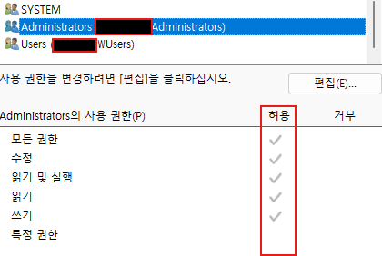
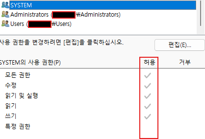
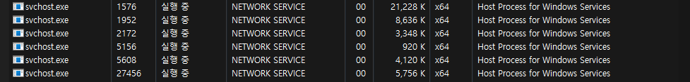
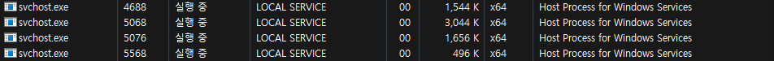

**[공지사항]** [본 블로그에 포함된 모든 정보는 교육 목적으로만 제공됩니다.](https://weoooo.github.io/notice/notice/)
{: .notice--danger}

## 관리자 권한과 시스템 권한

컴퓨터 시스템이나 네트워크에서 사용자에게 부여되는 권한 수준을 말한다.
각각의 권한은 사용자가 수행할 수 있는 작업을 정의한다. 

## 관리자 권한과 시스템 권한의 차이점

관리자 권한은 시스템을 관리하는 데 필요한 권한인 반면, 시스템 권한은 운영체제의 모든 것을 제어할 수 있는 최상위 권한이다.

## 🧑‍🏫관리자 권한 (Administrator Privileges)



**설명**: 일반적으로 컴퓨터나 네트워크의 관리 및 유지보수를 담당하는 사용자에게 부여되는 권한이다

- **역할**:
  - 소프트웨어 설치/제거
  - 사용자 계정 관리 (생성, 삭제, 권한 부여)
  - 시스템 설정 변경
  - 시스템 로그 및 이벤트 보기
- **사용 예시**: 새로운 프로그램 설치, 시스템 업데이트, 사용자 추가 등.

### 일반 사용자 권한 (Regular User Privileges)


- **설명**: 특정 작업에 제한된 권한을 가진 사용자.
- **역할**:
  - 개인 파일 및 디렉터리 접근
  - 기본적인 소프트웨어 사용
  - 제한된 시스템 설정 변경
- **사용 예시**: 문서 작성, 소프트웨어 사용, 개인 파일 관리 등.

### 게스트 권한 (Guest Privileges)

- **설명**: 매우 제한된 권한을 가진 사용자.
- **역할**:
  - 일시적인 접근
  - 시스템에 거의 변경 불가능
  - 제한된 소프트웨어 사용
- **사용 예시**: 공공 컴퓨터 사용, 시스템 시험용 계정 등.

## 🛠️시스템 권한 (System Privileges)



- **설명**: 운영체제의 핵심 부분을 제어할 수 있는 최고 수준의 권한이다.
  
  커널 레벨에서 작동하며, 하드웨어 자원 및 모든 시스템 프로세스를 제어할 수 있다.
  
  Windows에서는 'SYSTEM' 계정, 유닉스/리눅스에서는 'root' 계정으로 불린다.

- **역할**:
  
  - 운영 체제의 핵심 파일 수정
  - 시스템 프로세스 관리
  - 보안 설정 변경

- **사용 예시**: 드라이버 설치, 시스템 커널 수정, 보안 정책 설정 등.

### 루트 권한 (Root Privileges)


리눅스 환경에서 ps -ef 명령어를 활용하여 프로세스의(ps) -e(모든 프로세스) -f(full format으로 세센의 정보 표시)정보를 확인한다.

```shell
ps -ef
```

- **설명**: 주로 Unix/Linux 시스템에서 운영체제의 핵심 부분을 제어할 수 있는 최고 수준의 권한이다.
- **역할**:
  - 모든 파일과 디렉터리에 접근 및 수정
  - 시스템 설정 변경
  - 모든 사용자와 프로세스 제어
- **사용 예시**: 파일 시스템 수정, 네트워크 설정 변경, 시스템 복구 등.

## ⚙️기타 시스템 권한


윈도우 11기준 작업 관리자 -> 자세히에서 확인 가능하다.

### NETWORK SERVICE 권한



- **설명**: 네트워크 서비스 계정은 네트워크 관련 서비스나 작업을 수행하는 데 사용되는 계정이다. 이 계정은 로컬 시스템에 제한된 권한을 가지고 있지만 네트워크 리소스에 액세스할 수 있는 권한이 있다.
- **역할**:
  - 네트워크 상의 다른 컴퓨터나 장치에 접근
  - 네트워크 서비스를 실행하고 관리
  - 인터넷 연결 관리
- **사용 예시**: HTTP 웹 서비스, 원격 데스크톱 서비스, 네트워크 파일 공유 등.

### LOCAL SERVICE 권한



- **설명**: 로컬 서비스 계정은 로컬 시스템의 서비스나 작업을 수행하는 데 사용되는 계정이다. 이 계정은 네트워크 리소스에 접근할 수 없는 제한된 권한을 가지고 있다.
- **역할**:
  - 로컬 시스템 서비스 실행
  - 시스템 리소스 관리
  - 로컬 컴퓨터 내에서의 보안 작업 수행
- **사용 예시**: 로컬 프린터 관리, 로컬 파일 시스템 접근, 로컬 네트워크 설정 등.

### UMFD 권한 (User-Mode Driver Framework Host)


- **설명**: UMFD는 사용자 모드 드라이버 프레임워크(UMDF) 호스트 프로세스를 실행하는 계정이다. UMDF는 드라이버를 사용자 모드에서 실행하여 시스템 안정성을 높이는 기술이다.
- **역할**:
  - 사용자 모드에서 드라이버 실행
  - 하드웨어와 소프트웨어 간의 상호 작용 관리
  - 시스템 크래시를 방지하기 위해 사용자 모드에서 실행되는 드라이버 격리
- **사용 예시**: 프린터 드라이버, USB 장치 드라이버 등.

### DWM 권한 (Desktop Window Manager)


- **설명**: DWM은 윈도우 운영 체제에서 데스크탑 창 관리자(Desktop Window Manager) 프로세스를 실행하는 계정이다. 이 프로세스는 윈도우의 그래픽 사용자 인터페이스를 관리한다.
- **역할**:
  - 윈도우 컴포지션 및 렌더링
  - 시각적 효과 및 투명도 관리
  - 그래픽 하드웨어 가속을 이용한 화면 출력
- **사용 예시**: 창 애니메이션, 투명한 창, Alt-Tab 창 전환 등.

## 권한 관리의 중요성

공격자는 희생자의 hfs프로그램의 취약점을 활용하여 메타익스플로잇의 미터프리터 세센이 연결되었다는 가정한다.


희생자 유저 아이디를 확인하기 위해 getuid 명령어를 입력한다.

```shell
getuid
```

희생자의 hfs프로그램은 일반사용자(IEUser) 권한으로 동작되는 것을 확인할 수 있다. 


만약 공격자가 미터프리터 세센를 활용하여 프로그램 삭제와 ,사용자 계정 관리 (생성, 삭제, 권한 부여),시스템 설정 변경 등 포스트 익스플로잇을 한다고 했을때


현재 일반 사용자의 권한이기에 공격이 불가능하다.(추가적으로 다른 우회기법을 활용해야 한다.)


만약 hfs프로그램이 사용자 권한, 시스템 권한을 가진 프로그램이였다면 공격자 입장에선 더욱 신속히 희생자의 중요 정보를 공격, 유출 시킬 수 있다.


때문에 권한을 적절히 관리하는 것은 보안을 유지하는 데 매우 중요하다. 과도한 권한을 부여하면 보안 위험이 증가하고, 필요한 권한을 부여하지 않으면 업무에 지장이 생길 수 있다.

## 대응 방안

- **최소 권한 원칙 적용**: 사용자에게 필요한 최소한의 권한만 부여.
- **정기적 검토**: 권한 검토 및 필요에 따라 수정.
- **이중 인증**: 관리자 권한에 대해 이중 인증 적용.
- **로그 모니터링**: 권한 사용에 대한 로그를 모니터링하여 이상 징후 탐지.

## 📖Reference

[itwiki.kr/w/윈도우_사용자_그룹](https://itwiki.kr/w/%EC%9C%88%EB%8F%84%EC%9A%B0_%EC%82%AC%EC%9A%A9%EC%9E%90_%EA%B7%B8%EB%A3%B9)