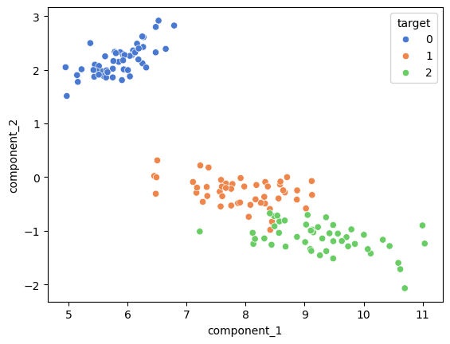
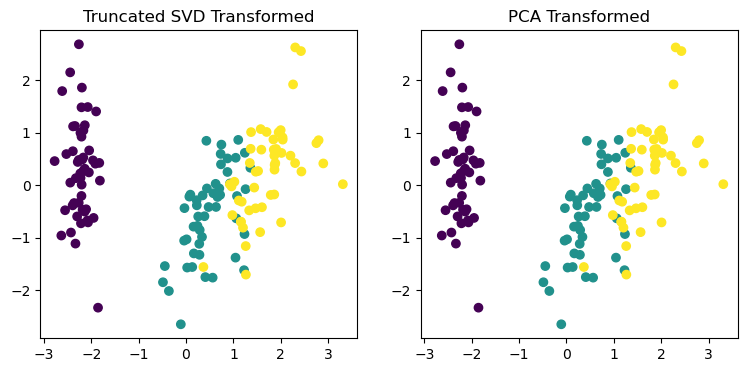

```python
03. SVD 차원 축소
```


```python
import numpy as np

np.random.seed(121)
a = np.random.randn(4,4)
a
```


    array([[-0.21203317, -0.28492917, -0.57389821, -0.44031017],
           [-0.33011056,  1.18369457,  1.61537293,  0.36706247],
           [-0.01411931,  0.6296418 ,  1.70964074, -1.32698736],
           [ 0.40187312, -0.19142667,  1.40382596, -1.96876855]])


```python
## SVD 행렬 분해 
```


```python
U, Sigma, VT = np.linalg.svd(a)

print("U : {}".format(U))
print()
print("Sigma : {}".format(Sigma))
print()
print("U : {}".format(U))
print()
```

    U : [[-0.07913928 -0.31822729  0.86653217  0.37628494]
     [ 0.38294523  0.78655287  0.12002097  0.46934262]
     [ 0.65640669  0.02243181  0.35668848 -0.66437971]
     [ 0.64515128 -0.52873697 -0.32785711  0.44353889]]
    
    Sigma : [3.4229581  2.02287339 0.46263157 0.07935069]
    
    U : [[-0.07913928 -0.31822729  0.86653217  0.37628494]
     [ 0.38294523  0.78655287  0.12002097  0.46934262]
     [ 0.65640669  0.02243181  0.35668848 -0.66437971]
     [ 0.64515128 -0.52873697 -0.32785711  0.44353889]]
    
    


```python
# 특잇값 Sigma를 대각행렬로 변환
Sigma_mat = np.diag(Sigma)
Sigma_mat
```


    array([[3.4229581 , 0.        , 0.        , 0.        ],
           [0.        , 2.02287339, 0.        , 0.        ],
           [0.        , 0.        , 0.46263157, 0.        ],
           [0.        , 0.        , 0.        , 0.07935069]])


```python
print("원본 행렬 A : \n{}".format(a))
```

    원본 행렬 A : 
    [[-0.21203317 -0.28492917 -0.57389821 -0.44031017]
     [-0.33011056  1.18369457  1.61537293  0.36706247]
     [-0.01411931  0.6296418   1.70964074 -1.32698736]
     [ 0.40187312 -0.19142667  1.40382596 -1.96876855]]
    


```python
# U, SigmaMat, VT를 이용해서 다시 조립
a_ = U @ Sigma_mat @ VT
a_
```


    array([[-0.21203317, -0.28492917, -0.57389821, -0.44031017],
           [-0.33011056,  1.18369457,  1.61537293,  0.36706247],
           [-0.01411931,  0.6296418 ,  1.70964074, -1.32698736],
           [ 0.40187312, -0.19142667,  1.40382596, -1.96876855]])


```python
#Truncated Sigma_Mat : 원본 데이터를 보다 많이 반영할 수 있는 상위 2개의 특이값만 추출
Signa_truncated = np.diag(Sigma[:2])
Signa_truncated

```


    array([[3.4229581 , 0.        ],
           [0.        , 2.02287339]])


```python
U_truncated = U[:, :2]
U_truncated 
```


    array([[-0.07913928, -0.31822729],
           [ 0.38294523,  0.78655287],
           [ 0.65640669,  0.02243181],
           [ 0.64515128, -0.52873697]])


```python
VT_truncated = VT[:2]
VT_truncated
```


    array([[ 0.04100747,  0.22367823,  0.78643002, -0.57429458],
           [-0.20019867,  0.56209596,  0.37041464,  0.71187191]])


```python
#데이터가 선형 종속인 상태로 만들기
a[2] = a[0] + a[1]
a[3] = a[0]

a
```


    array([[-0.21203317, -0.28492917, -0.57389821, -0.44031017],
           [-0.33011056,  1.18369457,  1.61537293,  0.36706247],
           [-0.54214372,  0.8987654 ,  1.04147472, -0.0732477 ],
           [-0.21203317, -0.28492917, -0.57389821, -0.44031017]])


```python
# 선형 종속이면 역행렬이 존재하지 않을 수 있다.
# 특잇값 중 하나라도 0이 있으면 역행렬이 존재하지 않는다.

U, Sigma, VT = np.linalg.svd(a)
Sigma
```


    array([2.66335286e+00, 8.07035060e-01, 1.30310447e-16, 3.87711837e-17])


첫 번재 특잇값부터 마지막 값까지 큰 차이가 없다면 모든 값을 다 쓰면 됨

## 사이킷런의 TruncatedSVD


```python
from sklearn.decomposition import TruncatedSVD
from sklearn.datasets import load_iris
import matplotlib.pyplot as plt
import seaborn as sns

iris = load_iris()
```


```python
tsvd = TruncatedSVD(n_components=2)
tsvd.fit(iris.data)

iris_tsvd = tsvd.transform(iris.data)
iris_tsvd.shape
```


    (150, 2)


```python
import pandas as pd

iris_tsvd_df = pd.DataFrame(
    data=iris_tsvd,
    columns=["component_1","component_2"]
    
)

iris_tsvd_df["target"] = iris.target
iris_tsvd_df.head()
```


<div>
<style scoped>
    .dataframe tbody tr th:only-of-type {
        vertical-align: middle;
    }

    .dataframe tbody tr th {
        vertical-align: top;
    }

    .dataframe thead th {
        text-align: right;
    }
</style>
<table border="1" class="dataframe">
  <thead>
    <tr style="text-align: right;">
      <th></th>
      <th>component_1</th>
      <th>component_2</th>
      <th>target</th>
    </tr>
  </thead>
  <tbody>
    <tr>
      <th>0</th>
      <td>5.912747</td>
      <td>2.302033</td>
      <td>0</td>
    </tr>
    <tr>
      <th>1</th>
      <td>5.572482</td>
      <td>1.971826</td>
      <td>0</td>
    </tr>
    <tr>
      <th>2</th>
      <td>5.446977</td>
      <td>2.095206</td>
      <td>0</td>
    </tr>
    <tr>
      <th>3</th>
      <td>5.436459</td>
      <td>1.870382</td>
      <td>0</td>
    </tr>
    <tr>
      <th>4</th>
      <td>5.875645</td>
      <td>2.328290</td>
      <td>0</td>
    </tr>
  </tbody>
</table>
</div>


```python
sns.scatterplot(
    x="component_1",
    y="component_2",
    hue='target',
    palette='muted',
    data=iris_tsvd_df
)

plt.show()
```


    

    


```python
from sklearn.preprocessing import StandardScaler
from sklearn.decomposition import PCA

# iris 데이터를 StandardScaler로 변환
scaler = StandardScaler()
iris_scaled = scaler.fit_transform(iris.data)

# 스케일링된 데이터를 기반으로 TruncatedSVD 변환 수행
tsvd = TruncatedSVD(n_components=2)
tsvd.fit(iris_scaled)
iris_tsvd = tsvd.transform(iris_scaled)

# 스케일링된 데이터를 기반으로 PCA 변환 수행
pca = PCA(n_components=2)
pca.fit(iris_scaled)
iris_pca = pca.transform(iris_scaled)

# TruncatedSVD 변환 데이터를 왼쪽에, PCA변환 데이터를 오른쪽에 표현
fig, (ax1, ax2) = plt.subplots(figsize=(9,4), ncols=2)
ax1.scatter(x=iris_tsvd[:,0], y= iris_tsvd[:,1], c= iris.target)
ax2.scatter(x=iris_pca[:,0], y= iris_pca[:,1], c= iris.target)
ax1.set_title('Truncated SVD Transformed')
ax2.set_title('PCA Transformed')
```


    Text(0.5, 1.0, 'PCA Transformed')


    

    

