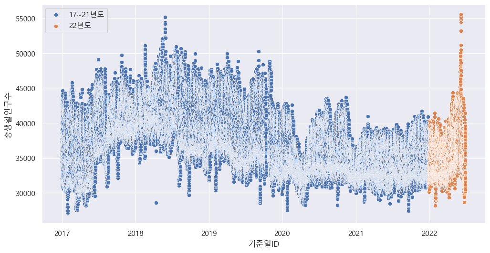

<!-- **[공지사항]** [공지사항!!!!]
{: .notice--danger} -->

<!-- 

<h4>공지사항 입니다.</h4>
<ul>
    <li>공지 사항순서1</li>
</ul>

 -->

<!-- [구글](https://google.com){: .btn .btn--danger} -->

# 오늘 처음 블로그를 만들었다. 

## 목차

### 목차 세부 1

이미지1

### 목차 세부 2

이미지2

### 목차 세부 3

이미지3
