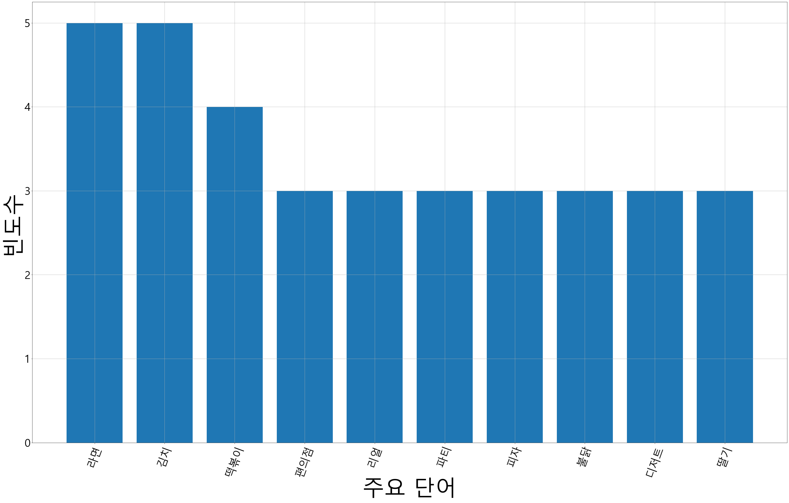

# 안녕하세요^^
# 미니 프로젝트에 오신 여러분을 환영합니다.

* 앞선 교육과정을 정리하는 마음과 지금까지 배운 내용을 바탕으로 문제 해결을 해볼게요!
* 미니 프로젝트를 통한 문제 해결 과정 'A에서 Z까지', 지금부터 시작합니다!

---

# 데이터 분석부터 먼저 시작해보겠습니다.

## 기본 데이터

[기본 데이터]
* 서울시 특정구 특정동의 생활인구 데이터입니다.
* data2017.csv
* data2018.csv
* data2019.csv
* data2020.csv
* data2021.csv
* data2022.csv


* 2017~2021년은 데이터 전부(train data), 2022년은 1~6월(test data)까지 제공합니다.

[변수 소개]
* index : 날짜

* 시간대 : 0 ~ 23

* 총 생활 인구 수 : 생활 인구 합계

* 각 성별, 연령대 별 생활 인구수

---

# 1. 데이터 불러오기
## 모든 미니 프로젝트의 시작은 '데이터 불러오기' 부터라고 할 수 있습니다.
+ KeyPoint : 불러오고자 하는 데이터에 따라 자유롭게 변수로 지정할 수 있다.

###  데이터 프레임을 불러오고 변수로 저장(여기서는 CSV 기준으로 진행)

#### [실습문제1] 데이터 로딩
* Pandas 라이브러리를 활용해서 'data2017.csv'파일을 'df2017' 변수에 저장하고 그 Shape을 확인하세요.
* 아래에 'Pandas'를 Import하고 'data2017.csv'파일을 불러오고 Shape을 확인하는 소스코드를 작성하고 실행해보세요.
* 구분자(sep) : ','
* index_col = 0


```python
# 아래에 실습코드를 작성하고 결과를 확인합니다.
import pandas as pd
```


```python
# 아래에 실습코드를 작성하고 결과를 확인합니다.
df2017 = pd.read_csv('data/data2017.csv', sep=',', index_col=0)
```


```python
# 데이터 프레임의 Shape을 확인합니다.
df2017.shape
```


    (8760, 30)


```python
df2017.head()
```


<div>
<style scoped>
    .dataframe tbody tr th:only-of-type {
        vertical-align: middle;
    }

    .dataframe tbody tr th {
        vertical-align: top;
    }

    .dataframe thead th {
        text-align: right;
    }
</style>
<table border="1" class="dataframe">
  <thead>
    <tr style="text-align: right;">
      <th></th>
      <th>시간대구분</th>
      <th>총생활인구수</th>
      <th>남자0세부터9세생활인구수</th>
      <th>남자10세부터14세생활인구수</th>
      <th>남자15세부터19세생활인구수</th>
      <th>남자20세부터24세생활인구수</th>
      <th>남자25세부터29세생활인구수</th>
      <th>남자30세부터34세생활인구수</th>
      <th>남자35세부터39세생활인구수</th>
      <th>남자40세부터44세생활인구수</th>
      <th>...</th>
      <th>여자25세부터29세생활인구수</th>
      <th>여자30세부터34세생활인구수</th>
      <th>여자35세부터39세생활인구수</th>
      <th>여자40세부터44세생활인구수</th>
      <th>여자45세부터49세생활인구수</th>
      <th>여자50세부터54세생활인구수</th>
      <th>여자55세부터59세생활인구수</th>
      <th>여자60세부터64세생활인구수</th>
      <th>여자65세부터69세생활인구수</th>
      <th>여자70세이상생활인구수</th>
    </tr>
    <tr>
      <th>기준일ID</th>
      <th></th>
      <th></th>
      <th></th>
      <th></th>
      <th></th>
      <th></th>
      <th></th>
      <th></th>
      <th></th>
      <th></th>
      <th></th>
      <th></th>
      <th></th>
      <th></th>
      <th></th>
      <th></th>
      <th></th>
      <th></th>
      <th></th>
      <th></th>
      <th></th>
    </tr>
  </thead>
  <tbody>
    <tr>
      <th>20170101</th>
      <td>0</td>
      <td>31535.2200</td>
      <td>1945.4402</td>
      <td>566.4588</td>
      <td>631.5581</td>
      <td>991.9184</td>
      <td>1297.1287</td>
      <td>1223.1529</td>
      <td>1552.9448</td>
      <td>1236.7535</td>
      <td>...</td>
      <td>1157.6661</td>
      <td>1107.6781</td>
      <td>1282.9235</td>
      <td>1029.4360</td>
      <td>998.0414</td>
      <td>874.5643</td>
      <td>1162.1547</td>
      <td>1053.0477</td>
      <td>964.3940</td>
      <td>2025.4819</td>
    </tr>
    <tr>
      <th>20170101</th>
      <td>1</td>
      <td>31188.9174</td>
      <td>1930.4766</td>
      <td>562.1018</td>
      <td>625.2151</td>
      <td>1030.6281</td>
      <td>1307.7381</td>
      <td>1183.0956</td>
      <td>1491.5827</td>
      <td>1236.8635</td>
      <td>...</td>
      <td>1120.0051</td>
      <td>1102.5198</td>
      <td>1271.8997</td>
      <td>1027.2574</td>
      <td>1038.7528</td>
      <td>857.9100</td>
      <td>1149.7532</td>
      <td>1042.7411</td>
      <td>919.0115</td>
      <td>2062.2422</td>
    </tr>
    <tr>
      <th>20170101</th>
      <td>2</td>
      <td>31240.4974</td>
      <td>1921.1864</td>
      <td>559.3965</td>
      <td>658.7463</td>
      <td>1058.7082</td>
      <td>1311.9591</td>
      <td>1186.2600</td>
      <td>1537.3732</td>
      <td>1211.8326</td>
      <td>...</td>
      <td>1103.1547</td>
      <td>1112.4579</td>
      <td>1282.9366</td>
      <td>1027.8901</td>
      <td>1020.0177</td>
      <td>853.3890</td>
      <td>1193.4472</td>
      <td>1011.2073</td>
      <td>889.9325</td>
      <td>1960.1236</td>
    </tr>
    <tr>
      <th>20170101</th>
      <td>3</td>
      <td>31442.4314</td>
      <td>1946.4476</td>
      <td>566.7525</td>
      <td>649.0804</td>
      <td>1057.9119</td>
      <td>1324.2638</td>
      <td>1202.1250</td>
      <td>1521.2732</td>
      <td>1232.8897</td>
      <td>...</td>
      <td>1116.2165</td>
      <td>1102.0668</td>
      <td>1260.8472</td>
      <td>1007.6650</td>
      <td>1042.9554</td>
      <td>896.0038</td>
      <td>1163.0355</td>
      <td>1056.6428</td>
      <td>891.9177</td>
      <td>2060.1872</td>
    </tr>
    <tr>
      <th>20170101</th>
      <td>4</td>
      <td>31922.7751</td>
      <td>1953.7713</td>
      <td>568.8845</td>
      <td>623.2087</td>
      <td>1063.2557</td>
      <td>1342.9146</td>
      <td>1209.2680</td>
      <td>1556.0675</td>
      <td>1282.1621</td>
      <td>...</td>
      <td>1187.5457</td>
      <td>1120.2232</td>
      <td>1281.2738</td>
      <td>1064.0655</td>
      <td>1045.2130</td>
      <td>895.8336</td>
      <td>1191.7017</td>
      <td>1045.3362</td>
      <td>874.4984</td>
      <td>2038.6212</td>
    </tr>
  </tbody>
</table>
<p>5 rows × 30 columns</p>
</div>


---

# 2. 추가 데이터 불러오기

#### [실습문제2] 추가데이터 불러오기
* Pandas 라이브러리를 활용해서 'data2018.csv' ~ 'data2021.csv'를 df18 ~ df21로 각각 불러오고, 이미 불러와 있던 df17을 포함하여 'df_total'로 합쳐보세요. 그리고 Shape을 확인하세요.
* 구분자(sep) : ','
* index_col = 0


```python
# 아래에 실습코드를 작성하고 결과를 확인합니다.
df18 = pd.read_csv('data/data2018.csv', sep=',', index_col=0)
df19 = pd.read_csv('data/data2019.csv', sep=',', index_col=0)
df20 = pd.read_csv('data/data2020.csv', sep=',', index_col=0)
df21 = pd.read_csv('data/data2021.csv', sep=',', index_col=0)
```


```python
# 아래에 실습코드를 작성하고 결과를 확인합니다.
df_total = pd.concat([df2017, df18], axis=0)
df_total = pd.concat([df_total, df19], axis=0)
df_total = pd.concat([df_total, df20], axis=0)
df_total = pd.concat([df_total, df21], axis=0)
```


```python
# 데이터 프레임의 Shape을 확인합니다.
df_total.shape
```


    (43512, 30)


#### [실습문제3] 추가데이터 불러오기
* Pandas 라이브러리를 활용해서 'data2022.csv'를 df_test로 불러오고 Shape을 확인하세요.
* 구분자(sep) : ','
* index_col = 0


```python
# 아래에 실습코드를 작성하고 결과를 확인합니다.
df_test = pd.read_csv('data/data2022.csv', index_col=0, sep=',')
```


```python
# 데이터 프레임의 Shape을 확인합니다.
df_test.shape
```


    (4344, 30)


#### [실습문제4] 데이터 확인
* df_total와 df_test 데이터를 head, tail. describe, info 등을 활용하여 확인하세요.


```python
# 아래에 실습코드를 작성하고 결과를 확인합니다.
df_total.columns
```


    Index(['시간대구분', '총생활인구수', '남자0세부터9세생활인구수', '남자10세부터14세생활인구수',
           '남자15세부터19세생활인구수', '남자20세부터24세생활인구수', '남자25세부터29세생활인구수',
           '남자30세부터34세생활인구수', '남자35세부터39세생활인구수', '남자40세부터44세생활인구수',
           '남자45세부터49세생활인구수', '남자50세부터54세생활인구수', '남자55세부터59세생활인구수',
           '남자60세부터64세생활인구수', '남자65세부터69세생활인구수', '남자70세이상생활인구수', '여자0세부터9세생활인구수',
           '여자10세부터14세생활인구수', '여자15세부터19세생활인구수', '여자20세부터24세생활인구수',
           '여자25세부터29세생활인구수', '여자30세부터34세생활인구수', '여자35세부터39세생활인구수',
           '여자40세부터44세생활인구수', '여자45세부터49세생활인구수', '여자50세부터54세생활인구수',
           '여자55세부터59세생활인구수', '여자60세부터64세생활인구수', '여자65세부터69세생활인구수',
           '여자70세이상생활인구수'],
          dtype='object')


```python
# 아래에 실습코드를 작성하고 결과를 확인합니다.
df_total.head()
```


<div>
<style scoped>
    .dataframe tbody tr th:only-of-type {
        vertical-align: middle;
    }

    .dataframe tbody tr th {
        vertical-align: top;
    }

    .dataframe thead th {
        text-align: right;
    }
</style>
<table border="1" class="dataframe">
  <thead>
    <tr style="text-align: right;">
      <th></th>
      <th>시간대구분</th>
      <th>총생활인구수</th>
      <th>남자0세부터9세생활인구수</th>
      <th>남자10세부터14세생활인구수</th>
      <th>남자15세부터19세생활인구수</th>
      <th>남자20세부터24세생활인구수</th>
      <th>남자25세부터29세생활인구수</th>
      <th>남자30세부터34세생활인구수</th>
      <th>남자35세부터39세생활인구수</th>
      <th>남자40세부터44세생활인구수</th>
      <th>...</th>
      <th>여자25세부터29세생활인구수</th>
      <th>여자30세부터34세생활인구수</th>
      <th>여자35세부터39세생활인구수</th>
      <th>여자40세부터44세생활인구수</th>
      <th>여자45세부터49세생활인구수</th>
      <th>여자50세부터54세생활인구수</th>
      <th>여자55세부터59세생활인구수</th>
      <th>여자60세부터64세생활인구수</th>
      <th>여자65세부터69세생활인구수</th>
      <th>여자70세이상생활인구수</th>
    </tr>
    <tr>
      <th>기준일ID</th>
      <th></th>
      <th></th>
      <th></th>
      <th></th>
      <th></th>
      <th></th>
      <th></th>
      <th></th>
      <th></th>
      <th></th>
      <th></th>
      <th></th>
      <th></th>
      <th></th>
      <th></th>
      <th></th>
      <th></th>
      <th></th>
      <th></th>
      <th></th>
      <th></th>
    </tr>
  </thead>
  <tbody>
    <tr>
      <th>20170101</th>
      <td>0</td>
      <td>31535.2200</td>
      <td>1945.4402</td>
      <td>566.4588</td>
      <td>631.5581</td>
      <td>991.9184</td>
      <td>1297.1287</td>
      <td>1223.1529</td>
      <td>1552.9448</td>
      <td>1236.7535</td>
      <td>...</td>
      <td>1157.6661</td>
      <td>1107.6781</td>
      <td>1282.9235</td>
      <td>1029.4360</td>
      <td>998.0414</td>
      <td>874.5643</td>
      <td>1162.1547</td>
      <td>1053.0477</td>
      <td>964.3940</td>
      <td>2025.4819</td>
    </tr>
    <tr>
      <th>20170101</th>
      <td>1</td>
      <td>31188.9174</td>
      <td>1930.4766</td>
      <td>562.1018</td>
      <td>625.2151</td>
      <td>1030.6281</td>
      <td>1307.7381</td>
      <td>1183.0956</td>
      <td>1491.5827</td>
      <td>1236.8635</td>
      <td>...</td>
      <td>1120.0051</td>
      <td>1102.5198</td>
      <td>1271.8997</td>
      <td>1027.2574</td>
      <td>1038.7528</td>
      <td>857.9100</td>
      <td>1149.7532</td>
      <td>1042.7411</td>
      <td>919.0115</td>
      <td>2062.2422</td>
    </tr>
    <tr>
      <th>20170101</th>
      <td>2</td>
      <td>31240.4974</td>
      <td>1921.1864</td>
      <td>559.3965</td>
      <td>658.7463</td>
      <td>1058.7082</td>
      <td>1311.9591</td>
      <td>1186.2600</td>
      <td>1537.3732</td>
      <td>1211.8326</td>
      <td>...</td>
      <td>1103.1547</td>
      <td>1112.4579</td>
      <td>1282.9366</td>
      <td>1027.8901</td>
      <td>1020.0177</td>
      <td>853.3890</td>
      <td>1193.4472</td>
      <td>1011.2073</td>
      <td>889.9325</td>
      <td>1960.1236</td>
    </tr>
    <tr>
      <th>20170101</th>
      <td>3</td>
      <td>31442.4314</td>
      <td>1946.4476</td>
      <td>566.7525</td>
      <td>649.0804</td>
      <td>1057.9119</td>
      <td>1324.2638</td>
      <td>1202.1250</td>
      <td>1521.2732</td>
      <td>1232.8897</td>
      <td>...</td>
      <td>1116.2165</td>
      <td>1102.0668</td>
      <td>1260.8472</td>
      <td>1007.6650</td>
      <td>1042.9554</td>
      <td>896.0038</td>
      <td>1163.0355</td>
      <td>1056.6428</td>
      <td>891.9177</td>
      <td>2060.1872</td>
    </tr>
    <tr>
      <th>20170101</th>
      <td>4</td>
      <td>31922.7751</td>
      <td>1953.7713</td>
      <td>568.8845</td>
      <td>623.2087</td>
      <td>1063.2557</td>
      <td>1342.9146</td>
      <td>1209.2680</td>
      <td>1556.0675</td>
      <td>1282.1621</td>
      <td>...</td>
      <td>1187.5457</td>
      <td>1120.2232</td>
      <td>1281.2738</td>
      <td>1064.0655</td>
      <td>1045.2130</td>
      <td>895.8336</td>
      <td>1191.7017</td>
      <td>1045.3362</td>
      <td>874.4984</td>
      <td>2038.6212</td>
    </tr>
  </tbody>
</table>
<p>5 rows × 30 columns</p>
</div>


```python
# 아래에 실습코드를 작성하고 결과를 확인합니다.
df_total.tail()
```


<div>
<style scoped>
    .dataframe tbody tr th:only-of-type {
        vertical-align: middle;
    }

    .dataframe tbody tr th {
        vertical-align: top;
    }

    .dataframe thead th {
        text-align: right;
    }
</style>
<table border="1" class="dataframe">
  <thead>
    <tr style="text-align: right;">
      <th></th>
      <th>시간대구분</th>
      <th>총생활인구수</th>
      <th>남자0세부터9세생활인구수</th>
      <th>남자10세부터14세생활인구수</th>
      <th>남자15세부터19세생활인구수</th>
      <th>남자20세부터24세생활인구수</th>
      <th>남자25세부터29세생활인구수</th>
      <th>남자30세부터34세생활인구수</th>
      <th>남자35세부터39세생활인구수</th>
      <th>남자40세부터44세생활인구수</th>
      <th>...</th>
      <th>여자25세부터29세생활인구수</th>
      <th>여자30세부터34세생활인구수</th>
      <th>여자35세부터39세생활인구수</th>
      <th>여자40세부터44세생활인구수</th>
      <th>여자45세부터49세생활인구수</th>
      <th>여자50세부터54세생활인구수</th>
      <th>여자55세부터59세생활인구수</th>
      <th>여자60세부터64세생활인구수</th>
      <th>여자65세부터69세생활인구수</th>
      <th>여자70세이상생활인구수</th>
    </tr>
    <tr>
      <th>기준일ID</th>
      <th></th>
      <th></th>
      <th></th>
      <th></th>
      <th></th>
      <th></th>
      <th></th>
      <th></th>
      <th></th>
      <th></th>
      <th></th>
      <th></th>
      <th></th>
      <th></th>
      <th></th>
      <th></th>
      <th></th>
      <th></th>
      <th></th>
      <th></th>
      <th></th>
    </tr>
  </thead>
  <tbody>
    <tr>
      <th>20211231</th>
      <td>19</td>
      <td>33060.4555</td>
      <td>1858.2611</td>
      <td>541.0746</td>
      <td>605.9080</td>
      <td>781.6602</td>
      <td>1342.6763</td>
      <td>1435.1080</td>
      <td>1678.8904</td>
      <td>1605.1525</td>
      <td>...</td>
      <td>1415.9734</td>
      <td>1513.1706</td>
      <td>1521.8562</td>
      <td>1277.9546</td>
      <td>1279.9036</td>
      <td>977.2774</td>
      <td>1091.7204</td>
      <td>942.1525</td>
      <td>789.2094</td>
      <td>1705.8216</td>
    </tr>
    <tr>
      <th>20211231</th>
      <td>20</td>
      <td>32360.1898</td>
      <td>2093.8808</td>
      <td>609.6807</td>
      <td>612.5326</td>
      <td>768.8351</td>
      <td>1323.7124</td>
      <td>1479.1382</td>
      <td>1654.5005</td>
      <td>1533.4662</td>
      <td>...</td>
      <td>1311.7764</td>
      <td>1431.5813</td>
      <td>1461.8649</td>
      <td>1294.2541</td>
      <td>1232.4805</td>
      <td>918.4935</td>
      <td>1062.8069</td>
      <td>894.8617</td>
      <td>792.1748</td>
      <td>1726.3071</td>
    </tr>
    <tr>
      <th>20211231</th>
      <td>21</td>
      <td>31417.3991</td>
      <td>1983.6728</td>
      <td>577.5909</td>
      <td>639.2174</td>
      <td>779.6693</td>
      <td>1187.6783</td>
      <td>1375.6785</td>
      <td>1600.9946</td>
      <td>1423.7113</td>
      <td>...</td>
      <td>1186.6502</td>
      <td>1348.7581</td>
      <td>1407.1924</td>
      <td>1223.4195</td>
      <td>1205.9346</td>
      <td>908.4537</td>
      <td>999.7321</td>
      <td>874.9000</td>
      <td>770.3955</td>
      <td>1674.6047</td>
    </tr>
    <tr>
      <th>20211231</th>
      <td>22</td>
      <td>30763.0563</td>
      <td>2028.3314</td>
      <td>590.5941</td>
      <td>654.0295</td>
      <td>790.1638</td>
      <td>1133.6311</td>
      <td>1362.0266</td>
      <td>1548.7366</td>
      <td>1456.9716</td>
      <td>...</td>
      <td>1108.3915</td>
      <td>1260.6435</td>
      <td>1391.1649</td>
      <td>1213.3359</td>
      <td>1110.3310</td>
      <td>863.0019</td>
      <td>991.0451</td>
      <td>848.4622</td>
      <td>753.9750</td>
      <td>1727.0258</td>
    </tr>
    <tr>
      <th>20211231</th>
      <td>23</td>
      <td>30404.2740</td>
      <td>1903.8825</td>
      <td>554.3582</td>
      <td>615.0753</td>
      <td>772.8499</td>
      <td>1136.6157</td>
      <td>1295.0434</td>
      <td>1549.1984</td>
      <td>1508.8052</td>
      <td>...</td>
      <td>993.5635</td>
      <td>1166.8245</td>
      <td>1428.1257</td>
      <td>1239.5283</td>
      <td>1186.8895</td>
      <td>805.3827</td>
      <td>986.6660</td>
      <td>872.1547</td>
      <td>734.2503</td>
      <td>1759.0664</td>
    </tr>
  </tbody>
</table>
<p>5 rows × 30 columns</p>
</div>


```python
# 아래에 실습코드를 작성하고 결과를 확인합니다.
df_total.info()
```

    <class 'pandas.core.frame.DataFrame'>
    Int64Index: 43512 entries, 20170101 to 20211231
    Data columns (total 30 columns):
     #   Column           Non-Null Count  Dtype  
    ---  ------           --------------  -----  
     0   시간대구분            43512 non-null  int64  
     1   총생활인구수           43512 non-null  float64
     2   남자0세부터9세생활인구수    43512 non-null  float64
     3   남자10세부터14세생활인구수  43512 non-null  float64
     4   남자15세부터19세생활인구수  43512 non-null  float64
     5   남자20세부터24세생활인구수  43512 non-null  float64
     6   남자25세부터29세생활인구수  43512 non-null  float64
     7   남자30세부터34세생활인구수  43512 non-null  float64
     8   남자35세부터39세생활인구수  43512 non-null  float64
     9   남자40세부터44세생활인구수  43512 non-null  float64
     10  남자45세부터49세생활인구수  43512 non-null  float64
     11  남자50세부터54세생활인구수  43512 non-null  float64
     12  남자55세부터59세생활인구수  43512 non-null  float64
     13  남자60세부터64세생활인구수  43512 non-null  float64
     14  남자65세부터69세생활인구수  43512 non-null  float64
     15  남자70세이상생활인구수     43512 non-null  float64
     16  여자0세부터9세생활인구수    43512 non-null  float64
     17  여자10세부터14세생활인구수  43512 non-null  float64
     18  여자15세부터19세생활인구수  43512 non-null  float64
     19  여자20세부터24세생활인구수  43512 non-null  float64
     20  여자25세부터29세생활인구수  43512 non-null  float64
     21  여자30세부터34세생활인구수  43512 non-null  float64
     22  여자35세부터39세생활인구수  43512 non-null  float64
     23  여자40세부터44세생활인구수  43512 non-null  float64
     24  여자45세부터49세생활인구수  43512 non-null  float64
     25  여자50세부터54세생활인구수  43512 non-null  float64
     26  여자55세부터59세생활인구수  43512 non-null  float64
     27  여자60세부터64세생활인구수  43512 non-null  float64
     28  여자65세부터69세생활인구수  43512 non-null  float64
     29  여자70세이상생활인구수     43512 non-null  float64
    dtypes: float64(29), int64(1)
    memory usage: 10.3 MB
    


```python
# 아래에 실습코드를 작성하고 결과를 확인합니다.
df_total.describe().T
```


<div>
<style scoped>
    .dataframe tbody tr th:only-of-type {
        vertical-align: middle;
    }

    .dataframe tbody tr th {
        vertical-align: top;
    }

    .dataframe thead th {
        text-align: right;
    }
</style>
<table border="1" class="dataframe">
  <thead>
    <tr style="text-align: right;">
      <th></th>
      <th>count</th>
      <th>mean</th>
      <th>std</th>
      <th>min</th>
      <th>25%</th>
      <th>50%</th>
      <th>75%</th>
      <th>max</th>
    </tr>
  </thead>
  <tbody>
    <tr>
      <th>시간대구분</th>
      <td>43512.0</td>
      <td>11.500000</td>
      <td>6.922266</td>
      <td>0.0000</td>
      <td>5.750000</td>
      <td>11.50000</td>
      <td>17.250000</td>
      <td>23.0000</td>
    </tr>
    <tr>
      <th>총생활인구수</th>
      <td>43512.0</td>
      <td>37390.662860</td>
      <td>4310.755449</td>
      <td>27011.5749</td>
      <td>33875.737425</td>
      <td>36894.77580</td>
      <td>40337.888175</td>
      <td>55160.6673</td>
    </tr>
    <tr>
      <th>남자0세부터9세생활인구수</th>
      <td>43512.0</td>
      <td>2148.116383</td>
      <td>300.500034</td>
      <td>1256.2228</td>
      <td>1949.556800</td>
      <td>2110.84225</td>
      <td>2319.439625</td>
      <td>5732.8946</td>
    </tr>
    <tr>
      <th>남자10세부터14세생활인구수</th>
      <td>43512.0</td>
      <td>625.472466</td>
      <td>87.497350</td>
      <td>365.7778</td>
      <td>567.657250</td>
      <td>614.61925</td>
      <td>675.356925</td>
      <td>1669.2615</td>
    </tr>
    <tr>
      <th>남자15세부터19세생활인구수</th>
      <td>43512.0</td>
      <td>780.302694</td>
      <td>133.564721</td>
      <td>433.7626</td>
      <td>697.131600</td>
      <td>773.72520</td>
      <td>847.501575</td>
      <td>2552.6669</td>
    </tr>
    <tr>
      <th>남자20세부터24세생활인구수</th>
      <td>43512.0</td>
      <td>1281.098112</td>
      <td>254.313828</td>
      <td>638.4080</td>
      <td>1098.306125</td>
      <td>1286.79030</td>
      <td>1459.179875</td>
      <td>2254.2723</td>
    </tr>
    <tr>
      <th>남자25세부터29세생활인구수</th>
      <td>43512.0</td>
      <td>1527.965879</td>
      <td>243.519957</td>
      <td>944.9047</td>
      <td>1356.053125</td>
      <td>1476.64320</td>
      <td>1666.844650</td>
      <td>2602.2874</td>
    </tr>
    <tr>
      <th>남자30세부터34세생활인구수</th>
      <td>43512.0</td>
      <td>1651.545670</td>
      <td>258.969396</td>
      <td>1032.0761</td>
      <td>1468.659300</td>
      <td>1599.61855</td>
      <td>1801.818150</td>
      <td>2889.7183</td>
    </tr>
    <tr>
      <th>남자35세부터39세생활인구수</th>
      <td>43512.0</td>
      <td>1954.198499</td>
      <td>268.571940</td>
      <td>1292.4267</td>
      <td>1742.718575</td>
      <td>1914.34745</td>
      <td>2131.280025</td>
      <td>3113.8421</td>
    </tr>
    <tr>
      <th>남자40세부터44세생활인구수</th>
      <td>43512.0</td>
      <td>1702.120427</td>
      <td>255.984178</td>
      <td>956.7808</td>
      <td>1506.318675</td>
      <td>1671.87825</td>
      <td>1868.415875</td>
      <td>2769.3061</td>
    </tr>
    <tr>
      <th>남자45세부터49세생활인구수</th>
      <td>43512.0</td>
      <td>1671.584814</td>
      <td>267.275107</td>
      <td>960.4186</td>
      <td>1476.563300</td>
      <td>1604.70855</td>
      <td>1861.059125</td>
      <td>2689.2676</td>
    </tr>
    <tr>
      <th>남자50세부터54세생활인구수</th>
      <td>43512.0</td>
      <td>1374.311165</td>
      <td>248.475492</td>
      <td>846.9045</td>
      <td>1172.715600</td>
      <td>1328.00215</td>
      <td>1556.628075</td>
      <td>2156.5019</td>
    </tr>
    <tr>
      <th>남자55세부터59세생활인구수</th>
      <td>43512.0</td>
      <td>1416.180701</td>
      <td>234.649360</td>
      <td>919.6407</td>
      <td>1227.167575</td>
      <td>1387.86110</td>
      <td>1571.986650</td>
      <td>2189.7774</td>
    </tr>
    <tr>
      <th>남자60세부터64세생활인구수</th>
      <td>43512.0</td>
      <td>1107.430996</td>
      <td>157.568387</td>
      <td>748.6774</td>
      <td>983.006700</td>
      <td>1081.00435</td>
      <td>1215.026125</td>
      <td>1665.8858</td>
    </tr>
    <tr>
      <th>남자65세부터69세생활인구수</th>
      <td>43512.0</td>
      <td>719.549801</td>
      <td>97.000656</td>
      <td>492.6888</td>
      <td>643.352825</td>
      <td>706.00460</td>
      <td>785.266400</td>
      <td>1195.3478</td>
    </tr>
    <tr>
      <th>남자70세이상생활인구수</th>
      <td>43512.0</td>
      <td>1363.120187</td>
      <td>130.878516</td>
      <td>968.0914</td>
      <td>1268.844450</td>
      <td>1340.60195</td>
      <td>1443.190200</td>
      <td>2189.1836</td>
    </tr>
    <tr>
      <th>여자0세부터9세생활인구수</th>
      <td>43512.0</td>
      <td>2027.226298</td>
      <td>354.281664</td>
      <td>1168.1294</td>
      <td>1747.526475</td>
      <td>1985.87045</td>
      <td>2260.005750</td>
      <td>4813.4892</td>
    </tr>
    <tr>
      <th>여자10세부터14세생활인구수</th>
      <td>43512.0</td>
      <td>544.373812</td>
      <td>95.135733</td>
      <td>313.6794</td>
      <td>469.265425</td>
      <td>533.26850</td>
      <td>606.882375</td>
      <td>1292.5730</td>
    </tr>
    <tr>
      <th>여자15세부터19세생활인구수</th>
      <td>43512.0</td>
      <td>645.654240</td>
      <td>128.757216</td>
      <td>287.3356</td>
      <td>559.990800</td>
      <td>627.77205</td>
      <td>718.963350</td>
      <td>1889.8573</td>
    </tr>
    <tr>
      <th>여자20세부터24세생활인구수</th>
      <td>43512.0</td>
      <td>1231.510317</td>
      <td>207.461250</td>
      <td>692.8497</td>
      <td>1075.123750</td>
      <td>1206.87510</td>
      <td>1360.224350</td>
      <td>2251.5576</td>
    </tr>
    <tr>
      <th>여자25세부터29세생활인구수</th>
      <td>43512.0</td>
      <td>1584.695277</td>
      <td>253.507304</td>
      <td>903.1067</td>
      <td>1393.425800</td>
      <td>1549.95985</td>
      <td>1758.015925</td>
      <td>2559.7042</td>
    </tr>
    <tr>
      <th>여자30세부터34세생활인구수</th>
      <td>43512.0</td>
      <td>1564.601154</td>
      <td>219.687578</td>
      <td>909.5705</td>
      <td>1403.251200</td>
      <td>1550.37020</td>
      <td>1709.051850</td>
      <td>2493.3495</td>
    </tr>
    <tr>
      <th>여자35세부터39세생활인구수</th>
      <td>43512.0</td>
      <td>1674.193633</td>
      <td>191.108060</td>
      <td>1025.8434</td>
      <td>1550.552100</td>
      <td>1666.19210</td>
      <td>1803.789100</td>
      <td>2322.0216</td>
    </tr>
    <tr>
      <th>여자40세부터44세생활인구수</th>
      <td>43512.0</td>
      <td>1350.005326</td>
      <td>146.287736</td>
      <td>827.3803</td>
      <td>1249.948150</td>
      <td>1348.00340</td>
      <td>1450.721075</td>
      <td>1910.6377</td>
    </tr>
    <tr>
      <th>여자45세부터49세생활인구수</th>
      <td>43512.0</td>
      <td>1270.863780</td>
      <td>142.600281</td>
      <td>810.5596</td>
      <td>1164.192875</td>
      <td>1256.97630</td>
      <td>1365.977925</td>
      <td>1878.3881</td>
    </tr>
    <tr>
      <th>여자50세부터54세생활인구수</th>
      <td>43512.0</td>
      <td>1096.356480</td>
      <td>141.477103</td>
      <td>722.0096</td>
      <td>984.859725</td>
      <td>1086.89725</td>
      <td>1198.444075</td>
      <td>1893.4072</td>
    </tr>
    <tr>
      <th>여자55세부터59세생활인구수</th>
      <td>43512.0</td>
      <td>1240.731624</td>
      <td>161.394866</td>
      <td>826.4695</td>
      <td>1114.905925</td>
      <td>1227.79290</td>
      <td>1358.140275</td>
      <td>1879.5344</td>
    </tr>
    <tr>
      <th>여자60세부터64세생활인구수</th>
      <td>43512.0</td>
      <td>1097.079173</td>
      <td>154.086172</td>
      <td>753.4347</td>
      <td>974.305975</td>
      <td>1079.89515</td>
      <td>1211.505250</td>
      <td>1790.0286</td>
    </tr>
    <tr>
      <th>여자65세부터69세생활인구수</th>
      <td>43512.0</td>
      <td>802.123901</td>
      <td>103.382497</td>
      <td>548.9780</td>
      <td>720.183200</td>
      <td>779.59140</td>
      <td>875.005500</td>
      <td>1222.8177</td>
    </tr>
    <tr>
      <th>여자70세이상생활인구수</th>
      <td>43512.0</td>
      <td>1938.250009</td>
      <td>261.300489</td>
      <td>1344.9293</td>
      <td>1735.883625</td>
      <td>1868.37715</td>
      <td>2121.105125</td>
      <td>3199.8374</td>
    </tr>
  </tbody>
</table>
</div>


```python
# 아래에 실습코드를 작성하고 결과를 확인합니다.
df_test.head()
```


<div>
<style scoped>
    .dataframe tbody tr th:only-of-type {
        vertical-align: middle;
    }

    .dataframe tbody tr th {
        vertical-align: top;
    }

    .dataframe thead th {
        text-align: right;
    }
</style>
<table border="1" class="dataframe">
  <thead>
    <tr style="text-align: right;">
      <th></th>
      <th>시간대구분</th>
      <th>총생활인구수</th>
      <th>남자0세부터9세생활인구수</th>
      <th>남자10세부터14세생활인구수</th>
      <th>남자15세부터19세생활인구수</th>
      <th>남자20세부터24세생활인구수</th>
      <th>남자25세부터29세생활인구수</th>
      <th>남자30세부터34세생활인구수</th>
      <th>남자35세부터39세생활인구수</th>
      <th>남자40세부터44세생활인구수</th>
      <th>...</th>
      <th>여자25세부터29세생활인구수</th>
      <th>여자30세부터34세생활인구수</th>
      <th>여자35세부터39세생활인구수</th>
      <th>여자40세부터44세생활인구수</th>
      <th>여자45세부터49세생활인구수</th>
      <th>여자50세부터54세생활인구수</th>
      <th>여자55세부터59세생활인구수</th>
      <th>여자60세부터64세생활인구수</th>
      <th>여자65세부터69세생활인구수</th>
      <th>여자70세이상생활인구수</th>
    </tr>
    <tr>
      <th>기준일ID</th>
      <th></th>
      <th></th>
      <th></th>
      <th></th>
      <th></th>
      <th></th>
      <th></th>
      <th></th>
      <th></th>
      <th></th>
      <th></th>
      <th></th>
      <th></th>
      <th></th>
      <th></th>
      <th></th>
      <th></th>
      <th></th>
      <th></th>
      <th></th>
      <th></th>
    </tr>
  </thead>
  <tbody>
    <tr>
      <th>20220101</th>
      <td>0</td>
      <td>30509.7386</td>
      <td>1884.2082</td>
      <td>548.6298</td>
      <td>635.1617</td>
      <td>816.1686</td>
      <td>1140.0136</td>
      <td>1310.3109</td>
      <td>1528.2100</td>
      <td>1490.5116</td>
      <td>...</td>
      <td>1034.3335</td>
      <td>1210.2650</td>
      <td>1427.1433</td>
      <td>1218.2473</td>
      <td>1167.4485</td>
      <td>823.9020</td>
      <td>1032.1651</td>
      <td>872.8850</td>
      <td>767.0226</td>
      <td>1737.1551</td>
    </tr>
    <tr>
      <th>20220101</th>
      <td>1</td>
      <td>30759.5067</td>
      <td>1918.5330</td>
      <td>558.6242</td>
      <td>665.6793</td>
      <td>822.6910</td>
      <td>1159.5614</td>
      <td>1293.1350</td>
      <td>1542.7586</td>
      <td>1485.2323</td>
      <td>...</td>
      <td>1072.8086</td>
      <td>1193.7476</td>
      <td>1403.5719</td>
      <td>1248.7765</td>
      <td>1180.9186</td>
      <td>838.5323</td>
      <td>998.1091</td>
      <td>862.3041</td>
      <td>776.7908</td>
      <td>1753.0597</td>
    </tr>
    <tr>
      <th>20220101</th>
      <td>2</td>
      <td>31048.8787</td>
      <td>2068.1943</td>
      <td>602.2013</td>
      <td>680.8294</td>
      <td>819.7141</td>
      <td>1164.5819</td>
      <td>1331.9311</td>
      <td>1537.8207</td>
      <td>1493.3085</td>
      <td>...</td>
      <td>1090.9845</td>
      <td>1208.3281</td>
      <td>1410.2452</td>
      <td>1268.6557</td>
      <td>1197.7707</td>
      <td>840.6799</td>
      <td>1026.5402</td>
      <td>882.2846</td>
      <td>772.8478</td>
      <td>1757.8801</td>
    </tr>
    <tr>
      <th>20220101</th>
      <td>3</td>
      <td>31076.1092</td>
      <td>1951.7702</td>
      <td>568.3016</td>
      <td>690.9847</td>
      <td>804.2219</td>
      <td>1180.7028</td>
      <td>1336.8848</td>
      <td>1542.4681</td>
      <td>1474.2258</td>
      <td>...</td>
      <td>1104.3879</td>
      <td>1224.9349</td>
      <td>1414.4162</td>
      <td>1275.0993</td>
      <td>1207.1428</td>
      <td>856.1711</td>
      <td>1042.1205</td>
      <td>891.6092</td>
      <td>785.1560</td>
      <td>1747.8953</td>
    </tr>
    <tr>
      <th>20220101</th>
      <td>4</td>
      <td>31714.9309</td>
      <td>2058.5797</td>
      <td>599.4019</td>
      <td>708.3313</td>
      <td>847.9704</td>
      <td>1168.0681</td>
      <td>1355.7735</td>
      <td>1586.0121</td>
      <td>1506.2284</td>
      <td>...</td>
      <td>1152.1235</td>
      <td>1269.6214</td>
      <td>1442.1163</td>
      <td>1296.6590</td>
      <td>1206.5972</td>
      <td>875.1503</td>
      <td>1052.5656</td>
      <td>877.6836</td>
      <td>795.0789</td>
      <td>1760.4713</td>
    </tr>
  </tbody>
</table>
<p>5 rows × 30 columns</p>
</div>


```python
# 아래에 실습코드를 작성하고 결과를 확인합니다.
df_test.tail()
```


<div>
<style scoped>
    .dataframe tbody tr th:only-of-type {
        vertical-align: middle;
    }

    .dataframe tbody tr th {
        vertical-align: top;
    }

    .dataframe thead th {
        text-align: right;
    }
</style>
<table border="1" class="dataframe">
  <thead>
    <tr style="text-align: right;">
      <th></th>
      <th>시간대구분</th>
      <th>총생활인구수</th>
      <th>남자0세부터9세생활인구수</th>
      <th>남자10세부터14세생활인구수</th>
      <th>남자15세부터19세생활인구수</th>
      <th>남자20세부터24세생활인구수</th>
      <th>남자25세부터29세생활인구수</th>
      <th>남자30세부터34세생활인구수</th>
      <th>남자35세부터39세생활인구수</th>
      <th>남자40세부터44세생활인구수</th>
      <th>...</th>
      <th>여자25세부터29세생활인구수</th>
      <th>여자30세부터34세생활인구수</th>
      <th>여자35세부터39세생활인구수</th>
      <th>여자40세부터44세생활인구수</th>
      <th>여자45세부터49세생활인구수</th>
      <th>여자50세부터54세생활인구수</th>
      <th>여자55세부터59세생활인구수</th>
      <th>여자60세부터64세생활인구수</th>
      <th>여자65세부터69세생활인구수</th>
      <th>여자70세이상생활인구수</th>
    </tr>
    <tr>
      <th>기준일ID</th>
      <th></th>
      <th></th>
      <th></th>
      <th></th>
      <th></th>
      <th></th>
      <th></th>
      <th></th>
      <th></th>
      <th></th>
      <th></th>
      <th></th>
      <th></th>
      <th></th>
      <th></th>
      <th></th>
      <th></th>
      <th></th>
      <th></th>
      <th></th>
      <th></th>
    </tr>
  </thead>
  <tbody>
    <tr>
      <th>20220630</th>
      <td>19</td>
      <td>32969.6040</td>
      <td>2108.4754</td>
      <td>613.9301</td>
      <td>565.6419</td>
      <td>904.1955</td>
      <td>1338.8420</td>
      <td>1416.2874</td>
      <td>1785.9297</td>
      <td>1629.3457</td>
      <td>...</td>
      <td>1317.1130</td>
      <td>1414.8528</td>
      <td>1587.0943</td>
      <td>1315.6209</td>
      <td>1221.7289</td>
      <td>952.5630</td>
      <td>1094.5123</td>
      <td>932.6297</td>
      <td>694.0737</td>
      <td>1687.9623</td>
    </tr>
    <tr>
      <th>20220630</th>
      <td>20</td>
      <td>31014.6597</td>
      <td>2017.9104</td>
      <td>587.5599</td>
      <td>542.7330</td>
      <td>826.7983</td>
      <td>1210.9392</td>
      <td>1313.6926</td>
      <td>1596.4043</td>
      <td>1560.6974</td>
      <td>...</td>
      <td>1239.8245</td>
      <td>1345.4435</td>
      <td>1499.0060</td>
      <td>1255.8520</td>
      <td>1134.0779</td>
      <td>906.4051</td>
      <td>1016.0333</td>
      <td>829.0177</td>
      <td>693.8136</td>
      <td>1679.0869</td>
    </tr>
    <tr>
      <th>20220630</th>
      <td>21</td>
      <td>30923.2923</td>
      <td>2083.7634</td>
      <td>606.7347</td>
      <td>544.7149</td>
      <td>813.5115</td>
      <td>1175.5524</td>
      <td>1279.7073</td>
      <td>1659.6803</td>
      <td>1472.3995</td>
      <td>...</td>
      <td>1103.4450</td>
      <td>1321.0237</td>
      <td>1434.9698</td>
      <td>1236.1779</td>
      <td>1113.2840</td>
      <td>907.1416</td>
      <td>1002.7494</td>
      <td>835.7204</td>
      <td>682.2879</td>
      <td>1672.6951</td>
    </tr>
    <tr>
      <th>20220630</th>
      <td>22</td>
      <td>30509.5463</td>
      <td>2186.0950</td>
      <td>636.5307</td>
      <td>573.6676</td>
      <td>755.8347</td>
      <td>1156.8269</td>
      <td>1230.5487</td>
      <td>1605.8491</td>
      <td>1453.4369</td>
      <td>...</td>
      <td>1052.4724</td>
      <td>1302.8045</td>
      <td>1413.5208</td>
      <td>1221.4595</td>
      <td>1160.3239</td>
      <td>879.1828</td>
      <td>949.2953</td>
      <td>821.7916</td>
      <td>666.9312</td>
      <td>1666.6319</td>
    </tr>
    <tr>
      <th>20220630</th>
      <td>23</td>
      <td>31184.8763</td>
      <td>2179.2547</td>
      <td>634.5390</td>
      <td>580.9860</td>
      <td>711.6332</td>
      <td>1212.8320</td>
      <td>1308.7377</td>
      <td>1703.1838</td>
      <td>1547.4281</td>
      <td>...</td>
      <td>1077.5920</td>
      <td>1255.1600</td>
      <td>1440.3530</td>
      <td>1308.9829</td>
      <td>1200.4453</td>
      <td>840.6338</td>
      <td>1001.2561</td>
      <td>851.5886</td>
      <td>716.4634</td>
      <td>1761.5731</td>
    </tr>
  </tbody>
</table>
<p>5 rows × 30 columns</p>
</div>


```python
# 아래에 실습코드를 작성하고 결과를 확인합니다.
df_test.info()
```

    <class 'pandas.core.frame.DataFrame'>
    Int64Index: 4344 entries, 20220101 to 20220630
    Data columns (total 30 columns):
     #   Column           Non-Null Count  Dtype  
    ---  ------           --------------  -----  
     0   시간대구분            4344 non-null   int64  
     1   총생활인구수           4344 non-null   float64
     2   남자0세부터9세생활인구수    4344 non-null   float64
     3   남자10세부터14세생활인구수  4344 non-null   float64
     4   남자15세부터19세생활인구수  4344 non-null   float64
     5   남자20세부터24세생활인구수  4344 non-null   float64
     6   남자25세부터29세생활인구수  4344 non-null   float64
     7   남자30세부터34세생활인구수  4344 non-null   float64
     8   남자35세부터39세생활인구수  4344 non-null   float64
     9   남자40세부터44세생활인구수  4344 non-null   float64
     10  남자45세부터49세생활인구수  4344 non-null   float64
     11  남자50세부터54세생활인구수  4344 non-null   float64
     12  남자55세부터59세생활인구수  4344 non-null   float64
     13  남자60세부터64세생활인구수  4344 non-null   float64
     14  남자65세부터69세생활인구수  4344 non-null   float64
     15  남자70세이상생활인구수     4344 non-null   float64
     16  여자0세부터9세생활인구수    4344 non-null   float64
     17  여자10세부터14세생활인구수  4344 non-null   float64
     18  여자15세부터19세생활인구수  4344 non-null   float64
     19  여자20세부터24세생활인구수  4344 non-null   float64
     20  여자25세부터29세생활인구수  4344 non-null   float64
     21  여자30세부터34세생활인구수  4344 non-null   float64
     22  여자35세부터39세생활인구수  4344 non-null   float64
     23  여자40세부터44세생활인구수  4344 non-null   float64
     24  여자45세부터49세생활인구수  4344 non-null   float64
     25  여자50세부터54세생활인구수  4344 non-null   float64
     26  여자55세부터59세생활인구수  4344 non-null   float64
     27  여자60세부터64세생활인구수  4344 non-null   float64
     28  여자65세부터69세생활인구수  4344 non-null   float64
     29  여자70세이상생활인구수     4344 non-null   float64
    dtypes: float64(29), int64(1)
    memory usage: 1.0 MB
    


```python
df_test.describe().T
```


<div>
<style scoped>
    .dataframe tbody tr th:only-of-type {
        vertical-align: middle;
    }

    .dataframe tbody tr th {
        vertical-align: top;
    }

    .dataframe thead th {
        text-align: right;
    }
</style>
<table border="1" class="dataframe">
  <thead>
    <tr style="text-align: right;">
      <th></th>
      <th>count</th>
      <th>mean</th>
      <th>std</th>
      <th>min</th>
      <th>25%</th>
      <th>50%</th>
      <th>75%</th>
      <th>max</th>
    </tr>
  </thead>
  <tbody>
    <tr>
      <th>시간대구분</th>
      <td>4344.0</td>
      <td>11.500000</td>
      <td>6.922983</td>
      <td>0.0000</td>
      <td>5.750000</td>
      <td>11.50000</td>
      <td>17.250000</td>
      <td>23.0000</td>
    </tr>
    <tr>
      <th>총생활인구수</th>
      <td>4344.0</td>
      <td>36003.921997</td>
      <td>3553.140560</td>
      <td>28168.6910</td>
      <td>33135.555000</td>
      <td>35471.66655</td>
      <td>38221.242725</td>
      <td>55541.8423</td>
    </tr>
    <tr>
      <th>남자0세부터9세생활인구수</th>
      <td>4344.0</td>
      <td>2325.550717</td>
      <td>309.575554</td>
      <td>1535.9272</td>
      <td>2131.500900</td>
      <td>2273.38515</td>
      <td>2438.792775</td>
      <td>3942.9672</td>
    </tr>
    <tr>
      <th>남자10세부터14세생활인구수</th>
      <td>4344.0</td>
      <td>677.136467</td>
      <td>90.139893</td>
      <td>447.2197</td>
      <td>620.634400</td>
      <td>661.94740</td>
      <td>710.109275</td>
      <td>1148.0837</td>
    </tr>
    <tr>
      <th>남자15세부터19세생활인구수</th>
      <td>4344.0</td>
      <td>649.775589</td>
      <td>110.616291</td>
      <td>357.6542</td>
      <td>570.856500</td>
      <td>659.01450</td>
      <td>720.050000</td>
      <td>1068.6818</td>
    </tr>
    <tr>
      <th>남자20세부터24세생활인구수</th>
      <td>4344.0</td>
      <td>886.934272</td>
      <td>105.890912</td>
      <td>589.7504</td>
      <td>812.859550</td>
      <td>877.30345</td>
      <td>952.732100</td>
      <td>1299.8665</td>
    </tr>
    <tr>
      <th>남자25세부터29세생활인구수</th>
      <td>4344.0</td>
      <td>1310.851562</td>
      <td>113.693016</td>
      <td>913.5917</td>
      <td>1222.614800</td>
      <td>1306.91170</td>
      <td>1386.961300</td>
      <td>1893.0118</td>
    </tr>
    <tr>
      <th>남자30세부터34세생활인구수</th>
      <td>4344.0</td>
      <td>1600.397094</td>
      <td>205.623073</td>
      <td>1158.4866</td>
      <td>1428.308100</td>
      <td>1549.12670</td>
      <td>1762.225425</td>
      <td>2360.6194</td>
    </tr>
    <tr>
      <th>남자35세부터39세생활인구수</th>
      <td>4344.0</td>
      <td>1854.337577</td>
      <td>223.965976</td>
      <td>1399.7567</td>
      <td>1678.593450</td>
      <td>1788.37720</td>
      <td>2011.803850</td>
      <td>2872.3411</td>
    </tr>
    <tr>
      <th>남자40세부터44세생활인구수</th>
      <td>4344.0</td>
      <td>1825.349589</td>
      <td>210.863611</td>
      <td>1309.3979</td>
      <td>1667.469925</td>
      <td>1772.81085</td>
      <td>1967.438900</td>
      <td>2803.0844</td>
    </tr>
    <tr>
      <th>남자45세부터49세생활인구수</th>
      <td>4344.0</td>
      <td>1722.502487</td>
      <td>206.231112</td>
      <td>1192.0896</td>
      <td>1559.723575</td>
      <td>1671.89400</td>
      <td>1876.102100</td>
      <td>2642.6478</td>
    </tr>
    <tr>
      <th>남자50세부터54세생활인구수</th>
      <td>4344.0</td>
      <td>1339.460023</td>
      <td>218.258864</td>
      <td>944.9805</td>
      <td>1156.973750</td>
      <td>1281.15145</td>
      <td>1520.043850</td>
      <td>2240.0592</td>
    </tr>
    <tr>
      <th>남자55세부터59세생활인구수</th>
      <td>4344.0</td>
      <td>1314.842056</td>
      <td>206.028290</td>
      <td>923.7584</td>
      <td>1139.862900</td>
      <td>1267.73880</td>
      <td>1489.340150</td>
      <td>2228.1934</td>
    </tr>
    <tr>
      <th>남자60세부터64세생활인구수</th>
      <td>4344.0</td>
      <td>1049.579812</td>
      <td>113.249250</td>
      <td>779.4191</td>
      <td>955.707600</td>
      <td>1037.76025</td>
      <td>1137.482375</td>
      <td>1622.9963</td>
    </tr>
    <tr>
      <th>남자65세부터69세생활인구수</th>
      <td>4344.0</td>
      <td>714.081892</td>
      <td>59.355423</td>
      <td>569.4102</td>
      <td>670.870350</td>
      <td>707.94255</td>
      <td>751.411700</td>
      <td>1127.3910</td>
    </tr>
    <tr>
      <th>남자70세이상생활인구수</th>
      <td>4344.0</td>
      <td>1216.681261</td>
      <td>78.136203</td>
      <td>962.9651</td>
      <td>1168.159900</td>
      <td>1213.68140</td>
      <td>1260.055175</td>
      <td>1697.7996</td>
    </tr>
    <tr>
      <th>여자0세부터9세생활인구수</th>
      <td>4344.0</td>
      <td>1979.077465</td>
      <td>341.292984</td>
      <td>1347.2780</td>
      <td>1762.034300</td>
      <td>1901.89900</td>
      <td>2095.815550</td>
      <td>3775.2109</td>
    </tr>
    <tr>
      <th>여자10세부터14세생활인구수</th>
      <td>4344.0</td>
      <td>531.444346</td>
      <td>91.647866</td>
      <td>361.7863</td>
      <td>473.161525</td>
      <td>510.71950</td>
      <td>562.791900</td>
      <td>1013.7623</td>
    </tr>
    <tr>
      <th>여자15세부터19세생활인구수</th>
      <td>4344.0</td>
      <td>605.461880</td>
      <td>107.101233</td>
      <td>312.9078</td>
      <td>531.336075</td>
      <td>601.70745</td>
      <td>685.042475</td>
      <td>976.5220</td>
    </tr>
    <tr>
      <th>여자20세부터24세생활인구수</th>
      <td>4344.0</td>
      <td>1122.424068</td>
      <td>143.771592</td>
      <td>697.1073</td>
      <td>1007.550100</td>
      <td>1115.64800</td>
      <td>1214.237400</td>
      <td>1833.7795</td>
    </tr>
    <tr>
      <th>여자25세부터29세생활인구수</th>
      <td>4344.0</td>
      <td>1412.586763</td>
      <td>216.052116</td>
      <td>834.3105</td>
      <td>1232.038125</td>
      <td>1413.78420</td>
      <td>1563.657900</td>
      <td>2404.0677</td>
    </tr>
    <tr>
      <th>여자30세부터34세생활인구수</th>
      <td>4344.0</td>
      <td>1538.280316</td>
      <td>208.053558</td>
      <td>1072.9345</td>
      <td>1366.563925</td>
      <td>1511.10435</td>
      <td>1681.678775</td>
      <td>2445.1364</td>
    </tr>
    <tr>
      <th>여자35세부터39세생활인구수</th>
      <td>4344.0</td>
      <td>1727.867201</td>
      <td>198.264255</td>
      <td>1219.0193</td>
      <td>1580.491425</td>
      <td>1696.18600</td>
      <td>1836.652400</td>
      <td>2767.3268</td>
    </tr>
    <tr>
      <th>여자40세부터44세생활인구수</th>
      <td>4344.0</td>
      <td>1430.181855</td>
      <td>165.423487</td>
      <td>1082.3678</td>
      <td>1303.871300</td>
      <td>1403.73280</td>
      <td>1517.527600</td>
      <td>2244.2986</td>
    </tr>
    <tr>
      <th>여자45세부터49세생활인구수</th>
      <td>4344.0</td>
      <td>1347.384424</td>
      <td>126.728303</td>
      <td>1010.7432</td>
      <td>1257.958425</td>
      <td>1331.26090</td>
      <td>1420.731950</td>
      <td>2061.8774</td>
    </tr>
    <tr>
      <th>여자50세부터54세생활인구수</th>
      <td>4344.0</td>
      <td>1069.638622</td>
      <td>133.793452</td>
      <td>773.3533</td>
      <td>970.068625</td>
      <td>1055.71560</td>
      <td>1143.312275</td>
      <td>1863.8508</td>
    </tr>
    <tr>
      <th>여자55세부터59세생활인구수</th>
      <td>4344.0</td>
      <td>1181.896927</td>
      <td>147.376028</td>
      <td>864.4144</td>
      <td>1073.274575</td>
      <td>1162.91150</td>
      <td>1257.175100</td>
      <td>2159.5872</td>
    </tr>
    <tr>
      <th>여자60세부터64세생활인구수</th>
      <td>4344.0</td>
      <td>970.504595</td>
      <td>104.966779</td>
      <td>757.1618</td>
      <td>894.228600</td>
      <td>954.36725</td>
      <td>1024.499050</td>
      <td>1662.7652</td>
    </tr>
    <tr>
      <th>여자65세부터69세생활인구수</th>
      <td>4344.0</td>
      <td>765.223483</td>
      <td>56.024459</td>
      <td>608.7406</td>
      <td>730.446325</td>
      <td>757.06450</td>
      <td>789.956625</td>
      <td>1303.2515</td>
    </tr>
    <tr>
      <th>여자70세이상생활인구수</th>
      <td>4344.0</td>
      <td>1834.469678</td>
      <td>119.496083</td>
      <td>1558.7710</td>
      <td>1759.034025</td>
      <td>1817.62955</td>
      <td>1891.055550</td>
      <td>2598.0354</td>
    </tr>
  </tbody>
</table>
</div>


---

# 3. 데이터 분석하기
## EDA for Feature Engineering

* EDA는 명확한 목적하에, 반드시 workflow에 도움이 되는 결과를 도출해야 함.
* EDA를 검색해봐도 좋음.

+ KeyPoint : 데이터의 형태를 살펴보고 다양한 분석기법을 통해 모델링에 적합하도록 정제요소를 선별할 수 있다.
  * 관측치들의 패턴 탐색
  * 잘못된 자료들을 탐색
  * 변수들간의 관계 파악


```python
# 시각화 한글폰트 설정
import seaborn as sns
import matplotlib.pyplot as plt

plt.rc('font', family='Malgun Gothic')
sns.set(font="Malgun Gothic",#"NanumGothicCoding",
        rc={"axes.unicode_minus":False}, # 마이너스 부호 깨짐 현상 해결
        style='darkgrid')
```

#### [실습문제5] 데이터 형태 변경하기
* df_total, df_test의 index를 리셋 하고, ['기준일ID']에 to_datetime 함수를 사용하여 데이터 형태를 변경하세요.


```python
# 아래에 실습코드를 작성하고 결과를 확인합니다.
df_total.reset_index(inplace=True)
df_test.reset_index(inplace=True)
```


```python
# 아래에 실습코드를 작성하고 결과를 확인합니다.
df_total['기준일ID'] = pd.to_datetime(df_total['기준일ID'].astype(str))
df_test['기준일ID'] = pd.to_datetime(df_test['기준일ID'].astype(str))
```


```python
df_total.tail()
```


<div>
<style scoped>
    .dataframe tbody tr th:only-of-type {
        vertical-align: middle;
    }

    .dataframe tbody tr th {
        vertical-align: top;
    }

    .dataframe thead th {
        text-align: right;
    }
</style>
<table border="1" class="dataframe">
  <thead>
    <tr style="text-align: right;">
      <th></th>
      <th>기준일ID</th>
      <th>시간대구분</th>
      <th>총생활인구수</th>
      <th>남자0세부터9세생활인구수</th>
      <th>남자10세부터14세생활인구수</th>
      <th>남자15세부터19세생활인구수</th>
      <th>남자20세부터24세생활인구수</th>
      <th>남자25세부터29세생활인구수</th>
      <th>남자30세부터34세생활인구수</th>
      <th>남자35세부터39세생활인구수</th>
      <th>...</th>
      <th>여자25세부터29세생활인구수</th>
      <th>여자30세부터34세생활인구수</th>
      <th>여자35세부터39세생활인구수</th>
      <th>여자40세부터44세생활인구수</th>
      <th>여자45세부터49세생활인구수</th>
      <th>여자50세부터54세생활인구수</th>
      <th>여자55세부터59세생활인구수</th>
      <th>여자60세부터64세생활인구수</th>
      <th>여자65세부터69세생활인구수</th>
      <th>여자70세이상생활인구수</th>
    </tr>
  </thead>
  <tbody>
    <tr>
      <th>43507</th>
      <td>2021-12-31</td>
      <td>19</td>
      <td>33060.4555</td>
      <td>1858.2611</td>
      <td>541.0746</td>
      <td>605.9080</td>
      <td>781.6602</td>
      <td>1342.6763</td>
      <td>1435.1080</td>
      <td>1678.8904</td>
      <td>...</td>
      <td>1415.9734</td>
      <td>1513.1706</td>
      <td>1521.8562</td>
      <td>1277.9546</td>
      <td>1279.9036</td>
      <td>977.2774</td>
      <td>1091.7204</td>
      <td>942.1525</td>
      <td>789.2094</td>
      <td>1705.8216</td>
    </tr>
    <tr>
      <th>43508</th>
      <td>2021-12-31</td>
      <td>20</td>
      <td>32360.1898</td>
      <td>2093.8808</td>
      <td>609.6807</td>
      <td>612.5326</td>
      <td>768.8351</td>
      <td>1323.7124</td>
      <td>1479.1382</td>
      <td>1654.5005</td>
      <td>...</td>
      <td>1311.7764</td>
      <td>1431.5813</td>
      <td>1461.8649</td>
      <td>1294.2541</td>
      <td>1232.4805</td>
      <td>918.4935</td>
      <td>1062.8069</td>
      <td>894.8617</td>
      <td>792.1748</td>
      <td>1726.3071</td>
    </tr>
    <tr>
      <th>43509</th>
      <td>2021-12-31</td>
      <td>21</td>
      <td>31417.3991</td>
      <td>1983.6728</td>
      <td>577.5909</td>
      <td>639.2174</td>
      <td>779.6693</td>
      <td>1187.6783</td>
      <td>1375.6785</td>
      <td>1600.9946</td>
      <td>...</td>
      <td>1186.6502</td>
      <td>1348.7581</td>
      <td>1407.1924</td>
      <td>1223.4195</td>
      <td>1205.9346</td>
      <td>908.4537</td>
      <td>999.7321</td>
      <td>874.9000</td>
      <td>770.3955</td>
      <td>1674.6047</td>
    </tr>
    <tr>
      <th>43510</th>
      <td>2021-12-31</td>
      <td>22</td>
      <td>30763.0563</td>
      <td>2028.3314</td>
      <td>590.5941</td>
      <td>654.0295</td>
      <td>790.1638</td>
      <td>1133.6311</td>
      <td>1362.0266</td>
      <td>1548.7366</td>
      <td>...</td>
      <td>1108.3915</td>
      <td>1260.6435</td>
      <td>1391.1649</td>
      <td>1213.3359</td>
      <td>1110.3310</td>
      <td>863.0019</td>
      <td>991.0451</td>
      <td>848.4622</td>
      <td>753.9750</td>
      <td>1727.0258</td>
    </tr>
    <tr>
      <th>43511</th>
      <td>2021-12-31</td>
      <td>23</td>
      <td>30404.2740</td>
      <td>1903.8825</td>
      <td>554.3582</td>
      <td>615.0753</td>
      <td>772.8499</td>
      <td>1136.6157</td>
      <td>1295.0434</td>
      <td>1549.1984</td>
      <td>...</td>
      <td>993.5635</td>
      <td>1166.8245</td>
      <td>1428.1257</td>
      <td>1239.5283</td>
      <td>1186.8895</td>
      <td>805.3827</td>
      <td>986.6660</td>
      <td>872.1547</td>
      <td>734.2503</td>
      <td>1759.0664</td>
    </tr>
  </tbody>
</table>
<p>5 rows × 31 columns</p>
</div>


#### [실습문제6] 데이터 분포 알아보기
* df_total 및 df_test의 '총생활인구수' 변수를 기준으로 각종 Chart를 그려보고 인사이트를 도출해보세요.


```python
# 아래에 실습코드를 작성하고 결과를 확인합니다.
plt.figure(figsize=(12,6))
sns.scatterplot(x=df_total['기준일ID'], y=df_total['총생활인구수'], label='17~21년도')
sns.scatterplot(x=df_test['기준일ID'], y=df_test['총생활인구수'], label='22년도')
plt.legend()
plt.show()
```


    

    


```python
# 아래에 실습코드를 작성하고 결과를 확인합니다.
plt.figure(figsize=(12,6))
sns.lineplot(x=df_total['기준일ID'], y=df_total['총생활인구수'], label='17~21년도')
sns.lineplot(x=df_test['기준일ID'], y=df_test['총생활인구수'], label='22년도')
plt.show()
```


    

    


```python
temp = pd.concat([df_total, df_test])

plt.figure(figsize=(12,6))

sns.boxplot(x=temp['기준일ID'].dt.year, y=temp['총생활인구수'])
plt.show()
```


    

    


```python
# 아래에 실습코드를 작성하고 결과를 확인합니다.

plt.figure(figsize=(12,6))
sns.boxplot(x=df_test['기준일ID'].dt.month, y=df_test['총생활인구수'])
plt.title('2022년 월별 총생활인구수')
plt.show()
# 4월부터 증가세 : 코로나19 사회적 거리두기 해제
```


    

    


```python
df_test_6 = df_test.loc[df_test['기준일ID'].dt.month == 6]
plt.figure(figsize=(12,12))

plt.subplot(3,1,1)
plt.title('2022년 6월 일자별 총생활인구수')
sns.lineplot(x=df_test_6['기준일ID'].dt.day, y=df_test_6['총생활인구수'])

plt.subplot(3,1,2)
sns.barplot(x=df_test_6['기준일ID'].dt.day, y=df_test_6['총생활인구수'])

plt.subplot(3,1,3)
sns.boxplot(x=df_test_6['기준일ID'].dt.day, y=df_test_6['총생활인구수'])

plt.tight_layout()
plt.show()
```


    

    


```python
# 6월 5일과 6일에는 편차가 적고 총생활인구수가 높다.
# 6월 7일의 총샐활인구수 편차가 크다.
# 6월 7일에 고척동 고척 스카이돔에서 호국보훈의 달 프로야구 시구행사 및 kt wiz의 야구 경기가 있었다.
```


```python
df_test_6_7 = df_test.loc[(df_test['기준일ID'].dt.month == 6) & (df_test['기준일ID'].dt.day == 7)]
plt.figure(figsize=(8,6))

plt.title('2022년 6월 7일 시간대별 총생활인구수')
sns.lineplot(x=df_test_6_7['시간대구분'], y=df_test_6_7['총생활인구수'])

plt.tight_layout()
plt.show()
```


    

    


```python

```


```python
df_test_5 = df_test.loc[df_test['기준일ID'].dt.month == 5]
plt.figure(figsize=(12,12))

plt.subplot(3,1,1)
plt.title('2022년 5월 일자별 총생활인구수')
sns.lineplot(x=df_test_5['기준일ID'].dt.day, y=df_test_5['총생활인구수'])

plt.subplot(3,1,2)
sns.barplot(x=df_test_5['기준일ID'].dt.day, y=df_test_5['총생활인구수'])

plt.subplot(3,1,3)
sns.boxplot(x=df_test_5['기준일ID'].dt.day, y=df_test_5['총생활인구수'])

plt.tight_layout()
plt.show()
```


    

    


```python
# 5월 5일이 휴일(목요일) 7,8일 주말 - 다른 지역으로 놀러갔는지?
```


```python
plt.figure(figsize=(12,12))

plt.subplot(3,1,1)
plt.title('시간별 총생활인구수')
sns.lineplot(x=df_total['시간대구분'], y=df_total['총생활인구수'])

plt.subplot(3,1,2)
sns.barplot(x=df_total['시간대구분'], y=df_total['총생활인구수'])

plt.subplot(3,1,3)
sns.boxplot(x=df_total['시간대구분'], y=df_total['총생활인구수'])

plt.tight_layout()
plt.show()
```


    

    


```python
# 위 차트를 통해 알게된 사실을 정리해봅시다.
# 1. 2018년부터 생활 인구수가 하락세
# 2. 2020년, 2021년은 코로나로 인해 생활 인구수가 낮은걸로 추측
# 3. 2022년은 4월달부터 증가세(사회적 거리두기 해제로 인해 증가하는 것으로 보임)
# 4. 2022년 6월달에 현충일로 인해 4,5,6일에 3일 연휴로 이상치가 많은 것으로 추측
```

## 다음 단계를 위해서 데이터를 저장하겠습니다.


```python
# CSV로 저장
df_total.to_csv('df_total.csv', index=False)
df_test.to_csv('df_test.csv', index=False)
```

# 4. (참고) 시계열 분석 기초 (Stationary / Normality)

* 아래 주어진 코드를 기반으로 해당 데이터가 정상성과 정규성을 충족 하는지 확인해봅시다

#### [실습문제7] 정상성 분석
* df_total['총생활인구수'] 데이터가 정상성을 띄는지 확인해보도록 하겠습니다

* 정상성을 띈다 = 시계열 데이터의 평균과 분산이 일정하다.
    - Dickey Fuller test 를 활용합니다
    - Stationary (p-value < 0.05)

---
        
* 귀무가설 : H0 : 시계열 데이터에 unit root를 포함한다 : nonstatinary / 정상 시계열이 아니다.
* 대립가설 : H1 : 시계열 데이터에 unit root를 포함하지 않는다 : 정상 시계열이다.
---


```python
from statsmodels.tsa.stattools import adfuller

def adf_test(y):
    dftest = adfuller(y, autolag='AIC')
    # autolag 'AIC' : 검정 AR 모형의 차수를 자동으로 결정
    dfoutput = pd.Series(dftest[0:4], index=['test statistic', 'p-value', '# of lags', '# of observations'])
    for key, value in dftest[4].items():
        dfoutput['Critical Value ({})'.format(key)] = value
    print(dfoutput)
```


```python

adf_test(df_total['총생활인구수'])
```

    test statistic         -8.946524e+00
    p-value                 8.957713e-15
    # of lags               5.500000e+01
    # of observations       4.345600e+04
    Critical Value (1%)    -3.430500e+00
    Critical Value (5%)    -2.861607e+00
    Critical Value (10%)   -2.566805e+00
    dtype: float64
    


```python
# test statistic 검정 통계량 - 회귀 분석의 결과로 나타나는 계수
# p-value : p-value 추정치
# # of lags : 사용된 시차의 수(used lags)
# # of observations : 분석에 사용된 자료의 수

# critical values : 1%, 5%, 10%수준에 해당되는 검정 통계량의 값
```

#### [실습문제8] 정규성 분석
* df_total['총생활인구수'] 데이터가 정규성을 띄는지 확인해보도록 하겠습니다

* 정규성을 띈다 = 데이터의 분포가 정규분포를 이룬다.
    * Shapiro test 를 활용합니다
    * Normality (p-value > 0.05)

---
* 귀무가설 : H0 : 시계열 데이터가 정규성을 충족한다.
* 대립가설 : H1 : 시계열 데이터가 정규성을 충족하지 않는다.
---


```python
from scipy import stats
from scipy.stats import shapiro
shapiro_test = stats.shapiro(df_total['총생활인구수'])
shapiro_test
```

    C:\Users\user\anaconda3\Lib\site-packages\scipy\stats\_morestats.py:1816: UserWarning: p-value may not be accurate for N > 5000.
      warnings.warn("p-value may not be accurate for N > 5000.")
    


    ShapiroResult(statistic=0.9755631685256958, pvalue=0.0)


```python
# shapiro test의 특징 : 데이터 수가 5000을 초과 하는 경우,
#                      정규성 검정에 대한 p-value를 담보하지 못한다.(통계적 유의성이 떨어진다.)

# 시계열 데이터가 정규성을 충족하지 않습니다.
```


```python
from scipy.stats import anderson
anderson(df_total['총생활인구수'])
```


    AndersonResult(statistic=295.90222305037605, critical_values=array([0.576, 0.656, 0.787, 0.918, 1.092]), significance_level=array([15. , 10. ,  5. ,  2.5,  1. ]), fit_result=  params: FitParams(loc=37390.66286024542, scale=4310.755448585706)
     success: True
     message: '`anderson` successfully fit the distribution to the data.')


```python

```
