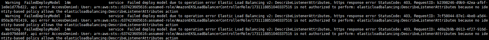
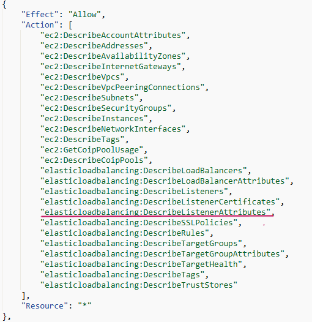
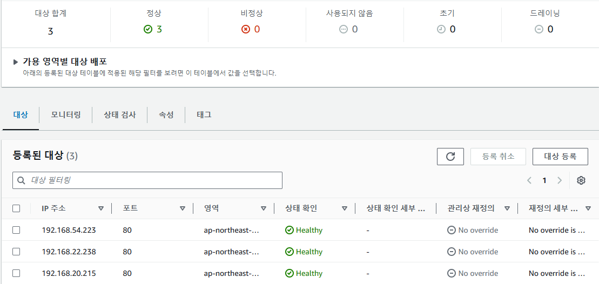

## 공식 문서대로 진행했는데 오류가 발생한다면

새로운 플랫폼이나 오픈 소스를 도입할 때 흔히 공식 문서를 참고하곤 합니다. 하지만 사용하려는 기술의 벤더가 제공하는 공식 문서대로 따라했는데 원하는 방식대로 동작하지 않았던 경험을 다들 한번쯤 겪어보셨을 수도 있습니다.

저는 AWS EKS 클러스터를 공부하던 중 Load Balancer를 배포하기 위해 관련 AWS Documentation들을 참고하여 sample 실습을 진행하였습니다. CSP가 직접 제공하는 매뉴얼이라서 순서대로 따라하기만 하면 될 줄 알았지만, 결과는 그렇지 않았습니다. NLB를 배포하기 위해 Load Balancer Controller를 설치하고 로드밸런서 서비스 매니페스트를 적용했는데, 서비스와 NLB 자체는 생성됐지만 고유의 external-ip 주소를 가져야 할 서비스에 주소가 mapping되지 않았고 대상 그룹에 sample 디플로이먼트 내 파드들 또한 추가되지 않았습니다. 당연히 외부에서 서비스에 접근할 수도 없었고요.


### Load Balancer Controller 설치 및 NLB 배포 공식 문서 링크

[AWS Load Balancer Controller](https://docs.aws.amazon.com/eks/latest/userguide/lbc-helm.html)

[Network Load Balancing](https://docs.aws.amazon.com/eks/latest/userguide/network-load-balancing.html)

#### AWS Load Balancer Controller

EKS 클러스터 내 LoadBalancer 서비스를 생성하면 AWS API를 통해 ELB를 생성하고 통합할 수 있도록 지원하는 컨트롤러입니다. LoadBalancer 매니페스트 내 Annotations 값을 참조하여 ELB를 설정합니다.

#### Network Load Balancer

외부 요청을 L4 기반으로 각 타겟에 분산하는 로드밸런서로 주로 게임 혹은 미디어 스트리밍 서비스에 사용되고 있습니다. 

### 원인 분석

공식적으로 제공된 문서를 따라 진행하였는데 오류가 발생하였다는 점이 당황스러웠지만 차근차근 원인을 분석해보기로 하였습니다. 설치한 Load Balancer Controller 파드들의 로그와 로드밸런서 서비스를 describe했을 때 출력되는 이벤트를 확인한 결과 공통적으로 출력하는 메시지를 아래와 같이 확인할 수 있었습니다.

```bash
kubectl logs -n nlb-sample-app [Load Balancer Controller 파드명]
```


```bash
kubectl describe svc -n nlb-sample-app nlb-sample-service
```



**"is not authorized to perform: elasticloadbalancing:DescribeListenerAttributes because no identity-based policy allows the elasticloadbalancing:DescribeListenerAttributes action"**

Load Balancer Controller를 설치할 때 첫번째로 NLB를 배포하기 위한 IAM 역할(서비스 계정)을 생성합니다. 이 역할에 연결하기 위한 정책을 공식 문서에 명시된 레포지토리에서 JSON 파일을 다운로드 받은 다음 생성하게 되는데,

정책 파일에 'elasticloadbalancing:DescribeListenerAttributes' 액션이 허용되어 있지 않았던 것이 원인이었습니다.

### 해결



AWS 콘솔에서 직접 연결된 IAM 정책에 해당 액션을 추가해주니 정상적으로 external-ip가 mapping되고 리스너가 트래픽을 전달하는 대상 그룹에 sample 파드가 추가되는 것을 확인할 수 있었습니다.




### 결론

때로는 공식 문서가 정답이 아닌 경우가 생길 수 있습니다. 가장 신뢰할 만한 지침서가 되지만 기술 벤더의 사정에 따라 deprecate된 기능의 문서를 여전히 지원하기도 하고, 표준이 될 만한 문서 또한 개인 환경에 따라 정상적으로 적용되지 않기도 합니다. 각자 프로젝트를 진행하는 환경의 경우의 수는 정말 많이 때문에 이러한 경우 하나하나에 정확한 매뉴얼을 제공하는데도 한계가 있고요. 이 때 침착하게 자신 혹은 팀 내에서 아는 지식을 십분 활용하여 문제를 해결한다면 그 기술을 더욱 자신의 것으로 온전히 흡수할 수 있는 기억에 남을 한 걸음이 될 수 있다고 생각합니다.

 
