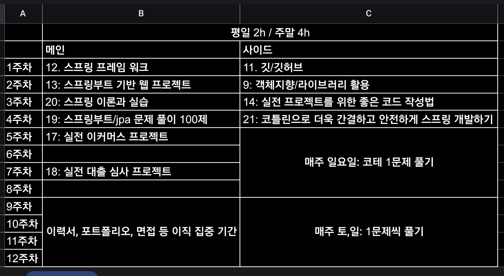

### 백엔드 개발자의 무기 = 스프링

### A. 멘토링 방식

1.스프링 기반으로 개념 질문

1) 키워드를 기반으로 멘토링 시간에 질문

2) 라이브 코딩

3) 자소서 쓰는 방법에 대한 멘토링 진행

(1) 스토리 및 키워드를 뽑아서 이야기가 진행되도록 작성

4) 회사업무 기반으로 포트폴리오 작성

(1) 키워드 같은 것만 이라도 뽑아올 것

(2) 자바스프링으로 프로젝트 진행 후 포트폴리오에 추가

### B. 과제

1. 공부한 내용을 정리할 블로그 생성

2. 공부계획을 세우기

1) 스케줄 작성 후 멘토님께 전달

(1) 추이를 볼 것이므로 100% 현실적인 스케줄을 작성할 것

3. 블로그에 스프링 개념 정리

1) 키워드 정리 필요

2) 공부한 내용 멘토님께 전달

- 12주동안 연속적으로 기간안에 진행 후 끝내야 하는 것은 아님