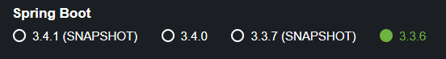
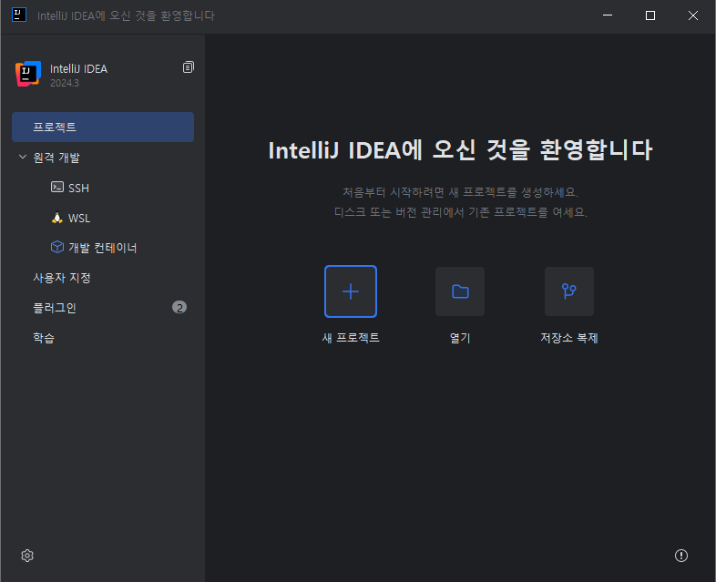
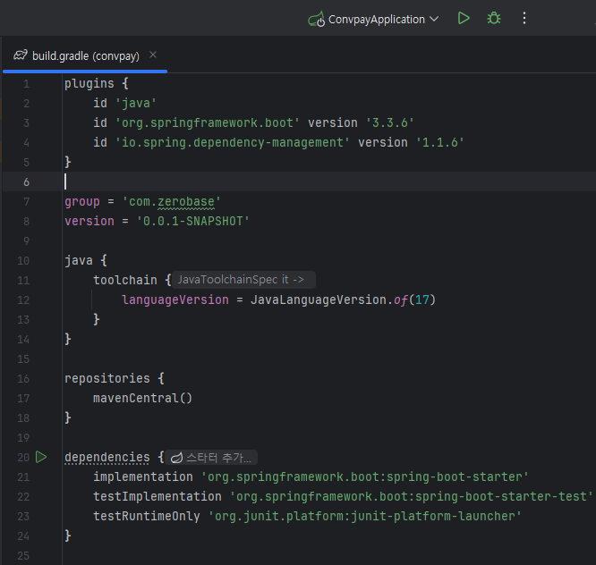
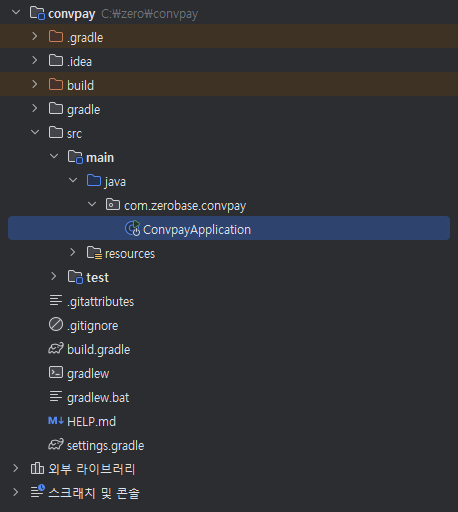
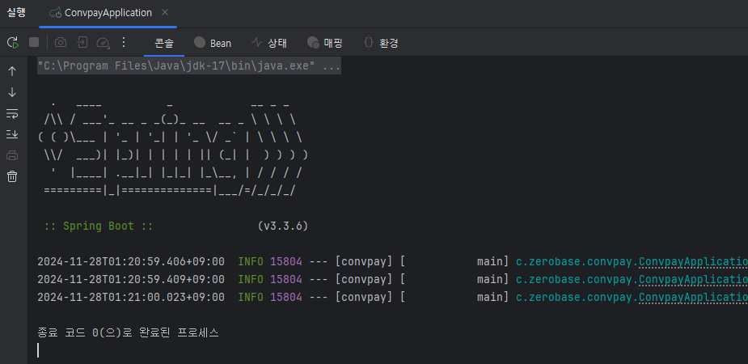

01_순수 자바로 이루어진 프로젝트

#1 프로젝트 소개 및 생성

- 앞에서 말했던 실습을 해볼 시간

실습 순서

1. 순수 자바로 된 프로젝트를 만들어본다.

2. 내가 직접 심플 스프링을 만들어본다,.

3. 스프링을 활용해서 내가 만든 프로젝트를 동작하게 한다.

프로젝트 설명

- 편의점 결제 서비스
    - Mac 또는 Windows
    - IDE: IntelliJ Ultimate 추천(Comumunity 버전 또는 Eclipse도 가능
- Language : Java(jdk 17)
- Project : Gradle Project
- Spring Boot : 2.6.4
- 프로젝트 생성 : start.spring.io
- Group : com.zerobase
- Artifact : heart

생성된 build.gradle 파일 내용

```kotlin
plugins {
	java
	id("org.springframework.boot") version "3.3.6"
	id("io.spring.dependency-management") version "1.1.6"
}

group = "com.zerobase"
version = "0.0.1-SNAPSHOT"

java {
	toolchain {
		languageVersion = JavaLanguageVersion.of(17)
	}
}

repositories {
	mavenCentral()
}

dependencies {
	implementation("org.springframework.boot:spring-boot-starter")
	testImplementation("org.springframework.boot:spring-boot-starter-test")
	testRuntimeOnly("org.junit.platform:junit-platform-launcher")
}

tasks.withType<Test> {
	useJUnitPlatform()
}

```

### 실습을 위한 스프링 부트 세팅
1\. spring initializr <br>
&nbsp;&nbsp;&nbsp;1\) 스프링부트 앱을 쉽게 만들어주는 웹

&nbsp;&nbsp;&nbsp;2\) URL : https://start.spring.io/


### Project

\> Gradle(Groovy)선택

### Language

\> Java 선택

### Spring Boot

\> SNAPSHOT 버전 외 선택 (SNAPSHOT 버전은 안정화가 덜 되었을 확률이 있음)
<Br>
### Project Metadata
<Br>
\> 프로젝트 명 밑 패키지 구성 <br>
\> Jar 선택 <br>
\> JAVA 17 추천 <br>
<Br>
\> GENERATE 클릭 시 위의 설정대로 프로젝트 생성됨<br>
<br>
<Br>
<br>
\> 다운 받은 프로젝트를 압축 해제<Br>
<Br>
<Br>
<br>
\> IDE실행하여 프로젝트 열기 수행<Br>
<Br>
<br>
\> build.gradle 내에 플러그인 및 그룹, 자바 버전 확인<Br>
<Br>
<Br>
\> 상단의 실행 버튼 클릭하여 빌드<Br>
<Br>
<br>
\> ConvpayApplication 실행 가능<Br>
<Br>
\> 정상적으로 어플리케이션이 실행이 되었다면, 위와같이 완료되면<Br>
\> 기본적인 스프링 부트 세팅이 완료되었다고 볼 수 있음<Br>