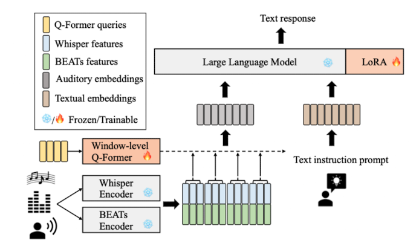

## Speech Audio Language Music Open Neural Network

<aside>

### ABSTRACT

General audio information: 적어도 세 가지 타입의 사운드를 포함하고 있음

**⇒ speech, audio events, music**

SALMONN: **“speech 인코더 + audio 인코더” → 멀티모달로 결합된 pretrained model**

⇒ training에 사용되는 왠만한 speech 및 audio task에 우수한 성능을 보임

<aside>

### INTRODUCTION

최근 LLM이 인간에 준하는 성능을 보이는 가운데, **Instruction Tunning**이라는 패러다임이 등장

⇒ LLM이 제약없이 사용자의 Instruction을 수행할 수 있도록

⇒ 최근 LLM 관련 연구들이 Instruction Tunning에 대해 나오고 있음

SALMONN → “A Single audio-text multimodal LLM”

: perceive three basic types of sounds (speech, audio events, music)

- Speech 데이터와 Non-speech 데이터 모두에 대해 증강시키기 위해 **Dual Encoder** 활용

  ⇒ from [Whisper](https://www.notion.so/Whisper-speech-Encoder-17da5ea423548075b396facf3bf044cc?pvs=21)(speech model)

  ⇒ from [BEATs](https://www.notion.so/BEATS-Non-speech-audio-Encoder-17da5ea4235480228d0dcfb68a7a59cb?pvs=21)(audio encoder)

- A window-level query Transformer([Q-Former](https://www.notion.so/Q-former-in-SALMONN-17da5ea42354808c91b3f35e27891589?pvs=21))

  : 인코더가 출력한 sequence를 Vicuna LLM에 넣을 다수의 augmented audio tokens로 바꿔줌

  - 오디오 입력 데이터를 처리하고, 이를 LLM과 연결

    (가변 길이의 오디오 데이터 → 고정 길이의 텍스트 토큰)

- Cross-modal Emergent abilities ⇒ “훈련 중에 보지 못한 크로스모달 작업을 수행할 수 있는 능력”

  - Instruction Tuning 단계에서 특정 작업에 과적합(task over-fitting)되는 문제가 발생.
  - 이를 해결하기 위해 Activation Tuning 단계를 도입하여 cross-modal emergent abilities를 활성화. </aside>

### RELATED WORK

### METHODOLOGY

1. Model Architecture

   

   

   **Dual Auditory Encoders**

   - For Speech data: Whisper Encoder
   - For Non-speech data: BEATs Encoder - high level non-speech semantics information using iterative self-supervised learning

   **Window-level Q-former**

   - Whisper encoder와 BEATs encoder의 결과물 Z

     ⇒ 윈도우 L의 크기로 쪼개

     ⇒ 학습 가능한 쿼리 벡터 Q를 주입

     ⇒ 두 단계의 Attention을 거쳐(Self-Attention, Cross-Attention)

     ⇒ 각 윈도우 별 N개의 텍스트 토큰 $H_l$ 생성

     ⇒ 최종적으로, 모든 윈도우에서 생성된 최종 텍스트 토큰 결합: Vicuna에 주입

   **LLM and LoRA**

   - LLM 파라미터 파인튜닝에 가장 널리 사용되는 LoRA ⇒ SALMONN의 Vicuna에 역시 적용

### EXPERIMENT SETUP

1. Model Specification

   - Whisper-Large-v2 ⇒ speech encoder
   - The fine-tuned BEATs encoder ⇒ Audio encoder
   - A vicuna LLM with 13 billions
     - Q-former, LoRA etc.

2. DATA Specification

   - About. Audio Dataset (Audiocaps, Gigaspeech, WavCaps, Librispeech, Clotho)

     ## **1. AudioCaps**

     - **설명**: AudioCaps는 오디오 캡셔닝(AAC) 작업을 위해 설계된 대규모 데이터셋으로, 오디오 클립과 해당 텍스트 설명 쌍으로 구성됩니다.
     - **출처**: AudioSet 데이터셋에서 추출된 10초 길이의 YouTube 오디오 클립을 기반으로 합니다.
     - **주요 특징**:
       - 약 **46,000개의 오디오-텍스트 쌍**으로 구성.
       - Amazon Mechanical Turk를 통해 수집된 **사람이 작성한 캡션** 포함.
       - 다양한 환경 소리와 이벤트를 설명하며, 자연어로 오디오 내용을 서술합니다.
     - **용도**:
       - 자동 오디오 캡셔닝(AAC).
       - 오디오 이벤트 탐지 및 텍스트 생성 연구.
     - **관련 작업**:
       - METEOR, CIDEr와 같은 평가 지표를 사용해 모델 성능을 평가합니다.

     ## **2. GigaSpeech**

     - **설명**: GigaSpeech는 영어 음성 인식을 위한 대규모 데이터셋으로, 약 **10,000시간의 고품질 라벨링된 음성 데이터**를 제공합니다.
     - **출처**: 오디오북, 팟캐스트, YouTube 등 다양한 도메인에서 수집된 데이터를 포함합니다.
     - **주요 특징**:
       - 읽기 스타일과 즉흥적 발화 스타일을 모두 포함.
       - 예술, 과학, 스포츠 등 다양한 주제를 다룸.
       - 여러 크기의 하위 세트(XS, S, M, L, XL)로 구성되어 있어 학습 요구에 맞게 선택 가능.
     - **용도**:
       - 자동 음성 인식(ASR).
       - 텍스트-음성 변환(TTS) 및 텍스트-오디오 변환 연구.

     ## **3. WavCaps**

     - **설명**: WavCaps는 ChatGPT를 활용하여 약간의 라벨링만 이루어진 대규모 오디오 캡셔닝 데이터셋입니다. 약 **400,000개의 오디오 클립과 캡션 쌍**으로 구성됩니다.
     - **출처**: BBC Sound Effects, FreeSound, AudioSet 등에서 수집된 데이터를 포함합니다.
     - **주요 특징**:
       - 평균 오디오 길이: 약 67.59초.
       - ChatGPT 기반의 세 단계 처리 파이프라인을 통해 고품질 캡션 생성.
       - 짧은 클립과 단일 이벤트 중심의 데이터를 포함하여 다양한 소리 이벤트를 포괄.
     - **용도**:
       - 약한 라벨링 기반 오디오 캡셔닝 연구.
       - 멀티모달 연구(오디오-언어 모델).

     ## **4. LibriSpeech**

     - **설명**: LibriSpeech는 영어 읽기 음성 데이터를 기반으로 한 자동 음성 인식(ASR) 데이터셋입니다. 약 **1,000시간의 녹음된 오디오북 데이터**로 구성됩니다.
     - **출처**: LibriVox 프로젝트에서 제공하는 공공 도메인 오디오북에서 추출됨.
     - **주요 특징**:
       - "clean" 및 "other"로 나뉘며, 발화 품질에 따라 분류됨.
       - 학습 세트는 총 3개로 나뉘며 각각 100시간(train.100), 360시간(train.360), 500시간(train.500)으로 구성됨.
       - Word Error Rate(WER)를 기준으로 평가 가능.
     - **용도**:
       - ASR 모델 학습 및 평가.

     ## **5. Clotho**

     - **설명**: Clotho는 오디오 캡셔닝 작업을 위해 설계된 데이터셋으로, 다양한 환경 소리와 이를 설명하는 텍스트로 구성됩니다.
     - **출처**: Freesound 플랫폼에서 수집된 오디오 샘플 사용.
     - **주요 특징**:
       - 각 샘플은 길이가 약 15~30초이며, 하나의 샘플당 최대 다섯 개의 캡션 제공(8~20단어).
       - 총 약 6,972개의 샘플과 약 34,860개의 캡션 포함(Clotho v2 기준).
       - Amazon Mechanical Turk를 통해 크라우드소싱 방식으로 캡션 수집.
     - **용도**:
       - 자동 오디오 캡셔닝(AAC).
       - DCASE 챌린지와 같은 평가 작업.

     ## **요약**

     이들 데이터셋은 SALMONN 모델 학습에 중요한 역할을 하며 각각 다음과 같은 작업에 활용:

     1. AudioCaps와 Clotho는 비음성 데이터를 대상으로 한 자동 오디오 캡셔닝(AAC)에 사용됩니다.
     2. GigaSpeech와 LibriSpeech는 음성 인식(ASR) 및 관련 작업에 활용됩니다.
     3. WavCaps는 멀티모달 연구와 약한 라벨링 기반 학습에 적합합니다.

     **공유**

     **다시 쓰기**

   In, Three stages

   - First stage(Pre-training stage)

     ⇒ Librispeech + Gigaspeech (speech recognition)

     ⇒ Wavcaps + Audiocaps + Clotho (audio captioning)

   - Second stage(Instruction-Tuning stage)

     - **Multiple tasks** (ASR, En2Zh, AAC, PR, ER, MC, OSR, SV, GR, SQA, AQA, MQA)

       ## **1. ASR (Automatic Speech Recognition)**

       - **설명**: 입력된 음성을 텍스트로 변환하는 작업입니다.
       - **데이터 소스**:
         - *LibriSpeech*: 오디오북 데이터셋으로, 음성 인식 연구에서 널리 사용됩니다.
         - *GigaSpeech*: 대규모 음성 데이터셋으로, 다양한 도메인에서 수집된 음성을 포함합니다.
       - **목적**: SALMONN이 음성 데이터를 정확히 텍스트로 변환할 수 있도록 학습.

       ## **2. En2Zh (English-to-Chinese Speech Translation)**

       - **설명**: 영어 음성을 중국어 텍스트로 번역하는 작업입니다.
       - **데이터 소스**:
         - *CoVoST2-En2Zh*: 다국어 음성 번역 데이터셋으로, 영어에서 중국어로 번역된 데이터를 포함합니다.
       - **목적**: SALMONN이 다국어 번역 작업을 수행할 수 있도록 학습.

       ## **3. AAC (Automated Audio Captioning)**

       - **설명**: 오디오 클립의 내용을 자연어로 설명하는 작업입니다.
       - **데이터 소스**:
         - *AudioCaps*: 다양한 환경 소리와 그에 대한 텍스트 설명을 포함하는 데이터셋.
         - *Clotho*: 오디오 캡셔닝 연구를 위해 설계된 데이터셋.
       - **목적**: SALMONN이 오디오 데이터를 이해하고 이를 텍스트로 설명할 수 있도록 학습.

       ## **4. PR (Phone Recognition)**

       - **설명**: 음성을 세분화하여 개별적인 음소(phoneme)를 식별하는 작업입니다.
       - **데이터 소스**:
         - *LibriSpeech*: 음소 인식 연구에 사용되는 고품질 데이터셋.
       - **목적**: SALMONN이 세부적인 발음 정보를 처리하고 분석할 수 있도록 학습.

       ## **5. ER (Emotion Recognition)**

       - **설명**: 음성 데이터를 기반으로 화자의 감정을 인식하는 작업입니다.
       - **데이터 소스**:
         - *IEMOCAP*: 감정 표현이 포함된 대화형 데이터셋.
       - **목적**: SALMONN이 감정을 이해하고 이를 분류할 수 있도록 학습.

       ## **6. MC (Music Captioning)**

       - **설명**: 음악 클립의 내용을 텍스트로 설명하는 작업입니다.
       - **데이터 소스**:
         - *MusicCaps*: 음악의 분위기, 악기, 장르 등을 설명하는 캡션 데이터셋.
       - **목적**: SALMONN이 음악 데이터를 분석하고 이를 자연어로 표현할 수 있도록 학습.

       ## **7. OSR (Overlapped Speech Recognition)**

       - **설명**: 여러 화자가 동시에 말하는 상황에서 각각의 발화를 인식하는 작업입니다.
       - **데이터 소스**:
         - *LibriMix*: 겹치는 음성을 포함한 데이터셋으로, 화자 분리 및 인식을 지원합니다.
       - **목적**: SALMONN이 복잡한 오디오 환경에서도 정확히 발화를 분리하고 인식할 수 있도록 학습.

       ## **8. SV (Speaker Verification)**

       - **설명**: 특정 화자가 말한 내용인지 확인하는 작업입니다.
       - **데이터 소스**:
         - *VoxCeleb1*: 다양한 화자의 음성을 포함한 대규모 데이터셋.
       - **목적**: SALMONN이 화자를 식별하거나 인증할 수 있는 능력을 갖추도록 학습.

       ## **9. GR (Gender Recognition)**

       - **설명**: 화자의 성별을 인식하는 작업입니다.
       - **데이터 소스**:
         - *LibriSpeech*: 성별 정보가 포함된 음성 데이터를 활용.
       - **목적**: SALMONN이 화자의 성별을 정확히 분류할 수 있도록 학습.

       ## 10~12: QA / Generated based the text caption labels using by ChatGPT

       ## **10. SQA (Speech Question Answering)**

       - **설명**: 음성 데이터를 기반으로 질문에 답변하는 작업입니다.
       - **데이터 소스**:
         - *LibriSpeech*: 질문과 답변 형식의 데이터를 생성하여 활용.
       - **목적**: SALMONN이 음성을 이해하고 질문에 답변할 수 있도록 학습.

       ## **11. AQA (Audio Question Answering)**

       - **설명**: 오디오 클립의 내용을 기반으로 질문에 답변하는 작업입니다.
       - **데이터 소스**:
         - *WavCaps*와 *AudioCaps*: 오디오와 관련된 질문과 답변 데이터를 포함합니다.
       - **목적**: SALMONN이 오디오 정보를 분석하고 질문에 답변할 수 있도록 학습.

       ## **12. MQA (Music Question Answering)**

       - **설명**: 음악 클립을 기반으로 질문에 답변하는 작업입니다.
       - **데이터 소스**:
         - *MillionSong*과 *MusicNet*: 음악 관련 질문과 답변 데이터를 포함합니다.
       - **목적**: SALMONN이 음악 콘텐츠를 이해하고 이에 대한 질문에 답변할 수 있도록 학습.

     ⇒ multiple tasks를 통해 다양한 multi-modal 능력 학습

     ⇒ 모델이 특정 도메인을 이해 및 처리하는 능력을 강화하기 위해 설계

