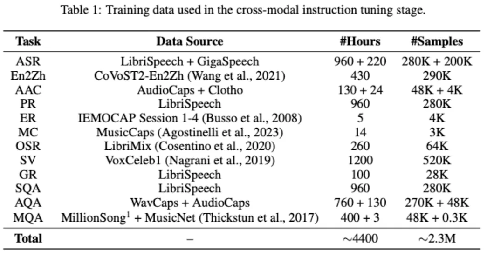

# SALMONN: Speech Audio Language Music Open Neural Network

## 0 ABSTRACT

General audio information: 적어도 세 가지 타입의 사운드를 포함하고 있음 (speech, audio events, music)

SALMONN: **“Speech 인코더 + Audio 인코더” → Multi-modal로 결합된 pretrained model**

⇒ training에 사용되는 왠만한 speech 및 audio task에 우수한 성능을 보임

## 1 INTRODUCTION

최근 LLM이 인간에 준하는 성능을 보이는 가운데, **Instruction Tunning**이라는 패러다임이 등장

-  LLM이 제약없이 사용자의 Instruction을 수행할 수 있도록

- 최근 LLM 관련 연구들이 Instruction Tunning에 대해 나오고 있음

SALMONN → “A Single audio-text multimodal LLM”

: perceive three basic types of sounds (speech, audio events, music)

- Speech 데이터와 Non-speech 데이터 모두에 대해 증강시키기 위해 **Dual Encoder** 활용

  ⇒ from <u>Whisper</u>(speech model)

  ⇒ from <u>BEATs</u>(audio encoder)

- A window-level query Transformer(Q-former)

  : 인코더가 출력한 sequence를 Vicuna LLM에 넣을 다수의 augmented audio tokens로 바꿔줌

  - 오디오 입력 데이터를 처리하고, 이를 LLM과 연결

    (가변 길이의 오디오 데이터 → 고정 길이의 텍스트 토큰)

- Cross-modal Emergent abilities ⇒ “훈련 중에 보지 못한 크로스모달 작업을 수행할 수 있는 능력”

  - Instruction Tuning 단계에서 특정 작업에 과적합(task over-fitting)되는 문제가 발생.
  - 이를 해결하기 위해 Activation Tuning 단계를 도입하여 cross-modal emergent abilities를 활성화. </aside>

## 2 RELATED WORK

## 3 METHODOLOGY

### 3.1 <u>**Model Architecture**</u>

**Dual Auditory Encoders**

- For Speech data: Whisper Encoder
- For Non-speech data: BEATs Encoder - high level non-speech semantics information using iterative self-supervised learning

**Window-level Q-former**

- Whisper encoder와 BEATs encoder의 결과물 Z

  ⇒ 윈도우 L의 크기로 쪼개

  ⇒ 학습 가능한 쿼리 벡터 Q를 주입

  ⇒ 두 단계의 Attention을 거쳐(Self-Attention, Cross-Attention)

  ⇒ 각 윈도우 별 N개의 텍스트 토큰 $H_l$ 생성

  ⇒ 최종적으로, 모든 윈도우에서 생성된 최종 텍스트 토큰 결합: Vicuna에 주입

**LLM and LoRA**

- LLM 파라미터 파인튜닝에 가장 널리 사용되는 LoRA ⇒ SALMONN의 Vicuna에 역시 적용

### 3.2 <u>**Training Method**</u>

## 4 EXPERIMENT SETUP

### 4.1 <u>Model Specification</u>

- Whisper-Large-v2 ⇒ speech encoder
- The fine-tuned BEATs encoder ⇒ Audio encoder
- A vicuna LLM with 13 billions
  - Q-former, LoRA etc.

### 4.2 <u>DATA Specification</u>

**DATA: Audio Benchmark Dataset (Audiocaps, Gigaspeech, WavCaps, Librispeech, Clotho)**

- AudioCaps / Clotho: 비음성 데이터를 대상으로 한 AAC task에 활용
- GigaSpeech / LibriSpeech: ASR 및 관련 작업에 활용
- WavCaps: Multi-modal 및 라벨링 기반 Training에 적합

**Train stages**

- **First Stage**: <u>Pre-training stage</u>

  - <u>Speech Recognition</u>
    - 960-hr Librispeech
    - 1000-hr Gigaspeech M-set

  - <u>Audio Captioning</u>
    - 2880-hr Wavcaps (180초 이상의 음원 제거)
    - Audiocaps
    - Clotho

- **Second Stage**: <u>Instruction Tuning stage</u>

  - **Multiple tasks** (ASR, En2Zh, AAC, PR, ER, MC, OSR, SV, GR, SQA, AQA, MQA)
    (관련 포스트 참조)

    ⇒ multiple tasks를 통해 다양한 multi-modal 능력 학습

    ⇒ 목적: 모델이 특정 도메인을 이해 및 처리하는 능력 강화

    

- **Final Stage**: <u>Activation Tuning stage</u>

  - SALMONN(+reduce LoRA): 오디오 클립들을 기반으로 12개의 스토리 작성

    ⇒ 12개의 각 스토리 샘플을 활용하여, 12단계에 걸쳐 **teacher-forcing** 방법으로 cross-entropy loss를 측정하여 훈련 (For. lightweight fine-tuning process)

### 4.3 <u>Task Specification</u>

