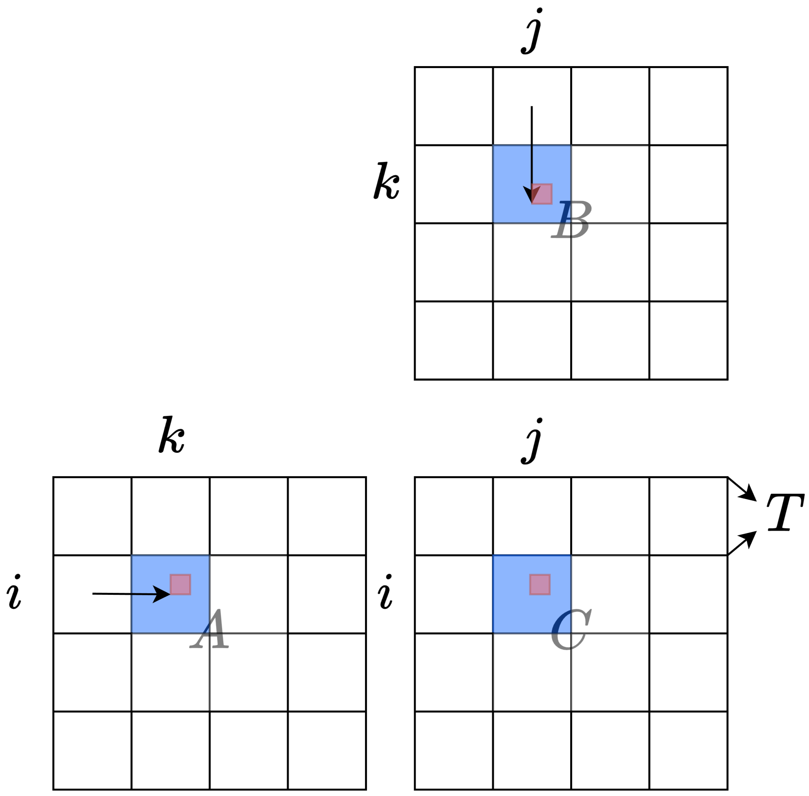
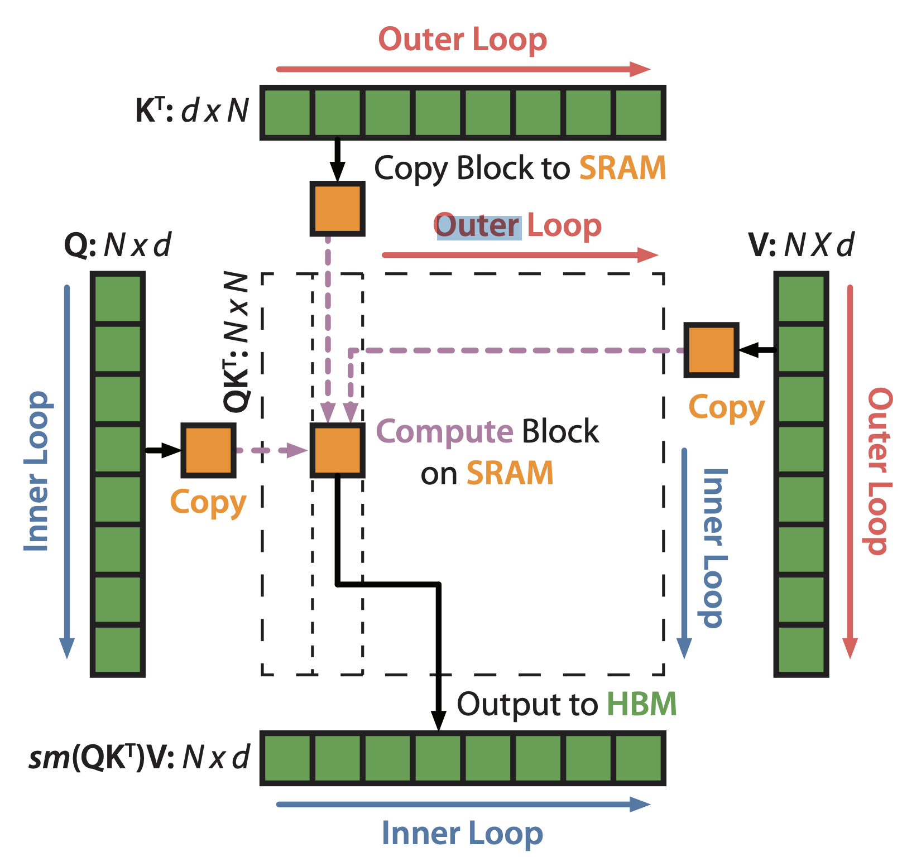
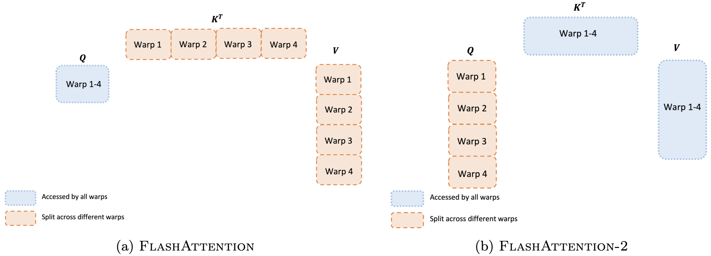

이번 포스팅은 [From Online Softmax to FlashAttention](https://courses.cs.washington.edu/courses/cse599m/23sp/notes/flashattn.pdf) 리포트에 대해 다룹니다. 

이 리포트는 워싱턴 대학교 컴퓨터 공학과 박사과정 학생인  [Zihao Ye](https://homes.cs.washington.edu/~zhye/)가 2023년 봄 학기에 CSE 599M: ML for ML Systems 강의의 조교(TA)로 활동하며 수업 참고 자료로 제공한 것입니다. 

FlashAttention 알고리즘이 어떻게 작동하는지를 온라인 소프트맥스(Online Softmax) 기법을 통해 단계적으로 유도하는 것을 목표로 합니다. 

## The Self-Attention 

Self-Attention의 계산은 다음과 같이 요약할 수 있습니다. 

$$
O = \text{softmax}(QK^T)V
$$

 Self-Attention을 계산하는 일반적인 접근 방식은 여러 단계로 계산을 분해하는 것입니다. 여기서 $ X $ 는 pre-softmax logits, $ A $ 는 attention score, $ O $는 output 입니다.

$$
X = QK^T
$$

$$
A = \text{softmax}(X)
$$

$$
O = AV
$$

```python
def flashatt_spec(q: Float32[Tensor, "200"], k: Float32[Tensor, "200"], v: Float32[Tensor, "200"]) -> Float32[Tensor, "200"]:
    x = q[:, None] * k[None, :]
    x_max = x.max(1, keepdim=True)[0]
    x = x - x_max
    x_exp = x.exp()
    soft =  x_exp  / x_exp.sum(1, keepdim=True)
    return (v[None, :] * soft).sum(1)
```

FlashAttention의 주요 특징은 기존 어텐션 메커니즘과 달리 $X$ 와 $A$ 를 전부 메모리에 상주시킬 필요가 없다는 점입니다. 

행렬 곱셈은 타일링을 사용하여 온칩 메모리가 하드웨어의 용량 한계를 넘지 않도록 설계합니다. 커널 실행 중에는 행렬의 형태와 관계없이 온칩에 저장되는 요소의 수를 $3T^2$ 개로 제한합니다. 

이러한 타일링 접근법이 효과적인 이유는 전체 행렬 곱셈을 여러 타일 단위의 부분 행렬 곱셈의 합으로 분해할 수 있기 때문입니다. 

하지만 Self-Attention의 경우, 소프트맥스 연산으로 인해 단순히 타일링만으로는 제약이 따르며, FlashAttention은 이를 해결한 방법으로 개발되었습니다. 



## (safe) softmax

소프트맥스 계산의 일반적인 공식은 다음과 같습니다. 

$$
\text{softmax}(\{x_1, \cdots, x_N\}) = \left\{ \frac{e^{x_i}}{\sum_{j=1}^{N} e^{x_j}} \right\}_{i=1}^{N}
$$

여기서 $x_i$ 값이 매우 클 경우, $e^{x_i}$는 쉽게 오버플로우 될 수 있습니다. 예를 들어, float16이 지원할 수 있는 최대 숫자는 65536인데, 이는 $x > 11$ 일 경우 $e^{x}$ 가 float16의 유효 범위를 넘어서게 됨을 것을 의미합니다. 이런 문제를 해결하기 위해 **"safe"** softmax 를 활용하여 오버플로우를 방지합니다. 

$$
\frac{e^{x_i}}{\sum_{j=1}^{N} e^{x_j}} = \frac{e^{x_i -m}}{\sum_{j=1}^{N} e^{x_j - m}}
$$

여기서 $m = \text{max}_{j=1}^{N} (x_j)$ 로 정의되며, $x_i - m \leq 0$ 이 성립함으로 지수 함수에는 항상 음수 또는 0이 입력됩니다. 이로 인해 오버플로우가 발생하지 않아 안전하게 계산할 수 있습니다. 

이러한 **"safe"** softmax는 3-pass 알고리즘으로 요약할 수 있다. 

### Algorithm 3-pass safe softmax 

이 알고리즘은 [1, N]을 3번 반복해야 합니다. 트랜스포머의 Self-Attention과 관련하여 $\{x_i\}$는  $QK^T$ 로 계산된 pre-softmax logits 입니다. 이는 SRAM이 충분히 크지 않아 모든 logits을  저장할 수 없다면, 재계산을 위해 $Q$와 $K$ 에 세 번 접근해야 함을 의미합니다. 이는 I/O 측면에서 효율적이지 않습니다.

**NOTIONS**

${m_i}: max_{j=1}^{i}\{x_j\}$, with initial value $m_0 = -\inf$

$\{d_i\}: \sum_{j=1}^{i} e^{x_j -m_N}$, with initial value $d_0 = 0, d_n$ is the denominator of safe softmax

$\{a_i\}:$ the final softmax value 

**BODY**

$\text{for i} \leftarrow 1, \text{N do}$

$$
m_i \leftarrow \max(m_{i-1}, x_i), \quad \text{for } i = 1, \dots, N
$$

$\text{end}$

$\text{for i} \leftarrow 1, \text{N do}$

$$
d_i \leftarrow d_{i-1} + e^{x_i - m_N}
$$

$\text{end}$

$\text{for i} \leftarrow 1, \text{N do}$

$$
a_i \leftarrow \frac{e^{x_i - m_N}}{d_N}
$$

$\text{end}$

## Online Softmax 

3-pass safe softmax에서 $d_i$는 $m_N$에 의존합니다. 이를 $d_i$ 와 $d_{i-1}$ 간의 재귀 관계를 통해 $N$에 대한 의존성을 제거할 수 있습니다.

$$
\begin{align*}
d_i^{\prime} &= \sum_{j=1}^{i}e^{x_j - m_i} \\
     &= \left(\sum_{j=1}^{i-1}e^{x_j - m_i} \right) + e^{x_i - m_i} \\ 
     &= \left( \sum_{j=1}^{i-1}e^{x_j-m_{i-1}} \right) e^{m_{i-1} - m_i}
     + e^{x_i-m_i} \\
     &= d^{\prime}_{i-1} e^{m_{i-1}-m_i} + e^{x_i - m_i}
\end{align*}
$$

### Algorithm 2-pass online softmax 

$\text{for i} \leftarrow 1, \text{N do}$

$$
\begin{align*}
m_i &\leftarrow \text{max}(m_{i-1}, x_i)\\
d_{i}^{\prime} &\leftarrow d_{i-1}^{\prime} e^{m_{i-1}-m_i} + e^{x_i - m_i}
\end{align*}
$$

$\text{end}$

$\text{for i} \leftarrow 1, \text{N do}$

$$
a_i \leftarrow \frac{e^{x_i - m_N}}{d_N^{\prime}}
$$

$\text{end}$

해당 알고리즘은 [온라인 소프트맥스 논문](https://arxiv.org/pdf/1805.02867)에서 제안되었습니다. 그러나 여전히 소프트맥스 계산을 완료하는데 두 번의 패스가 필요합니다. 소프트맥스에서는 이를 1개의 패스로 줄일 수는 없습니다.

## FlashAttention 

Self-Attention에 온라인 소프트맥스를 적용하면 다음과 같습니다.

**NOTATIONS**

$Q[k, :]$ : $Q$ 행렬의 $k$ 번째 행 벡터 

$K^{T}[:, i]$ : $K^T$ 행렬의 i 번째 열 벡터 

$V[:, i]$ : $V$ 행렬의 i 번째 열 벡터 

$O[k, :]$ : $O$ 행렬의 $k$ 번째 행 벡터 

$\{o_i\}$ : $\sum_{j=1}^{i} a_j V[j, :]$ , 부분 집합 결과를 저장하는 행 벡터 

**BODY**

$\text{for i} \leftarrow 1, \text{N do}$

$$
\begin{align*}
x_i &\leftarrow Q[k, :]K^T[:, i] \\
m_i &\leftarrow \text{max}(m_{i-1}, x_i)\\
d_i^{\prime} &\leftarrow d_{i-1}^{\prime}e^{m_{i-1}-m_i} + e^{x_i-m_i}
\end{align*}
$$

$\text{end}$

$\text{for i} \leftarrow 1, \text{N do}$

$$
\begin{align*}
x_i &\leftarrow Q[k, :]K^T[:, i] \\
a_i &\leftarrow \frac{e^{x_i} - m_N}{d_N^{'}} \\
o_i &\leftarrow o_{i-1} + a_iV[i,:]
\end{align*}
$$

$\text{end}$

$$
O[k,:] \leftarrow o_N
$$

```python
@triton.jit
def flashatt_kernel(q_ptr, k_ptr, v_ptr, z_ptr, N0, T, B0: tl.constexpr):
  pid = tl.program_id(0)
  block_indices = pid * B0 + tl.arange(0, B0)
  block_mask = block_indices < N0
  q_val = tl.load(q_ptr + block_indices, mask=block_mask, other=0.0)
  
  m = tl.full((B0,), float("-inf"), dtype=tl.float32)
  d = tl.zeros((B0,), dtype=tl.float32)
  
  for j in range(0, T, B0):
    tile_indices = j + tl.arange(0, B0)
    tile_mask = tile_indices < T
    k_val = tl.load(k_ptr + tile_indices, mask=tile_mask, other=0.0)
    
    x = q_val[:, None] * k_val[None, :]
    x = tl.where(tile_indices[None, :] < T, x, float("-inf"))
    
    tile_m = tl.max(x, axis=1)
    tile_exp = tl.exp(x - tile_m[:, None])
    tile_d = tl.sum(tile_exp, axis=1)
    
    new_m = tl.maximum(m, tile_m)
    d = d * tl.exp(m - new_m) + tile_d * tl.exp(tile_m - new_m)
    m = new_m

  z = tl.zeros((B0,), dtype=tl.float32)
  for j in range(0, T, B0):
    tile_indices = j + tl.arange(0, B0)
    tile_mask = tile_indices < T
    k_val = tl.load(k_ptr + tile_indices, mask=tile_mask, other=0.0)
    v_val = tl.load(v_ptr + tile_indices, mask=tile_mask, other=0.0)
    
    x = q_val[:, None] * k_val[None, :]
    
    a = tl.exp(x - m[:, None]) / d[:, None]
    z += tl.sum(a * v_val[None, :], axis=1)

  tl.store(z_ptr + block_indices, z, mask=block_mask)
```

$$
z_i = \sum_j \text{softmax}(q_1k_1, \cdots, q_T k_T)_jv_j \quad \text{for } i =1 \cdots N_0
$$


이제 2번의 패스를 1번의 패스로 줄입니다.  $o_i$ 는 다음과 같이 정의할 수 있습니다.
$$
o_i := \sum_{j=1}^{i} \left( \frac{e^{x_j - m_N}}{d_N^{\prime}} V[j, :]\right)
$$

이는 여전히 $m_N$과 $d_N$에 의존성을 가지고 있습니다. 하지만 온라인 소프트맥스에서 제안하는 트릭을 다시 활용하여 표현할 수 있습니다. 

$$
o_i^{\prime} := \left( \sum_{j=1}^{i} \frac{e^{x_j - m_i}}
{d_i^{\prime}} V[j,:] \right)
$$

$o_N^{'} = o_N$ 이며, 여기서 $o_i$ 와 $o_{i-1}$ 사이의 재귀 관계를 찾으면 의존성을 제거 할 수 있습니다, 

$$
\begin{align*}
o_i^{\prime} &= \sum_{j=1}^{i} \frac{e^{x_j - m_i}}{d_i^{'}}V[j,:] \\
&= \left( \sum_{j=1}^{i-1} \frac{e^{x_j - m_i}}{d_i^{\prime}} V[j,:] \right)
+ \frac{e^{x_i - m_i}}{d_i^{\prime}}V[i,:] \\
&= \left( \sum_{j=1}^{i-1} \frac{e^{x_j-m_i-1}}{d_{i-1}^{\prime}} 
\frac{e^{x_j - m_i}}{e^{x_j-m_i-1}} 
\frac{d_{i-1}^{\prime}}{d_i^{\prime}} V[j, :] \right) 
+ \frac{e^{x_i-m_i}}{d_i^{\prime}}V[i,:] \\ 
&= \left( \sum_{j=1}^{i-1} \frac{e^{x_j-m_i-1}}{d_{i-1}^{\prime}}V[j,:] \right)
\frac{d_{i-1}^{\prime}}{d_i^{\prime}} e^{m_{i-1} - m_i}
+ \frac{e^{x_i-m_i}}{d_i^{\prime}}V[i,:] \\
&= o_{i-1}^{\prime} \frac{d_{i-1}^{\prime} e^{m_{i-1}-m_i}}{d_i^{\prime}}
+ \frac{e^{x_i-m_i}}{d_i^{\prime}}V[i,:]
\end{align*}
$$

위 수식에서  $d_i^{\prime}, d_{i-1}^{\prime}, m_i, m_{i-1}$ 는 $x_i$에만 의존한다. 따라서 Self-Attention의 모든 계산을 단일 루프에서 통합할 수 있다. 

### Algorithm FlashAttention 

상태 $x_i, m_i, d_i^{'}, o_i^{'}$ 는 SRAM에서만 처리할 수 있을 만큼 작은 크기를 가질 수 있습니다 

$\text{for i} \leftarrow 1, \text{N do}$

$$
\begin{align*}
x_i &\leftarrow Q[k,:]K^T[:,i] \\
m_i &\leftarrow \text{max}(m_{i-1}, x_i) \\
d_i^{\prime} &\leftarrow d_{i-1}^{\prime} e^{m_{i-1}-m_i} + e^{x_i-m_i} \\
o_i^{\prime} &\leftarrow o_{i-1}^{\prime} 
\frac{d_{i-1}^{\prime}e^{m_{i-1}-m_i}}{d_i^{\prime}} 
+ \frac{e^{x_i-m_i}}{d_i^{\prime}}V[i,:]
\end{align*}
$$

$\text{end}$

$$
O[k,:] \leftarrow o_N^{\prime}
$$

```python
@triton.jit
def flashatt_kernel(q_ptr, k_ptr, v_ptr, z_ptr, N0, T, B0: tl.constexpr):
  pid = tl.program_id(0)
  block_indices = pid * B0 + tl.arange(0, B0)
  block_mask = block_indices < N0
  q_val = tl.load(q_ptr + block_indices, mask=block_mask, other=0.0)
  
  m = tl.full((B0,), float("-inf"), dtype=tl.float32)
  d = tl.zeros((B0,), dtype=tl.float32)
  z = tl.zeros((B0,), dtype=tl.float32)
  
  for j in range(0, T, B0):
    tile_indices = j + tl.arange(0, B0)
    tile_mask = tile_indices < T
    k_val = tl.load(k_ptr + tile_indices, mask=tile_mask, other=0.0)
    v_val = tl.load(v_ptr + tile_indices, mask=tile_mask, other=0.0)
    
    x = q_val[:, None] * k_val[None, :]
    x = tl.where(tile_indices[None, :] < T, x, float("-inf"))
    
    tile_m = tl.max(x, axis=1)
    tile_exp = tl.exp(x - tile_m[:, None])
    tile_d = tl.sum(tile_exp, axis=1)
    
    new_m = tl.maximum(m, tile_m)
    new_d = d * tl.exp(m - new_m) + tile_d * tl.exp(tile_m - new_m)
    
    a = tl.exp(x - new_m[:, None]) / new_d[:, None]
    z = z * (d * tl.exp(m - new_m) / new_d) + tl.sum(a * v_val[None, :], axis=1)
    
    m = new_m
    d = new_d 

  tl.store(z_ptr + block_indices, z, mask=block_mask)
```

### Algorithm FlashAttention (Tiling)

단일 루프로 구현할 수 있게되어 타일링을 적용할 수 있습니다. 

**NEW NOTATIONS**

$b$ : the block size of the tile 

$\text{\#tile}$ : number of tiles in the row, $N = b \times \text{\#tiles}$

$x_i$ : a vector storing the $Q[k]K^T$ value of the $i$-th tile $[(i-1)b: ib]$

$m_i^{(\text{local})}$ : the local maximum value inside  $x_i$

**BODY**

$\text{for i} \leftarrow 1, \text{N do}$

$$
\begin{align*}
x_i &\leftarrow Q[k,:]K^T[:, (i-1)b:ib] \\ 
m_i^{(\text{local})} &= \text{max}_{j=1}^{b}(x_i[j]) \\
m_i &\leftarrow \text{max}(m_{i-1}, m_i^{\text{(local)}}) \\
d_i^{\prime} &\leftarrow d_{i-1}^{\prime} e^{m_{i-1}-m_i} + \sum_{j=1}^{b} e^{x_i[j]-m_i} \\
o_i^{\prime} &\leftarrow o_{i-1}^{\prime} \frac{d_{i-1}^{\prime}e^{m_{i-1}-m_i}}{d_i^{\prime}}
+ \sum_{j=1}^{b}\frac{e^{x_i[j]-m_i}}{d_i^{\prime}}V[j + (i-1)b. :]
\end{align*}
$$

$\text{end}$

$$
O[k,:] \leftarrow o_{N/b}^{\prime}
$$


### 생각

위 그림은 Query를 고정하고 Key, Value를 움직이는 방식으로 수식을 해석하고 있습니다. 그러나 [FlashAttention 논문](https://arxiv.org/pdf/2205.14135)에 따르면 Key, Value를 고정하고 Query를 움직이는 방식으로 설명하고 있습니다. 

이는 SRAM 접근을 최소화하려는 목적을 가지고 있지만, 병렬화 측면에서 어려움이 따릅니다. 이를 개선하기 위해 [FlashAttention-2 논문](https://arxiv.org/pdf/2307.08691) 에서는 Query를 Outer Loop로 이동시켜 SRAM 접근이 다소 증가하더라도 병렬 처리가 가능하도록 설계하였습니다. 

### **FlashAttention**



### **FlashAttention-2**


