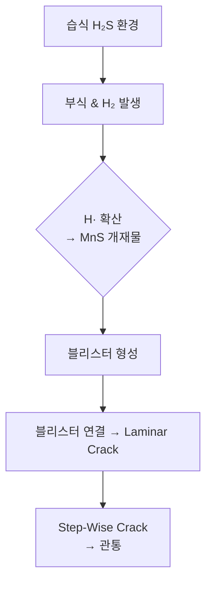

> **핵심 요약**  
> HIC는 **황화수소(H₂S)가 존재하는 습식 환경**에서 강재 내부로 확산한 수소가 **층상(laminar) 균열**을 만들며,  
> **강재 청정도·환경 제어·응력 관리**가 예방의 열쇠입니다.

---

## 1️⃣ HIC란 무엇인가?

- **정의**  
  수소 원자가 강재 내부의 비금속 개재물(주로 MnS) 주변에서 응집·재결합해 **내부 압력**을 일으키며 *층상 균열*을 형성하는 손상 메커니즘
- **발생 단계**  
  1. 개별 수소 블리스터(Blister)  
  2. 블리스터 상호 연결  
  3. *Step-Wise Cracking* (SWC)  
  4. 두께 관통 균열
- **주요 평가 기준**  
  - **NACE TM0284** — HIC 저항성 시험법  
  - **API RP 571** — 정유·석유화학 설비 손상 메커니즘 가이드

---

## 2️⃣ 발생 메커니즘

1. **음극 반응:** H⁺ + e⁻ → H·
2. **확산·트랩핑:** 수소 원자 → 개재물·밴드 주변 포집
3. **재결합:** n H· → H₂ ↑ → 국부 팽창 → 균열 생성

------

## 3️⃣ 취약 재질 & 영향 인자

| 구분        | 영향 요인                 | 설명                         |
| ----------- | ------------------------- | ---------------------------- |
| 강재 청정도 | S, P ↑ / MnS 밴드         | 개재물·밴딩이 수소 트랩 역할 |
| 화학 조성   | 저 C, Ni·Mo ↑             | 수소 확산 억제(양면 효과)    |
| 조직 상태   | 밴디드 조직               | Ferrite-Pearlite 밴드 → 취약 |
| 환경        | **H₂S 농도, pH < 5, Cl⁻** | 황화막 형성 → 음극 반응 촉진 |
| 온도        | 20 – 90 ℃                 | 확산 속도·전기화학 반응 최적 |
| 응력        | 잔류·외부 응력            | SWC 전파 가속                |

> **SSC**(황화 응력부식 균열)는 고응력이 필수이지만 **HIC**는 *무응력* 상태에서도 발생할 수 있습니다.

------

## 4️⃣ HIC · SSC · SOHIC 비교

| 구분      | HIC            | SSC            | SOHIC           |
| --------- | -------------- | -------------- | --------------- |
| 응력 필요 | 거의 없음      | YS × 0.75 이상 | 변형 응력       |
| 균열 방향 | 압연 방향 평행 | 응력 직각      | 응력 방향(Z)    |
| 형상      | Laminar        | Trans-granular | Stacked ladder  |
| 재질      | CS, 저합금강   | CS, ≤ 110 ksi  | 두께↑ 고강도강  |
| 시험      | NACE TM0284    | NACE TM0177    | API RP 571 부록 |

------

## 5️⃣ 평가 · 검사 방법

| 방법                    | 특징                            | 적용 단계      |
| ----------------------- | ------------------------------- | -------------- |
| **NACE TM0284**         | HIC 저항성 정량화 (CLR, CTR 등) | 자재 선정      |
| **UT** (PAUT)           | Laminar/SWC 탐지                | 운전 중        |
| **디지털 X-선**         | 블리스터 체적 파악              | 초도 검사      |
| **AET**                 | 균열 성장 실시간 감시           | 고위험 설비    |
| **Hydrogen Flux Probe** | 내부 수소 활동량 계측           | 조건 기반 정비 |

------

## 6️⃣ 예방 및 완화 전략

### 설계·재질 단계

1. **HIC Resistant Steel** — S ≤ 0.002 %, Ca 처리, CE < 0.40
2. **클래딩/라이닝** — 316L, Ti 등 CRA clad
3. **두께 최적화** — Laminar crack 길이 제한

### 운전 단계

- **H₂S 농도 관리** (< 50 ppmv 권장)
- **탈황·Inhibitor** 투입으로 환경 완화
- **PWHT** : 잔류응력 저감(SOHIC 예방)
- **급가동/급정지 최소화** — 수소 포화 완화

### 검사·모니터링

- **RBI 주기** : 3 ~ 5 년
- **Base-Line UT + 주기적 PAUT**
- **두께·균열 DB** → 트렌드 분석

> 📌 **관련 글** : [Caustic SCC 메커니즘 알아보기]({{ site.baseurl }}/piping/Corrosion-Caustic/)

------

## 7️⃣ 실제 사례

| 설비                      | 사건 개요             | 원인 분석                       | 교훈                      |
| ------------------------- | --------------------- | ------------------------------- | ------------------------- |
| 원유 탈황 압력용기 (중동) | 하부 Laminar → Leak   | 고 S 강판, pH 3.8, H₂S 150 ppmv | TM0284 기준 미준수        |
| API 5L-X60 파이프 (북미)  | 8 년 후 1.8 km SWC    | RE값 미관리, PWHT 없음          | PWHT·RE 관리 필요         |
| Flash Drum (국내)         | 2 년 운전 후 HIC 검출 | 탈황 설비 트러블 → H₂S 급상승   | H₂S 센서·Inhibitor 자동화 |

------

## 8️⃣ 디자인·운영 체크리스트

-  자재사 **TM0284** 성적서( CLR, CTR ) 검증
-  **API RP 571** 설계 가이드 적용 여부 확인
-  WPS Essential Variable 에 PWHT 기록
-  H₂S·pH 실시간 모니터링 & 알람
-  RBI 재평가(3/5 yr) 이행
-  두께·균열 데이터 → 디지털 DB 연동

------

## 참고 문헌

1. NACE TM0284-2011, *Evaluation of Pipeline and Pressure-Vessel Steels for Resistance to Hydrogen-Induced Cracking*
2. API RP 571 (3rd Ed., 2020), *Damage Mechanisms Affecting Fixed Equipment in the Refining Industry*
3. ISO 15156 / NACE MR0175, *Materials for Use in H₂S-Containing Environments*
4. EFC Pub. 16, *Guidelines on the Avoidance of Hydrogen Damage*
