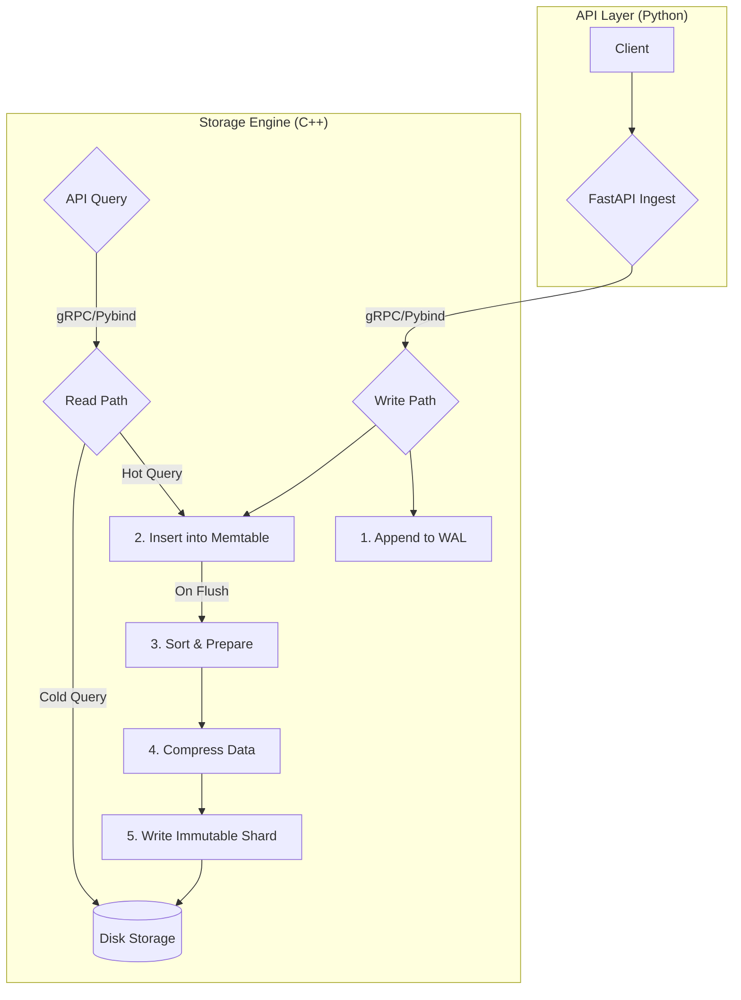

## A Curiosity-Driven Deep Dive Inspired by Real-World Bottlenecks

For the past few years, my work has revolved around projects that deal heavily with time-series data—everything from performance metrics pipelines to large-scale scientific computing workloads. During my contributions as a Google Summer of Code student with CERN-HSF, I worked with massive streams of timestamped detector readings and system monitoring signals. To give an idea, the LHC (Large Hadron Collider at CERN) produces around 40 million collision events per second, each generating large amounts of numeric data. So for such cases efficient storage and fast retrieval aren’t just “nice to have”, in the current scenario they’re essential.

A single theme became painfully clear: traditional relational databases are not architected for the unique demands of time-series data.

While fantastic for transactional integrity and relational consistency, databases like PostgreSQL and MySQL begin to struggle under the firehose of millions of data points per second. The core issues are fundamental:

- **Row-based storage** creates significant I/O overhead
- **B-tree indexes**, optimized for cardinality, are inefficient for sequential time-based scans
- **Protocol overhead** for single-point ingestion becomes a major bottleneck

After navigating these limitations on several projects, my frustration eventually transformed into a technical curiosity: **What if I built a specialized time-series database myself?**

Not out of necessity, I mean, I obviously could have used a renowned time-series database, but out of a desire to truly understand the first principles of high-performance data storage and to make sure that I can efficiently build it for general-purpose time-series data. That decision led me to build Insight-TSDB: a C++17 time-series storage engine wrapped with a FastAPI interface, featuring custom compression algorithms and a log-structured design.

This is a technical write-up of that journey.

---

## 🚀 Core Engineering Goals

My objective was not to build the next InfluxDB, but to gain a deep, practical understanding of key database internals:

- How do storage systems handle high-frequency, append-only writes?
- How can a write path be designed for both high throughput and durability?
- How do specialized compression algorithms exploit patterns in time-series data?
- Why are Log-Structured Merge-Trees (LSM-trees) the dominant architecture for modern write-heavy systems?
- How can data be laid out on disk to optimize for fast, sequential scans over time ranges?

This project became the perfect playground to explore these questions.

---

## ⚙️ High-Level Architecture

At its core, Insight-TSDB is a lightweight but performant time-series engine built from scratch.

- **Custom C++17 Storage Engine:** Optimized for numerical time-series data
- **Specialized Compression:** Implements Delta-of-Delta for timestamps and XOR encoding for floating-point values
- **LSM-Tree Design:** A log-structured merge-tree architecture for high-speed ingestion
- **FastAPI Interface:** A clean, asynchronous REST API for easy interaction
- **Containerized:** Packaged with Docker for portability and reproducible builds

The internal design follows the classic LSM-tree style, which transforms random write I/O into highly efficient sequential I/O. Here is how data flows through the system:

### Data Flow Breakdown

**Ingestion**: A new data point arrives via the FastAPI endpoint.

**Durable Logging (WAL)**: To guarantee crash-safety, the point is immediately appended to a Write-Ahead Log on disk.

**Memtable (RAM)**: Simultaneously, it is inserted into an in-memory sorted data structure (a `std::map` in this implementation) for fast querying of recent data.

**Flush & Compress**: When the memtable reaches a size threshold, its contents are sorted, compressed, and written to disk as an immutable, time-sharded binary file (a "shard"). This is the key step that converts random writes into a single, sequential write operation.

---

## 🔬 Custom Compression: A 50% Improvement

Time-series data is highly predictable. Timestamps increment at semi-regular intervals, and values often change gradually. To exploit this, I implemented two well-known algorithms from scratch:

### Delta-of-Delta Encoding (Timestamps)

This algorithm calculates the difference between differences. For timestamps arriving at a steady rate, this reduces the value to a very small integer that can be stored in just a few bits—a massive saving over a full 64-bit timestamp.

### XOR Encoding (Values)

Based on the approach detailed in the Gorilla paper, this stores only the XOR of consecutive floating-point values. If values change slowly, the leading bits are mostly zeroes, allowing for excellent compression.

The result of this low-level, bit-level optimization was a storage efficiency of approximately **8.2 bytes per data point**—a 50% improvement over storing uncompressed 16-byte timestamp/value pairs.

---

## ⚡ Performance Benchmarks

The engine was benchmarked on a personal machine running WSL2 to provide a clear performance baseline.

### Test Environment

- **CPU**: 12th Gen Intel(R) Core(TM) i7-12700H
- **RAM**: 16 GB DDR5
- **Storage**: NVMe SSD Gen 4

### Results

| Metric | Result | Notes |
|--------|--------|-------|
| Storage Efficiency | ~8.2 bytes/point | A 50% reduction via custom compression |
| Hot Query Latency (p99) | ~1.3 ms | Data served directly from the in-memory Memtable |
| Cold Query Latency (p99) | ~16 ms | Single-threaded sequential scan of a compressed disk shard |
| Ingestion Throughput | ~5,500 points/sec | Currently limited by single-point file I/O in the WAL |

Achieving sub-16ms query latency over millions of points from a system I built from first principles was a profoundly rewarding experience.

---

## 🌱 Key Learnings

There are a lot of things I learned, and I also realized that before this project there were many parts of software engineering I simply didn’t know or fully understand.

**Databases are a study in trade-offs**: Durability vs. speed, compression vs. CPU overhead, RAM vs. disk. Every decision has a cost.

**LSM-trees are an elegant solution to write amplification**: Building one reveals why they are the foundation of so many modern storage systems.

**Implementation does lead to a through understanding**: Reading about a database and building one are entirely different universes of comprehension.

**Building this database was a long and difficult journey**, but it gave me a glimpse into what the engineers behind renowned time-series databases must have gone through. It made me appreciate their work at a much deeper level.

**It also showed me why C++ is used in so many time- and space-efficient systems**: When you’re controlling memory layouts, compression paths, and I/O behavior, the language gives you the precision and low-level access you need.

And in the end, this project reminded me *why* I started it: partly out of curiosity, and partly to attempt building a general-purpose time-series database that I could use in my own future projects — something efficient, something I fully understand, and something I can keep improving.

---

## 📚 Full Source Code

You can find the full source code and more detailed documentation on the official GitHub repository:

👉 [KaranSinghDev/Time-Series-Database-Engine](https://github.com/KaranSinghDev/Time-Series-Database-Engine)

Cheers!
