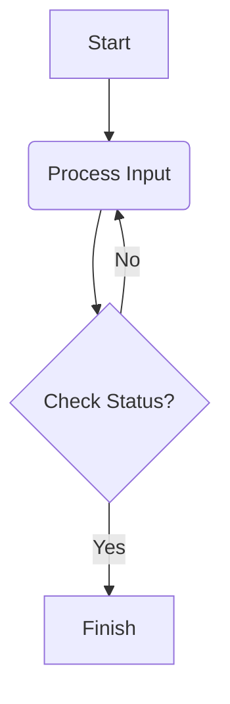

## My Sample Diagram

Here is a simple **flowchart**:

### Steps to generate using _minimal mistakes_ theme
1.  Add the following codes to the custom.html under root/head folder (if not present, create it).
>
    
    
    
    

2. Diplay desired multi-media
  1. Image  
  2. Youtube
  3. Audio