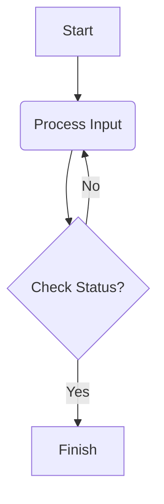

# Main heading - Parabola

**Introduction** about the topic and link to images if needed 
>"I heave the basketball; I know it sails in a parabola, exhibiting perfect symmetry, which is interrupted by the basket. It's funny, but it is always interrupted by the basket." ~ Michael Jordan

** Steps to use mathjax** in jekyll
---
1. Add `mathjax: true` to the page (local to the page) or  _config.yml file (if you want globally) of the minimal mistakes theme.
2. Add the content to the markdown file
3. Create a file to the root _includes/head/custom.html with following content






>




This is how the **formula** is rendered 
\$$\frac{4}{9} \left( 17 - 8\cos(2\sqrt{3}) \right)$$
by using mathjax-minimal-mistakes theme as opposed to below format

<pre>\frac{4}{9} \left( 17 - 8\cos(2\sqrt{3}) \right)</pre>

## My Sample Diagram

Here is a simple **flowchart**:

_follow this_ [link!](https://vijayakumarcnp.github.io/know-how/bomonike-aibenchmark/) if you want maths formulas to be displayed in your content

erDiagram
          CUSTOMER }|..|{ DELIVERY-ADDRESS : has
          CUSTOMER ||--o{ ORDER : places
          CUSTOMER ||--o{ INVOICE : "liable for"
          DELIVERY-ADDRESS ||--o{ ORDER : receives
          INVOICE ||--|{ ORDER : covers
          ORDER ||--|{ ORDER-ITEM : includes
          PRODUCT-CATEGORY ||--|{ PRODUCT : contains
          PRODUCT ||--o{ ORDER-ITEM : "ordered in"

Enter the link name which you want to [Reference] in the template and mention its path in in the below name .If you have questions, you can email @ vijayakumar_cnp@yahoo.co.in.

[Reference]: https://vijayakumarcnp.github.io/