취약점 진단은 어러가지 분야가 있다.

웹 해킹 

모바일 해킹

외부에 묶어져있는 여러가지(인프라 진단, 내부 모의해킹)

-> 서버, DB, 보안장비, WAS 들은 직접적으로 내부 네트워크에 접속이 되지 않기에  별도의 **인프라 진단이**라는 것을 이용해서 진단한다.

모의해킹쪽에서도 인프라 진단을 하기 위해서 공격자가 공격을 하는 시나리오로 진단을 함. 

목표 

모의 해킹 관점에서 인프라에 접속하기 위해 

외부에서 -> 해커의 입장에서 내부 인프라의 보안설정을 살펴 취약점을 진단한다. 

이 취약점을 확인하기 위해 사용하는 도구는 Nessus로 한다.

#취약점 진단 개요

1. Server-Cilent 구조로 **취약점 점검을 하는 서버**와 **취약점 점검 설정과 결과물을 재공하는 클라이언트**로 구성됨

2. 플러그인으로 자세한 부분까지 점검이 가능하고 개발사는 매주 플러그인을 계속해서 만들어 내고 있음

3. 스캔의 결과는 XML, HTML, PDF등 다양한 포맷의 형태로 리포팅 제공
   
   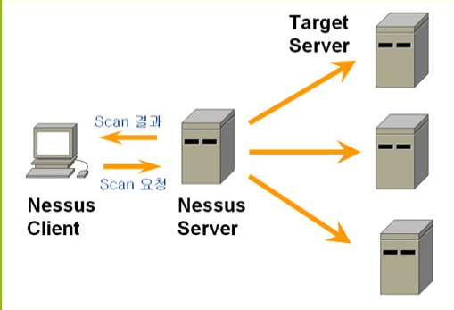

[Nessus를 활용한 점검](https://boanchanggo.tistory.com/14)

클라이언트 설치와 동시에 Nessus서버도 동시에 설치가되는 구조이다. 

서버에 스케줄링, 진단 보고서를 받아 볼 수 있다.
진단할 대상들이 많이에 다양한 플러그인 지원한다. 

  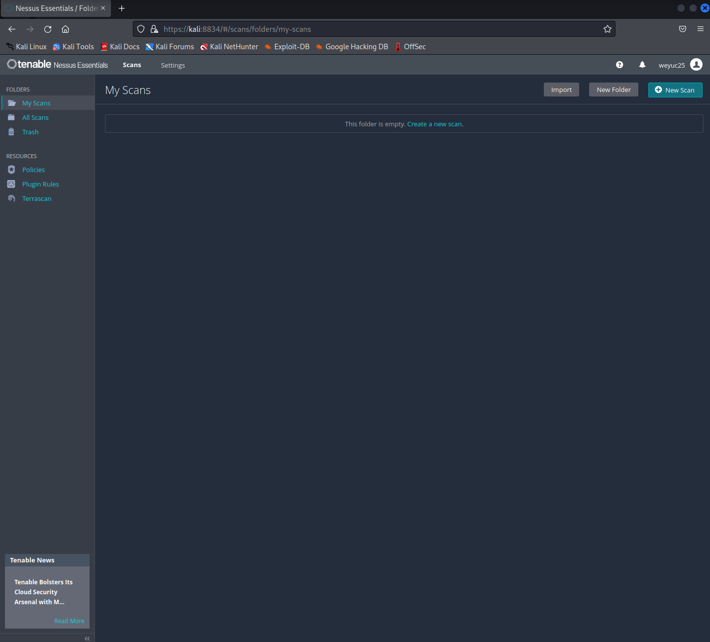

"New Scan" -> Advanced Scan -> 

###BASIC

####General

대상 작성 (대량의 대상이 있는 경우 -> Add File 텍스트 파일)

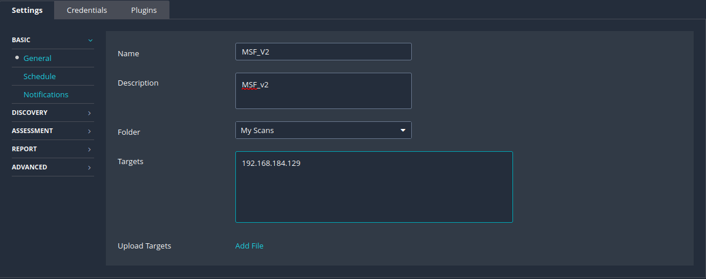

####Schedule 

서버에 특정한 스케줄을 정한다. 

####Notifications

결과 값들을 담당자들에게 리포트 형식으로 보낸다.

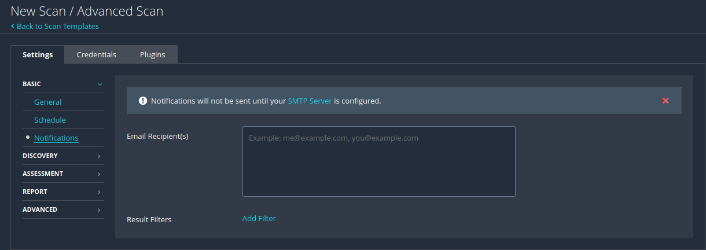

###DISCOVERY

####Hos Discovery

타갯으로 하는 호스트가 살아있는지 Ping 보냄. 

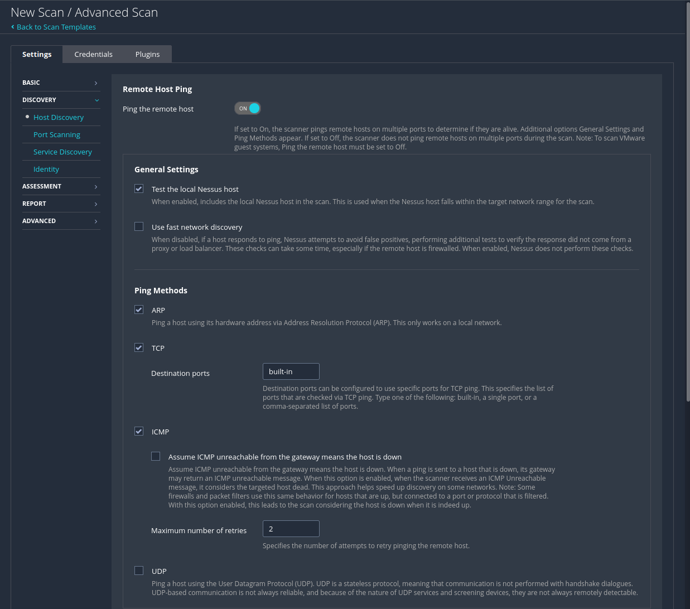

UDP

어떤서버들의 동작여부와 다양한 로고들을 일방적으로 보냄(시간이 많이 소요됨)

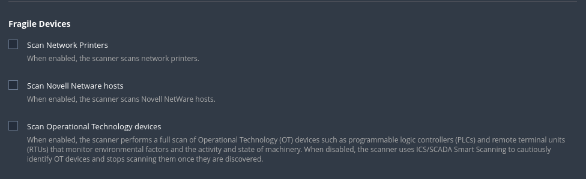

내부적으로 사용하는 IP 대역에 프린터를 연결하고 연결된 곳을 이용해서 각각 부서별 프린트한다.

문제 프린트 연결의 문제 관리자 페이지의 접근이 바로된다면 공격자의 입장에서 프린트 내부 네트워크의 접근이 쉽다. (산업기반 스캔) 

####Port Scanning

어느 대역 어떤 방식으로 할것인지에 대해 선택

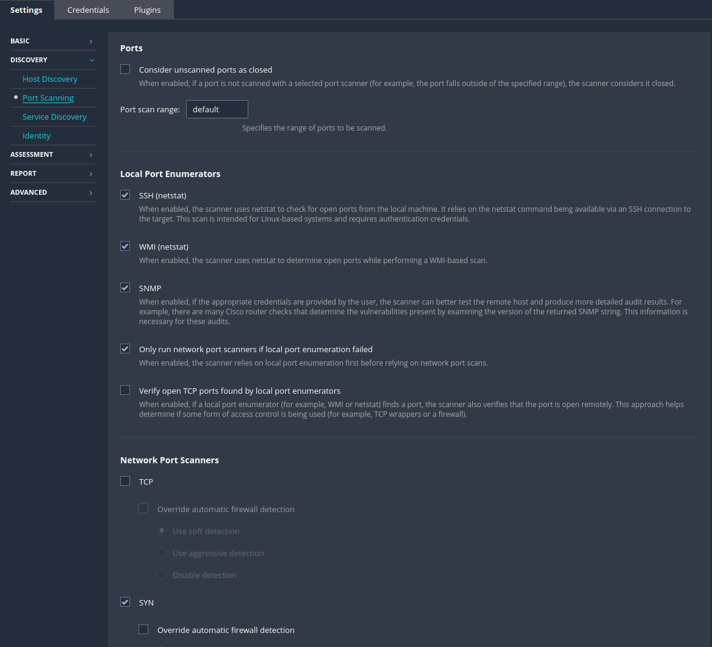

####Service Discovery

딱히 건들건 없다.

###ASSESSMSNT

####General

####Brute Force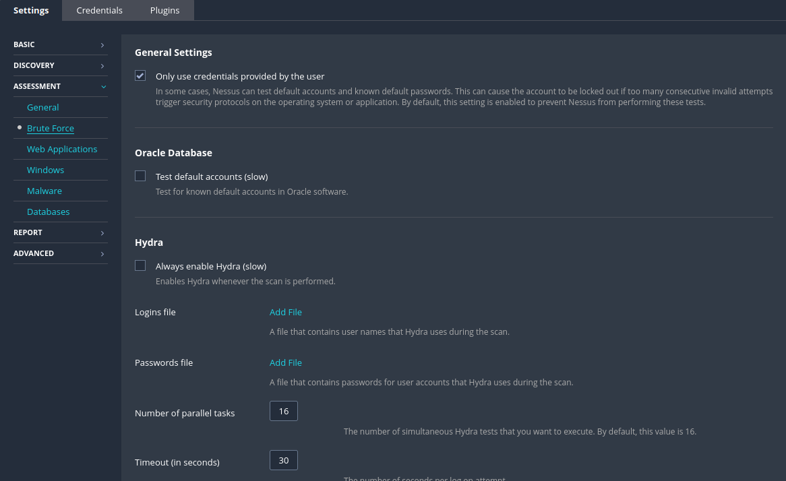

ssh, Telnet, ftp등 Brute Force 공격을 진행할 시 사전파일의 량이 많을떄 사용한다.

####Wed Applications

그닥 좋지 않아 별도의 도구 사용 

####Windows

윈도우 환경에 관련된 점검한다

####Malware

####Databases

###REPRT

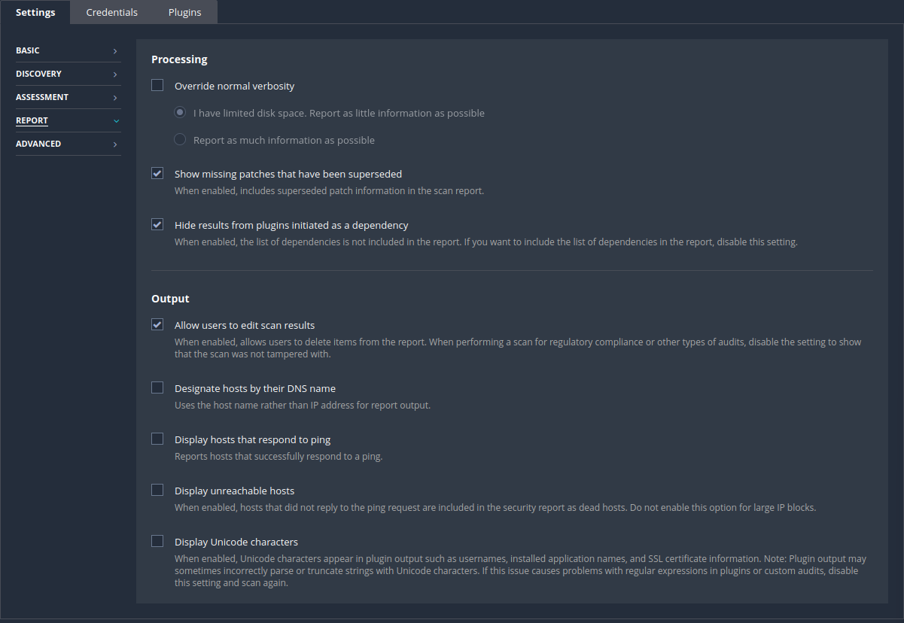

다양한 종류의 레포트 생성해준다.

SAVE한뒤 모

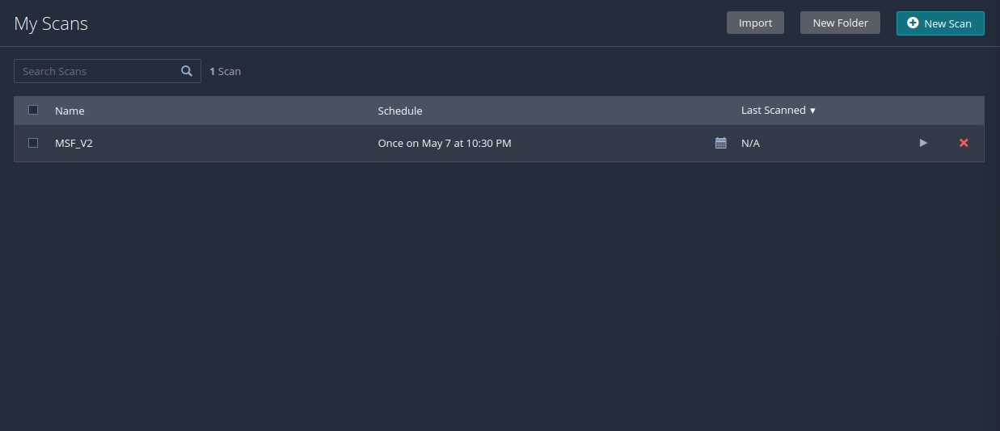

Launch 버튼을 눌려서 실행한다. 

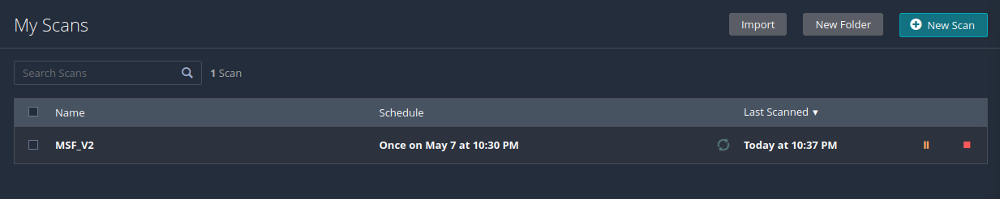

통신이 제대로된다면 정상 작동한다.  

윈도우즈는 방화벽을 내리지 않는다면 Ping이 제대로 가지 않는다.(점검이 힘)

스캔이 끝난 뒤 취약점을 확인할 수 있다.

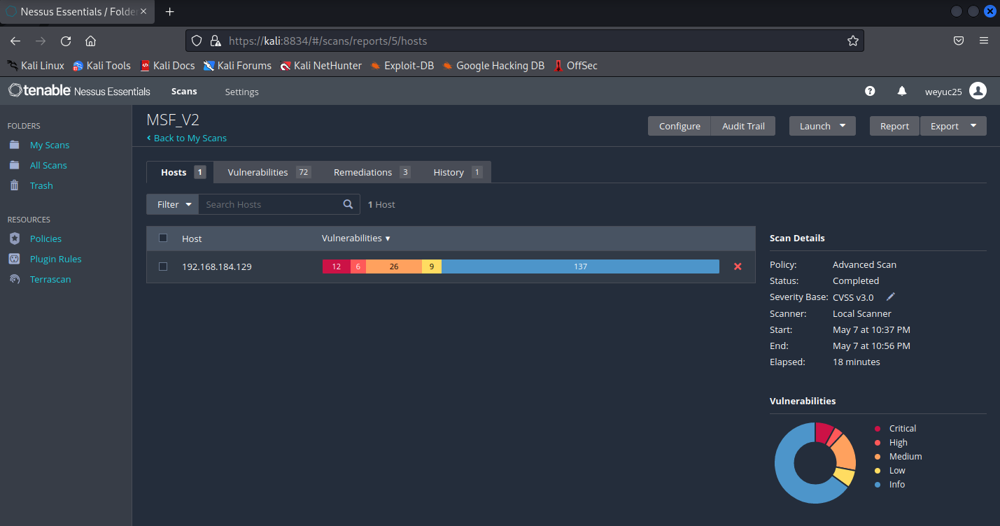

취약점을 클릭하면 어떠한 취약점이 있는지 볼 수 있다.

이러한 취약점을 확인한다.

MIXED 항목을 클릭을 해보면 

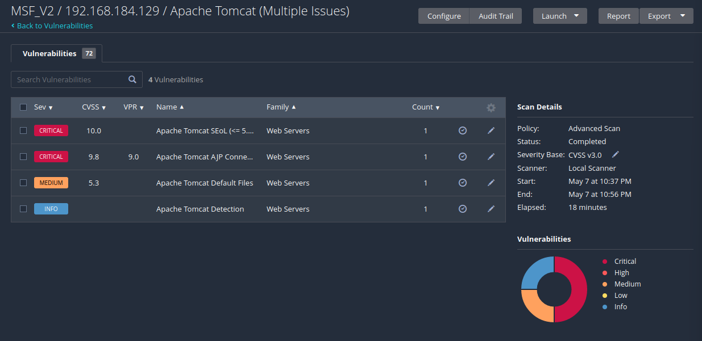

ex: Apache Tomcat의 취약점들을 확인할 수 있다. 

##실습   

###VNC Password 취약점을 이용한다.

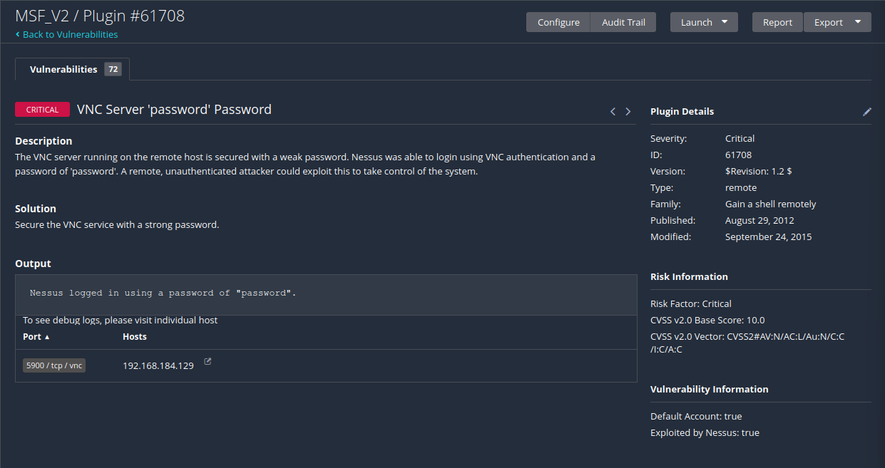

password를 입력하면 연결이된다.

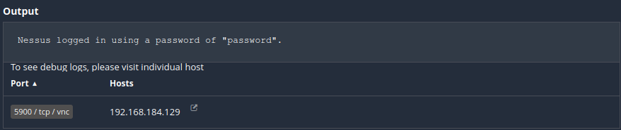

tcp vnc로 연결 하기 위해 

칼리리눅스에 sudo vncviewer [ip] 입력

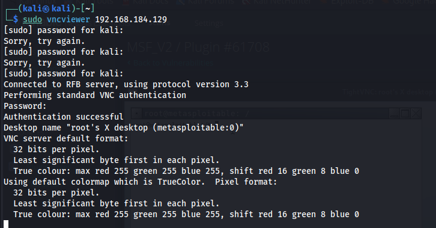

metasploitable의 접속하였고, id 명령어를 입력하여 root 계정으로 로그인된 모습이다.

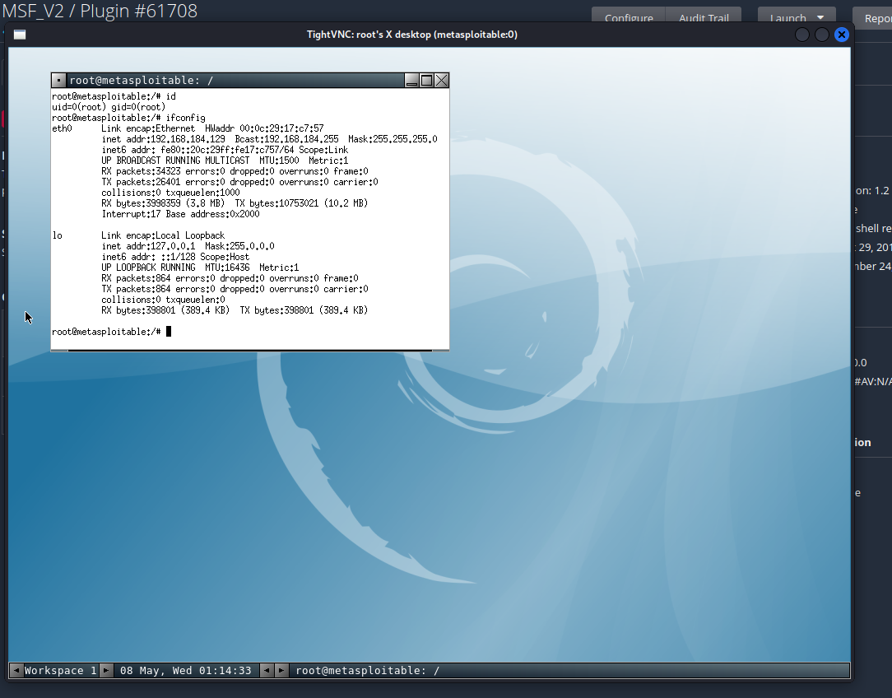

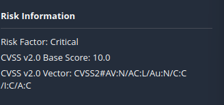

엄청 중요하다.
