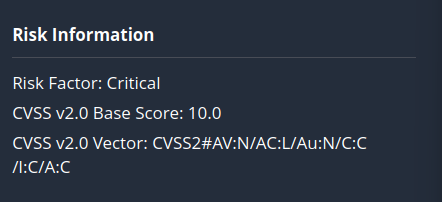
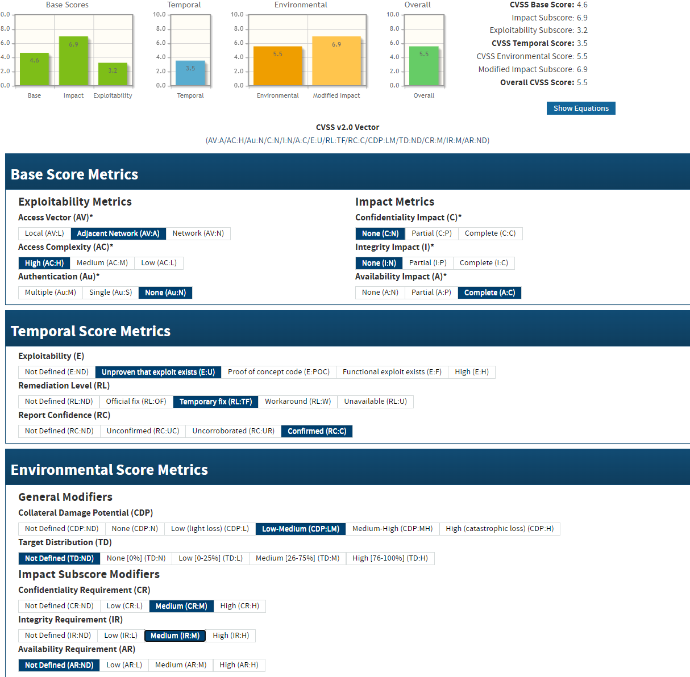
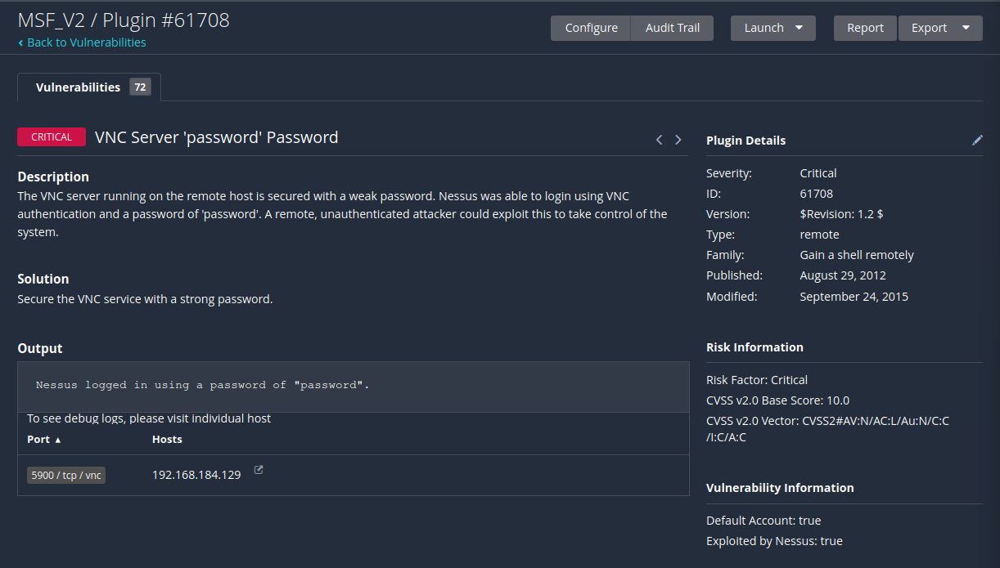
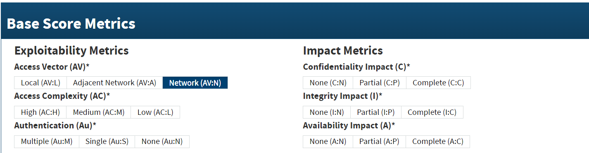

#CVSS란?

##CVSS

**공통 취약점 등급 시스템**(Common Vulnerability Scoring System)이라는 뜻

**컴퓨터 시스템의 보안 취약점을 평가하고 등급을 매기는 프레임워크이다**.

CVSS는 취약점의 중요도를 정량적으로 측정하고 이를 **0에서 10까지의 숫자로 표현**합니다. (높은 점수는 더 심각한 취약점을 의미한다.)

CVSS 계산기는 취약점의 주요 특성을 포착하고, 그 심각도를 반영하는 숫자 점수를 생성한다. 그런 다음, 이 숫자 점수를 정성적 표현 (예: 낮음, 중간, 높음 및 중요)으로 변환하여 조직이 취약성 관리 프로세스를 적절하게 평가하고 우선 순위를 지정할 수 있다.

CVSS는 다음과 같은 메트릭으로 구성된다.

- 공격 벡터(Attack Vector, AV)

공격이 발생할 수 있는 경로를 나타냅니다. 

원격으로 악용될 수 있는 취약점에 가장 높은 점수가, 물리적으로 접근해야만 악용 가능한 취약점에 가장 낮은 점수가 부여된다.

- 공격 복잡성(Attack Complexity, AC)

공격을 성공적으로 수행하기 위해 필요한 추가 조건이나 복잡성을 나타낸다.

- 필요한 권한(Privileges Required, PR) 

공격을 성공적으로 수행하기 위해 공격자가 **어떤 수준의 권한이 필요한지**를 나타낸다.

- 사용자 상호작용(User Interaction, UI)

취약점을 악용하기 위해 대상 시스템의 사용자 **상호작용이 필요한지 아닌지를 나타낸다**.

- 범위(Scope, S)

취약점이 악용됐을 때 영향을 받는 컴포넌트의 범위를 나타냅니다1.

- 영향(Impact)

취약점이 시스템이나 데이터에 미치는 영향을 평가하는 메트릭을 의미한다.

이번 실습에는 VNC Server 'password' Password의 CVSS의 예로 설명한다.

    

CVSS2#....은 CVSS의 버전 2이며, CVSS v2.0 Base Score: 10.0(10.0이 만점이다.)

[NVD - CVSS v2.0 Calculator](https://nvd.nist.gov/vuln-metrics/cvss/v2-calculator)[NVD - CVSS v2.0 Calculator](https://nvd.nist.gov/vuln-metrics/cvss/v2-calculator)

해당 사이트에서 계산을 한뒤 

Nessus에 Risk Information의 점수를 표시한다.

##cvss v2 사이트에 대해 자세히 알아보자.

#**Base Score Metrics**

###**Access Vector (AV)접근성**

Network(AV:N)

누구나 접속할 수 있는 웹서버 대역에서 취약점을 발견하게됬다.(웹 해킹, 디도스 공격이 해당)

Adjacet Network(AV:A)

제안된 네트워크 (내부 네트워크) 외부에선 들어오진 못함.

Nessus, Telnet, ftp에서 발생한 취약점.(특정 임직원이 있는 곳에서만 일어난다.)

###**Access Complexity (AC)**

Local(AV:L)

네트워크가 완전히 망분리가 된 상태 네트워크가 연결x(악성코드가 USB등 으로 유입이될 상황 등등 )(관리가 되지 않아 패치가 노후화 사용자 권한에서 어떤 특정한 공격코드로 인해서 관리자권한으로 상승할 수 있는 공격의 취약점이 있냐 없냐)

###Authentication (Au)

인증과정 없이 접근할 수 있는 취약점이냐  

None(Au:N)

아무나 들어와서 공격을 할 수 있는 수준

Single(Au:S)

허용된 사용자, 회원가입과 일반사용자의 인증을 거친 뒤에 공격을할 수 있는  수준

Multiple(Au:M)

멀티인증 아이티 + 비밀번호 인증과 또 다른 인증을 필요로 하는 수준(OTP, 공인인증서, 인증서, 전화인증) 

###**Impact Metrics**

보안 3대 요소 

Confidentiality Impact (C)

취약점을 악용할 경우 시스템의 데이터 보안에 어떤 영향을 미칠 수 있는지를 나타낸다. 이 메트릭은 공격자가 민감한 정보에 접근할 수 있는지, 정보를 유출할 수 있는지 등을 평가한다. 즉, 이 메트릭은 공격자가 취약점을 이용하여 시스템의 기밀성을 얼마나 침해할 수 있는지를 나타내는 지표이다.

개인정보, 중요 정보 어느정보 유출이되었느냐.

Integrity Impact (I) 무결성

취약점을 악용할 경우 시스템의 데이터 또는 기능이 어떻게 변경될 수 있는지를 평가하는 메트릭이다. 

예를 들어, 공격자가 데이터를 수정하거나 삭제할 수 있는지, 시스템의 정상적인 작동을 방해할 수 있는지 등이 이에 해당한다. 즉, 이 메트릭은 공격자가 취약점을 이용하여 시스템의 무결성을 얼마나 침해할 수 있는지를 나타내는 지표이다.

시스템을 침투을 하면 그 공격자가 시스템을 망가트릴수있는다.(악성코드 변조) 

Availability Impact (A) 가용성

취약점을 악용할 경우 시스템의 가용성에 어떤 영향을 미칠 수 있는지를 평가하는 메트릭이다. 

예를 들어, 공격자가 서비스 거부 공격을 수행하여 시스템을 사용 불가능하게 만들 수 있는지, 시스템 자원을 과도하게 소모시켜 성능을 저하시킬 수 있는지 등이 여기에 포함된다. 즉, 이 메트릭은 공격자가 취약점을 이용하여 시스템의 가용성을 얼마나 침해할 수 있는지를 나타내는 지표이다.

디도스 공격 

# 

[CVSS란 무엇인가?: 컴퓨터 보안 취약점 평가에 대한 이해와 활용 (tistory.com)](https://healthierusd.tistory.com/86)

[CVSS v3 취약점 등급 시스템에 대해서 알아보자_01 : 네이버 블로그 (naver.com)[IBM Documentation](https://www.ibm.com/docs/ko/qradar-on-cloud?topic=vulnerabilities-common-vulnerability-scoring-system-cvss)](https://m.blog.naver.com/ttong_ji/223202825442)

https://www.ibm.com/docs/ko/qradar-on-cloud?topic=vulnerabilities-common-vulnerability-scoring-system-cvss
