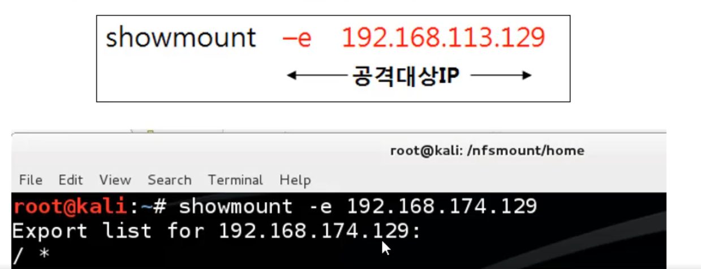

# NFS란

 <mark>NFS(Network File System)</mark>

네트워크를 통해 파일을 공유하고 접근할 수 있게 해주는 프로토콜입니다. 

이 시스템은 한 컴퓨터에서 다른 컴퓨터의 파일을 마치 자신의 컴퓨터에 있는 것처럼 사용할 수 있게 해줍니다.

NFS는 서버-클라이언트 모델을 사용합니다. 서버는 파일을 공유하며, 클라이언트는 서버에 연결하여 해당 파일을 접근하거나 업로드할 수 있습니다.

(파티션를 공유해서 원격에서도 공유된 파티션를 마치 로컬 파티션처럼 사용할 수 있는 기능,

NFS Export는 다른 서버의 파티션을 로컬에 연결하여 사용) 

<mark>NFS의 주요 특징</mark>

**플랫폼 독립성**

NFS는 다양한 운영 체제에서 사용할 수 있습니다. 이로 인해 서로 다른 운영 체제를 가진 컴퓨터 간에도 파일을 공유할 수 있습니다.

<mark>로컬 파일 시스템처럼 사용</mark>

NFS를 통해 공유된 파일은 마치 로컬 파일 시스템에 있는 것처럼 사용할 수 있습니다. 이는 사용자가 네트워크를 통해 파일을 접근하고 조작하는 것을 쉽게 해줍니다.

<mark>네트워크 투명성</mark>

사용자는 파일이 어디에 있는지, 어떤 네트워크 경로를 통해 접근되는지 알 필요가 없습니다. NFS는 이러한 세부 사항을 추상화하여 사용자에게 투명한 파일 공유 환경을 제공합니다.
**NFS를 설정하려면 **

1. 먼저 NFS 서버 패키지를 설치해야 합니다. 

2. 그런 다음, /etc/exports 파일을 수정하여 공유할 디렉토리와 그 디렉토리에 접근할 수 있는 클라이언트를 설정합니다. 

3. 설정이 완료되면, 클라이언트는 NFS 서버에 연결하여 파일을 접근하거나 업로드할 수 있습니다.

---

[How to configure NFS on Linux - Linux Tutorials - Learn Linux Configuration](https://linuxconfig.org/how-to-configure-nfs-on-linux)

[NFS Unbound: Beginner's guide | gamepressure.com](https://www.gamepressure.com/need-for-speed-unbound/beginners-guide/zf106f2)
