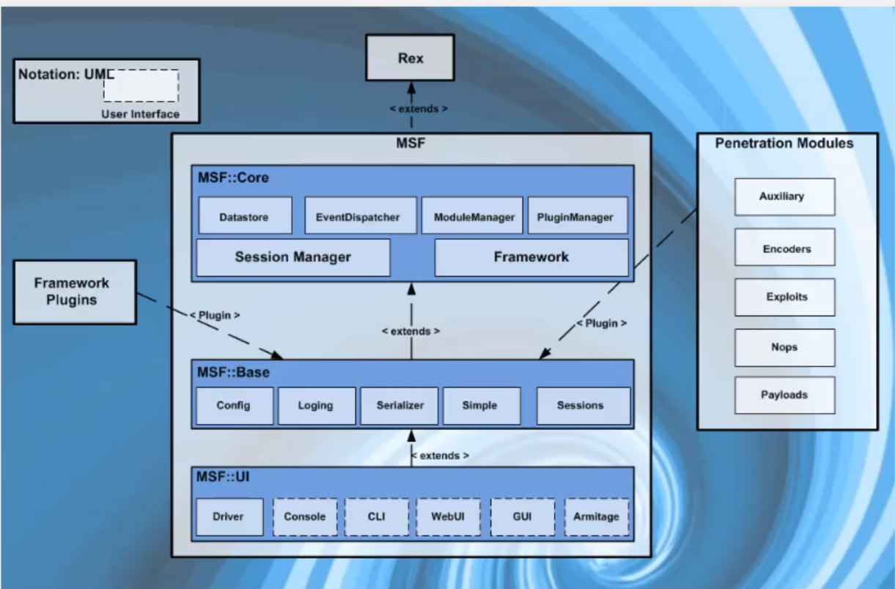
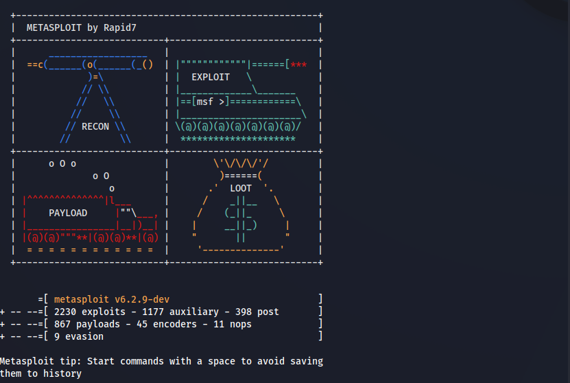
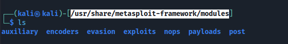
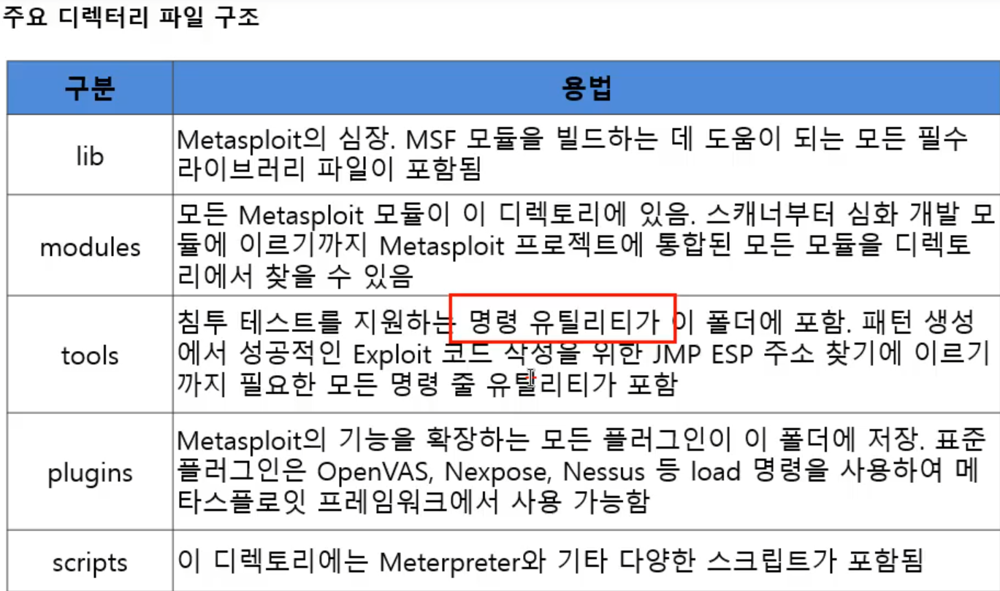

# **Metasploit란?**

컴퓨터 시스템의 보안 취약점을 테스트하고 공격하는 데 사용되는 강력한 도구입니다. 

이 도구는 보안 전문가들이 컴퓨터 시스템, 네트워크, 애플리케이션에 대한 공격을 시뮬레이션하는 데 사용됩니다.

페네트레이션 테스팅 프레임워크라고도 불립니다. 이는 공격자가 타겟을 지정하고, 어떤 취약점을 공격할지, 어떤 페이로드를 사용할지 선택하고, 실행 버튼을 누르는 것만으로도 공격을 수행할 수 있게 해주는 도구입니다.

#### **Metasploit을 사용하기 위한 기본적인 단계**

**<mark>msfdb init </mark>**

Metasploit에서 사용하는 데이터베이스를 설정하고 시작하는 데 사용됩니다. 

Metasploit은 타겟 정보, 익스플로잇, 그 외의 정보를 저장하기 위해 데이터베이스를 사용합니다.

msfdb init 명령어는 이 데이터베이스를 초기화하고 시작하는 역할을 합니다. 비전공자에게 이해하기 쉽게 설명하면, 이 명령어는 Metasploit이 정보를 저장하고 관리할 수 있도록 '서랍장’을 준비하는 것과 같습니다.

**<mark>service postgresql start</mark>**

PostgreSQL 데이터베이스 서버를 시작하는 데 사용됩니다. 

Metasploit은 PostgreSQL 데이터베이스를 사용하여 정보를 저장하고 관리합니다. 따라서 Metasploit을 사용하기 전에 PostgreSQL 서비스를 먼저 시작해야 합니다. 비전공자에게 이해하기 쉽게 설명하면, 이 명령어는 Metasploit이 '서랍장’을 열 수 있도록 '열쇠’를 제공하는 것과 같습니다.

**<mark>msfconsole</mark>**

Metasploit의 주요 인터페이스인 MSFconsole을 시작하는 데 사용됩니다. 

MSFconsole은 명령 줄 인터페이스로, 여기에서 타겟을 스캔하거나 취약점을 공격하고 데이터를 수집할 수 있습니다. 비전공자에게 이해하기 쉽게 설명하면, 이 명령어는 Metasploit의 '조종실’을 열어주는 것과 같습니다.

먼저 데이터베이스를 설정하고 시작하고(msfdb init), PostgreSQL 서비스를 시작(service postgresql start), 그리고 나서 Metasploit의 주요 인터페이스인 MSFconsole을 엽니다(msfconsole)

   



Metasploit에서는 exploits, auxiliary, post, payloads, encoders, nops, evasion 등의 모듈을 사용합니다.

#### Metasploit의 모듈 기능

**<mark>Exploits </mark>**

특정 취약점을 이용하도록 설계된 코드입니다 . 이 모듈은 타겟 시스템의 취약점을 공격하고, 공격이 성공하면 페이로드를 전달하여 타겟 시스템을 제어합니다.

<mark>**Auxiliary**</mark>

스캔, 정보 수집 등과 같은 **보조 작업을 수행**하는 데 사용됩니다.

이 모듈은 직접적인 공격을 수행하지 않지만, **타겟 시스템에 대한 중요한 정보를 수집하고 제공**하는 데 도움이 됩니다.

**<mark>Post</mark>**

취약점이 성공적으로 공격된 후에 수행되는 작업을 정의합니다. 

이 모듈은 권한 상승, 데이터 추출, 네트워크 내 이동 등과 같은 작업을 수행할 수 있습니다.

<mark>**Payloads**</mark>

공격이 성공한 후에 특정 작업을 수행하는 코드 또는 스크립트를 의미합니다. Payload의 주요 목적은 exploit의 원하는 결과를 제공하는 것으로, **타겟 시스템과의 연결 설정부터 고급 post-exploitation 작업 실행에 이르기까지 다양할 수 있습니다**.

(공격을 하고 난뒤 공격자와 연결을 해줘야한다(세션 맺는다.)이후 추가적으로 계속해서 공격을 해줘아한다. 그러므로 연결을 해주는 역활로 Payloads가 사용됨.)

exploits공격 payloads로 세션을 맺어준다.

<mark>**Encoders**</mark>

**payload를 변조하고 인코딩하는 데 사용됩니다**. 

이는 payload가 **타겟 시스템의 보안 시스템을 우회**하도록 돕습니다.

(백신 우회)

**<mark>Nops</mark>**

No Operation의 약자로, 프로그램 실행을 다음 메모리 주소로 단순히 이동시키는 명령입니다. Nops는 메모리 주소에서 원하는 위치에 도달하기 위해 사용됩니다.

(더 안정적으로 사용하고 싶다.)

**<mark>Evasion</mark>**

Metasploit의 payload가 타겟 시스템의 보안 시스템을 우회하는 데 도움이 됩니다. 이 모듈은 **payload를 변조하여 보안 시스템이 payload를 감지하는 것을 어렵게 만듭니다**.

공격 -> payloads로 세션을 맺어준다.

비전공자에게 이해하기 쉽게 설명하면, Metasploit의 각 모듈은 ‘도구 상자’ 안의 다양한 도구와 같습니다. 각 도구는 특정 작업을 수행하며, 이 작업들이 모여서 컴퓨터 시스템의 보안을 테스트하고 공격하는 데 사용됩니다.

디렉토리 위치

```
cd /usr/share/metasploit-framework/
```

어떠한 서비스에 대해 취약점이 나와 공격 스크립트르 metasploit에서 사용하고 싶을떄 해당 metasploit의 버전업(오류 발생이 높다)

```
cd /usr/share/metasploit-framework/modules
```

로 이동하여 파일을 추가한다. 





modules는 공격파일을 추가할때 사용한다.

plugins는 Auxiliary단계에서 사용한다.

scripts는 post단계에서 사용한다.

---

[What is Metasploit? And how to use this popular hacking tool | CSO Online](https://www.csoonline.com/article/567067/what-is-metasploit-and-how-to-use-this-popular-hacking-tool.html)

[What is Metasploit: Tools, Uses, History, Benefits, and Limitations](https://cybersecuritynews.com/what-is-metasploit/)

[What is Metasploit? The Beginner's Guide](https://www.varonis.com/blog/what-is-metasploit)

[Metasploit을 이용한 모의해킹-3[MSF 인터페이스 및 명령어] : 네이버 블로그](https://m.blog.naver.com/taeyoun795/220639105335)

[메타스플로잇(Metasploit) Msfconsole 사용법 및 활용 / 업데이트](https://t-okk.tistory.com/187)

[Metasploit Framework | Metasploit Documentation](https://docs.rapid7.com/metasploit/msf-overview/)

[msfdb: Database Features &amp; How to Set up a Database for Metasploit · rapid7/metasploit-framework Wiki · GitHub](https://github.com/rapid7/metasploit-framework/wiki/msfdb:-Database-Features-&-How-to-Set-up-a-Database-for-Metasploit/1228443d066fa8b20be55c42b1b0540ff3f09278)

https://medium.com/@JAlblas/exploits-and-payloads-essentials-including-a-metasploit-primer-922660405954
https://www.golinuxcloud.com/exploit-vulnerabilities-using-metasploit/
https://www.jamesparker.dev/how-do-i-use-metasploit-to-exploit-a-vulnerable-system/
https://zsecurity.org/how-to-use-metasploit-auxiliaries/
http://en.wikipedia.org/wiki/Buffer_overflow
