# 실습 목표

#### 포트스캔를 통해 나온 포트들을 Nikto라는 도구로 진단하여 Tomcat의 취약점을 분석한다.

관리자 페이지에 있는 디폴트 계정들을 확인하는 방법과 기타 취약점을 확인하는 방법을 알아보자.

1. 포트스캔
   
   공격 대상인 MSF-2의 IP를 포트스캔을 한다.

```
sudo nmap -sV -T4 192.168.184.129
```

8180포트의 Tomcat 취약점으로 실습한다.

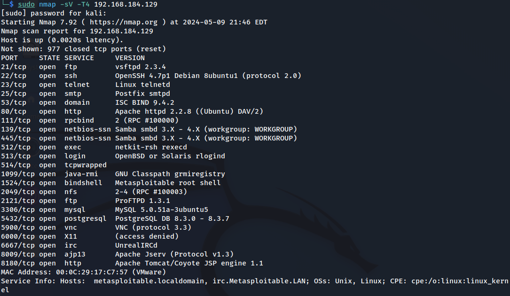

8180/tcp open  http        Apache Tomcat/Coyote JSP engine 1.1 이라는 페이지가 노출되는것으 볼 수 있다.

MSF-2의 Apache Tomcat를 칼리리눅스에 접속을해보자.

```
192.168.184.129:8180
```

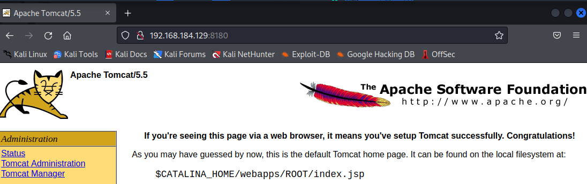

관리자 페이지가 나온다.이런 Apache Tomcat페이지(was서버쪽)

was에서 나온 기본적인 페이지의  노출은  침해사고 대응에 있어서 중요하다.

페스워드를 알아보자.

Tomcat Manager 를 클릭하여 유추해본다.

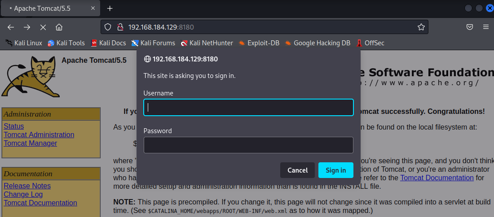

해당 패이지와 관련된 문자들을 사진파일로 만들어 무작위  공격(brute-force attack)

**<mark>tip</mark>**

칼리리눅스는 사전파일 리스트들이 존재한다.

```
locate wordlist
```

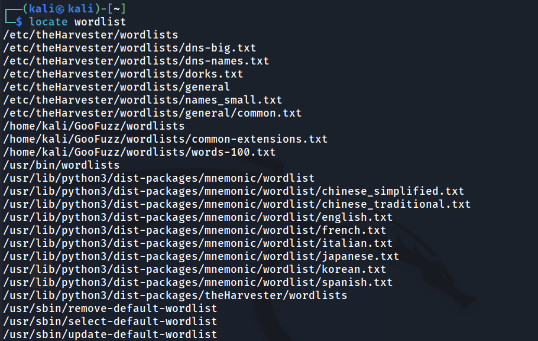

Tomcat의 사전파일들을 찾아보자.

```
locate wordlist | grep tomcat
```

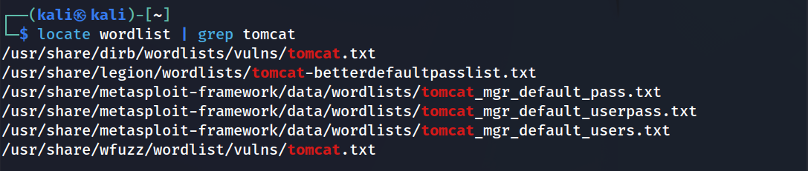

Tomcat의 기본 페이지에서 동사, 명사 들을 추출하여 사전파일을 만들어 보자.

```
sudo cewl http://192.168.184.129:8180/ > test.txt
```

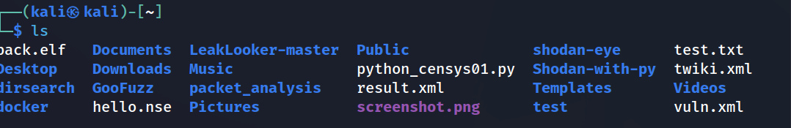

more 명령어로 저장된 사전파일을 확인해보자

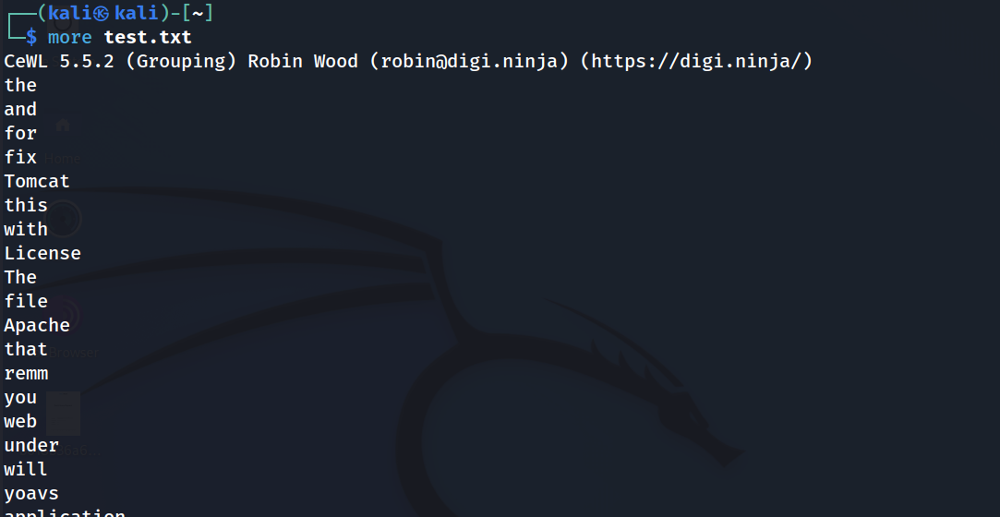

# Nikto란?

**웹 서버의 취약점을 스캔**하는 오픈 소스 도구입니다. 이 도구는 Perl 언어로 작성되었으며, Kali Linux와 같은 페네트레이션 테스팅 배포판에 포함되어 있습니다.

#### Nikto는 웹 서버에서 다음과 같은 항목들을 체크합니다.

6700개 이상의 잠재적으로 위험한 파일이나 프로그램
1250개 이상의 서버의 오래된 버전
270개 이상의 서버에서 특정 버전 문제
또한, Nikto는 다음과 같은 기능을 제공합니다.

SSL, 프록시, 호스트 인증, IDS 회피 등을 지원
서버 구성 항목 검사 (예: 여러 인덱스 파일의 존재, HTTP 서버 옵션 등)
설치된 웹 서버와 소프트웨어 식별 시도
스캔 항목과 플러그인은 자주 업데이트되며, 자동으로 업데이트할 수 있음
그러나 Nikto는 은밀한 도구로 설계되지 않았습니다. 즉, 가능한 한 빠른 시간 내에 웹 서버를 테스트하며, 이는 로그 파일이나 IPS/IDS에서 명확하게 확인할 수 있습니다.

비전공자에게 이해하기 쉽게 설명하면, Nikto는 웹 서버의 '건강 검진’을 수행하는 도구라고 할 수 있습니다. 이 도구는 웹 서버가 안전한지, 아니면 악의적인 공격에 취약한지를 판단하는 데 도움을 줍니다

#### 로그파일(Log Files)

컴퓨터 시스템, 네트워크 또는 애플리케이션에서 발생하는 이벤트나 활동의 기록입니다12. 이들은 타임스탬프, 이벤트에 대한 자세한 정보, 그리고 종종 추가 메타데이터를 포함합니다1. 로그파일을 시스템 내에서 일어나는 활동을 문서화하는 일기라고 생각하면 이해하기 쉽습니다1. 로그파일은 모니터링, 문제 해결, 포렌식 분석, 사건 대응 등에 대한 중요한 정보 소스로 사용됩니다1.

#### IPS(Intrusion Prevention System)와 IDS(Intrusion Detection System)

네트워크 보안 시스템의 일종입니다.

IDS(Intrusion Detection System)

네트워크 내의 비정상적인 활동을 감지하고 관리자에게 경고하는 역할을 합니다35. IDS는 네트워크 활동을 모니터링하고, 이상 징후를 감지하면 경고를 보냅니다. 하지만 IDS는 데이터 전송에 직접 개입하지 않습니다.

#### 반면에, IPS(Intrusion Prevention System)

IDS의 기능을 한 단계 더 나아가, 위협을 감지하고 실시간으로 악의적인 트래픽을 차단합니다35. 즉, IPS는 위협을 단순히 감지하는 것을 넘어서서, 실제로 네트워크를 침해하려는 시도를 막습니다4.

비전공자에게 이해하기 쉽게 설명하면, 로그파일은 컴퓨터나 네트워크가 무슨 일을 했는지 기록하는 일기장과 같고, IDS와 IPS는 집에 설치된 보안 카메라와 경보 시스템과 비슷하다고 할 수 있습니다. IDS는 카메라로서 이상 징후를 감지하고 알려주며, IPS는 경보 시스템으로서 위협을 감지하고 이를 차단하는 역할을 합니다.

## 

## 실습

피해자의 ip를 스캔을 해준다.

```
sudo nikto -h 192.168.184.129
```

스캔하고자 하는 포트를 지정하지 않았을 경우 디폴트로 80번 포트를 스캔한다.

정확한 포트스캔을 위한 -p 옵션을 준다.

```
sudo nikto -h 192.168.184.129 -p 8180
```

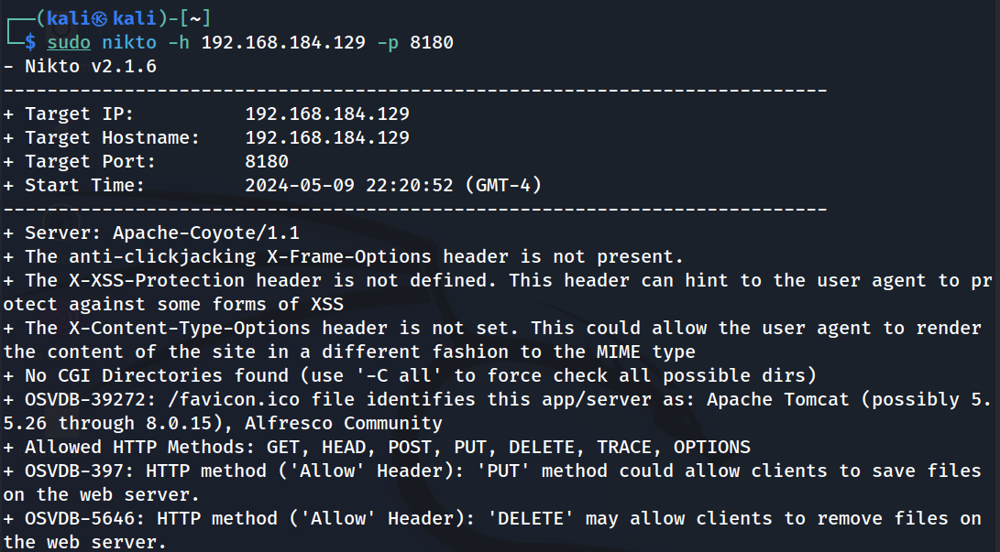

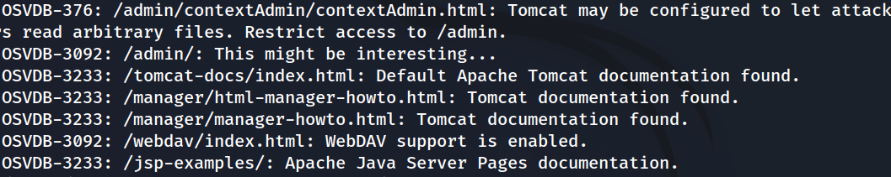

jdp-examples로 들어가 확인해보자.


Tomcat Manager의 비밀번호화 아이디가 노출 되었다는 결과를 볼 수 있다.

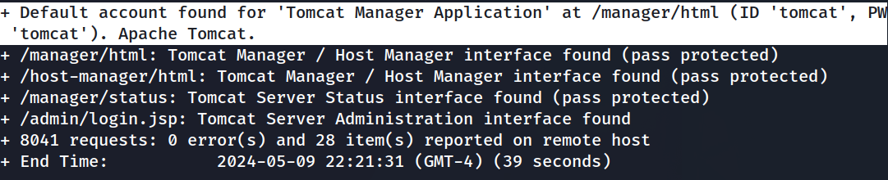

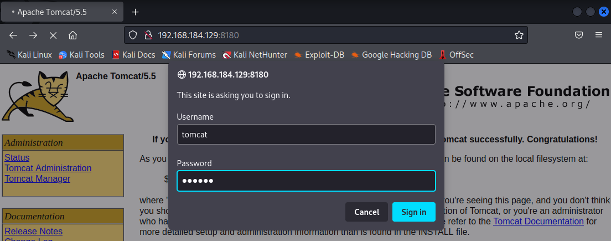

관리자 권한으로 로그인이 되었다.

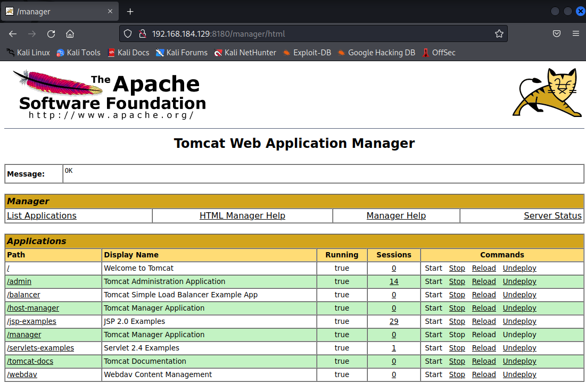

---

https://www.kali.org/tools/nikto/

[[WEB]Nikto 사용법 및 옵션 : 네이버 블로그](https://m.blog.naver.com/PostView.naver?blogId=hohan241&logNo=221013721662)

https://www.infosecinstitute.com/resources/penetration-testing/introduction-nikto-web-application-vulnerability-scanner/

[Log files explained | infosec-jobs.com](https://infosec-jobs.com/insights/log-files-explained/)

[What Is a Log File: Definition &amp; Types Explained - Sematext](https://sematext.com/glossary/log-file/)

[An IDS, IPS, SIEM Guide for the Non-Technical](https://www.ntiva.com/blog/ids-ips-siem-decoded-for-non-techs)

[IPS. vs. IDS vs. Firewall: What Are the Differences? - Palo Alto Networks](https://www.paloaltonetworks.com/cyberpedia/firewall-vs-ids-vs-ips)

[Intrusion Detection Systems (IDS) vs Intrusion Prevention Systems (IPS) - GeeksforGeeks](https://www.geeksforgeeks.org/intrusion-detection-systems-ids-vs-intrusion-prevention-systems-ips/)
