metasploit 실행전 명령어

```
msfdb init
service postgresql start
msfconsole
```

root계정으로 로그인하여 실행한다.

#### workspace란?

Metasploit에서 데이터를 세분화하고 관리하는데 사용되는 기능입니다. 

Workspace를 사용하면 **테스트하려는 각 세그먼트에 대해 논리적으로 분리**할 수 있습니다.

예를 들어, 조직 내의 각 서브넷에 대해 Workspace를 생성하여 특정 네트워크에 속한 호스트만 제한할 수 있습니다. 

이렇게 하면 작업 결과들이 저장되어서 분류별로 사용할 수 있습니다.

비전공자에게 이해하기 쉽게 설명하면, Workspace는 '서랍장’과 같습니다. 각 '서랍’은 특정 작업이나 프로젝트에 대한 정보를 저장하고 관리하는 데 사용됩니다. 예를 들어, 'scan’이라는 Workspace는 스캔 작업과 결과 정보들만을 위해 사용하고, 'payload’라는 Workspace는 공격을 수행할 때만 사용할 수 있습니다.

workspace -a test01이라는 새로은 작업환경을 만든다.

```
workspace -a test01
```

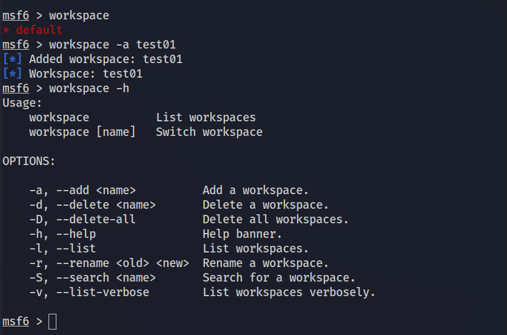

**test01** workspace를 사용한다.

```
workspace test01
```

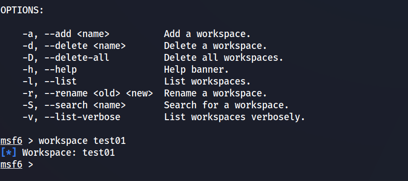

metasploit환경에서 nmap의 사용이 가능하다.

```
db_nmap -sV -T4 
```

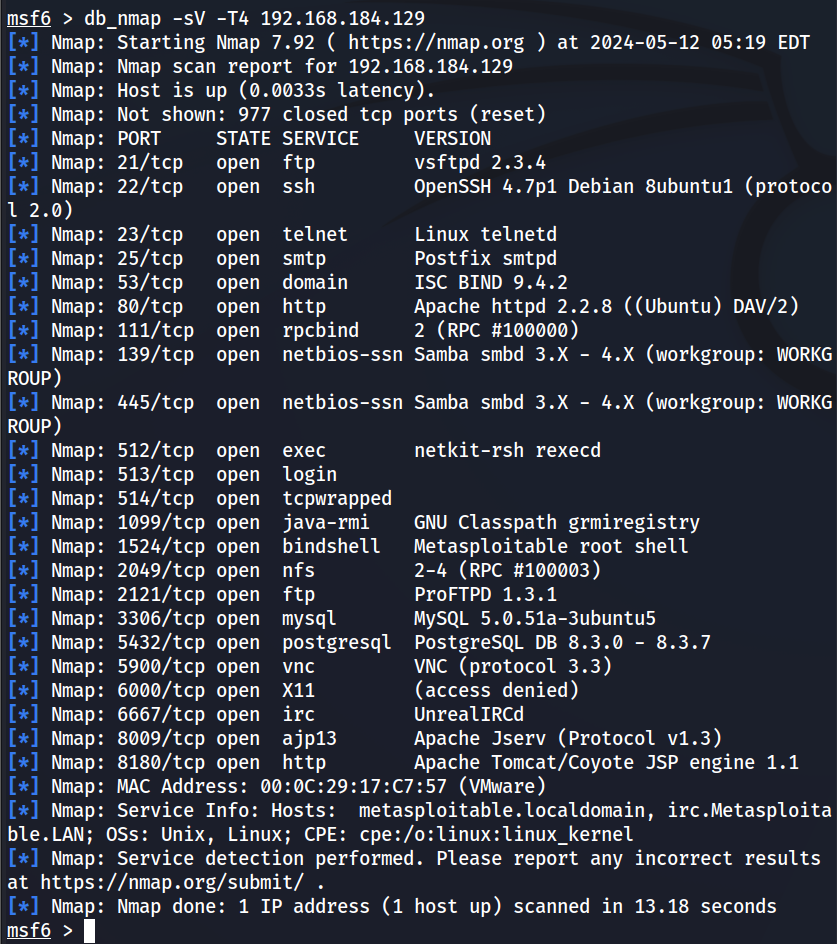

터미널 환경에서 nmap을 사용했을때와 동일한 결과을 볼 수 있다.

**<mark>hosts란?</mark>**

Metasploit에서 **타겟 호스트의 정보를 관리하는 데 사용됩니다**.

이 명령어를 사용하면, 타겟 호스트의 IP 주소, 운영 체제, 서비스 등의 정보를 확인하고 관리할 수 있습니다. 

비전공자에게 이해하기 쉽게 설명하면, hosts 명령어는 '주소록’과 같습니다. 이 '주소록’에는 각 타겟 호스트의 정보가 저장되어 있습니다.

hosts명령러를 입력하여 스캔한 호스트의 정보를 확인할 수 있다.

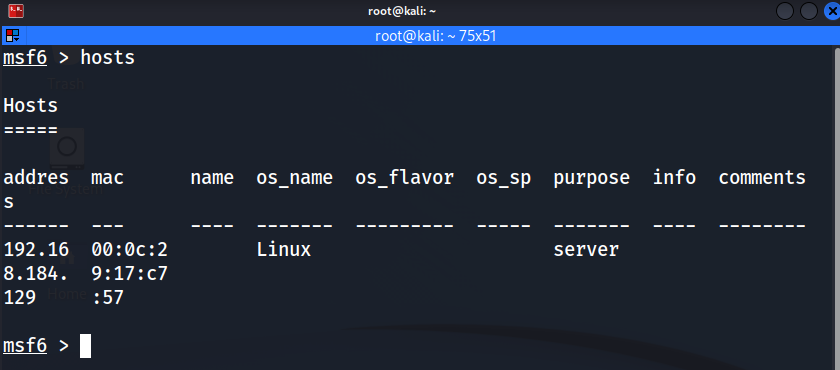

스캔한 ip의 기본정보를 확인가능하다.

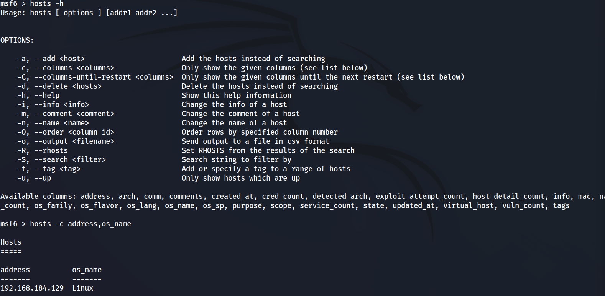

**<mark>services란?</mark>**

**타겟 호스트의 서비스 정보를 관리하는 데 사용됩니다**. 

이 명령어를 사용하면, 타겟 호스트에서 실행 중인 서비스와 그 서비스의 상태, 포트 번호 등의 정보를 확인하고 관리할 수 있습니다. 

비전공자에게 이해하기 쉽게 설명하면, services 명령어는 '서비스 목록’과 같습니다. 이 '서비스 목록’에는 각 타겟 호스트에서 실행 중인 서비스의 정보가 저장되어 있습니다.

스캔한 ip에서 실행중인 서비스들을 확인할 수 있다.

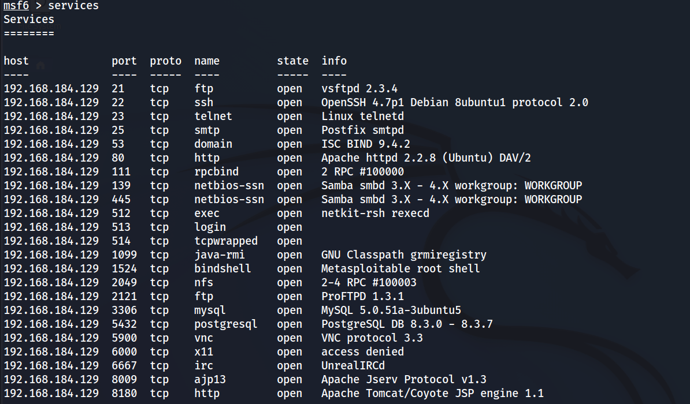

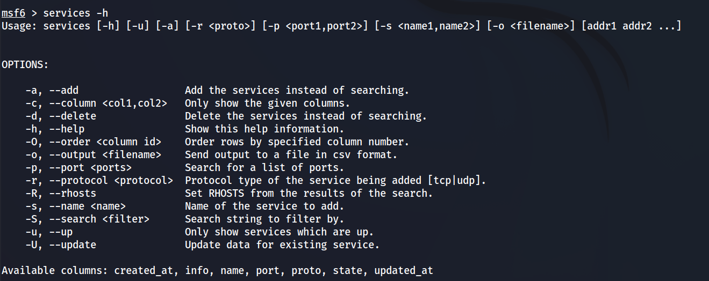

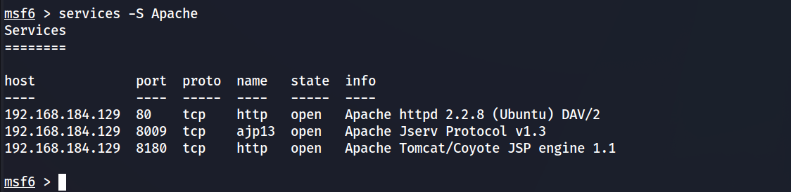

**<mark>search란?</mark>**

Metasploit에서 **특정 취약점**이나 **모듈을 검색**하는 데 사용됩니다. 

이 명령어를 사용하면, 특정 키워드에 관련된 취약점이나 모듈을 찾을 수 있습니다. 

비전공자에게 이해하기 쉽게 설명하면, search 명령어는 '검색 엔진’과 같습니다. 이 '검색 엔진’을 사용하면, 특정 키워드에 관련된 취약점이나 모듈을 찾을 수 있습니다.

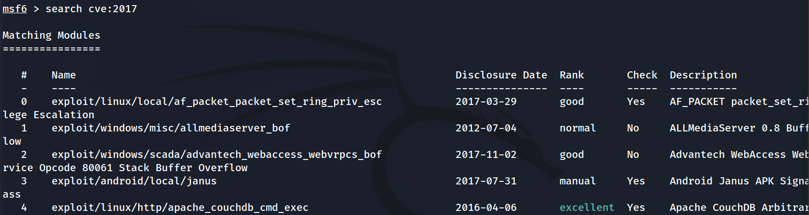

특정 취약점에 대한 정보를 복사한뒤 info 명령어를 통해 상세 정보를 확인한다. 

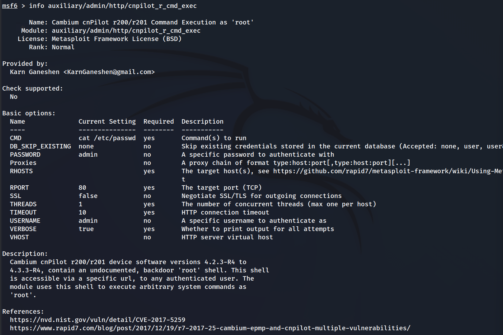

search명령어를 사용시 검색하고자하는 내용을 보다 자세히 작성하는 것이 좋다. 

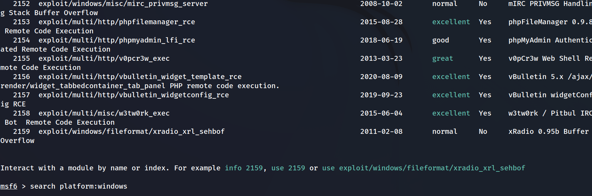

windows에 대한 검색을 할시 관련된 모든 정보가 도출되니 정보를 찾는데 많은 시간이 소요된다.

더 명확하고 자세하게 검색한다.

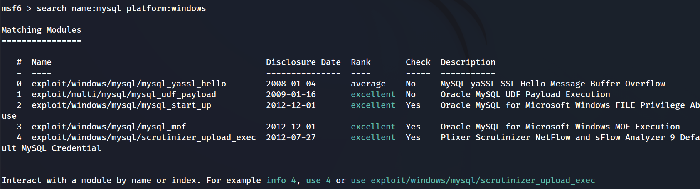


---

https://docs.rapid7.com/metasploit/managing-workspaces/
https://help.metasploit.com/Content/getting-started/managing-workspaces.html
https://blog.naver.com/PostView.naver?blogId=ka8503&logNo=223092878379&noTrackingCode=true

https://t-okk.tistory.com/187
https://10th-doctrine.tistory.com/54
https://docs.rapid7.com/metasploit/scanning-and-managing-hosts/
https://www.jamesparker.dev/how-do-i-search-for-exploits-in-metasploit/
