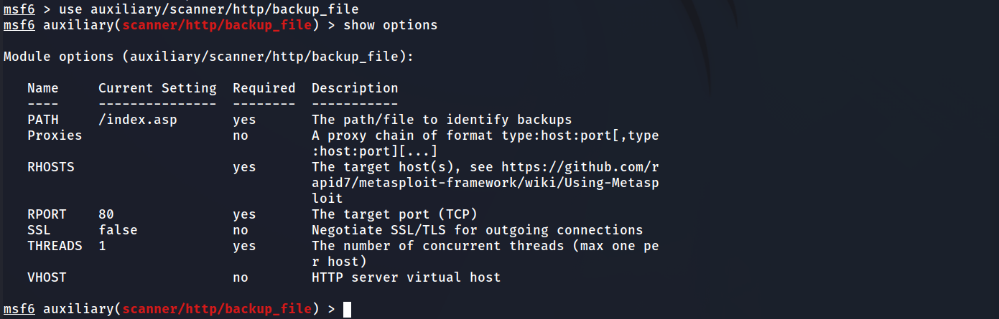
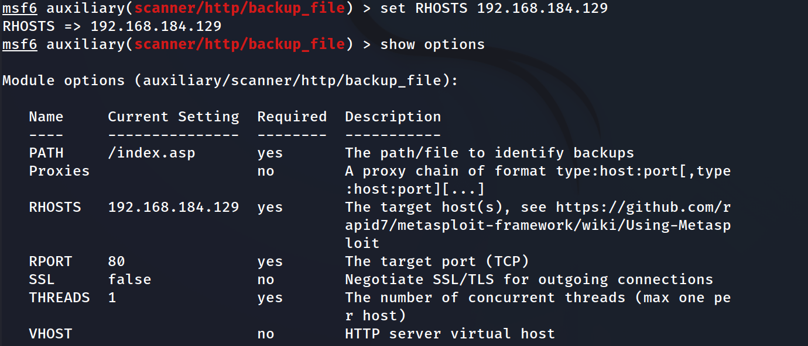
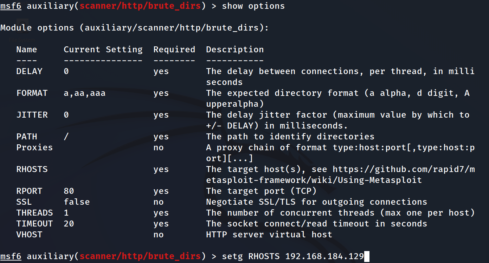
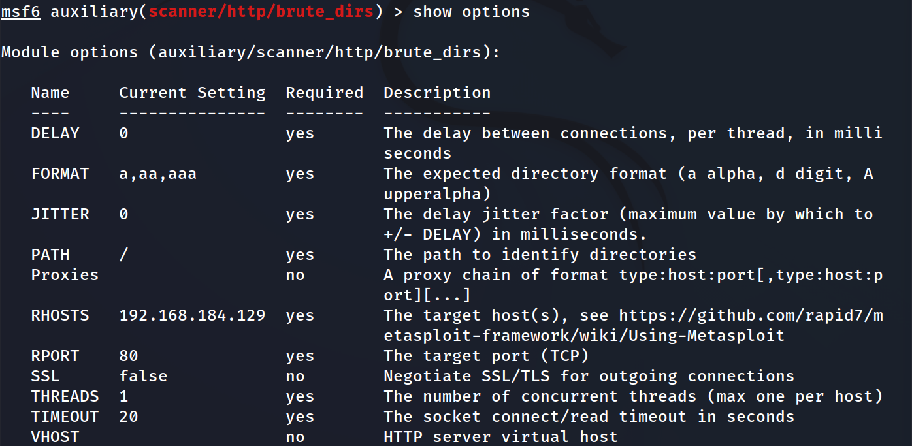
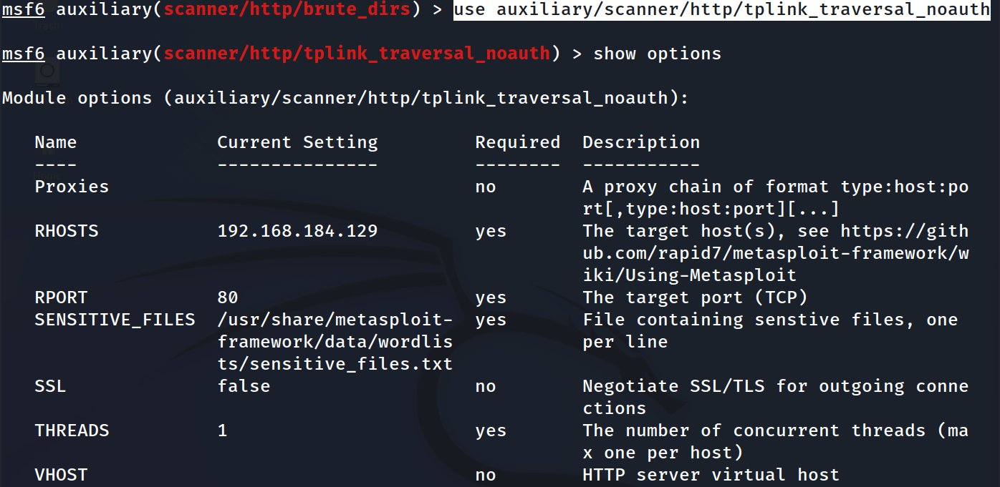

# Metasploit의 set, setg 옵션 설명

set,setg는  Core Commands의 하위 명령어이다.

Metasploit의 명령어

Core Commands

이는 Metasploit에서 가장 기본적인 명령어들로, 도움말 보기(help), Metasploit 종료(exit), 백그라운드 작업 보기(jobs) 등이 포함됩니다12.

Module Commands

이 명령어들은 Metasploit의 모듈(Exploit, Auxiliary, Post, Payload 등)과 관련된 작업을 수행합니다. 예를 들어, 특정 모듈을 사용하려면 use 명령어를 사용하고, 모듈에 대한 정보를 보려면 info 명령어를 사용합니다12.

Job Commands

이 명령어들은 백그라운드에서 실행 중인 작업들을 관리합니다jobs 명령어를 사용하면 현재 실행 중인 작업의 목록을 볼 수 있고, kill 명령어를 사용하면 특정 작업을 종료할 수 있습니다.

Resource Script Commands

리소스 스크립트는 반복적인 작업을 자동화하는 데 사용됩니다resource 명령어를 사용하여 스크립트를 로드하고 실행할 수 있습니다4.

Database Backend Commands

이 명령어들은 Metasploit의 데이터베이스와 상호 작용하는 데 사용됩니다. 예를 들어, db_connect 명령어를 사용하여 데이터베이스에 연결하고, db_disconnect 명령어를 사용하여 연결을 끊을 수 있습니다5.

Credentials Backend Commands

이 명령어들은 인증 정보를 관리하는 데 사용됩니다. 예를 들어, creds 명령어를 사용하여 데이터베이스에 저장된 모든 인증 정보를 나열할 수 있습니다5.

Developer Commands

이 명령어들은 Metasploit 개발자들이 프레임워크를 더 잘 이해하고 활용할 수 있도록 도와줍니다2.

auxiliary모듈의 scanner/http/backup_file을 사용한다.

```
use auxiliary/scanner/http/backup_file
```



이때 피해자의 ip, port를 설정해야 한다.

set 옵션을 통해 설정을 한다.

 **<mark>set란?</mark>** 

Metasploit의 특정 모듈에서 **사용할 옵션 값을 설정**하는데 사용됩니다. 

예를 들어, 특정 취약점을 공격하는 모듈을 사용하려면, 타겟 호스트의 IP 주소를 설정해야 하는데, 이 때 set 명령어를 사용하여 IP 주소를 설정합니다.



```
set RHOSTS 192.168.184.129
```

<mark>**setg란?**</mark>

set 명령어와 비슷하지만, setg로 설정한 옵션 값은 현재 모듈 뿐만 아니라 Metasploit의 모든 모듈에서 사용할 수 있습니다.

<mark>setg는 'global’의 약자</mark>로, 이 명령어로 설정한 옵션 값은 **전역적으로 적용**됩니다.
비전공자에게 이해하기 쉽게 설명하면, set과 setg 명령어는 ‘설정’ 버튼과 같습니다set 명령어는 특정 '설정’을 변경하고, setg 명령어는 **모든 '설정’을 변경**합니다.

setg의 실습을 위해 auxiliary/scanner/http/brute_dirs 모듈을 사용한다. 

```
use auxiliary/scanner/http/brute_dirs
```



show options를 통해 변경되었음을 확인한다.



전역설정이 되었는지 확인을 위해 auxiliary/scanner/http/tplink_traversal_noauth

```
use auxiliary/scanner/http/tplink_traversal_noauth
```

show options 명령어 입력한다.



set옵션을 따로 주지 않았음에도 RHOSTS의 설정이 변경되어 있다.

**<mark>get/getg란?</mark>**

get 명령어는 특정 모듈에 설정된 옵션 값을 확인하는 데 사용됩니다. 예를 들어, get RHOSTS를 사용하면 RHOSTS 옵션에 설정된 값을 확인할 수 있습니다.

getg 명령어는 setg로 설정된 전역 옵션 값을 확인하는 데 사용됩니다.

**<mark>unset/unsetg란?</mark>** 

특정 모듈의 옵션을 초기화하는 데 사용됩니다. 예를 들어, unset RHOSTS를 사용하면 RHOSTS 옵션의 값을 초기화할 수 있습니다.

unsetg 명령어는 전역적으로 설정된 옵션 값을 해제하는 데 사용됩니다.

## Tip명령어

#### verbose란? (wireshark로 더 자세히)

```
set verbose
```

Metasploit에서 수행하는 다양한 작업들의 상세한 정보를 출력하는 기능을 가지고 있습니다.

‘Verbose’ 옵션은 다음과 같은 상황에서 유용하게 사용됩니다

문제 해결

특정 모듈이 예상대로 작동하지 않을 때 ‘verbose’ 옵션을 활성화하면 그 원인을 찾는 데 도움을 받을 수 있습니다.

학습 목적

Metasploit를 배우는 초기 단계에서 해당 도구의 작동 원리를 깊게 이해하려면 ‘verbose’ 옵션으로 출력되는 정보를 분석하는 것이 좋습니다.

사용자 정의 스크립트와의 호환성

사용자가 정의한 특정 스크립트나 모듈을 Metasploit와 함께 사용할 때 어떻게 상호작용하는지 알기 위해 사용될 수 있습니다.

‘Verbose’ 옵션을 활성화하면 작업의 세부적인 진행 상태, 응답, 에러 메시지 등의 자세한 정보가 출력됩니다. 이를 통해 오류나 예외 상황의 원인을 정확히 파악하고 해결할 수 있습니다. 그러나 출력되는 정보가 많기 때문에, 중요한 정보를 찾기 위해 추가적인 필터링이나 검색 작업이 필요할 수 있습니다1.

간단히 말해, ‘verbose’ 옵션은 Metasploit에서 수행하는 작업의 '자세한 설명’을 제공하는 기능이라고 할 수 있습니다.

---

https://m.blog.naver.com/taeyoun795/220639105335
https://t-okk.tistory.com/187
https://5log.tistory.com/115
https://www.hahwul.com/2018/01/25/metasploit-alias-plugin-resource-script/
https://blog.naver.com/PostView.nhn?blogId=carmine1025&logNo=220549603464
