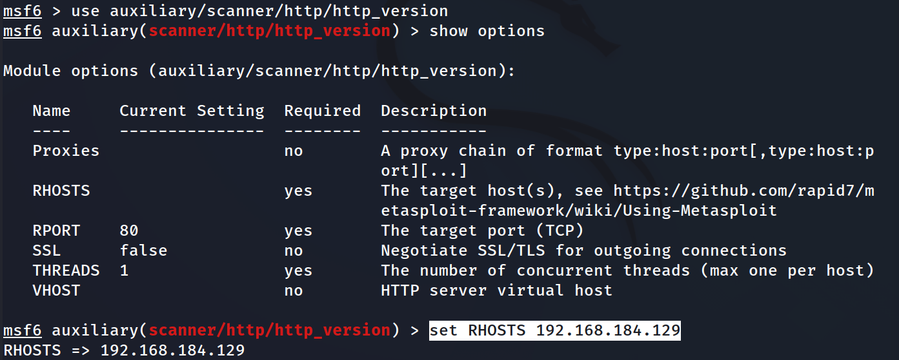
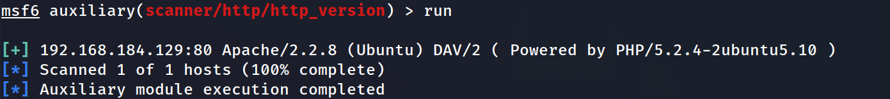

간단한것부터 보고 -> 확장 -> 프로토콜까지 

모듈을 사용하기 위해 auxiliary/scanner/http/http_version 입력한다.

```
use auxiliary/scanner/http/http_version
```



rhosts를 설정한다.

```
set RHOSTS 192.168.184.129
```

실행을 한다.

```
run(exploit)
```

해당 RHOST의 http의 버전 정보를 확인가능하다.   



```
/usr/share/metasploit-framework/modules/auxiliary/scanner/http
```


