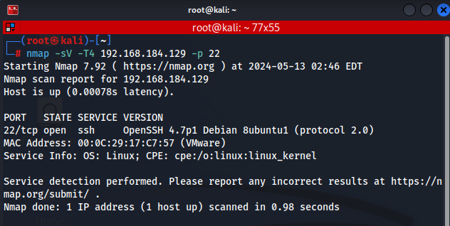
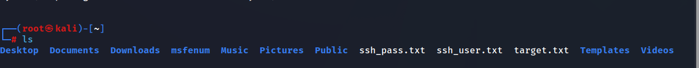
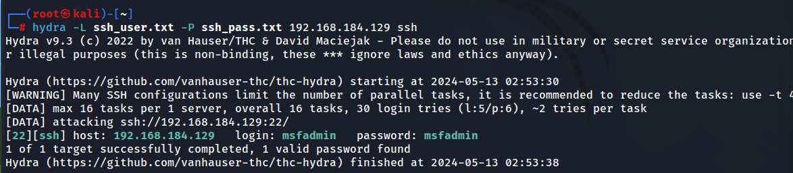

실습 목표 

SSH원격 서버 대상으로  Hydra 공격 도구를 이용해서 공격하는 방법을 알아보자.


<mark>**SSH란?**</mark>

**Secure Shell**의 약자로, 두 컴퓨터 간 통신을 할 수 있게 해주는 하나의 프로토콜입니다. 

이해를 돕기 위해, SSH를 '두 컴퓨터가 서로 안전하게 통신하기 위한 규칙’이라고 생각하시면 됩니다.

SSH는 인터넷 연결만 되어있어도 내 컴퓨터의 터미널을 통해 다른 지역에 있는 컴퓨터 혹은 서버를 관리할 수 있게 해주고, 파일도 공유할 수 있습니다. 이런 기능 덕분에, 원격으로 서버를 관리하거나 데이터를 안전하게 전송하는 데 많이 사용됩니다.

SSH의 가장 큰 장점 중 하나는 **암호화된 통신**입니다. 

SSH를 이용한 통신에서는 **클라이언트와 호스트의 통신이 암호화 되어 있습니다**. 이는 모든 데이터가 암호화 되어 전송되기 때문에 굉장히 안전하다는 점이며, 널리 사용 되어지고 있는 이유입니다.

SSH는 또한 **터널링 또는 포트 포워딩을 허용하는데**, 이는 데이터 패킷이 다른 방법으로는 통과할 수 없는 네트워크를 통과할 수 있도록 하는 것입니다. 이 기능 덕분에, SSH는 서버를 원격으로 제어하고, 인프라를 관리하며, 파일을 전송하는 데 자주 사용됩니다.

마지막으로, 

**SSH는 사용자의 인증이 필요합니다**. 일반적으로 사용자 이름과 비밀번호를 입력하는 형태로 이루어집니다. 인증이 완료되면 원격 컴퓨터에서 마치 자신의 로컬 컴퓨터에서 명령을 실행하는 것처럼 명령을 실행할 수 있습니다.


**<mark>Hydra</mark>** 

**‘무차별 대입 공격’** 또는 **브루트 포스 공격**이라고 불리는 방법을 사용하여 특정 시스템의 로그인 정보를 찾아내는 데 사용됩니다.

무차별 대입 공격이란 가능한 모든 조합을 시도하여 비밀번호를 찾아내는 방법을 말합니다. Hydra는 이런 공격을 **자동화하여**, 사용자가 지정한 대상에 대해 반복적인 로그인 시도를 통해 이용자의 아이디와 비밀번호를 탈취할 수 있습니다.

Hydra는 다양한 프로토콜에 대해 이러한 공격을 시도할 수 있습니다. 예를 들어, 웹 로그인, MySQL, SSH 등 다양한 서비스에 대한 무차별 대입 공격을 시도할 수 있습니다.




공격자 입장에서 공격 준비!

ssh_user.txt,  ssh_pass.txt 사전파일을 준비한다.




```
hydra -L ssh_user.txt -P ssh_pass.txt 192.168.184.129 ssh
```

명령어 입력뒤 사전파일을 단어들을 대입하여 공격한다.



login과 password를 찾았다.

---

https://medium.com/@jamessoun93/ssh%EB%9E%80-%EB%AC%B4%EC%97%87%EC%9D%B8%EA%B0%80%EC%9A%94-87b58c521d6f
https://www.cloudflare.com/ko-kr/learning/access-management/what-is-ssh/

https://m.blog.naver.com/wwwkasa/221211720295
https://m.blog.naver.com/guar_ing_/222187527403
https://secu-lee-ty.tistory.com/entry/%EC%B9%BC%EB%A6%AC-%EB%A6%AC%EB%88%85%EC%8A%A4-%ED%9E%88%EB%93%9C%EB%9D%BC-%EC%82%AC%EC%9A%A9%EB%B2%95


