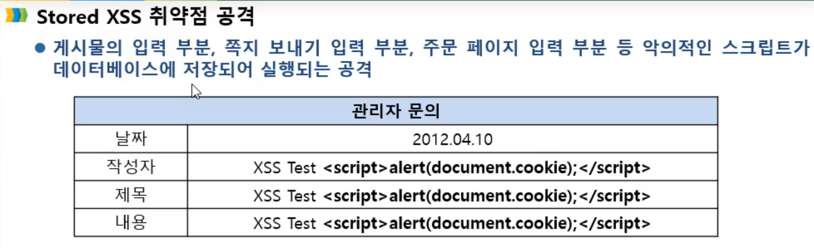
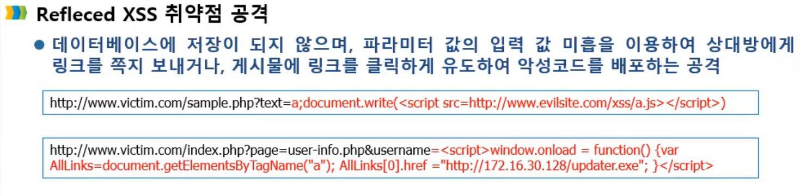
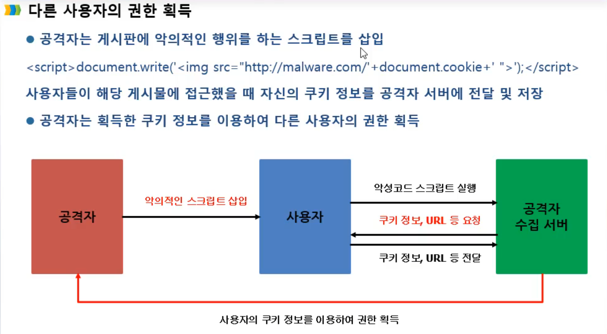
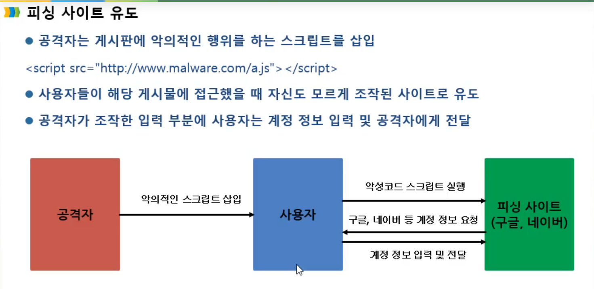

XSS 취약점 공격이란?

클라이언트 스크립트를 이용하여 사용자에게 특정 행위를 하게 해서 악의적인 목적으로 이용하는 것이다.

웹 페이지에 악의적인 스크립트를 삽입하여 사용자의 브라우저에서 실행되게 만드는 공격입니다. 

이를 통해 공격자는 사용자의 **세션 정보를 탈취**하거나, **웹 사이트를 변조**하거나, **악의적인 사이트로 사용자를 유도**할 수 있습니다.

<mark>XSS공격유형</mark>

**저장 XSS 공격**(데이터베이스에 저장된다.)

공격자가 웹 서버에 악성 스크립트를 저장해두면, 해당 페이지를 읽는 방문자의 브라우저에서 악성 스크립트가 실행됩니다.(주로 게시판이나 웹 기반 이메일에서 발생합니다.)

웹 서비스 데이터베이스에 저장이되어 웹 페이지를 접속하는 개개인에게 공격이 가해진다. 

**반사 XSS 공격**(데이터베이스에 저장되지 않는다.)

웹 애플리케이션의 변수를 이용할 때 발생하는 취약점을 이용하는 방식입니다. 사용자가 악성 스크립트가 포함된 링크를 클릭하면 해당 스크립트가 실행됩니다.

웹 페이지의 URL **파라미터 값의 입력 값 검증을 하지 않아** 파라미터 값의를 악의적으로 변조하여 공격한다. 

**DOM 기반 XSS 공격**

DOM 환경에서 악성 URL을 통해 사용자 브라우저를 공격합니다. 페이지 자체는 변하지 않지만, 페이지에 포함된 브라우저 측 코드가 악성 코드로 실행됩니다.

**DOM (Document Object Model)이란?**

웹 페이지에 대한 인터페이스입니다. 

기본적으로 여러 프로그램들이 페이지의 콘텐츠 및 구조, 그리고 스타일을 읽고 조작할 수 있도록 API를 제공합니다.

DOM은 HTML, XML 문서의 프로그래밍 인터페이스로, 문서의 구조화된 표현을 제공하며 프로그래밍 언어가 DOM 구조에 접근할 수 있는 방법을 제공합니다. 이를 통해 웹 페이지의 요소들을 자바스크립트와 같은 프로그래밍 언어로 조작할 수 있습니다. 예를 들면, HTML 태그들 (예: 
, <input>, <a>)이 DOM에 해당합니다.

쿠키란?

웹 서버가 생성하여  -->웹 브라우저로 전송하는 작은 정보 파일이다.

웹 브라우저는 수신한 쿠키를 미리 정해진 기간 동안 또는 웹 사이트에서의 **사용자 세션 기간 동안 저장합니다.** 

이렇게 저장된 쿠키는 향후 사용자가 웹 서버에 요청할 때 관련 쿠키를 첨부하여 사용된다.

1. 로그인 정보 

2. 장바구니 정보를 저장하는 용도로 쓰인다.

3. 사용자가 같은 웹사이트를 방문할 때마다 읽히고 수시로 새로운 정보로 바뀝니다.

4. 쿠키는 웹 브라우저에 의해 선별되어 처음 송신되며, 웹 브라우저에 의해 **클라이언트 컴퓨터에 저장됩니다.** 

5. 쿠키는 웹 서버에 의해 설정되지만 자바스크립트와 같은 스크립트 언어를 사용하여 클라이언트에 의해 설정될 수도 있습니다.

쿠키는웹사이트를 편리하게 사용하기 위한 용도로 사용되며, 사용자 동의로 제공된 쿠키 정보는 웹사이트 개선에 도움을 줍니다. **하지만 광고와 관련된 쿠키는 사용자의 웹 활동을 추적하는 데에도 사용될 수 있으므로 주의가 필요합니다.** 

<script>document.write('') ;< /script>
<script> 태그 안에서 document.cookie를 사용하여 사용자의 쿠키 값을 가져옵니다.
"Image" 객체를 생성합니다.
"Image" 객체의 src 속성에 공격자의 서버 주소와 사용자의 쿠키 값을 추가합니다.

쿠기 재사용 공격, 세션 재사용 공격이라고 한다.

