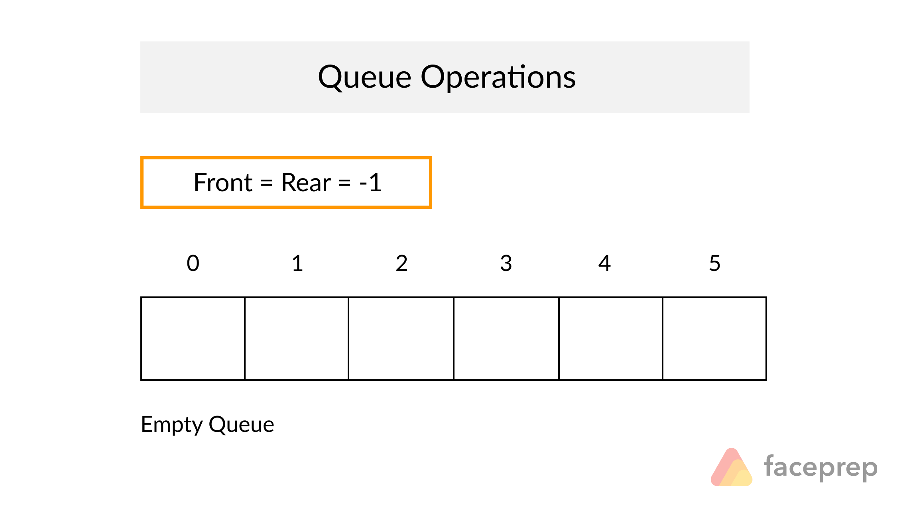
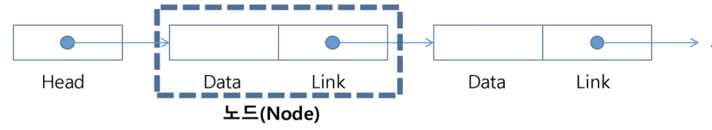

# <a style="color:#00adb5">QUEUE & LIST</a>

## <a style="color:#00adb5">QUEUE</a>란 무엇인가 ?

 
스택과 마찬가지로 삽입과 삭제의 위치가 제한적인 자료구조 
앞에서는 삭제만 하고 뒤에서는 삽입만 한다. 
<a style="color:red"><b>선입 선출 구조 (FIFO)</b></a>이다. 
큐에 삽입한 순서대로 원소가 저장된다. 
<a style="color:red"><b>Front</b></a>는 머리로 마지막으로 삭제된 원소이다. 
<a style="color:red"><b>Rear</b></a>은 꼬리로 저장된 원소중 마지막 원소이다. 
삽입은 enQueue, 삭제는 deQueue 이다. 

### <a style="color:#00adb5">java.util.Queue</a>

- 큐에 필요한 연산을 선언해 놓은 인터페이스
- LinkedList 클래스를 Queue 인터페이스의 구현체로 많이 사용
\
Queue<Integer> queue = new LinkedList<Integer>();
LinkedList의 모든 기능 중에 queue 기능만 제한에서 사용
LinkedList는 많은 것들의 인터페이스 같은 역할을 하기 때문에 많은 기능들이 있다.

### <a style="color:#00adb5">QUEUE</a>의 주요 메서드

- offer()
Queue에 원소를 삽입하는 메서드 ( 맨 뒤로 )
- poll()
Queue에서 원소를 삭제하는 메서드 ( 맨 앞에서 )
- isEmpty()
Queue가 비었으면 true, 안비었으면 false를 반환
- size()
Queue의 크기를 반환해준다
 

### <a style="color:#00adb5">QUEUE</a>를 활용한 문제 유형

- BFS ( 대표적인 경우 )
- 캐시
- 버퍼
- 프로세스 관리

## <a style="color:#00adb5">LIST</a>이란 무엇인가 ?
<a style="color:red"><b>순서를 가진 데이터의 집합을 가리키는 추상자료형이다.</b></a> 
동일한 데이터를 가지고 있어도 상관없다.
구현애 따라 크게 두 가지로 나뉜다.
- 순차 리스트
배열을 기반으로 구현된 리스트
 
- 연결 리스트
메모리의 동적할당을 기반으로 구현된 리스트

### <a style="color:#00adb5">순차 리스트</a>

#### 구현 방법
1차원 배열에 항목들을 순서대로 저장 
데이터의 종류와 구조에 따라 구조화된 자료구조를 만들어 배열에 저장할 수 있다.

#### 데이터 접근
배열의 인덱스를 이용해 원하는 위치의 데이터에 접근할 수 있다.

#### 삽입 연산
삽입 위치 다음의 항목들을 뒤로 이동해야 한다.
-> 빈자리를 채워야 한다.

#### 삭제 연산
삭제 위치 다음의 항목들을 앞으로 이동해야 한다.
-> 빈자리를 채워야 한다.

#### <a style="color:#00adb5">순차 리스트</a>의 문제점
- 자료의 삽입/삭제 연산 과정에서 연속적인 메모리 배열을 위해 원소들을 이동시키는 작업이 필요하다.
- 원소 개수가 많아지고 연산 과정이 빈번하게 일어나면 작업에 소요되는 시간이 크게 증가한다.
- 배열의 크기가 정해져 있는 경우 실제로 많이 사용해서 새롭게 배열을 만드는 작업이 발생할 수 있고, 실제 메모리 보다 크게 할당하여 메모리의 낭비를 초래할 수도 있다. 

### <a style="color:#00adb5">연결 리스트 ( LinkedList )</a>
<a style="color:red"><b>자료의 논리적인 순서와 메모리 상의 물리적인 순서가 일치하지 않고, 개별적으로 위치하고 있는 각 원소를 연결하여 하나의 전체적인 자료구조</b></a>를 이룬다.
링크를 통해 원소에 접근하므로, 순차 리스트의 문제점 중 하나인 순서를 맞추기 위한 작업이 필요하지 않다.
자료구조의 크기를 동적으로 조정할 수 있어, 메모리의 효율적인 사용이 가능하다.

#### 기본 구조

##### <a style="color:red">노드</a>
연결 리스트에서 하나의 원소를 표현하는 building block
구성요소는 데이터 필드와 링크 필드로 이루어져 있다.
- 데이터 필드
원소의 값 저장
 
- 링크 필드
다음 노드의 참조값을 저장 

##### <a style="color:red">헤드</a>
연결 리스트의 첫 노드에 대한 참조 값을 가지고 있다

#### <a style="color:#00adb5">연결 리스트</a> 종류

- 단순 연결 리스트 ( Singly Linked List )
노드가 하나의 링크 필드에 의해 다음 노드와 연결되는 구조를 가진다.
헤드가 가장 앞의 노드를 가리키고 링크 필드가 연속적으로 다음 노드를 가리킨다.
링크 필드가 NULL인 노드가 연결 리스트의 가장 마지막 노드이다.
 
- 이중 연결 리스트 ( Doubly Linked List )
양쪽 방향으로 순회할 수 있도록 노드를 연결한 리스트
두 개의 링크 필드와 한 개의 데이터 필드로 구성

#### <a style="color:#00adb5">연결 리스트</a>의 문제점
인덱스가 없어서 특정 요소에 접근하기에는 순차 탐색이 필요하므로 탐색 속도가 떨어진다.

#### 주요 메서드
- add()
데이터 추가
- addFirst()
가장 앞에 데이터 추가
- addLast()
가장 뒤에 데이터 추가
- remove()
데이터 삭제
- removeFirst()
가장 앞에 데이터 삭제
- removeLast()
가장 뒤에 데이터 삭제
- clear()
데이저 전부 삭제
- size()
리스트 크기
- get(index)
index 위치 값 리턴
- contains()
괄호 안의 값이 리스트에 있는 지 확인, 있으면 true ,없으면 false
- indexOf()
괄호 안의 값이 있는 인덱스가 있으면 인덱스 반환, 없으면 -1
