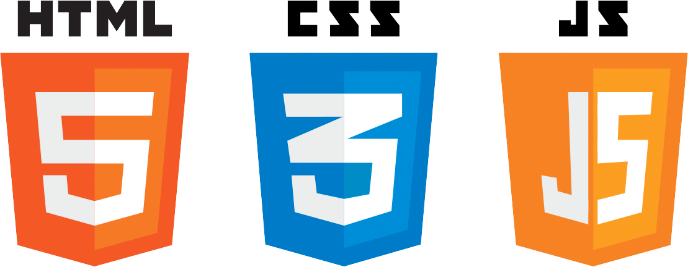

# <a style="color:#00adb5">HTML</a>
<b>웹 문서를 구성하는 3가지 요소</b>
<a style="color:red"><b>웹 페이지 문서 담당 ( 구 조 )</b></a><br>
<p align="center"></p>

## <a style="color:#00adb5">HTML</a>이란 무엇인가 ?
HTML이란 <a style="color:red"><b>Hypertext Markup Language의 약자이며 프로그래밍 언어는 아니고 웹페이지가 어떻게 구조화되어 있는지 브라우저로 하여금 알 수 있도록 하는 마크업 언어</b></a>이다.<br>
HTML은 웹을 이루는 가장 기초적인 구성 요소로 웹 콘텐츠의 의미와 구조를 정의할 때 사용한다. <br>


## <a style="color:#00adb5">tag</a>와 속성
HTML은 <a style="color:red"><b>tag</b></a>를 사용하여 문서의 구조 등을 기술한다.<br>
tag는 시작 tag와 종료 tag로 쌍을 이루거나 시작 tag만 존재하는 경우가 있다.<br>

```html
<a href="www.naver.com">go naver</a>
__ 시작 tag                      ____ 종료 tag
   ____ 속성이름        ________ 사용자에게 보여지는 문장         
        _______________ 속성 값
```
<br>

### 글로벌 속성
어느 tag에나 넣어서 사용할 수 있는 글로벌속성 ( global attribute )<br>

- class<br>
.클래스명{속성1: 속성값; 속성2: 속성값;}<br>
tag에 적용할 스타일의 이름<br>
여러 곳에서 class 사용 가능 <br>

```html
<div class="content"> .. </div>
```

- dir<br>
내용의 텍스트 방향을 지정<br>
기본값,ltr = 왼쪽 >> 오른쪽<br>
rtl = 오른쪽 >> 왼쪽

- id<br>
#아이디명{ 속성1: 속성값; 속성2: 속성값;}<br>
tag에 유일한 ID를 지정함, JS에서 주로 사용<br>
한 곳에서만 ID 사용 가능<br>

```html
<input type="text" id="userid">
```

- style<br>
인라인 스타일을 적용하기 위해 사용<br>

```html
<p style="color:red; text-align: center;">빨간색 가운데</p>
```

- title<br>
tag에 추가 정보를 지정. tag에 마우스 포인터를 위치시킬 경우 title의 값 표시<br>

```html
<p><abbr title="Web Application Server">WAS</addr>는 .. </p><br>
여기서 WAS 위에 포인터를 위치 시키면 Web Application Server라고 뜬다.
```

## 주석
주석의 내용은 브라우저에 출력되지 않는다.

```html
<!-- 주석은 포함되지 않는 내용입니다. -->
```

## <a style="color:#00adb5">Root</a> 요소
html tag는 HTML 문서 전체를 정의한다.<br>
안에 head tag와 body tag로 구성된다.<br>

```html
<html>
    <head>
        <meta charset="UTF-8">
        <title>제목</title>
    </head>
    <body>
        내용
    </body>
</html>
```

## <a style="color:#00adb5">Head</a> 요소

### head, title
<a style="color:red"><b><head> tag는 브라우저에게 HTML문서의 머리 부분</b></a>이다.<br>
title, meta, style, script, link  tag 포함 가능.<br>
title tag는 문서의 제목을 의미하며 브라우저의 제목 표시줄에 tag 내용이 나타난다.<br>
title tag 이외의 tag 들은 화면에 출력되지 않는다.

### metadata
브라우저 본문에 나타나지 않는 일반 정보를 나타낸다. ( 문서의 작성자, 날짜, 키워드 등 )<br>
name과 content 속성을 이용하여 다양한 정보를 나타낸다.<br>
http-equiv 속성을 이용하여 인코딩 설정 및 문서 이동, 새로 고침 가능.<br>
charset 속성을 이용하여 문서의 인코딩 정보를 설정한다.<br>

```html
<meta name = "name" content = "value">
- name 속성 : description, keyword 등

<meta name = "description" content = "간단한 설명">
- 페이지 설명, 검색엔진 로봇이 수집

<meta name = "keyword" content = "html5, web">
- 페이지 키워드를 ,로 구분해서 나열, 검색엔진 로봇이 수집

<meta http-equiv = "refresh" content ="30">
- refresh, content-type(인코딩 설정)

<meta charset = "UTF-8">
- 인코딩 정보를 설정
```

## <a style="color:#00adb5">BODY</a> 요소

### body

<a style="color:red"><b>웹 브라우저에 보여질 문서의 내용을 작성</b></a><br>
id 속성을 이용하여 문서 내에서 tag를 유일하게 식별 가능 <a style="color:red"><b>(id속성은 중복X)</b></a><br>
class 속성을 이용하여 여러 tag에 공통적인 특성(css)을 부여 <a style="color:red"><b>(class속성은 중복O)</b></a>

```html
<head>
    <meta charset="UTF-8">
    <title>제목</title>
</head>

<body>
    <h1>문단의 제목</h1>
    <p class = "ClassName">공통부분</p>
    <p id = "IDName">독립부분</p>
</body>
```

### heading
문단의 제목을 지정할 때 사용
"<h1>" ~ "<h6>" 까지 존재하면 숫자가 커질수록 크기는 작아진다.<br>
section tag를 이용하면 같은 tag를 서로 다르게 표현할 수 있다.

```html
<h1>문단 제목 h1</h1>
<h2>문단 제목 h1</h2>
<h3>문단 제목 h1</h3>
<h4>문단 제목 h1</h4>
<h5>문단 제목 h1</h5>
<h6>문단 제목 h1</h6>
```

## <a style="color:#00adb5">특수문자</a>

```html
- &nbsp;
Non-breaking space
-> 공백
- &lt;
Less than
-> <
- &gt;
Greater than
-> >
- &amp;
Ampersand
-> &
- &quot;
Quotation mark
-> "
- &copy;
Copyright
-> ©
- &reg;
registered trademark
-> ®

사용법
<p> 안녕하십니까 저는 &quot;Jack&quot;입니다.</p>
</p> 저의 &apos;취미&apos;는 &lt;노래듣기 &amp; 운동&gt; 입니다.</p>

-> 출력
안녕하십니까 저는 "Jack"입니다.
저의 '취미'는 <노래듣기 & 운동> 입니다.
```

## <a style="color:#00adb5">HTML</a> 기본 마무리
웹 문서를 구성하는 3가지 요소 중 하나인 HTML을 공부해보았다.<br>
현재 github blog를 작성하고 있어서 markup language에 대한 부담감은 덜 했지만 또 여기서 살짝살짝 다른 부분이 있어서 색다른 것들도 있었다.<br>
구현하자마자 바로 내가 구현한 것을 웹에서 볼 수 있어서 재미있었던 것 같다.<br>
교수님들도 강조하시는게 모든 것을 달달 외울 필요는 없다고 하신다. 그러나 많이 쓰이는 거나 중요한 것은 외워야 하기 때문에 frontend의 기초라고 할 수 있는 HTML을 소홀히 해서는 안된다.<br>
공부를 하면서 느낀 것은 확실히 전체적인 구조를 파악하고 있는 것이 중요할 것 같다.<br>
HTML은 웹 페이지 문서 담당이며 이것은 웹의 전체적인 구조를 작성하는데 필요하기 때문이다.<br>
곧 css ( 표현 ) 와 js ( 동작 ) 를 같이 배워서 다 같이 활용해서 사용한다면 더 재미있어질 것 같다.<br>
그리고 다음으로는 HTML 마크업 요소에 대해 알아보자 !!


<br><br><br><br>
참조<br>
<a href="https://developer.mozilla.org/ko/docs/Web/HTML" target=_blank>https://developer.mozilla.org/ko/docs/Web/HTML</a><br>