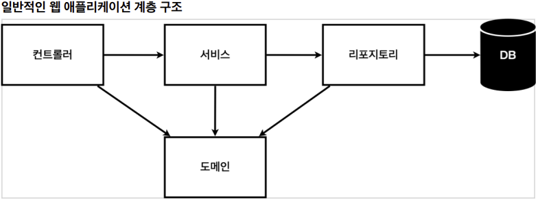
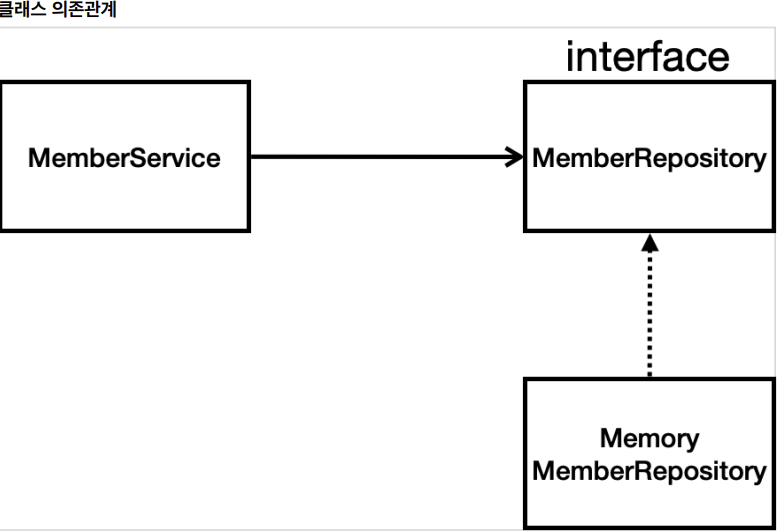

# 1. 요구사항 정리

- 데이터: 회원ID, 이름

- 기능: 회원 등록, 조회 

- 아직 데이터 저장소가 선정되지 않음(가상의 시나리오)

## 웹어플리케이션 계층 구조



- 컨트롤러 : 웹 MVC 의 컨트롤러 역할
- 서비스 : 핵심 비스니스 로직 구현(회원은 중복가입이 안된다거나 등)
- 리포지토리 : DB 에 접근, 도메인 객체를 DB 에 저장하고 관
- 도메인 : 비즈니스 도메인 객체 / Ex) 회원, 주문, 쿠폰 처럼 주로 DB 에 저장되고 관리

##  클래스 의존관계



- 회원 비즈니스 로직에는 MemberService 가 있음
- 아직 데이터 저장소가 선정되지 않아서, interface 로 설정
- 구현체를 일단 가벼운 메모리 기반의 데이터 저장소 사용
- 향후, 구체적인 기술이 선정되면(Ex. RDB, Jpa 등...) 바꿔 끼우기 위해 Interface 를 설정


# 2. 회원 도메인과 repository 만들기

##  회원 도메인 만들기

- domain 패키지에 Member 클래스 생성

- 요구사항에 맞게 Id 와 name 생

- ```java
  package com.example.hellospring.domain;
  
  public class Member {
  
      private Long id;
      private String name;
  
      public Long getId() {
          return id;
      }
  
      public void setId(Long id) {
          this.id = id;
      }
  
      public String getName() {
          return name;
      }
  
      public void setName(String name) {
          this.name = name;
      }
  }
  ```


## MemberRepository 만들기

- 요구사항대로 MemberRepository 인터페이스와 MemoryMemberRepository 클래스 생성
- repository 패키지 생성해서 그 안에 만든다

### MemberRepository

- 사용하고자 하는 기능을 넣어준다.(저장, Id 로 찾기, Name 으로 찾기, 모든 멤버 찾기)

- ```java
  package com.example.hellospring.repository;
  import com.example.hellospring.domain.Member;
  import java.util.List;
  import java.util.Optional;
  
  public interface MemberRepository {
      Member save(Member member);
      
      Optional<Member> findById(Long id);
      
      Optional<Member> findByName(String name);
      
      List<Member> findAll();
  }
  
  ```

  - Optional 은 Null 이 발생할 수 있는 메소드에 사용한다.

### MemoryMemberRepository

- Repository 기능을 구체화

- ```java
  package com.example.hellospring.repository;
  
  import com.example.hellospring.domain.Member;
  
  import java.util.*;
  
  public class MemoryMemberRepository implements MemberRepository{
  
      /**
   * 동시성 문제가 고려되어 있지 않음, 실무에서는 ConcurrentHashMap, AtomicLong 사용 고려
   */
      private static Map<Long, Member> store = new HashMap<>();
      private static long sequence = 0L;
  
      @Override
      public Member save(Member member) {
          member.setId(++sequence);
          store.put(member.getId(), member);
          return member;
      }
  
      @Override
      public Optional<Member> findById(Long id) {
          //id 가 없을 수 있으므로 Option.ofNullable 을 사용
          return Optional.ofNullable(store.get(id));
      }
  
      @Override
      public Optional<Member> findByName(String name) {
          return store.values().stream()
                      .filter(member -> member.getName().equals(name))
                      .findAny();
      }
  
      @Override
      public List<Member> findAll() {
          return new ArrayList<>(store.values());
      }
  }
  ```

- Long sequence 를 통해 키값을 생성(0, 1, 2 ....)

#### Map

- 맵은 대응관계를 쉽게 표현할 수 있게 해주는 자료형


- 맵(Map)은 사전(dictionary)과 비슷하다. 즉, people 이란 단어에 "사람", baseball 이라는 단어에 "야구"라는 뜻이 부합되듯이 Map은 Key와 Value를 한 쌍으로 갖는 자료형이다.

- Map 역시 List와 마찬가지로 인터페이스이다. Map 인터페이스를 구현한 Map 자료형에는 HashMap, LinkedHashMap, TreeMap 등이 있다. 

##### put()

- map 에 key, value 추가

- ```java
  import java.util.HashMap;
  
  public class Sample {
      public static void main(String[] args) {
          HashMap<String, String> map = new HashMap<>();
          map.put("people", "사람");
          map.put("baseball", "야구");
      }
  }
  ```

##### get()

- key 에 해당하는 value 값을 얻음

- ```java
  System.out.println(map.get("people"));  // "사람" 출력
  ```

##### values()

- 해당 map 의 value 목록을 Colleciton 형태로 리턴

- ```java
  import java.util.Collection;
  import java.util.HashMap;
  import java.util.Map;
   
  public class HashMapPrint {
      public static void main(String[] args) {
   
          // HashMap 준비
          Map<Integer, String> map = new HashMap<Integer, String>();
          map.put(1, "Apple");
          map.put(2, "Banana");
          map.put(3, "Orange");
   
          // map.values()
          Collection<String> values = map.values();
          System.out.println(values);
          // [Apple, Banana, Orange]
      }
  }
    //결과  
  //[Apple, Banana, Orange]
  ```

  

# 3. Repository 테스트 케이스(Junit)

- 개발한 기능을 실행해서 테스트 할 때 자바의 main 메서드를 통해서 실행하거나, 웹 애플리케이션의 컨트롤러를 통해서 해당 기능을 실행한다. 
- 이러한 방법은 **준비하고 실행하는데 오래 걸리고, 반복 실행하기 어렵고 여러 테스트를 한번에 실행하기 어렵다는 단점**이 있다.

## test 클래스 설정

- test 폴더에서 MemoryMemberRepositoryTest.java 생성
  - 보통 테스트할 클래스 + Test 로 네이밍

- ```java
  class MemoryMemberRepositoryTest {
      
  	 MemoryMemberRepository repository = new MemoryMemberRepository();
      
       @AfterEach
       public void afterEach() {
       	repository.clearStore();
       }
  }
  ```

  - @AfterEach : 한번에 여러 테스트를 실행하면 메모리 DB에 직전 테스트의 결과가 남을 수 있다. 이렇게 되면 다음 이전 테스트 때문에 다음 테스트가 실패할 가능성이 있다. @AfterEach 를 사용하면 각 테스트가 종료될 때 마다 이 기능을 실행한다. 여기서는 메모리 DB에 저장된 데이터를 삭제한다. 
  - 테스트는 각각 독립적으로 실행되어야 한다. 테스트 순서에 의존관계가 있는 것은 좋은 테스트가 아니다

### clearStore()

- 직전 테스트 결과가 repository 에 남지 않기 위해 clearStore() 메소드 설정

- ```java
  //MemoryMemberRepository 에 설정
  public void clearStore(){
      store.clear();
  }
  ```

  

## save()

- ```java
  @Test
  public void save(){
      //given
      Member member = new Member();
      member.setName("John");
      
      //when
      repository.save(member);
  
      //then
      Member result = repository.findById(member.getId()).get();
      assertThat(member).isEqualTo(result);
      //junit
  	//Assertions.assertEquals(member, result);
  }
  ```

  - junit 의 Assertions.asserEquals 로 테스트할 수도 있지만 직관적이지 않고,
  - org.assertj.core.api.Assertions 으로 테스트 가능
  - 이떄 static 을 통해 Assertions. 를 생략하고 바로 assertThat 으로 사용가능
    - import static org.assertj.core.api.Assertions.*;

  ### Optional 에 관해

  - repository.findById(member.getId()) 는 Optional<Member> 클래스이기 때문에 .get()으로 값을 가져와 Optional 을 벗겨낼 수 있음

## findByName()

```java
@Test
public void findByName(){
    
    //given
    Member member1 = new Member();
    member1.setName("John");
    repository.save(member1);

    Member member2 = new Member();
    member2.setName("Bill");
    repository.save(member2);

    //when
    //optional 은 .get() 으로 꺼낼 수 있음
    Member result = repository.findByName("John").get();

    //then
    assertThat(result).isEqualTo(member1);
}
```

### Tip(shift + F6)

- 해당 단축키를 통해 해당되는 변수 이름 변경 가능하다

- ```java
  Member member1 = new Member();
  member1.setName("Bill");
  repository.save(member1);
  
  //위에서 member1 에 커서를 두고 shift + f6 를 눌러 member2 로 변경하면 3개의 member1 이 member2 로 변경됨 
  ```

  

## findAll()

- ```java
  @Test
  public void findAll(){
      //given
      Member member1 = new Member();
      member1.setName("John");
      repository.save(member1);
  
      Member member2 = new Member();
      member2.setName("Bill");
      repository.save(member2);
  
      //when
      List<Member> result = repository.findAll();
      
      //then
      assertThat(result.size()).isEqualTo(2);
  }
  ```

  - result 의 size 가 2인지 확인

# 4. 회원 서비스 개발

- service 폴더에 MemberService 클래스 생성

## 전체 서비스

- 주석 참고

- ```java
  package com.example.hellospring.service;
  
  import com.example.hellospring.domain.Member;
  import com.example.hellospring.repository.MemberRepository;
  import com.example.hellospring.repository.MemoryMemberRepository;
  
  import java.util.List;
  import java.util.Optional;
  
  public class MemberService {
  
      private final MemberRepository memberRepository = new MemoryMemberRepository();
  
      /**
       * 회원가입
       */
      public Long join(Member member){
          //같은 이름이 있는 중복 회원 x (중복회원검증)
          validateDuplicateMember(member);
  
          memberRepository.save(member);
          return member.getId();
      }
  
      //ctrl + alt + M
      //해당 메소드는 밑에서 추가 설명
      private void validateDuplicateMember(Member member) {
          memberRepository.findByName(member.getName())
              .ifPresent(m -> {
                  throw new IllegalStateException("이미 존재하는 회원입니다.");
              });
      }
  
      /**
       * 전체회원조회
       */
      public List<Member> findMember(){
          return memberRepository.findAll();
      }
      
      /**
       * 회원 1명 조회
       */
      public Optional<Member> findOne(Long memberId){
          return memberRepository.findById(memberId);
      }
  }
  
  ```

### 메소드 추출 (Extract Method)

- 그룹으로 함께 묶을 수 있는 코드 조각이 있으면 코드의 목적이 잘 드러나도록 메소드의 이름을 지어 별도의 메소드로 뽑아낸다. (ctrl + alt + M)
- 소드가 잘 쪼개져 있을 때 다른 메소드에서 사용될 확률이 높아진다

### validateDuplicateMember 메소드

- ```java
  private void validateDuplicateMember(Member member) {
      memberRepository.findByName(member.getName())
          .ifPresent(m -> {
          	throw new IllegalStateException("이미 존재하는 회원입니다.");
          });
  }
  ```

  - memberRepository.findByName 이 Optional<Member> 클래스이기 때문에, ifPresent 메소드 사용 가능
  - ifPresent 로 IllegalStateExcetiopn 예외 처리

# 5. 회원 서비스 테스트

- 테스트 생성 단축키 : ctrl + shift + T

- ```java
  class MemberServiceTest {
  
      @Test
      void join() {}
  
      @Test
      void findMembers() {}
  
      @Test
      void findOne() {}
  }
  ```

  - 폴더에 맞춰서 이까지 생성됨

## 회원가입 테스트(join)

- ```java
  	
  MemoryMemberRepository memberRepository;
  
  @Test
  void join() {
      //given
      Member member = new Member();
      member.setName("John");
  
      //when
      Long saveId = memberService.join(member);
  
      //then
      Member foundedMember = memberService.findOne(saveId).get();
      assertThat(member.getName()).isEqualTo(foundedMember.getName());
  }
  ```

  - join() 이 Id 값을 반환하기 때문에 saveId 로 변수를 받은다음,
  - findOne(saveId) 를 통해 해당 member 와 생성된 member 가 같은지 확인

## 회원가입 예외 처리

### MemberSevice DI 처리

- ```java
  public class MemberService {
      
  //기존에 직접 repsitory 를 사용하는게 아니라 외부에서 생성자로 주입
  //private final MemberRepository memberRepository = new MemoryMemberRepository();
   private final MemberRepository memberRepository;
   
  //생성자로 주입
   public MemberService(MemberRepository memberRepository) {
   	this.memberRepository = memberRepository;
   }
   ...
  }
  
  ```

  - Test 클래스에서 memberService 와 memberRepository 를 정의하게 되는데, 
  - 각각 새로운 Repository 를 가지면 안되기 때문에 memberService 에서는 DI 를 통해 외부에서 설정하도록 처리
  - 물론, memberRepository 에서 HashMap 은 static 이기 때문에 이렇게 안해도 되지만, 나중에 필요함

### 회원가입 예외 처리

#### assertThrows 사용

- ```java
  package com.example.hellospring.service;
  
  import com.example.hellospring.domain.Member;
  import com.example.hellospring.repository.MemoryMemberRepository;
  import org.assertj.core.api.Assertions;
  import org.junit.jupiter.api.AfterEach;
  import org.junit.jupiter.api.BeforeEach;
  import org.junit.jupiter.api.Test;
  
  import static org.assertj.core.api.Assertions.*;
  import static org.junit.jupiter.api.Assertions.*;
  
  class MemberServiceTest {
  
      //선언만
      MemberService memberService;
      MemoryMemberRepository memberRepository;
  
      //테스트를 실행할 때마다 repository 와 service 를 각각 생성을 해줌
      //같은 멤버리파지토리가 사용됨
      @BeforeEach
      public void beforeEach(){
          memberRepository = new MemoryMemberRepository();
          memberService = new MemberService(memberRepository);
      }
  
      @AfterEach
      public void afterEach(){
          memberRepository.clearStore();
      }
  
      @Test
      void 중복회원_예외(){
          //given
          Member member1 = new Member();
          member1.setName("John");
  
          Member member2 = new Member();
          member2.setName("John");
  
          //when
          memberService.join(member1);
          
          //then
          //assertThrows(A, B) => B를 실행할 때, A 예외가 터져야 해
          IllegalStateException e = assertThrows(IllegalStateException.class, () -> memberService.join(member2));
          assertThat(e.getMessage()).isEqualTo("이미 존재하는 회원입니다.");
      }
  
     
  ```

##### 테스트 시 memberService 와 memberRepository

- 최초에 선언만 해준 뒤,
- @BeforeEach를 통해 각 테스트가 실행될 때마다 memberRepository 를 생성하고,
- 해당 memberRepository 를 생성자로 사용하여 memberService 생성
- 

##### assertThrows(Class<T> expectedType, Executable executable)

- executable 을 실행할 떄, expectedType 이 나와야 함
- 즉, 람다식으로 memberService.join(member2) 가 실행될 때, IllegalStateException.class 가 나와야 한다.
- 이거를 IllegalStateException e 로 받으면 e.getMessage() 가 "이미 존재하는 회원입니다." 가 된다.

#### try-catch 문 사용

- ```java
  try {
      memberService.join(member2);
      fail();
  } catch (IllegalStateException e){}
  	assertThat(e.getMessage()).isEqualTo("이미 존재하는 회원입니다.");
  }
  ```

- catch 문이 실행될 때(즉, 중복된 회원일 때) e.getMessage 로 확인

#### Tip(자동 변수 설정 ctrl + alt + v)

- ```java
  assertThrows(IllegalStateException.class, () -> memberService.join(member2));
  
  //해당 asserThrows 는 illegalStateException 으로 반환되므로
  //커서를 위에 대고 ctrl + alt + v 를 누르면
  
  IllegalStateException illegalStateException = assertThrows(IllegalStateException.class, () -> memberService.join(member2));
  
  //이렇게 해당 클래스 이름의 변수로 변경됨
  //이름은 알맞게 변경
  
  ```

  


